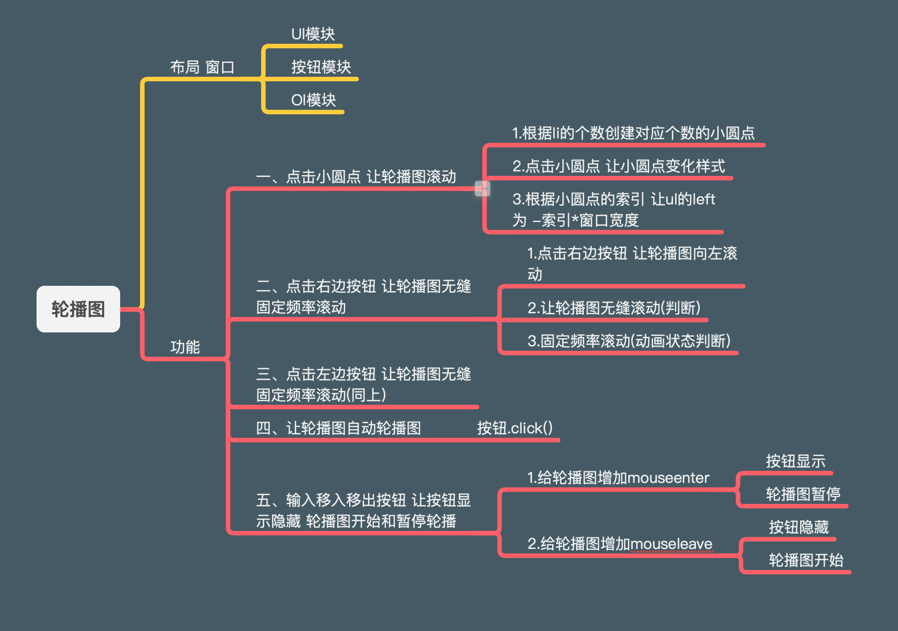

## 轮播图页面

`窗口 > ul > li*n > a >img`

```html
<body>
    <div class="slider">
        <ul>
            <li><a href="javascript:;"></a></li>
            <li><a href="javascript:;"></a></li>
            <li><a href="javascript:;"></a></li>
            <li><a href="javascript:;"></a></li>
        </ul>

        <!-- 左右按钮 -->
        <i class="prev"></i>
        <i class="next"></i>

        <!-- 小圆点导航 -->
        <ol>
            <!-- <li class="active"></li>
            <li></li>
            <li></li>
            <li></li> -->
        </ol>
    </div>
    <!-- 动画插件 -->
    <script src="animate.js"></script>
    <!-- 业务代码 -->
    <script src="index.js"></script>
</body>
```

```scss
// 业务代码
.slider {
    position: relative;
    width: 400px;
    height: 260px;
    margin: 100px auto;
    overflow: hidden;
    ul {
        // 这里是为了ul 以后移动的
        position: absolute;
        top: 0;
        left: 0;
        height: 260px;
        width: 400*4px;
        li {
            float: left;
        }
        a {
            display: block;
        }
    }
    .prev,
    .next {
        position: absolute;
        width: 22px;
        top: 50%;
        margin-top: -16px;
        height: 32px;
        background-color: pink;
    }
    .prev {
        left: 0;
    }
    .next {
        right: 0;
    }
//  小圆点导航
    ol {
        position: absolute;
        left: 0;
        bottom: 0;
        width: 100%;
        text-align: center;
        li {
            display: inline-block;
            width: 16px;
            height: 16px;
            border: 2px solid #cccccc;
            background-color: #ffffff;
            box-sizing: border-box;
            border-radius: 50%;
        }
    }
}

ol li.active {
    background-color: #cccccc;
    border-color: #ffffff;
}
```


## 获取元素，声明变量

```js
// 所有元素的获取，和变量的声明都在这里
let slider = document.querySelector(".slider")
let prev = document.querySelector(".prev")
let next = document.querySelector('.next')
let sliderWidth = slider.offsetWidth;  // 获取窗口宽度
let num = 0;  // 计数器
// 记录小圆点的索引
let circle = 0;
// 定义一个动画状态，作为一个节流阀
let flag = true;
let ul = document.querySelector("ul")
let ol = document.querySelector("ol")
let firstLi = document.querySelector("ul li:nth-child(1)")
// 将ul中第一个li克隆下来，添加到ul的最后
ul.appendChild(firstLi.cloneNode(true))
// 补充ul添加了一个li后的新宽度，否则宽度不够-插入的li就会到下一行
ul.style.width = ul.children.length * sliderWidth + "px";
```


## 鼠标经过轮播图区域左右按钮显示，离开该区域左右按钮隐藏

1. 左右按钮  本来就应该隐藏
2. 获取轮播图对象，左右按钮
3. 给轮播图区域添加 `mouseover` / `mouseout` 事件
4. 让鼠标移入，按钮显示，移出，按钮隐藏

```js
// 功能 1： 鼠标经过轮播图区域左右按钮显示，离开该区域左右按钮隐藏（实际工作中，用css实现更好）
// 1. 左右按钮  本来就应该隐藏
// 2. 获取轮播图对象，左右按钮
// 3. 给轮播图区域添加 `mouseover` / `mouseout` 事件
slider.addEventListener("mouseenter", function () {
    // 4. 让鼠标移入，按钮显示，移出，按钮隐藏
    prev.style.display = "block"
    next.style.display = "block"
    // 让轮播停止自动轮播
    clearInterval(timer)
    // 初始化timer
    timer = null;
})
slider.addEventListener("mouseleave", function () {
    // 4. 让鼠标移入，按钮显示，移出，按钮隐藏
    prev.style.display = "none"
    next.style.display = "none"

    // 再次声明一个定时器
    timer = setInterval(function () {
        // 用next调用它的click事件
        next.click()
    }, 2000)
})
```


## 点击右侧按钮一次，图片往左走一张

0. 找到`ul`中的第一个`li` 并且把它复制出来添加到`ul`的最后
1. 给右箭头添加一个点击事件
2. 声明一个变量`num`  获取窗口的宽度
3. 判断图片是否走到了最后一个
   * 如果`num`的值和图片的个数一样，那么就让`num`为0
4. 让`num++`
5. 让 `ul` 移动

```js
next.addEventListener("click", function () {
    // 如果动画状态开启
    if (flag) {
        // 让动画状态关闭，没完成本次动画前，不会执行下次动画
        flag = false;
        // 如果已经点到了最后一张插入的图片
        if (num == ul.children.length - 1) {
            // 那么让ul直接变回到起始位置
            // 并且让num为0
            ul.style.left = 0 + "px";
            num = 0;
        }
        // 当前的num值是当前图片的索引值，加 1 后，就成了下一张图片的索引，
        // 动用下面动画就可以完成往后一张。
        num++;
        animate(ul, {
            left: -num * sliderWidth
        }, function () {
            flag = true;
        })
        // 利用回调函数被分配到异步的特点，
        // 在动画结束后(也就是当前事件中的所有主线任务完成后)，让flag变为true

        // 让需要亮起的小圆点索引加 1 
        circle++
        // 如果索引加到了 4 ，让它回到 0
        if (circle == ol.children.length) {
            circle = 0;
        }
        // 调用 小圆点的排他函数 切换小圆点的样式
        circleChange()
    }
})
```


## 点击左侧按钮一次，图片往右走一张

1. 给左箭头添加一个点击事件

2. 判断图片是否在第一个

   * 让 `ul` 的 left 瞬间到最后一张图

   - 如果`num`的值为0，那么就让`num`为4

3. 让`num--`

5. 让 `ul` 移动

```js
prev.addEventListener("click", function () {
    // 如果动画状态开启
    if (flag) {
        // 让动画状态关闭，没完成本次动画前，不会执行下次动画
        flag = false;
        // 如果已经点到了最后一张插入的图片
        if (num == 0) {
            // 那么让ul直接变回到起始位置
            // 并且让num为0
            ul.style.left = -(ul.children.length - 1) * sliderWidth + "px";
            num = ul.children.length - 1;
        }
        // 当前的num值是当前图片的索引值，加 1 后，就成了下一张图片的索引，
        // 动用下面动画就可以完成往后一张。
        num--;
        animate(ul, {
            left: -num * sliderWidth
        }, function () {
            // 完成本次动画后，让动画状态开启
            flag = true;
        })
        // 让需要亮起的小圆点索引减 1 
        circle--
        // 如果索引减到了 -1 ，让它回到尾部 
        if (circle == -1) {
            circle = ol.children.length - 1;
        }
        circleChange()
    }
})
```


## 图片轮播的同时，下面播放相应的小圆点

让小圆点随着鼠标点击，跑到对应的位置

1. 应该定义一个变量，来记录小圆点的索引
2. 当鼠标点击`prev / next `的时候，这个变量要自增/自减
3. 让小圆点进行排他的样式变化

```js
// 写个小圆点的排他
function circleChange() {
    // 让其他小圆点移除样式
    for (let k = 0; k < ol.children.length; k++) {
        ol.children[k].classList.remove("active")
    }
    // 让索引为 circle值 的小圆点亮起
    ol.children[circle].classList.add("active")
}
```


## 点击小圆点导航，可以播放相应的图片

1. 创建小圆点元素
   * 获取`ul`, `ol` 
   * 遍历`ul`中的元素 
   * 通过`createElement()`方法创建 小圆点
   * 把创建出来的 小圆点 添加到 `ol` 中
2. 给小圆点添加事件

```js
//  在这里遍历时，注意ul.children.length要减一，因为我们之前添加了一个用来辅助的li
for (let i = 0; i < ul.children.length - 1; i++) {
    // 创建小圆点
    let li = document.createElement('li')
    // 给小圆点绑定 自定义属性 索引号  
    li.dataset.index = i;
    // 顺便给第一个小圆点绑定一个点击后的样式
    if (i == 0) {
        li.classList.add("active")
    }
    ol.appendChild(li)
    // 2. 给小圆点添加事件
    li.addEventListener('click', function () {
        for (let k = 0; k < ol.children.length; k++) {
            ol.children[k].classList.remove("active")
        }
        this.classList.add("active")
        // 点击哪个，用哪个的index找到对应的图片
        let index = this.dataset.index;
        // 跳转图片
        animate(ul, {
            left: -index * sliderWidth
        })
    })
}
```


## 鼠标进入轮播图区域，停止自动轮播


## 鼠标移出轮播图区域，继续自动轮播


## 轮播图默认向左轮播

```js
// 声明一个定时器
let timer = setInterval(function () {
    // 用next调用它的click事件
    next.click()
}, 2000)
```


## 节流阀解决按钮连续点击造成播放过快的问题

1. 定义一个动画状态，作为一个节流阀
2. 每次鼠标点击完`next/prev`，首先判断动画状态是否开启
3. 开启则可以执行，并关闭动画状态
4. 直到点击事件中的动画函数执行完，在动画函数的回调函数中让 节流阀再次开启（因为回调函数被分配到异步中，会在所有主线同步任务执行完，最后执行）


## 思路



## `js` 完整

```js
// 所有元素的获取，和变量的声明都在这里
let slider = document.querySelector(".slider")
let prev = document.querySelector(".prev")
let next = document.querySelector('.next')
let sliderWidth = slider.offsetWidth;  // 获取窗口宽度
let num = 0;  // 计数器
let circle = 0;
// 定义一个动画状态，作为一个节流阀
let flag = true;
let ul = document.querySelector("ul")
let ol = document.querySelector("ol")
let firstLi = document.querySelector("ul li:nth-child(1)")
ul.appendChild(firstLi.cloneNode(true))
// 补充ul添加了一个li后的新宽度，否则宽度不够-插入的li就会到下一行
ul.style.width = ul.children.length * sliderWidth + "px";


// 功能 1： 鼠标经过轮播图区域左右按钮显示，离开该区域左右按钮隐藏（实际工作中，用css实现更好）
// 1. 左右按钮  本来就应该隐藏
// 2. 获取轮播图对象，左右按钮
// 3. 给轮播图区域添加 `mouseover` / `mouseout` 事件
slider.addEventListener("mouseenter", function () {
    // 4. 让鼠标移入，按钮显示，移出，按钮隐藏
    prev.style.display = "block"
    next.style.display = "block"
    // 让轮播停止自动轮播
    clearInterval(timer)
    // 初始化timer
    timer = null;
})
slider.addEventListener("mouseleave", function () {
    // 4. 让鼠标移入，按钮显示，移出，按钮隐藏
    prev.style.display = "none"
    next.style.display = "none"

    // 再次声明一个定时器
    timer = setInterval(function () {
        // 用next调用它的click事件
        next.click()
    }, 2000)
})


// 功能2： 点击右侧按钮一次，图片往左走一张
// 0. 找到`ul`中的第一个`li` 并且把它复制出来添加到`ul`的最后
// 1. 给右箭头添加一个点击事件
// 2. 声明一个变量`num`  获取窗口的宽度
// 3. 判断图片是否走到了最后一个
//    - 如果num的值和图片的个数一样，那么就让num为0
// 4. 让`num++`
// 5. 让 `ul` 移动
next.addEventListener("click", function () {
    // 如果动画状态开启
    if (flag) {
        // 让动画状态关闭，没完成本次动画前，不会执行下次动画
        flag = false;
        // 如果已经点到了最后一张插入的图片
        if (num == ul.children.length - 1) {
            // 那么让ul直接变回到起始位置
            // 并且让num为0
            ul.style.left = 0 + "px";
            num = 0;
        }
        // 当前的num值是当前图片的索引值，加 1 后，就成了下一张图片的索引，
        // 动用下面动画就可以完成往后一张。
        num++;
        animate(ul, {
            left: -num * sliderWidth
        }, function () {
            flag = true;
        })
        // 利用回调函数被分配到异步的特点，
        // 在动画结束后(也就是当前事件中的所有主线任务完成后)，让flag变为true

        // 让需要亮起的小圆点索引加 1 
        circle++
        // 如果索引加到了 4 ，让它回到 0
        if (circle == ol.children.length) {
            circle = 0;
        }
        // 调用 小圆点的排他函数 切换小圆点的样式
        circleChange()
    }
})


// 功能3： 点击左侧按钮一次，图片往右走一张
prev.addEventListener("click", function () {
    // 如果动画状态开启
    if (flag) {
        // 让动画状态关闭，没完成本次动画前，不会执行下次动画
        flag = false;
        // 如果已经点到了最后一张插入的图片
        if (num == 0) {
            // 那么让ul直接变回到起始位置
            // 并且让num为0
            ul.style.left = -(ul.children.length - 1) * sliderWidth + "px";
            num = ul.children.length - 1;
        }
        // 当前的num值是当前图片的索引值，加 1 后，就成了下一张图片的索引，
        // 动用下面动画就可以完成往后一张。
        num--;
        animate(ul, {
            left: -num * sliderWidth
        }, function () {
            // 完成本次动画后，让动画状态开启
            flag = true;
        })
        // 让需要亮起的小圆点索引减 1 
        circle--
        // 如果索引减到了 -1 ，让它回到尾部 
        if (circle == -1) {
            circle = ol.children.length - 1;
        }
        circleChange()
    }
})


// 功能4： 点击小圆点导航，可以播放相应的图片
// 1. 创建小圆点元素
//    - 获取`ul`, `ol` 
//    - 遍历`ul`中的元素 
//    - 通过`createElement()`方法创建 小圆点
//    - 把创建出来的 小圆点 添加到 `ol` 中
//  在这里遍历时，注意ul.children.length要减一，因为我们之前添加了一个用来辅助的li
for (let i = 0; i < ul.children.length - 1; i++) {
    // 创建小圆点
    let li = document.createElement('li')
    // 给小圆点绑定 自定义属性 索引号  
    li.dataset.index = i;
    // 顺便给第一个小圆点绑定一个点击后的样式
    if (i == 0) {
        li.classList.add("active")
    }
    ol.appendChild(li)
    // 2. 给小圆点添加事件
    li.addEventListener('click', function () {
        for (let k = 0; k < ol.children.length; k++) {
            ol.children[k].classList.remove("active")
        }
        this.classList.add("active")
        // 点击哪个，用哪个的index找到对应的图片
        let index = this.dataset.index;
        // 跳转图片
        animate(ul, {
            left: -index * sliderWidth
        })
    })
}

// 写个小圆点的排他
function circleChange() {
    // 让其他小圆点移除样式
    for (let k = 0; k < ol.children.length; k++) {
        ol.children[k].classList.remove("active")
    }
    // 让索引为 circle值 的小圆点亮起
    ol.children[circle].classList.add("active")
}

// 声明一个定时器
let timer = setInterval(function () {
    // 用next调用它的click事件
    next.click()
}, 2000)

```

### 完善版

```html
<!DOCTYPE html>
<html lang="en">

<head>
    <meta charset="UTF-8">
    <meta name="viewport" content="width=device-width, initial-scale=1.0">
    <title>Document</title>
    <link rel="stylesheet" href="./lunbo.css">
</head>

<body>
    <div class="carousel">
        <ul>
            <li><a href="#"></a></li>
            <li><a href="#"></a></li>
            <li><a href="#"></a></li>
            <li><a href="#"></a></li>
            <li><a href="#"></a></li>
        </ul>
        <i class="prev"></i>
        <i class="next"></i>
        <ol>
            <!-- <li></li>
            <li></li> -->
        </ol>
    </div>

    <!-- 引入动画插件 -->
    <script src="./animate.js"></script>
    <script>
        // 1. 鼠标经过轮播图区域左右按钮显示，离开该区域左右按钮隐藏
        // 2. 点击右侧按钮一次，图片往左走一张  (实现无缝)
        // 3. 点击左侧按钮一次，图片往右走一张
        // 4. 图片轮播的同时，下面播放相应的小圆点
        // 5. 点击小圆点导航，可以播放相应的图片
        // 6. 鼠标进入轮播图区域，停止自动轮播
        // 7. 鼠标移出轮播图区域，继续自动轮播
        // 8. 轮播图默认向左轮播
        // 9. 节流阀解决按钮连续点击造成播放过快的问题

        // 获取元素  /  声明变量
        let carousel = document.querySelector(".carousel")
        let ul = document.querySelector(".carousel ul")
        let ol = carousel.children[3]
        let clicks = 0; // 记录点击按钮播放对应图片的索引
        let circle = 0; // 记录突出显示的小圆点的索引
        // 为了实现无缝滚动，把第一个图片补到最后一份
        let lastOne = ul.children[0].cloneNode(true)
        ul.appendChild(lastOne)  //补充后要注意，ul的宽度要改变，否则补充的这个会到下一层
        ul.style.width = ul.children.length * 400 + "px"
        let prevBtn = document.querySelector(".prev")
        let nextBtn = document.querySelector(".next")
        let timer = null;
        // 为了避免我们连续点击时，让图片过快滑动，我们要声明一个节流阀
        let flag = true;


        // 根据ul的子元素数量，插入ol中的小圆点
        for (let i = 0; i < ul.children.length - 1; i++) {
            // 获取当前ol内容字符串
            let nowStr = ol.innerHTML
            // 生成新的小圆点
            let newStr = `<li></li>`
            // 插入
            ol.innerHTML = nowStr + newStr
            // 给小圆点绑定对应的自定义属性
            ol.children[i].setAttribute("index", i)
        }
        // 给第一个小圆点上加active类名
        ol.children[0].className = "active"


        // 给next绑定事件
        nextBtn.addEventListener("click", next)
        function next() {
            if (flag) {
                // 关闭阀门
                flag = false;
                // 先判断是不是已经走到最后一张
                if (clicks == ul.children.length - 1) {
                    // 直接变回到第一张的位置
                    ul.style.left = 0
                    // 并且让clicks回到1
                    clicks = 0;
                }
                // 调用动画函数，到下一张
                animate(ul, {
                    left: -(clicks + 1) * 400
                }, function () {
                    flag = true;
                })
                // 让clicks加一
                clicks++;

                // 如果小圆点的索引到达 最后一个，索引归零
                circle++
                if (circle == ol.children.length) {
                    circle = 0;
                }
                // 让小圆点的也跟着动
                for (let i = 0; i < ol.children.length; i++) {
                    ol.children[i].classList.remove('active')
                }
                ol.children[circle].classList.add("active")
            }
        }

        // 给prev绑定事件
        prevBtn.addEventListener("click", prev)
        function prev() {
            if (flag) {
                // 关闭阀门
                flag = false;
                // 先判断是不是已经走到第一张
                if (clicks == 0) {
                    // 直接变回到最后一张的位置
                    ul.style.left = -(ul.children.length - 1) * 400 + "px"
                    // 并且让clicks回到 最后一个图片的索引
                    clicks = ul.children.length - 1;
                }
                // 调用动画函数，到上一张
                animate(ul, {
                    left: -(clicks - 1) * 400
                }, function () {
                    flag = true; // 放开阀门
                })
                // 让clicks减一
                clicks--;

                // 如果小圆点的索引到达 第一个，索引到最后一个
                circle--;
                if (circle == -1) {
                    circle = ol.children.length - 1;
                }
                // 让小圆点的也跟着动
                for (let i = 0; i < ol.children.length; i++) {
                    ol.children[i].classList.remove('active')
                }
                ol.children[circle].classList.add("active")
            }
        }

        // 给小圆点绑定点击事件
        for (let i = 0; i < ol.children.length; i++) {
            ol.children[i].addEventListener('click', circleClick)
        }
        function circleClick() {
            if (flag) {
                // 关闭阀门
                flag = false;
                // 这里依旧要再判断一次，否则 当我走到最后补充的图片上时，
                // 我们点击小圆点会发现：动画效果的方向相反（本来应该往后移，现在是往前移）。
                // 先判断是不是已经走到最后一张
                if (clicks == ul.children.length - 1) {
                    // 直接变回到第一张的位置
                    ul.style.left = 0
                    // 并且让clicks回到1
                    clicks = 0;
                }
                // 用排他思想，切换小圆点的样式
                for (let i = 0; i < ol.children.length; i++) {
                    ol.children[i].classList.remove('active')
                }
                this.classList.add("active")
                // 根据小圆点绑定的index自定义属性   让ul走到对应位置 
                // 注意：我们这里getAttribute接收到的是字符串，我们要变成数字，方便下面给circle,clicks重置
                let index = Number(this.getAttribute("index"))
                animate(ul, {
                    left: - index * 400
                }, function () {
                    flag = true;
                })
                // 这里是很容易忽视的问题
                // 我们需要在这里让circle和clicks与小圆点点击后，小圆点和图片索引都一致，不然我们点击小圆点后：再点击前后按钮，clicks和circle的还是基于原来的值改变
                circle = index;
                clicks = index;
            }
        }

        // 让轮播图自动轮播
        timer = setInterval(function () {
            nextBtn.click();
        }, 2000)

        // 鼠标进入后，停止轮播
        carousel.addEventListener("mouseenter", function () {
            clearInterval(timer);
            timer = null;
        })
        // 鼠标移出，再次自动轮播
        carousel.addEventListener("mouseleave", function () {
            timer = setInterval(function () {
                nextBtn.click();
            }, 2000)
        })
    </script>
</body>

</html>
```

