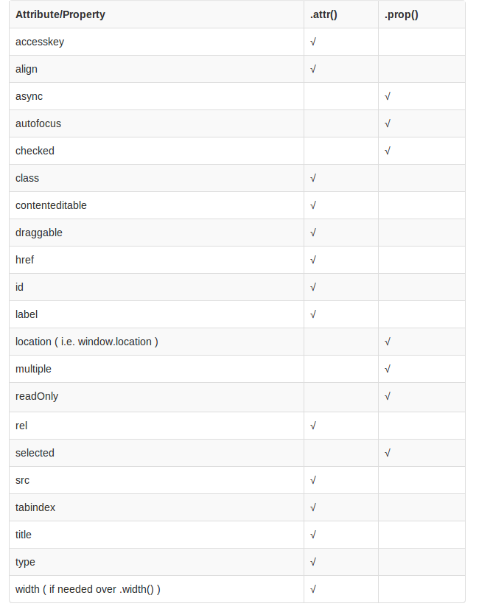

# jQuery

## jQuery概述

### jQuery是什么

是一个快速，简洁的Javascript库  --  `jquery.com`

设计宗旨：write less, do more

### 特点

* 用更少的代码，做更多的事情

* 不用管兼容性，jQuery已经做好了
* 不用记太多方法，而且功能强大
* 使用简单，看看文档就能学会
* 插件丰富，成千上万

### 为什么学？

* 轻量级，核心文件才几十KB，不会影响页面加载
* 早期使用jQuery的网站超过95%，到今天也有60%-70%
* 中大型Web开发项目的首选
* 兼容各种浏览器
* 开发者标配
* 开源，免费
* 插件丰富 http://www.jq22.com/

### 使用jQuery

#### 下载jQuery

进入官网 http://www.jq22.com/

下载未压缩版可以看到 源码的注释

#### 区别jQuery文件

开发版（开发时候使用）-- 未压缩版

生产板（用于发布之后）-- 压缩版

#### 引入

* 本地引入： `<script src="./lib/jquery-3.4.1.js"></script>`
* 用bootCDN引入

#### 版本

1. 1.x版本：
   * 兼容IE浏览器
   * 文件比较大
2. 2.x版本：
   * 部分支持IE8，支持IE9及其以上浏览器
   * 文件相比1.x版本比较小，执行效率更高
3. 3.x版本：
   * 完全不支持IE8及更低版本的浏览器
   * 提供一些新的方法及特性
   * 提供不包含动画及Ajax的版本


## jQuery核心

### 核心对象

```js
$ / jQuery
```

作为一个对象使用：

#### 例如：

**jQuery.each()**

```js
let arr = ['a', 'b', 'c']
$.each(arr, function (index, item) {
    console.log(index + "----" + item);
})
```

**jQuery.type()**

```js
// 返回类型
        console.log($.type(function () { }));
```


### 核心函数

自调用函数：自己调用自己

```js
(function (形参) {
	// 代码
}(实参))

// 或者

(function (形参) {
	// 代码
})(实参)
```

jQuery中的jQuery函数，是jQuery官方早就给我定义好的

既可以作为函数调用

也可以作为对象去调用jQuery中的方法

```js
jQuery源码
    // 所谓的jQuery核心函数,就是$或jQuery
    // jQuery定义了这个全局的函数提供我们使用
    // 它既可以作为一般函数调用
    // 它也可以作为对象调用早就定义好的方法
  
    (function (window, undefined) {

      var jQuery = (function () {

        // Define a local copy of jQuery
        var jQuery = function (selector, context) {
          //  返回了一个 jquery的对象 只有在创建对象的时候 才会new
          return new jQuery.fn.init(selector, context, rootjQuery);
        },
        return jQuery; // 对象
      })();
      // Expose jQuery to the global object
      window.jQuery = window.$ = jQuery;
    })(window);

```

##### 调用语法：$()

1. 参数可以为函数

   ```js
   $(function () {
               alert("11")
           })
   ```

2. 选择器的字符串

   ```html
   <body>
       <div class="one"></div>
       <div class="two"></div>
       <script src="./lib/jquery-3.4.1.js"></script>
       <script>
           console.log($(".one")[0]);
           //  返回第一个div
       </script>
   </body>
   ```

3. DOM对象

4. html标签字符串

   ```js
   $("<span>手动</span>").appendChild($("div"))
   ```

注意：

你给${}这个方法传入不同的参数，就会有不同的功能


## jQuery选择器

#### 注意：

只要用`$("")`获取的元素都是伪数组

### 基本选择器

##### Id选择器

`console.log($("#box"));`

##### 标签选择器

`console.log($("div"));`

##### 类选择器

`console.log($(".one"));`

##### 交集选择器

`console.log($("div.one"));`

##### 并集选择器

`console.log($(".one, .two"));`

##### 通配符选择器

`console.log($("*"));`


### 层级选择器

##### 后代选择器

`console.log($('ul li'));`

##### 子代选择器

`console.log($("ul > li"));`

##### 下一个兄弟选择器

`console.log($(".second + li"));`

##### 后面所有兄弟选择器

`console.log($(".second ~ li"));`


### 过滤选择器

##### 给定索引的元素

`console.log($("li").eq(2));`

`console.log($("li:eq(2)"));`

##### 索引大于 / 小于某一个某个值的元素

`console.log($("li:lt(2)"));`

##### 隐藏的元素

`console.log($("li:hidden"));`

##### 显示的元素

`cosole.log($("li:visible"))`


### 表单选择器

##### 获取所有Input,textarea,select和button表单元素

`console.log($(":input"));`

##### 匹配所有可用元素

`console.log($("input:enabled"));`

##### 匹配所有不可用元素

`console.log($("input:disabled"));`

##### 匹配所有被选中的元素

`console.log($("input:checked"));`

##### 匹配所有选中的复选框元素 

`console.log($(":checkbox:checked"));`

##### 匹配所有选中的option元素

`console.log($("option:selected"));`


## jQuery操作元素

### 操作HTML标签的类目

#### 添加类名 

`addClass()`

#### 移除类名

`removeClass()`

#### 切换类名

`toggleClass()`

#### 判断是否有某个类名 

`hasClass()`


### 操作HTML标签的属性

#### 获取 / 设置属性 

语法：`attr(属性名，属性值)`

```js
// 设置属性
// 还可以传  对象  作为参数
$("div").attr({
    // 可以给所有div添加这两个属性
            name: "zs",
            family: "dong"
        })

// 获取属性
let index = $(".first").attr("index");
```


#### 移除属性

语法：`removeAttr(属性名)`

```js
// 可以移除所有类名为 first 的元素的index属性
$(".first").removeAttr("index")
```


### 操作HTML表单的属性

checked

selected

disabled

这三个表单的属性还有一些其它属性需要用 `prop()` / `removeProp()` 来操作

```html
<body>
    <input type="text" disabled name="dong">
    <script src="./lib/jquery-3.4.1.js"></script>
    <script>
        $("input[name='dong']").prop('disabled', false)
    </script>
</body>
```




### 操作HTML表单的值

语法：`val()`

```html
<body>
    <input type="text" disabled name="dong" value="我测一下">
    <script src="./lib/jquery-3.4.1.js"></script>
    <script>
        // 获取
        console.log($(":text").val());
        // 修改
        $(":text").val("好用")
    </script>
</body>
```


### 操作HTML标签的内容

语法：`text()`  /  `html()`

```html
<body>
    <div></div>
    <script src="./lib/jquery-3.4.1.js"></script>
    <script>
        $('div').html("<h1>你好</h1>")
        $('div').text("<h1>你好</h1>")
    </script>
</body>
```


#### jQuery和原生js混合使用

```html
    <style>
        div {
            width: 200px;
            height: 200px;
            background-color: aqua;
        }
    </style>
</head>

<body>
    <div></div>
    <script src="./lib/jquery-3.4.1.js"></script>
    <script>
        let oDiv = document.querySelector("div")
        // 原生js
        oDiv.onclick = function () {
            // oDiv.style.display = 'none'
            // 需要 将原生对象 转换为 jQuery对象
            // $(oDiv).hide()
        }
        // jQuery
        $("div").click(function () {
            // $('div').hide()
            // 需要 将jQuery对象 转换为 原生对象
            // $('div')[0].style.display = "none"
            $('div').get(0).style.display = "none"
            // get(索引)返回的是DOM对象，eq(索引)返回的是jQuery对象
        })
    </script>
</body>
```

