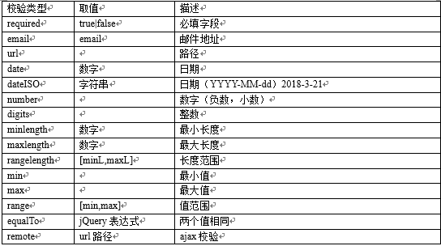
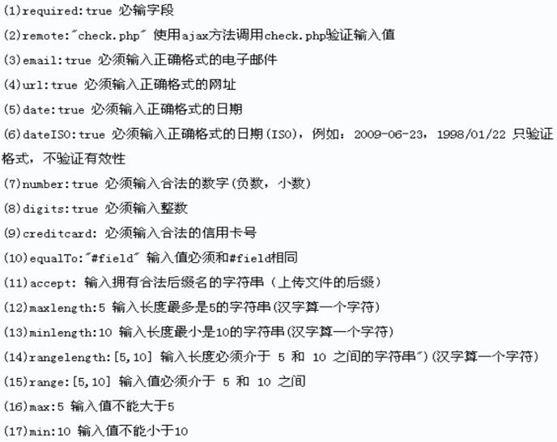

## `jQuery`插件

#### 定义：

通过别人开发写出来的一些功能，发布到网上，供其他开发者使用的代码

所谓的`jQuery`插件，就是基于`jQuery`开发的一些好用的功能的代码

那么所谓的`js`插件，就是基于原生的`js`, 原生的DOM开发的一些好用的功能代码，例如：`lodash`（全局对象为 `_`）

### 扩展插件

#### 扩展`jQuery`的工具方法

```js
$.fn.changeColor = function (color) {
    $(this).css("backgroundColor", color)
}
```


#### 解决全局对象同名冲突的问题

```html
<body>
    <button>按钮</button>

    <script src="./lib/jquery-3.4.1.js"></script>
    <script>
        // var $ = 10;
        // $("button").on("click", function () {
        //     console.log("姚姚真能吃");
        // })
        // 同名冲突会报错

        // 解决方案一：
        // 把 $ 换成 jQuery
        // var $ = 10;
        // jQuery("button").on("click", function () {
        //     console.log("姚姚真能吃");
        // })

        // 解决方案二：
        // 把$使用权给释放 换成别的符号 jQ
        var jQ = $.noConflict()
        // 注意：这里不能用let
        var $ = 10;
        jQ("button").on("click", function () {
            console.log("姚姚真能吃");
        })
    </script>
</body>
```


### 常用的`jQuery`插件

基于`jQuery`的扩展库

官方推荐：http://plugins.jquery.com

`jQuery`之家：http://www.htmleaf.com

`jQuery`插件库：http://www.jq22.com

好的插件应该小而美，不应该大而全

#### 放大镜插件

##### 介绍

`exzoom`是一款`jquery`商城商品放大镜插件。该`jquery`放大镜插件,自带缩略图导航和自动播放功能,也提供了手动修改大图的方法

##### 下载

http://www.htmleaf.com/jQuery/Image-Effects/201807245242.html

##### 使用步骤：

* 引入（人家用哪个版本，我们就先用哪个版本，没问题再想用的版本）

  ```html
  <link href="dist/css/jquery.exzoom.css" rel="stylesheet">
  <script src="js/jquery-1.11.0.min.js" type="text/javascript"></script>
  <script src="js/jquery.exzoom.js"></script>
  ```

* `html`结构

  ```html
  <div class="exzoom" id="exzoom">
      <!--大图区域-->
      <div class="exzoom_img_box">
          <ul class='exzoom_img_ul'>
              <li></li>
              <li></li>
              <li></li>
              <li></li>
              <li></li>
              <li></li>
              <li></li>
              <li></li>
          </ul>
      </div>
      <!--缩略图导航-->
      <div class="exzoom_nav"></div>
      <!--控制按钮-->
      <p class="exzoom_btn">
          <a href="javascript:void(0);" class="exzoom_prev_btn"> < </a>
          <a href="javascript:void(0);" class="exzoom_next_btn"> > </a>
      </p>
  </div> 
  ```

* 初始化插件

  ```js
  $("#exzoom").exzoom();
  ```

* 配置参数

  ```js
   $("#exzoom").exzoom(defaults = {
        "navWidth": 40,//列表每个宽度,该版本中请把宽高填写成一样
        "navHeight": 60,//列表每个高度,该版本中请把宽高填写成一样
        "navItemNum": 5,//列表显示个数
        "navItemMargin": 7,//列表间隔
        "navBorder": 1,//列表边框，没有边框填写0，边框在css中修改
        "autoPlay": true,//是否自动播放
        "autoPlayTimeout": 2000,//播放间隔时间
      });
  ```

  

#### 标签页插件

##### 介绍

这是一款`jQuery`响应式Tabs选项卡插件。该tabs选项卡插件兼容`ie8`，当浏览器缩小到小于选项卡的宽度时，选项卡的菜单会以下拉菜单的方式来显示。

##### 下载

http://www.htmleaf.com/jQuery/Tabs/201809285348.html


#### 全屏滚动插件

##### 介绍

`fullPage.js`是一款`js`页面全屏滚动插件。可轻易创建全屏滚动单页网站。可以和`vue.js`，`react.js`和`angular.js`完美结合使用。

`fullPage.js`兼容所有的现代浏览器，以及一些旧版浏览器，如Internet Explorer 9，Opera 12等都能兼容。 可兼容支持`CSS3`的浏览器与非支持`CSS3`的浏览器，适用于旧版浏览器。 同时，手机、平板电脑和触摸屏电脑还提供触屏支持。

##### 下载

http://www.htmleaf.com/jQuery/Layout-Interface/201812055442.html


#### 轮播图插件

##### 介绍

`Swiper`是一款支持硬件加速过渡动画的移动手机幻灯片插件。该幻灯片可以很好的在`iOS`，Android，Windows Phone 8和桌面浏览器中工作。`Swiper`提供了大量参数和`api`，功能非常强大

##### `swiper`官网

https://www.swiper.com.cn/


#### 日期选择插件 (`js`插件)

##### 介绍

日期与时间组件 `layDate`

##### 官网

https://www.layui.com/laydate/

##### 使用注意

获得 `layDate` 文件包后，解压并将*`laydate` 整个文件夹*（不要拆分结构） 存放到你项目的任意目录，使用时，*只需引入 `laydate.js` 即可。*

```html
<body>
    <input type="text" id="ccc">

    <script src="./laydate/laydate.js"></script>
    <script>
        //自定义颜色
        laydate.render({
            elem: '#ccc',
            theme: '#cccccc',
            // 日期和时间都可以选
            type: "datetime",
            // 时间范围，中间的字符串
            range: "到",
            format: "yyyy年M月d日H时m分s秒",
            // 显示公历节日
            calendar: true
        });
    </script>
</body>
```


#### 表单校验插件（任何网站）

##### 介绍

在学习JavaScript时，我们手动的完成过表单数据的校验，此功能在开发中非常常见，属于通用功能范畴，实际开发一般使用的都是第三方工具，本案例我们使用`jQuery`插件validation进行表单校验

##### 官网

https://jqueryvalidation.org （全英文，不如百度）

##### 使用步骤

```html
<body>
    <form id="login-form">
        <fieldset>
            <legend>登录</legend>
            <div>
                账号：<input type="text" name="username">
            </div>
            <div>
                密码：<input type="password" name="password">
            </div>
            <div>
                <input type="submit" value="登录">
            </div>
        </fieldset>
    </form>

    <script src="./jquery-validation-1.15.0/lib/jquery.js"></script>
    <script src="./jquery-validation-1.15.0/dist/jquery.validate.min.js"></script>
    <script src="./jquery-validation-1.15.0/dist/localization/messages_zh.min.js"></script>

    <script>
        // 语法规则
        // $("form表单的选择器").validate({
        //     // 规则
        //     rules: {
        //         "表单项name值": "校验规则",
        //         // 多个就写一个对象
        //         username: {
        //             // 必填要求
        //             required: true,
        //         }
        //     },
        //     // 错误信息
        //     messages: {
        //         //根据上面的
        //         username: {
        //             // 错误信息
        //             required: "用户名必须填写"
        //         }
        //     }
        // })

        // 例：
        $("#login-form").validate({
            // 填写规则
            rules: {
                // 表单项的name名
                username: {
                    // 必填
                    required: true,
                    // 规定用户名必须在6-18位
                    rangelength: [6, 18]
                },
                password: {
                    required: true,
                    rangelength: [6, 8]
                }
            },
            // 违反规则后，出现的错误信息
            messages: {
                // 表单项的name名
                username: {
                    // 对应的错误信息内容
                    required: "用户名必须填写",
                    rangelength: "必须写到6-18位"
                },
                password: {
                    required: "不填密码不行的",
                    rangelength: "密码必须是6到8位的"
                }
            }
        })
    </script>
</body>
```






### 客户端存储

在浏览器（浏览器也是一种客户端）上存数据

例如：微信等`app`就有客户端存储的功能

#### cookie(node)

#### `sessionStorage`(极少用到)

数据中能存一会儿，不能永久存储

#### `localStorage` 本地存储

##### 介绍

`localStorage`生命周期是永久，这意味着除非用户显示在浏览器提供的`UI`上清楚了`localStoragex`信息，否则这些信息将永远存在。存放数据大小一般为`5MB`，而且它仅在客户端（即浏览器）中保存

##### 方法

`localStorage.setItem(key,value)` --- 添加数据

`localStorage.getItem(key)` --- 获取某个数据

`localStorage.removeItem(key)` --- 删除某个数据

`localStorage.clear()` --- 清空数据

`localStorage.key(index)`  --- 获取某个索引的key

```html
<body>
    <button class="add">添加数据</button>
    <button class="get">获取数据</button>
    <button class="remove">删除一个</button>
    <button class="cle">清空</button>
    <button class="getkey">获取某个索引0的key</button>

    <script src="./lib/jquery-3.4.1.js"></script>
    <script>
        // 增 window.localStorage.setItem(key, value)
        $(".add").click(function () {
            window.localStorage.setItem("name", "['zs','lisi']")
            // 注意键值对都要写出字符串，JSON才能解析,而且必须是 单引号包双引号
            localStorage.setItem("name2", '{"name":"ccc"}')
        })
        // 获取 getItem(key)
        $(".get").click(function () {
            // 这是个字符串
            console.log(localStorage.getItem("name2"));
            // 这才是个对象
            console.log(JSON.parse(localStorage.getItem('name2')));
        })
        // 删除 removeItem(key)
        $(".remove").click(function () {
            localStorage.removeItem("name2")
        })

        $(".cle").click(function () {
            // 全部清空
            localStorage.clear()
        })

        $(".getkey").click(function () {
            console.log(localStorage.key(0));
        }) 
    </script>
</body>
```


##### 搜索历史记录案例：

```html
<!DOCTYPE html>
<html lang="en">

<head>
    <meta charset="UTF-8">
    <meta name="viewport" content="width=device-width, initial-scale=1.0">
    <title>Document</title>
</head>

<body>
    <input type="text" id="new">
    <input type="button" value="搜索" id="search">
    <a href="javascript:;" id="clear">清空记录</a>
    <ul>
        <!-- <li>没有搜索记录</li> -->
        <!-- <li>
            <span>手机</span>
            <a href="javascript:;">删除</a>
        </li> -->
    </ul>

    <script src="./lib/jquery-3.4.1.js"></script>
    <script>
        // 先存入一些假数据 fakehistory = ["手机","电脑"]
        // 显示现有历史记录
        function showData() {
            let aData = getDate();
            // 检测数据中的元素长度是否为0
            if (aData.length == 0) {
                $("ul").html(`<li>没有搜索记录</li>`)
            }
            else {
                let htmlStr = ''
                $.each(aData, function (i, j) {
                    htmlStr += `
                    <li>
            <span>${j}</span>
            <a href="javascript:;">删除</a>
        </li>
                    `
                })
                $("ul").html(htmlStr)
            }
        }
        showData()
        // 获取数据 函数
        function getDate() {
            return JSON.parse(localStorage.getItem('fakehistory') || '[]')
        }

        // 点击搜索，把数据添加到localStorage中
        $("#search").on("click", addDate)
        function addDate() {
            let newData = $("#new").val()
            if (newData.trim().length == 0) {
                alert("你要搜啥")
            }
            else {
                let aData = getDate()
                // 检查是否有相同的历史记录
                $.each(aData, function (i, j) {
                    // 有则删除
                    if (j == newData) {
                        aData.splice(i, 1)
                    }
                })
                // 添加新数据
                aData.push(newData)
                // 把新数据转成JSON的字符串
                localStorage.setItem("fakehistory", JSON.stringify(aData))
                // 再次显示
                showData()
                // 清空输入框
                $("#new").val('')
            }
        }

        // 删除功能  --- 需要委托给ul
        $('ul').on("click", "a", deleteData)
        function deleteData() {
            // 获取被点击删除的那个
            let spanFont = $(this).siblings("span").html();
            let aData = getDate()
            // 找到要删除的
            $.each(aData, function (i, j) {
                // 有则删除
                if (j == spanFont) {
                    aData.splice(i, 1)
                }
            })
            // 把新数据转成JSON的字符串
            localStorage.setItem("fakehistory", JSON.stringify(aData))
            // 再次展示
            showData()
        }

        // 清空功能
        $("#clear").on("click", clearHistory)
        function clearHistory() {
            localStorage.setItem('fakehistory', '[]')
            showData()
        }
    </script>
</body>

</html>
```


