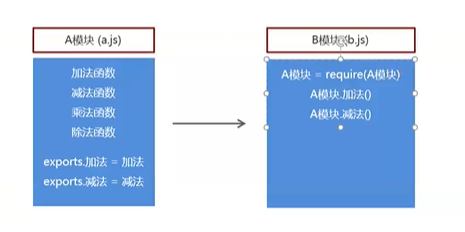
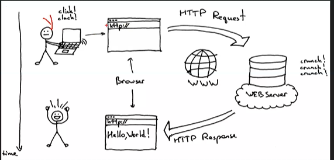
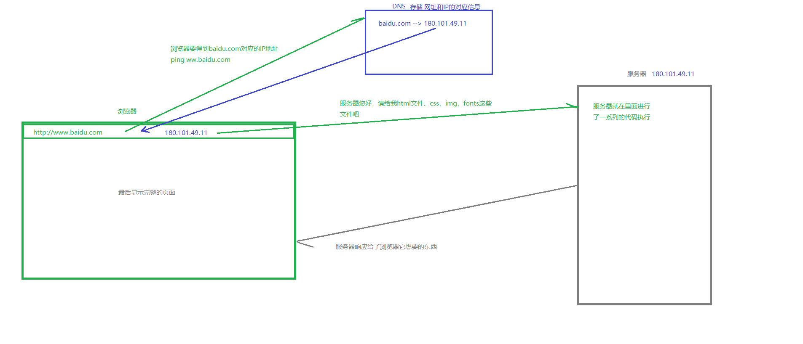
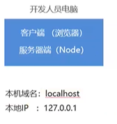

# Node.js基础

## 为什么学习Node?

1. Ajax需要服务器的支持
2. 前端（html, css, js）和后端（java, python, Node），能够和后端程序员更加紧密的配合
3. Vue 和 React 也需要Node的支持


## 服务器开发要做的事情

- 实现网站的业务逻辑
- 数据的增删改查


## Node是什么？

Node是一个基于Chrome V8引擎的JavaScript代码运行环境。（JavaScript原本是做前端开发的，随着JavaScript的发展现在也可以做后端）


## Node.js运行环境安装

官网：http://nodejs.org/en/

* LTS = Long Time Support 长期支持版、稳定版
* Current 拥有最新特性 （实验版）

## Node.js的快速入门

### Node.js 的组成

* JavaScript是由三部分组成，ECMAScript, DOM, BOM。
* Node.js是`ECMAScript`以及`Node 环境`提供的一些`附加API`组成的，包括文件、网络、路径等等一些更加强大的API （没有兼容性问题）

### Node.js 基础语法

就是ECMAScript的语法

在Node环境下执行语法：node 后缀名为.js的文件 （快捷键: Tab）

#### Node.js全局对象 global

在浏览器中，顶级对象是window

在node中，顶级对象是 global

* console.log() 在控制台中输出
* setTimeout() 设置超时定时器
* clearTimeout() 清除超时定时器
* setInterval() 设置间歇定时器
* clearInterval() 清除间歇定时器

在终端中停止命令行：`ctrl+C`

## 模块化

JavaScript在使用时存在两大问题，<font color=red>文件依赖</font>和<font color=red>命名冲突</font>

**软件中的模块化开发：**

一个功能就是一个模块，多个模块可以组成完整应用，抽离一个模块不会影响其他功能的运行。

### node的模块化规范（common.js模块化规范）


### Node.js的模块化开发

* Node.js规定一个<font color=red>JavaScript文件</font>就是一个模块，模块<font color=red>内部定义的变量和函数</font>默认情况下在<font color=red>外部无法得到</font>。
* 模块内部可以使用<font color=red>exports对象进行成员导出</font>，使用<font color=red>require方法</font>导入其他模块。



#### 导出

exports是module.exports的别名（地址引用关系），导出对象最终以书写顺序为准

建议写法：<font color=red>module.exports = {}  /  module.exports.键 = 值 </font>

```js
/* 在module1.js文件中 */
let strA = '我产于module1'
let strB = "我也是产于module1"

module.exports = {
    stra: strA
}
module.exports.strb = strB;
```

#### 导入

方法：<font color=red>require("模块的路径及名字")</font>

```js
/* 在module2.js文件中 */
let module1 = require("./module1") // 后缀名.js可写可不写

console.log(module1.stra);

console.log(module1.strb);
```


## Node的模块分类

1. 系统模块
2. 第三方模块（文件模块、插件（包））

### Node的系统模块

定义：Node运行环境提供的API，因为这些API都是一模块化的方式进行开发的，所以我们又称Node运行环境提供的API为系统模块。

#### fs模块

f: file文件；s：system系统，文件操作系统

```js
const fs = require('fs')
```

**读取文件内容**

```js
fs.readFile("文件路径/文件名称",["文件编码"], callback)
```

```js
// 1. 导入模块
let fs = require("fs");
console.log(fs);

// 2. 使用模块的读文件的方法来读文件
// readFile是一个异步的方法，因为读文件是硬盘来做的，
fs.readFile("./read.txt", "utf8", function (err, data) {
    // err代表错误对象，如果没有错误，那么值为null
    console.log(err);  // 找不到文件： no such file or directory  
    // data代表数据对象，如果没有错误，那么值为内容
    console.log(data);
    // 最好写上"utf8"参数
})
//注意：node在哪个目录下执行，哪个目录就是根目录
```

**写入文件内容**

```js
fs.writeFile('文件路径/文件名称', '数据', callback)
```

```js
// 1. 导入fs模块
const fs = require('fs');

// 2. 使用fs模块的写入文件内容的方法 wirteFile
let content = `<h1>通过writeFile把内容写入html文件</h1>`
fs.writeFile("./index.html", content, function (err) {
    if (err != null) {
        console.log(err);
        return;
    }
    console.log('文件写入成功')
})
```

**创建文件**

```js
// 引入fs模块
const fs = require("fs");
// 使用fs的mkdir 创建文件夹的意思  异步创建
fs.mkdir("./yuanxudong", { recursive: true }, function (err) {
    if (err != null) {
        console.log(err);
        return;
    }
    console.log("创建成功");
})
```


#### 系统模块path   路径操作

path可以帮助我们拼接出对应系统的路径

##### 为什么要进行路径拼接

* 不同操作系统的路径分隔符不统一
* /public/uploads/avatar
* Windows 上是  \  /
* Linux 上是 /

```js
// 拼接路径
// 1. 引入模块
const path = require("path");
// 2. 拼接路径   在什么系统下，拼接成什么系统的路径
let finalPath = path.join("public", "uploads", "avatar", "xxx.jpg");
console.log(finalPath);  //public\uploads\avatar\xxx.jpg
```


#### 相对路径VS绝对路径

* 大多数情况下使用绝对路径，因为相对路径有时候相对的是命令行工具的当前工作目录
* 在读取文件或者设置文件路径时都会选择绝对路径
* 使用 `__dirname` 获取当前文件所在的绝对路径

```js
// 导入模块
const fs = require("fs");
const path = require("path");
// 利用当前根目录
console.log(__dirname);
// 这样的话，不论我们在哪里执行node，我们都可以成功找到相对本文件路径的read.txt, 并匹配系统的路径写法
fs.readFile(path.join(__dirname, "read.txt"), "utf8", function (err, data) {
    console.log(err);
    console.log(data);
})

```


### Node的第三方模块

（自己写的）

（其他开发者写的）

就是别人写好的，具有特定功能的、我们能直接使用的模块，由于第三方模块通常都是由多个文件组成并且被放置在一个文件夹中，所以又叫包。

#### 第三方模块有两种存在形式：

* 以js文件的形式存在，提供实现项目具体功能的API接口
* 以命令行工具形式存在，辅助项目开发

#### 获取第三方模块

npmjs.com：第三方模块的存储和分发仓库

npm(node package manager)：node的第三方模块管理工具

* 下载：npm install 模块名称（@版本号）
* 卸载：npm uninstall package 模块名称

全局安装与本地安装

* 命令行工具：全局安装
* 库文件：本地安装


#### 第三方模块 nrm

nrm（npm registry manager）：npm 下载地址切换工具（也是命令行工具）

mpm默认的下载地址在国外，国外下载速度慢，所以我们可以使用nrm

使用步骤：

1. 使用npm install nrm -g 下载   （`-g`代表全局）
2. 查询可用下载地址列表 nrm ls
3. 切换npm下载地址  `nrm use taobao(下载地址名称)`


#### 第三方模块 nodemon

命令行工具，用于辅助项目开发。

在Node.js中，每次修改文件都要在命令行工具中重新执行该文件，很繁琐。

使用步骤：

1. 使用npm install nodemon -g  下载
2. 在命令行工具中用nodemon命令代替node命令执行文件


## Node中包的管理-package.josn

### 为了解决node_modules文件夹的问题

1. 文件夹已经文件过多过碎，当我们将项目整体拷贝给别人的时候，传输速度会很慢很慢。
2. 复杂的模块以来关系需要被记录，确保模块的版本和当前保持一致，否则会导致当前的项目运行报错。

### 创建package.json

**初始化项目-命令**：   可以生成package.json

```
npm init -y   (-y就是都回答yes)
```

dependencies 项目依赖：就是开发中需要的包，线上也需要的包

devDependencies 开发时的依赖：就是只在开发时依赖，线上不需要的包

**安装仅在开发时需要的包-命令**：

```
npm install 包名 --save-dev
```

#### package.json的作用：

是记录项目主要信息

```json
{
  "name": "code01",
  "version": "1.0.0",
  "description": "",
  "main": "index.js",
  "scripts": {
    "test": "echo \"Error: no test specified\" && exit 1"
  },
  "author": "yuanxudong",
  "license": "ISC",
  "dependencies": {
    "jquery": "^3.4.1"
  },
  "devDependencies": {
    "sass": "^1.26.5"
  }
}

```

#### package-lock.json的作用：

* 锁定包的版本，确保再次下载时不会因为包版本不同而产生问题
* 加快下载速度，因为该文件中已经记录了项目所依赖第三方包的树状结构和包的下载地址，重新安装时只需下载即可，不需要做额外的工作。


## Node中模块的加载机制

### 模块的查找规则-当模块拥有路径但没有后缀时

```js
require("./find.js")
```

```js
require("./find")
```

1. require方法根据模块路径查找模块，如果是完整路径，直接引入模块
2. 如果模块后缀省略，先找同名JS文件在找同名文件夹
3. 如果找到了同名文件夹，找文件夹中的index.js
4. 如果文件夹中没有index.js就会去当前文件夹中的package.json文件中查找main选项中的入口文件
5. 如果找指定的入口文件不存在或者没有指定入口文件就会报错，模块没有被找到。

### 模块的查找规则-当模块没有路径且没有后缀时

```js
require("find");
```

1. Node.js先会假设它是系统模块
2. 如果没有，Node.js会去node_modules文件夹中
3. 首先看是否有该名字的JS文件
4. 再看是否有该名字的文件夹
5. 如果是，看文件夹里是否有index.js
6. 如果没有index.js查看该文件夹中package.json中的main选项确定模块入口文件
7. 否则找不到报错


## 服务器

网站的组成：

网站应用程序主要分为两大部分：客户端和服务器端。

客户端：在浏览器中运行的部分，就是用户看到并与之交互的界面程序，使用HTML、CSS、JavaScript构建。

服务器端：在服务器中运行的部分，负责存储数据和处理应用逻辑。

### 什么是服务器

服务器指的就是一台安装特点软件的计算机，用于专门提供特定的服务 - 按照服务类型的不同，又划分为：Web服务器、数据库服务器、文件服务器等等。也会按照系统分类。

#### 客户端

客户端指的是在一次服务过程中使用这个服务的设备（网络端点）- 目前我们常见的客户端就是浏览器。


### C/S构架与B/S构架

应用软件架构一般分为两类：

* B/S构架：Browser(浏览器) <--- --->Server(服务器)，这种软件都是通过浏览器访问一个网站使用，服务器提供数据存储等服务
* C/S构架：Client(客户端)<--- --->Server(服务器)，这种软件通过安装一个软件到电脑，然后使用，服务器提供数据存储等服务

B/S的优点与缺点：

```txt
优点：部署方便（不用安装），可维护性强
缺点：用户体验不好，不能针对每个用户的不同特点进行设置
```

C/S的优点与缺点：

```txt
优点：用户体验好
缺点：部署不方便（需要安装），可维护性弱
```


### 请求响应的流程

1. 用户打开浏览器
2. 地址栏输入我们需要访问的网站地址（URL）
3. 浏览器通过DNS服务器（`存储网址和IP的对应信息`），获取即将访问的网站的IP地址
4. 浏览器发起一个对这个IP地址的请求
5. 服务端监听指定的端口的服务器软件接收到这个请求，进行相应的处理
6. 服务端将处理完的结果返回给客户端浏览器（响应）
7. 浏览器将服务端返回的结果呈现到界面上

**网站地址**：花钱买的 --> 域名是唯一的   

**DNS服务器**：域名解析服务器

**IP（Internet Protocol Address 互联网协议地址）**：计算机在网络中的唯一地址 （范围：000.000.000.000-255.255.255.255）本机IP：127.0.0.1  对应的域名：localhost

**端口**：0-65535  总共有65536个端口号 （22端口是ssh常用的，80端口是网络 3306是数据库常用的端口  443是https的）访问网站时，默认为80，所以我们访问网站就是在访问：`IP地址:80端口`







#### 开发过程中客户端和服务器端说明

在开发阶段，客户端和服务器端使用同一台电脑，即开发人员电脑。




### 创建web服务器

#### Node内置模块之http

```js
// 1. 引入Node给我们提供的http模块
const http = require("http");
// 2. 使用http模块的createServer
let server = http.createServer();
// 3. 监听客户端的请求，并处理请求，最后把处理的结果通过网络在响应回客户端浏览器
server.on('request', function (req, res) {
    console.log(req);

    // req: request 请求  请求是浏览器发起的，请求服务器干一些事情
    // res: response 响应  响应式服务器发起的，要发送一些结果给浏览器
    res.write("<h1>Helloworld</h1>");
    // 告诉浏览器  我说完了
    // 表示服务端对客户端的数据已经发送完毕了，客户端可以接收并显示了
    res.end()
    // 如果只发送一次的话，可以直接使用res.end("Helloworld")
})
// 4. 启动服务器，并指定服务器要监听的端口号
//    这里可以有三个参数：端口号，服务器的IP地址（默认是本地回环地址127.0.0.1）
//    第三个参数是当前服务器启动成功后，要执行的回调函数
server.listen(3000, function () {
    console.log("请打开http://127.0.0.1:3000/localhost:3000");
})
```


