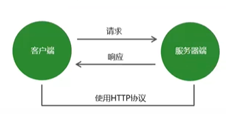
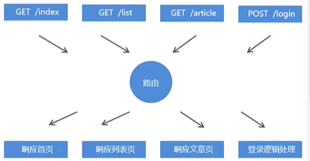

## http协议

### 概念

超文本传输协议（英文：HyperText Transfer Protocol, 缩写：HTTP）规定了如何从网站服务器传输超文本到本地浏览器，它基于客户端服务器架构工作，是客户端（用户）和服务器端（网站）请求和应答的标准。



### 报文

在HTTP请求和响应的过程中传递的数据就叫报文，包括要传送的数据和一些附加信息，并且要遵守规定好的格式。


### http请求方式

GET 请求  --  查

POST 请求  -- 增

PUT 请求  --  改

DELETE 请求  --  删


### http请求报文

```js
请求方式(GET等) / 请求地址 请求协议/版本  // 请求行

各种各样的请求头： // 请求头
键：值
/* 例如：accept键值对 浏览器告诉服务器，我能识别的文件格式 */
// accept: 'text/html,application/xhtml+xml,application/xml;q=0.9,image/webp,image/apng,*/*;q=0.8,application/signed-exchange;v=b3;q=0.9'

请求内容:  // 请求主体
// 格式为：username=tom&password=123
```

```js
app.on("request", (req, res) => {
    // 请求方式
    console.log(req.method);
    // 请求地址
    console.log(req.url);
    // 请求头
    console.log((req.headers));
    // 响应给客户端一句话
    res.end("Hello World1")
})
```


### http响应报文

```js
协议/版本号 状态码 状态码的描述 //响应行

各种各样的响应头： // 响应头
键：值
响应内容   // 响应主体
```

```js
app.on("request", (req, res) => {
    // 设置响应报文
    // res.writeHead(响应状态码，响应头)
    res.writeHead(200, {
        "Content-Type": "text/html;charset=utf8"
    })
    // 响应给客户端一句话
    res.end("这样就能正确显示中文了")
})
```

状态码：（1 信息  2 成功  3 重定向 4 客户端错误 5 服务器错误）

* 200请求成功
* 404请求的资源没有被找到
* 500服务器错误
* 400 客户端请求有语法错误

MIME类型：（文件的类型，也就是服务器告诉浏览器我发了什么类型的文件）

* text/html
* text/css
* application/javascript
* image/jpeg
* image/png
* image/gif
* application/json


## http请求与响应处理

### 通过GET方式把数据发送到后台

* 参数将被放置在浏览器地址栏中，例如：`(http://localhost/?username=袁旭东&password=123456)`
* 参数获取需要借助系统模块url，url模块用来处理url地址

1. 前端

   * 创建一个页面
   * 在form的action中写入要把这些数据交给哪个后台程序处理 --> 地址
   * 在form的method属性中声明请求方式（GET）
   * 在input中声明name属性
   * 按钮务必是submit

   ```html
   <body>
       <!-- action 用户输入的内容让谁去处理(交给谁) -->
       <!-- method 使用什么提交方式 -->
       <form action="http://localhost" method="GET">
           <input type="text" name="username" id="">
           <input type="password" name="password" id="">
           <input type="submit" value="登录">
       </form>
   </body>
   
   ```

   

2. 后端

   * 在监听请求事件中获取url，那就是前端传过来的数据

     ```js
     const http = require("http");
     
     let app = http.createServer();
     // 获取url模块
     const url = require('url');
     
     app.on("request", (req, res) => {
         // 为了解决乱码
         res.writeHead(200, {
             "Content-Type": "text/html;charset=utf8"
         })
         // 获取url字符串
         let urlStr = req.url;
         console.log(urlStr);  // /?username=123&password=1231231
         // 使用url模块的parse方法，得到url的对象形式
         // 将url路径的各个部分解析出来并返回对象，true代表将参数解析为对象格式
         let params = url.parse(urlStr, true);
         console.log(params.query);
         // { username: 'yuan', password: '123' }
         if (params.query.username == "tom" && params.query.password == "123456") {
             res.write("欢迎您，" + params.query.username)
         } else {
             res.write("账号或密码有错误，请您去注册")
         }
         res.end();
     })
     
     app.listen(80, () => {
         console.log("请访问localhost");
     })
     ```

### 通过POST方式把数据发送到后台

* 参数被放置在请求中进行传输
* 获取POST参数需要使用data事件和end事件
* 使用querystring系统模块将参数转换为对象格式

1. 前端

   - 创建一个页面
   - 在form的action中写入要把这些数据交给哪个后台程序处理 --> 地址
   - 在form的method属性中声明请求方式（POST）
   - 在input中声明name属性
   - 按钮务必是submit

   ```html
   <body>
       <!-- action 用户输入的内容让谁去处理(交给谁) -->
       <!-- method 使用什么提交方式 -->
       <form action="http://localhost" method="POST">
           <input type="text" name="username" id="">
           <input type="password" name="password" id="">
           <input type="submit" value="登录">
       </form>
   </body>
   
   ```

   

2. 后端

   - 通过post方式发送的数据不用url模块的parse方式把数据变成对象，要用querystring模块的parse方式

   ```js
   const http = require("http");
   const queryString = require("querystring");
   let app = http.createServer();
   
   app.on("request", (req, res) => {
       // 为了解决乱码
       res.writeHead(200, {
           "Content-Type": "text/html;charset=utf8"
       });
       let postData = "";
       // data事件 --> 监听数据传输事件
       req.on("data", (chunk) => {
           // chunk 获取到的是  字符串的16进制表示
           // 传输一点儿，拼接一点儿
           console.log(chunk);
           // 在传输中，不能保证数据传输完整
           postData += chunk;
       })
       // end事件 -->  监听数据传输完毕事件
       req.on("end", () => {
           console.log(postData);  // username=1&password=1
           // postdata就变成了数据
           // 把数据变成对象
           let finalData = queryString.parse(postData);
           console.log(finalData);  // { username: '1', password: '1' }
       })
   })
   
   app.listen(3000, () => {
       console.log("请访问localhost:3000");
   })
   ```


### 路由

路由是指客户端请求地址与服务器程序代码的对应关系。简单的说，就是请求什么响应什么。



```js
const http = require("http");
const url = require("url");

let server = http.createServer();
server.on("request", function (req, res) {
    // req.url是从请求中获取的url信息   /list?name=1
    console.log(req.url);
    // 用url模块的parse方法处理一下url，提取出路径名  （当url中掺杂参数 的时候 必须使用pathname来做）
    let pathName = url.parse(req.url, true).pathname;
    console.log(pathName);  // /list
    // 根据用户请求的不同路径名，写入不同的页面内容，这就是路由
    if (pathName == "/" || pathName == "/index") {
        res.end("index");
    }
    if (pathName == "/list") {
        res.end("list");
    }
    if (pathName == '/login') {
        res.end("login");
    }
    if (pathName == "/news") {
        res.end("news")
    }
})

server.listen(80);
```


## Express

