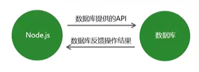
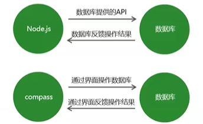

# `MongoDB`数据库

## 数据库概述及环境搭建

### 为什么要使用数据库

* 动态网站中的数据都是存储在数据库中的
* 数据库可以用来持久存储客户端通过表单收集的用户信息
* 数据库软件本身可以对数据进行高效管理

### 什么是数据库

数据库即存储数据的仓库，可以将数据进行有序的分门别类的存储。它是独立于语言之外的软件，可以通过`API`去操作它。

常见的数据库软件有：`mysql`、`mongoDB`、`oracle`



### `MongoDB`数据库下载安装

下载地址: https://www.mongodb.com/download-center/community


### 可视化软件

`MongoDB-compass`数据库的可视化操作软件，是使用图形界面操作数据库的一种方式



### 数据库相关概念

database 数据库：`mongoDB`数据库软件中可以建立多个数据库

collection 集合：一组数据的集合

document 文档：一条具体的数据

field 字段：文档中的属性名称

### Mongoose 第三方包

* 使用Mongoose第三方包可以操作`MongoDB`数据库

* 使用 `npm install mongoose` 命令下载

* 使用connect连接

  ```js
  // 使用 mongoose这个包来连接数据库
  
  // 1. 引入
  const mongoose = require("mongoose");
  // 2. 使用mongoose的包的connect方法来连接数据库
  
  // mongoose.connect("mongodb协议://IP或域名/数据库名称")
  mongoose.connect('mongodb://localhost/db_student', {
      useNewUrlParser: true,
      useUnifiedTopology: true
  }).then(() => {
      console.log("数据库连接成功");
  }).catch((err) => {
      console.log("数据库连接失败");
  });
  ```


### 创建数据库

在`MongoDB`中<font color=red>不需要显式创建数据库</font>，如果正在使用的数据库不存在，<font color=red>MongoDB会自动创建</font>。 <font color=yellow>但是必须是有数据的前提下</font>

### 给数据库中添加数据

#### 创建集合

创建集合分为两步，一是对集合设定规则，二是创建集合

```js
// 连接数据库
// 使用 mongoose这个包来连接数据库

// 1. 引入
const mongoose = require("mongoose");
// 2. 使用mongoose的包的connect方法来连接数据库

// mongoose.connect("mongodb://IP或域名/数据库名称")
mongoose.connect('mongodb://localhost/db_student', {
    useNewUrlParser: true,
    useUnifiedTopology: true
}).then(() => {
    console.log("数据库连接成功");
}).catch((err) => {
    console.log("数据库连接失败");
});

// 创建数据集合规则（学生表：学生姓名，学生年龄，家庭住址，爱好）
// 创建学生信息的约束
let studentSchema = new mongoose.Schema({
    // 字段：数据类型
    name: String,
    age: Number,
    address: String,
    hobbies: Array
})
// 应用规则
let Student = new mongoose.model("Student", studentSchema);

// 给Student添加数据
let student = new Student({
    name: "dong",
    age: 22,
    add: "home",
    hobbies: ["打球", "代码"]
})

// 保存数据
student.save();
```

<font color=red>**另一种方法**</font>

```js
// 创建学生信息的约束
let studentSchema = new mongoose.Schema({
    // 字段：数据类型
    name: String,
    age: Number,
    address: String,
    hobbies: Array
})
// 创建集合并应用规则  
let Student = new mongoose.model("Student", studentSchema);

// 
Student.create({
    name: 'shin',
    age: 20,
    address: '某哦某小区',
    hobbies: ["打游戏"]
})
    .then((data) => {
        console.log(data);
    })
    .catch((err) => {
        console.log(err);
    });
```


### 查询数据库中的所有数据

```js
Student.find().then((data) => {
    console.log(data);  // 返回集合 （全部数据）
}).catch((err) => {
    console.log(err);
})
```


### 停止/启动`mongodb`服务

停止

`net stop mongodb`

启动

`net start mongodb`


