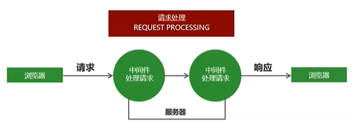
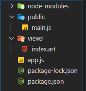

## Express中间件

### 什么是中间件

中间件就是一堆方法，可以接收客户端发来的请求，可以对请求做出响应，也可以将请求继续交给下一个中间件继续处理。



### 什么是中间件

中间件主要由两部分构成，中间件方法以及请求处理函数。

分类：第三方中间件、开发者自己写的

中间件方法由Express提供，负责拦截请求，请求处理函数有开发人员提供，负责处理请求

```js
app.get("请求路径", "处理函数")  // 接收处理get请求
```

可以针对同一个请求设置多个中间件，对同一个请求进行多次处理。

默认情况下，请求从上到下依次执行匹配中间件，一旦匹配成功，终止匹配。

可以调用`next()`方法将请求的控制权交给下一个中间件，直到遇到结束请求的中间件

```js
app.get("/request", (req, res, next) => {
    req.name = "张三";
    console.log(111);
    // 当匹配到/request的时候，我们就让数据流向下一个中间件
    next();
})

app.get("/request", (req, res) => {
    console.log(2222);
    res.send(req.name);
})
```

#### `app.use`中间件用户

`app.use匹配所有的请求方式，可以直接传入请求处理函数，代表接收所有请求`

`app.use` 第一个参数也可以传入请求地址，代表不论什么请求方式，只要是这个请求地址就接收这个请求

```js
const express = require("express");
const app = express();

// 这个use匹配所有请求
app.use((req, res, next) => {
    console.log("111");
    next();
})

// 这个use接受所有请求地址为 "/" 的请求
app.use("/", (req, res, next) => {
    console.log("222");
    next();
})

app.get("/", (req, res) => {
    console.log("路由/");
    res.send("我是路由/的请求")
})

app.listen(80)
```

### 中间件应用

1. 路由保护，客户端在访问需要登录的页面时，可以先使用中中间件判断用户登录状态，用户如果未登录，则拦截请求，直接响应，禁止用户进入需要登录的页面。

   ```js
   const express = require("express");
   
   const app = express();
   
   app.use("/admin", (req, res, next) => {
       let isLogin = false;
       if (isLogin) {
           next();
       }
       else {
           res.send("您还没有登录，不能访问");
       }
   })
   
   app.get("/admin", (req, res) => {
       res.send("您已经登录，可以访问");
   })
   
   app.listen(80)
   ```

   

2. 网站维护公告，在是所有路由的最上面定义接收所有请求的中间件，直接为客户端做出响应，网站正在维护中。

   ```js
   app.use((req, res, next) => {
       res.send("网站正在维护中。。。。")
   })
   ```

   

3. 自定义404页面

   ```js
   const express = require("express");
   const app = express();
   
   app.use("/admin", (req, res, next) => {
       let isLogin = false;
       if (isLogin) {
           next();
       }
       else {
           res.send("您还没有登录，不能访问");
       }
   })
   
   app.get("/admin", (req, res) => {
       res.send("您已经登录，可以访问");
   })
   
   // 如果用户在地址栏中乱写了一个地址，那么应该返回404页面
   app.use((req, res) => {
       res.status(404).send(`
       没有您访问的页面
       `)
   })
   app.listen(80)
   ```

   

### 错误处理中间件

在程序执行的过程中，不可避免地会出现一些无法预料的错误，比如文件读取失败，数据库连接失败。

错误处理中间件是一个集中处理错误的地方。（开发时异常 / 运行时异常）

```js
const express = require("express");
const app = express();

app.get("/index", (req, res, next) => {
    // 内置一个错误对象
    // 抛异常（开发时异常，尽量自己解决；运行时异常，抛）
    throw new Error("程序发生未知错误");
})

app.use((err, req, res, next) => {
    console.log(err.message);
    res.status(500).send(err.message)
})

app.listen(80)
```

当程序出现错误时，调用next()方法，并且将错误信息通过参数的形式传递给next()方法，即可触发错误处理中间件

```js
const express = require("express");
const fs = require("fs");
const app = express();

app.get("/index", (req, res, next) => {
    fs.readFile("./01.text", "utf8", (err, result) => {
        if (err != null) {
            next(err);
        }
        else {
            res.send(result);
        }
    })
})

app.listen(80)
```


## Express框架请求处理

### 模块化路由

最简单的路由应用

```js
const express = require("express");
const app = express();
// 创建路由  名字叫home
const home = express.Router();

app.use("/home", home);

home.get("/", (req, res) => {
    res.send("这是推荐页面的首页")
})

home.get("/recommend", (req, res) => {
    res.send("这是推荐页面的推荐部分")
})


app.listen(80, function () {
    console.log("请访问localhost/home/recommend");
});
```

#### 二级路由的应用


***`app.js`***

```js
const express = require("express");
// 导入所有路由器
const home = require("./routes/home");
const music = require("./routes/music");
const app = express();
// 创建路由  名字叫home
// const home = express.Router();

// 给/home请求，挂载home路由器
app.use("/home", home);

// 给/music请求，挂载music路由器
app.use("/music", music);

app.listen(80);
```

***`home.js`***

```jsx
// 引入express
const express = require("express");
const app = express();
// 创建路由  名字叫home
const home = express.Router();

home.get("/", (req, res) => {
    res.send("这是推荐页面的首页")
})

home.get("/recommend", (req, res) => {
    res.send("这是推荐页面的推荐部分")
})

// 导出home路由器
module.exports = home;
```

***`music.js`***

```js
// 引入express
const express = require("express");
// 创建路由  名字叫home
const music = express.Router();

music.get("/", (req, res) => {
    res.send("这是音乐页面的首页")
})

music.get("/recommend", (req, res) => {
    res.send("这是音乐页面的推荐部分")
})

// 导出music路由器
module.exports = music;
```


## 参数获取

### GET请求（参数都在 ` url ` 地址栏中）

`http://域名||IP:端口?key=value&key1=value2`

```js
// 获取请求数据
req.query
```

### 获取路由参数

`http://域名||IP:端口/a/b/c`

```js
// 获取路由参数
req.params
```

先要通过get方法设置参数的键

然后访问时在对应的参数位置写入值

```js
const express = require("express");

const app = express();

app.get("/find/:id/:name/:age", (req, res) => {
    // 访问 http://localhost/find/a/b/c
    res.send(req.params) // {"id":"a","name":"b","age":"c"}
})

app.listen(80)
```

### 其他请求（POST、DELETE、PUT）

```js
// 设置中间件
app.use(express.urlencoded({extend: true}))
// 获取请求数据
req.body
```


## 静态资源的处理

通过Express内置的<font color=red>express.static</font>可以方便地托管静态文件（`img`、`CSS`、JavaScript）

```js
app.use(express.static("public", { index: "index.html" }))
```

这样我们就只能访问public中的文件，并且会跳过public


## express-art-template模板引擎

### 模板引擎

* 为了使art-template模板引擎能更好和Express框架配合，模板引擎官方在原art-template模板引擎的基础上封装了`express-art-template`
* 使用 `npm install art-template express-art-template` 命令进行安装

```js
const express = require("express");
const path = require("path");

const app = express();

app.use(express.static(path.join(__dirname, "public")));

// 设置模板引擎
// 引入art-template模块, 并设置为art引擎
app.engine("art", require("express-art-template"));
// 使用set方法，为系统变量“views”和“view engine”指定值。
// 设置模板，模板的存放目录为views
app.set("views", path.join(__dirname, "views"))
// 视图引擎
// 设置express.js所使用的render engine
app.set("view engine", 'art')

app.get("/", (req, res) => {
    // 生成试图并响应给客户端
    // 第一个参数为要响应的模板文件名
    res.render("index", {
        title: "首页"
    });
})

app.listen(80)
```

在 `views` 文件夹中创建后缀名为`art`的文件，

文件中使用模板设置好的变量



```html
<!DOCTYPE html>
<html lang="en">

<head>
    <meta charset="UTF-8">
    <meta name="viewport" content="width=device-width, initial-scale=1.0">
    <title>Document</title>
</head>

<body>
    <h1>{{title}}</h1>
    
    <!-- 注意: 静态托管后, 需要引入public内部的文件时，不需要写public即可 -->
    <!-- 错的 <script src="/public/js/main.js"></script> -->
    <script src="/js/main.js"></script>
</body>

</html>
```

### 模板引擎的使用

1. 指定该应用使用什么模板引擎

   ```js
   app.engine('模板的后缀', require('express-art-template'));
   ```

2. 设置模板文件夹位置

   ```js
   app.set('views', path.join(__dirname, 'views'));
   ```

3. 设置引擎

   ```js
   app.set('view engine', 'html');
   ```

4. 使用

   ```js
    let data = {
       title: "关于我们",
       list: ["羽毛球", '乒乓球', '骑马', '射箭', '耍剑']
     }
     // res.send("关于")
   
     res.render('about', data);
   ```

   

#### 静态资源的引入

##### 情况一：

```js
app.use(express.static(path.join(__dirname, "public")));
```

直接写`public`里面的路径

##### 情况二：

```js
app.use("public",express.static(path.join(__dirname, "public")));
```

正常写路径即可

#### 共享数据

```js
app.locals.user = {
	name: "zs",
	age: 18
}
```

模板文件

```html
<h1>我叫{{user.name}}，今年{{user.age}}岁了</h1>
```

#### 子模版的使用(http://aui.github.io/art-template/zh-cn/docs/syntax.html)

```html
 {{include './child.html'}}
```


