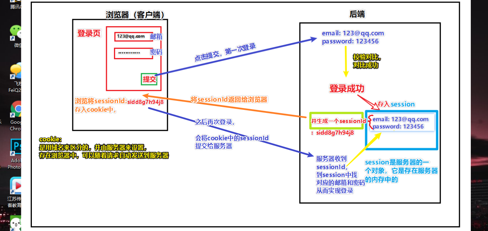

## express-session

### 简单介绍

session 是另一种记录客户状态的机制，不同的是 Cookie 保存在客户端浏览器中，而 session 保存在服务器上。

#### Session 的用途：
session 运行在服务器端，当客户端第一次访问服务器时，可以将客户的登录信息保存。
当客户访问其他页面时，可以判断客户的登录状态，做出提示，相当于登录拦截。
session 可以和 `Redis` 或者数据库等结合做持久化操作，当服务器挂掉时也不会导致某些客户信息（购物车）
丢失。

### 工作流程

当浏览器访问服务器并发送第一次请求时，

服务器端会创建一个 session 对象，

生成一个类似于key,value 的键值对，

然后将 key(cookie)返回到浏览器(客户)端，

浏览器下次再访问时，携带 key(cookie)，
找到对应的 session(value)。 客户的信息都保存在 session 中

### express-session 的常用参数:

```js
app.use(session({
　　secret: '12345',
　　name: 'name',
　　cookie: {maxAge: 60000},
　　resave: false,
　　saveUninitialized: true
}));
```

**secret** 一个 String 类型的字符串，作为服务器端生成 session 的签名。
**name** 返回客户端的 key 的名称，默认为 `connect.sid`,也可以自己设置。
**`resave`** 强制保存 session 即使它并没有变化,。默认为 true。建议设置成 false。 don't save session if unmodified
**`saveUninitialized`** 强制将未初始化的 session 存储。当新建了一个 session 且未设定属性或值时，它就处于

未初始化状态。在设定一个 cookie 前，这对于登陆验证，减轻服务端存储压力，权限控制是有帮助的。（默
认：true）。建议手动添加。
**cookie** 设置返回到前端 key 的属性，默认值为`{ path: ‘/’, httpOnly: true, secure: false, maxAge: null }`
**rolling** 在每次请求时强行设置 cookie，这将重置 cookie 过期时间（默认：false）


### express-session 的常用方法:

`req.session.destroy(function(err) { /*销毁 session*/})`
`req.session.username='张三'; //设置 session`
`req.session.username //获取 session`
`req.session.cookie.maxAge=0; //重新设置 cookie 的过期时间`


### 理解：

使用session插件以后，当一个浏览器访问服务时，请求中会带要这个浏览器特定的一个 `req.session.id`  这个id在浏览器中是以cookie形式保存

```js
/* 未登录时 */
// req.session.username
undefined
// req.session
Session {
  cookie: {
    path: '/',
    _expires: 2020-06-11T13:18:47.636Z,
    originalMaxAge: 86400000,
    httpOnly: true
  }
}
// req.session.id
X7G_Sz1mnOecFNNlTPWXqMraWrr9cgRF


/* 登录以后 */
// req.session.username
frank
// req.session
Session {
  cookie: {
    path: '/',
    _expires: 2020-06-11T13:18:52.467Z,
    originalMaxAge: 86400000,
    httpOnly: true
  },
  username: 'frank'
}
// req.session.id
X7G_Sz1mnOecFNNlTPWXqMraWrr9cgRF
```

也就是说不管用户是否登录，只要访问，我们就会让客户端带着一个特定的`session.id`，这样我们就可以识别来自不同浏览器的访问。

##### 那么我们如何识别登录呢？

就是因为我们已经可以通过 `session.id` 识别不同客户端，我们只需要当那些用户用<font color=red>用户名和密码</font>成功登录时，给他们的客户端对应的的 `session` 中写入一些更多的信息（也就是这里的`username`），

```js
// 将用户名，存到session中去 （这个username只会存在于这session.id访问时的sesssion中）
req.session.username = user.username;
```


这样的话，我们只需要在用户访问时判断：如果他的session中有写入`username（成功登录时写入的信息）`，说明这个用户已经成功登录，否则这个用户还没登录，就可以实施拦截跳转

所以不同客户端访问时，他们各自的session情况是这样的

```js
/* 用户frank */
// req.session.username
frank
// req.session
Session {
  cookie: {
    path: '/',
    _expires: 2020-06-11T13:18:52.467Z,
    originalMaxAge: 86400000,
    httpOnly: true
  },
  username: 'frank'
}
// req.session.id
X7G_Sz1mnOecFNNlTPWXqMraWrr9cgRF


/* 用户袁旭东 */
// req.session.username
袁旭东
// req.session
Session {
  cookie: {
    path: '/',
    _expires: 2020-06-11T13:18:16.666Z,
    originalMaxAge: 86400000,
    httpOnly: true
  },
  username: '袁旭东'
}
// req.session.id
tKqco-Z5RPduzif4uY-xgIMQtSugwq93
```

