### 创建数据库

CREATE DATABASE yuanxudong CHARSET utf8;

### 选择数据库
USE yuanxudong;
### 创建学生信息表并设置表结构
CREATE TABLE student (
id INT,
`name` VARCHAR(20),
chinese FLOAT,
math FLOAT,
english FLOAT
)CHARSET utf8;

### 查询表中所有学生信息
SELECT * FROM student;

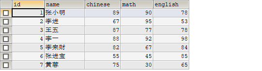

### 查询表中所有学生的姓名和对应的英语成绩
SELECT NAME,english FROM student;

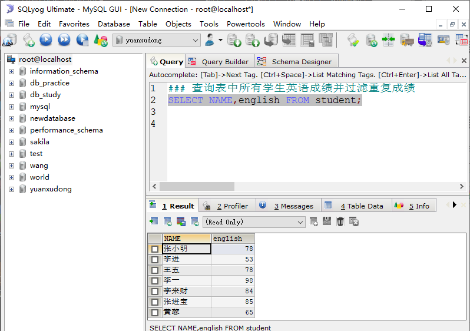

### 查询表中所有学生英语成绩并过滤重复成绩
SELECT DISTINCT english FROM student;

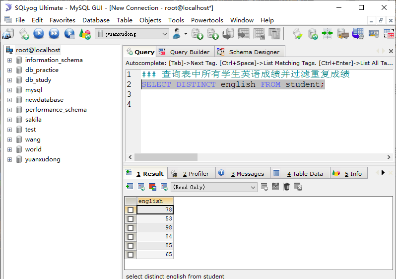

### 使用别名
SELECT NAME AS '姓名',chinese AS '语文',english AS '英语',math AS '数学' FROM student;

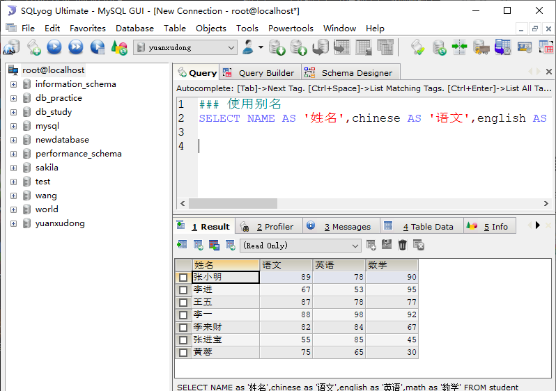

### 总分
SELECT NAME AS '姓名',english+chinese+math AS '总分' FROM student;

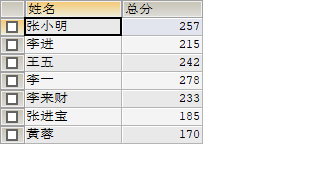

### 查询姓名为李一的学生成绩
SELECT NAME,chinese,english,math FROM student WHERE NAME = '李一';

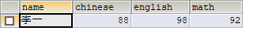

### 查询英语成绩大于90分的同学
SELECT * FROM student WHERE english > 90;

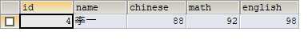

### 查询总分大于200分的所有同学
SELECT *, english+chinese+math AS '总分' FROM student WHERE english+chinese+math > 200;

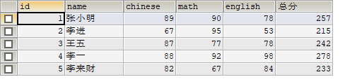

### 查询英语分数在80－90之间的同学
SELECT * FROM student WHERE 90 > english AND english > 80;

SELECT * FROM student WHERE english BETWEEN 80 AND 90;

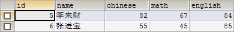

### 查询数学分数为89,90,91的同学
SELECT * FROM student WHERE math = 89 OR math = 90 OR math = 91;

SELECT * FROM student WHERE math IN (89,90,91);

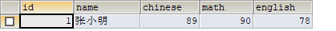

### 查询所有姓李的学生英语成绩
SELECT NAME,english FROM student WHERE NAME LIKE '李%';

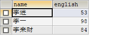

### 查询数学成绩大于80并且语文成绩大于80的同学
SELECT * FROM student WHERE chinese > 80 AND math > 80;

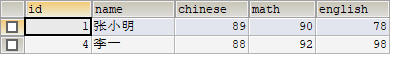

### 查询英语成绩大于80或者总分是200的同学
SELECT *,(chinese+math+english) AS '总分' FROM student WHERE english >80 OR chinese+math+english > 200;

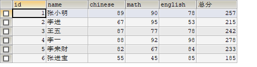

### 对数学成绩排序(降序)后输出
SELECT * FROM student ORDER BY math DESC;

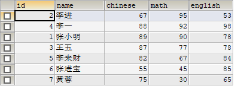

### 对总成绩按从高到低的顺序输出
SELECT NAME AS '姓名',english+chinese+math AS '总分' FROM student ORDER BY english+chinese+math DESC;

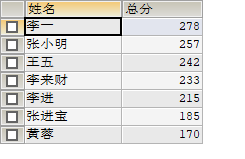

### 对姓李的学生总成绩按照从高到低的顺序输出
SELECT *,english+chinese+math AS '总分' FROM student WHERE NAME LIKE '李%' ORDER BY english+chinese+math DESC;

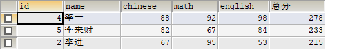

