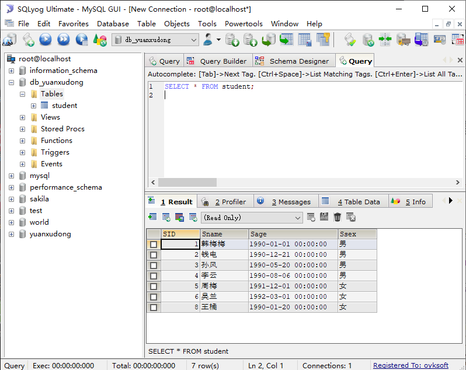
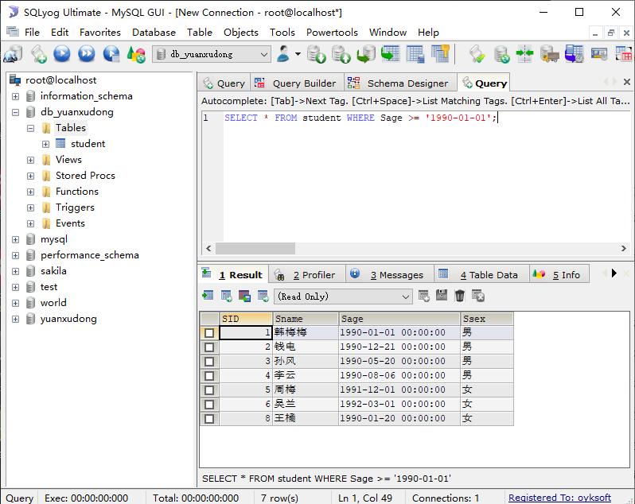
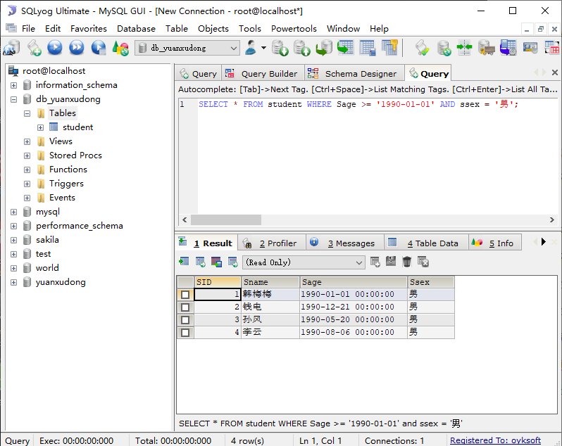
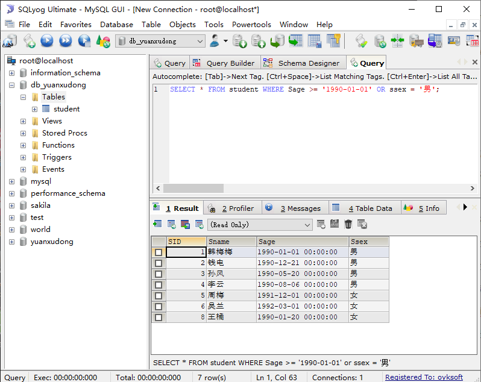
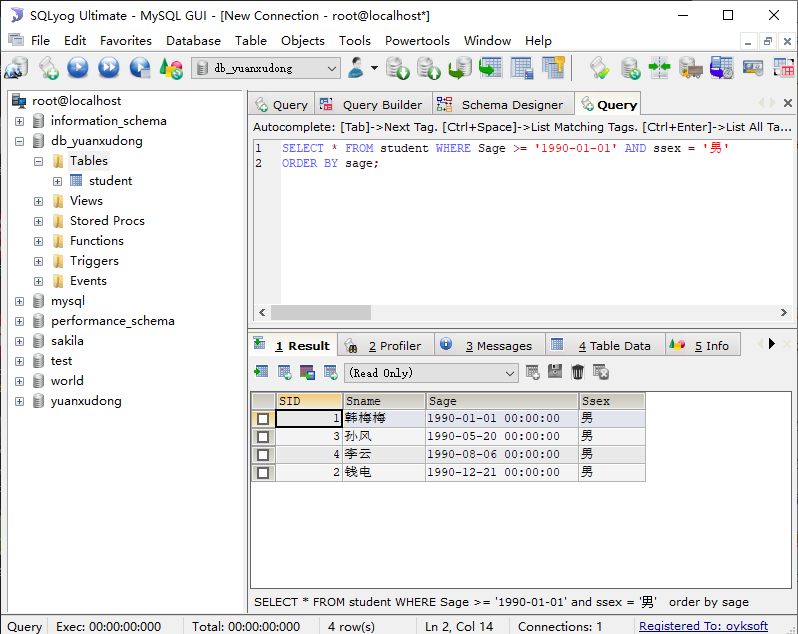
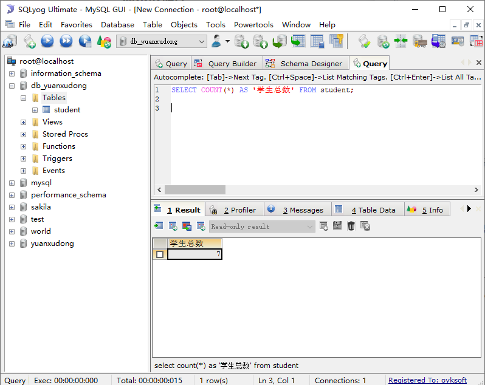
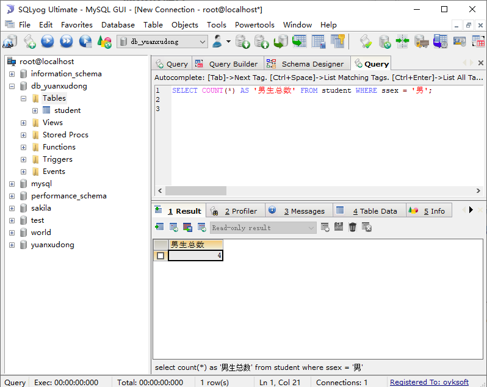
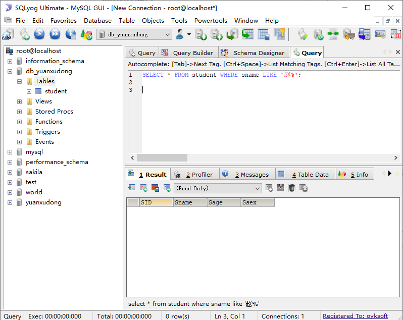
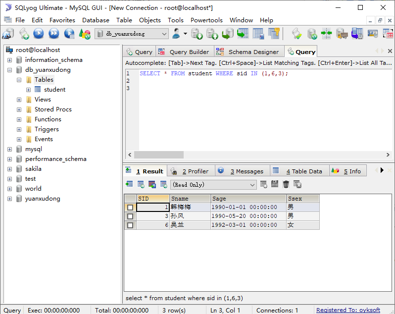
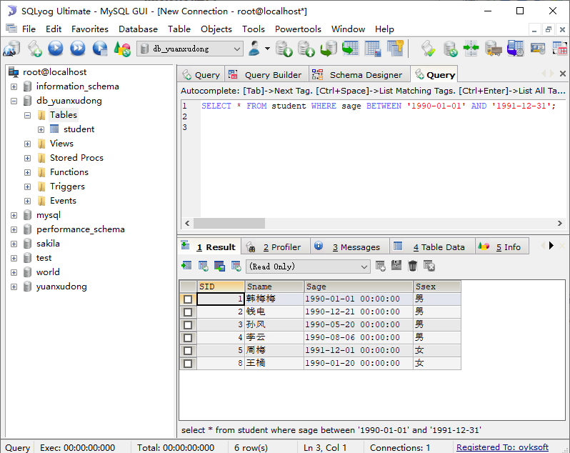

## 创建表结构

```sql
CREATE TABLE student(
SID INT(2) AUTO_INCREMENT PRIMARY KEY NOT NULL,
Sname  VARCHAR(10) NOT NULL,
Sage DATETIME NOT NULL,
Ssex ENUM('男','女') NOT NULL COMMENT '性别'
)DEFAULT CHARSET=utf8;
```

## 修改数据

修改需求1： 把sid=01的人名字修改为 “韩梅梅”

```sql
UPDATE student SET sname = '韩梅梅' WHERE sid = 1;
```

修改需求2： 把出生日期在90年之前的，性别全部改为 “男”

```sql
update student set ssex = '男' where Sage < '1990-01-01';
```

## 删除数据

删除需求： 把出生日期在90年之前的删除

```sql
delete from student where Sage < '1990-01-01';
```

## 简单查询

1）查询所有的学生数据

```sql
SELECT * FROM student;
```



2）查询学生性别，且使用distinct去重

```sql
SELECT DISTINCT ssex FROM student;
```


3）查询出在1990年之后的出生的学生？

```sql
SELECT * FROM student WHERE Sage >= '1990-01-01';
```



4）查询出在1990年之后的出生且性别为男的学生？



5）查询出在1990年之后的出生或性别为男的学生？



6）查询出在1990年之后的出生且性别为男的学生，并根据出生日期从小到大显示？



7）查询学生总数量？



8）统计学生性别为男的学生数量？



9）查询姓赵的学生？



10）查询sid=01、06、03 的学生？

 

11）查询出生日期在 90年 到 91年之间的学生？

