#### 1. 查询student表的所有记录

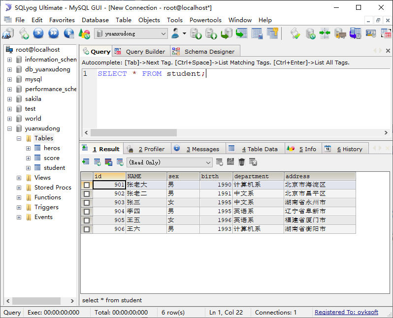

#### 2. 从student表查询所有学生的学号、姓名和院系信息

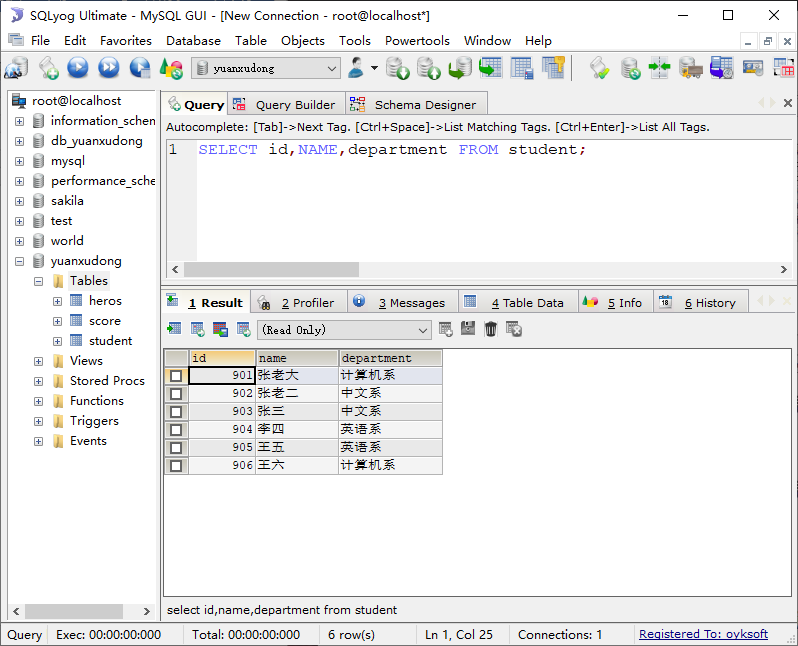

#### 3. 从student表中查询计算机系和英语系的学生的信息

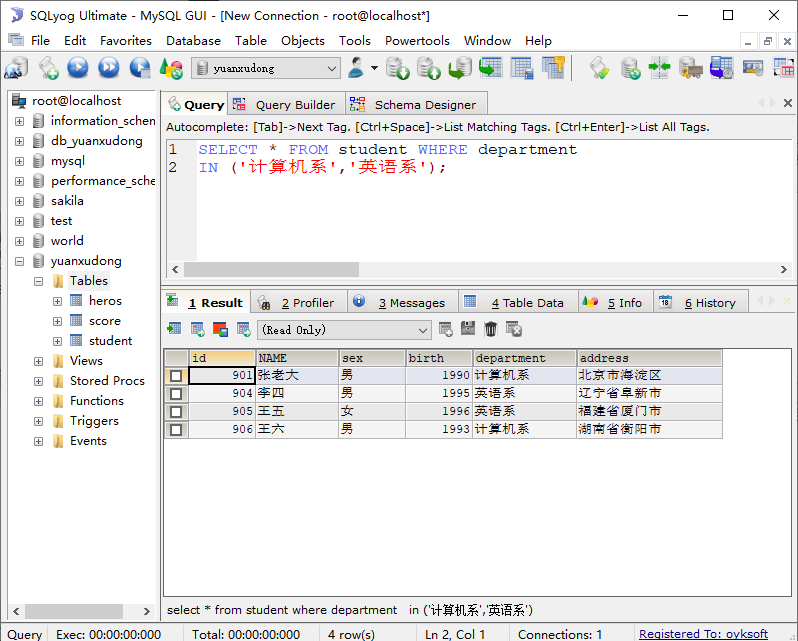

#### 4. 从student表中查询年龄18~22岁的学生信息

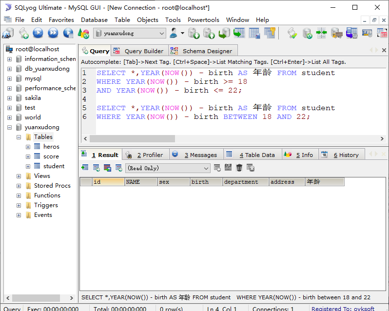

#### 5. 查询student表中查询男、女各有多少人

#### 6. 查询student表中查询男、女各有多少人，并按照降序排列

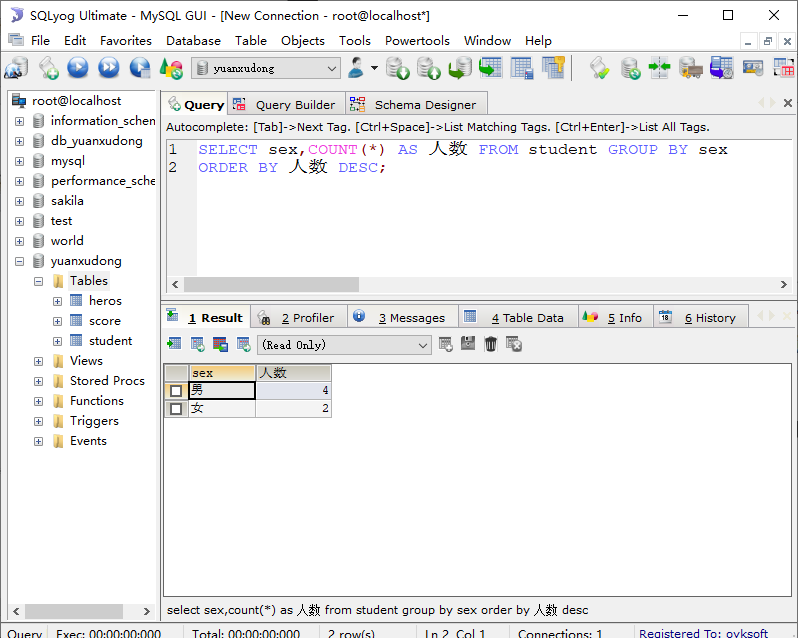

#### 7. 从student表中查询某系别总人数大于1的系名和数量

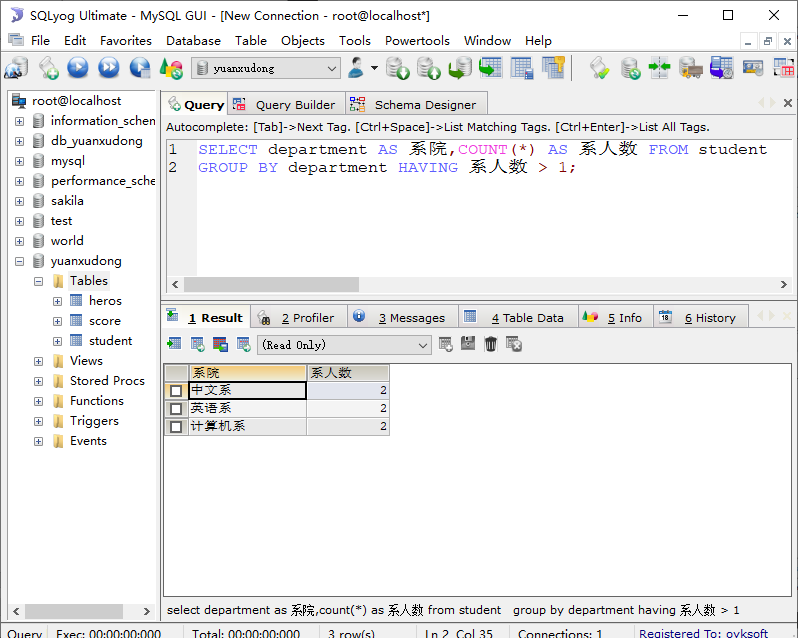

#### 8. 从score表中查询每个科目的最高分

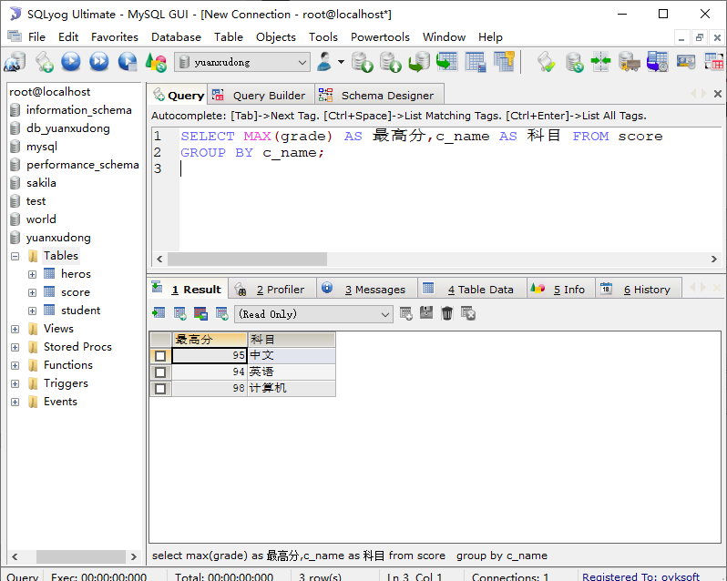

#### 9. 计算每个学生的总成绩

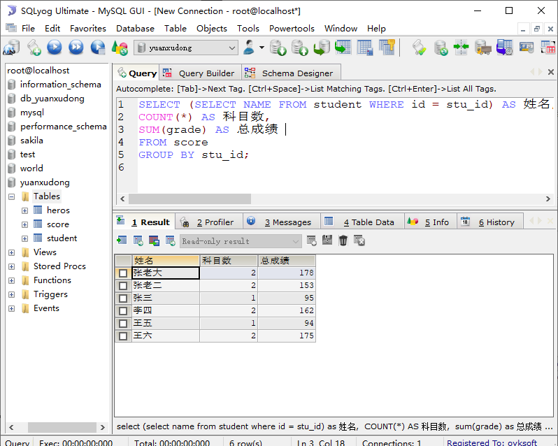

#### 10. 计算每个考试科目的平均成绩

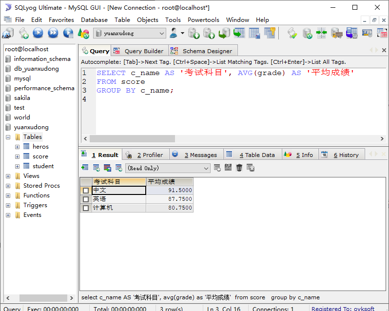

#### 11. 将计算机考试成绩按从高到低排序

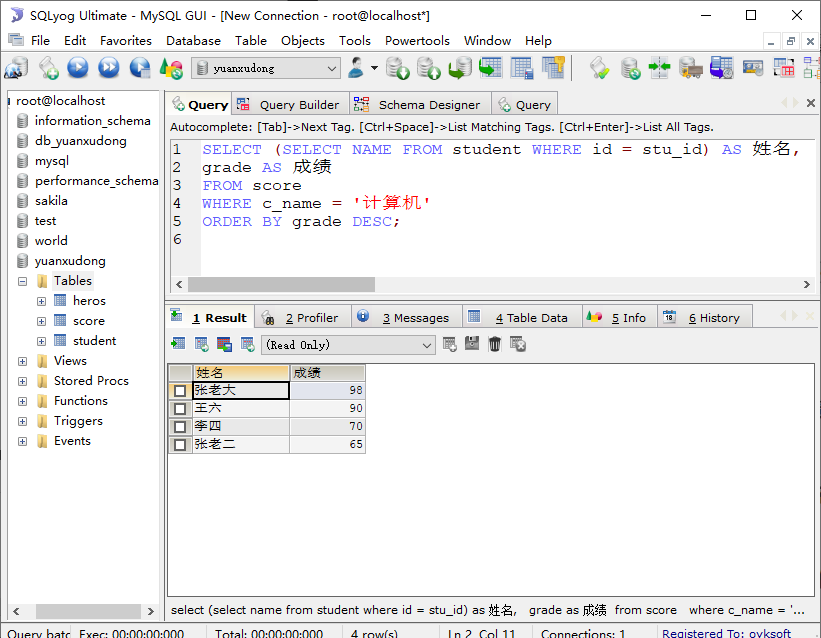

#### 12. 查询score表中stu_id不是902、904、906,且成绩大于80的信息

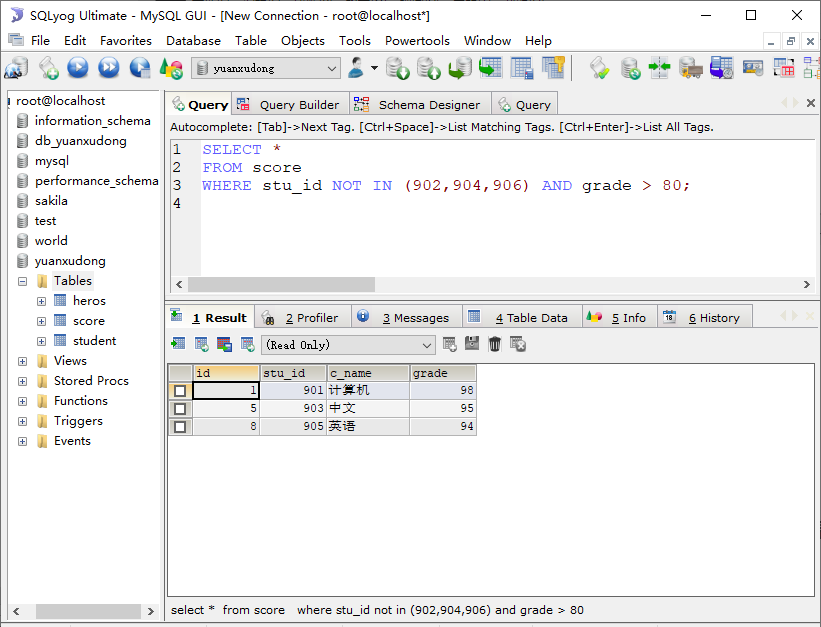

#### 13. 从student表中查询姓”王”，并且性别是男同学所在的系

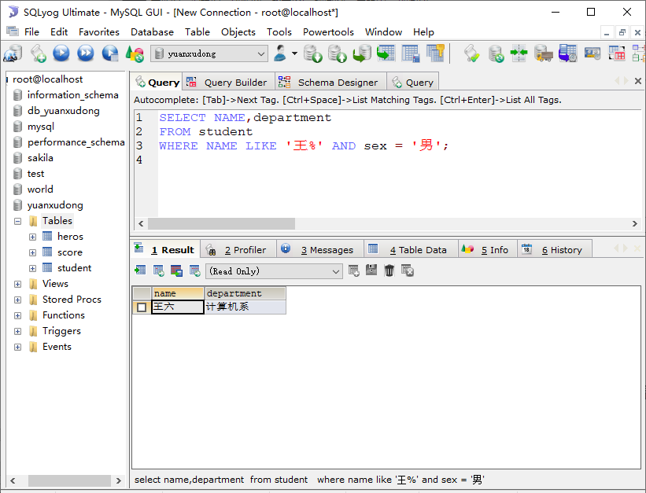

#### 14. 从student表中查询姓”张”，并且是单名的同学的信息

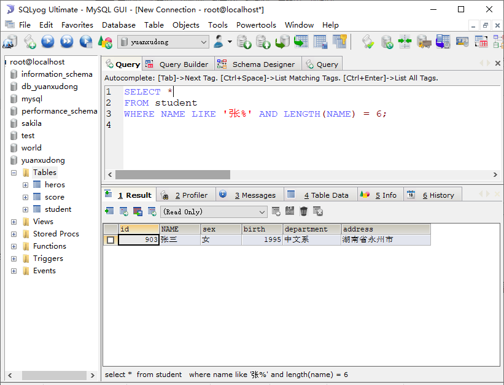

#### 15. 要求将student表中的数据格式化输出，格式为：xx的家庭住址是xx (使用字符串的函数)

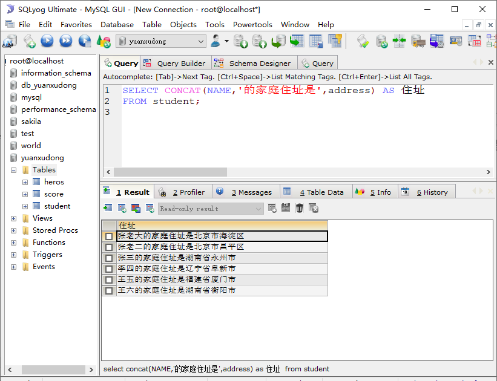

#### 16. 将student表中名字有“王”的替换为“小王”(使用字符串的函数)

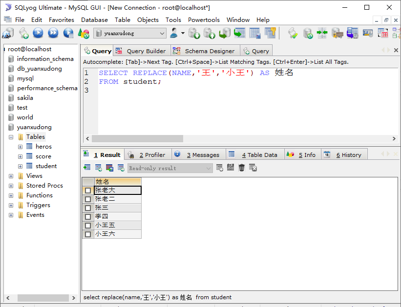

#### 17. 要求查看student表中的姓名的字节数(使用字符串的函数)

#### 18. 查询score表中的查询前3条的数据

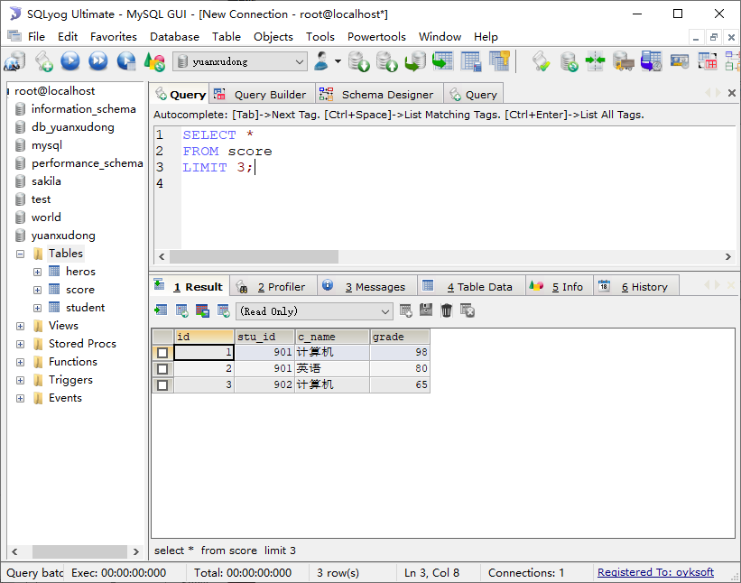

#### 19. 查询score表中查询第4条到第6条的数据

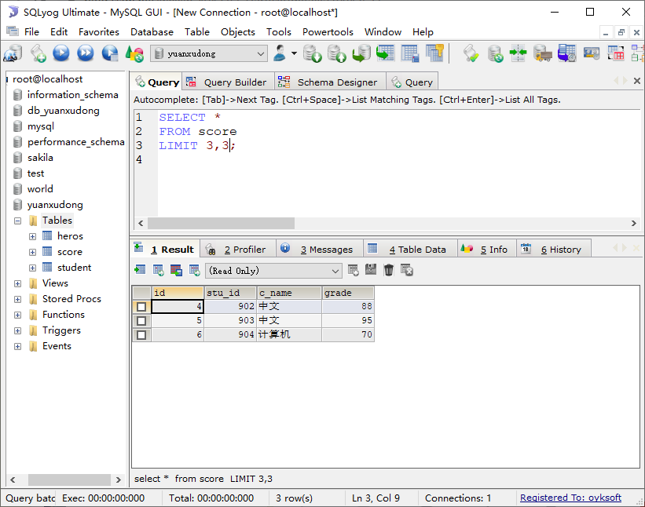

#### 20. 计算student表中学生的年龄

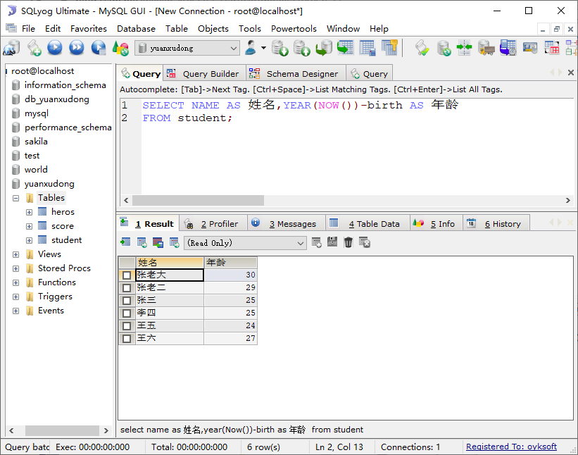

