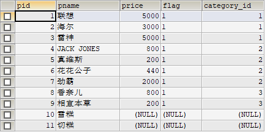
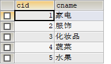
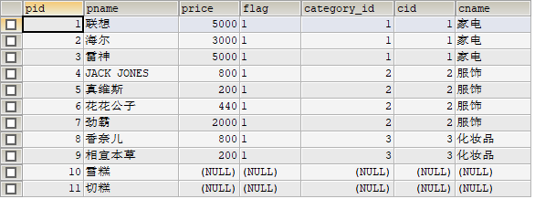
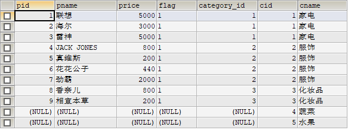

## 子查询

### 概念

当一个查询是另一个查询的条件时，称为子查询

子查询的结果作为输入传递回 **父查询** 或 **外部查询**，父查询将这个值结合到计算中，以便确定最后的输出。

`SQL` 语言允许多层嵌套查询，即一个子查询中还可以嵌套其他子查询。

### 本质：

子查询本质上就是一个完整的select 语句，它可以是一个 SELECT、SELECT...INTO 语句、INSERT...INTO 语句、DELETE 语句、或 UPDATE 语句或嵌套在另一子查询中。

子查询的输出可以包括一个单独的值（单行子查询）、几行值（多行子查询）、多列数据（多列子查询）

### 分类

#### 按功能分

* 标量子查询：子查询返回的结果是一个数据（一行一列）

  ```sql
  -- 查询 所有工资 大于 平均工资 的员工信息
  SELECT * FROM emp WHERE sal > (SELECT AVG(sal) FROM emp);
  -- 这里的子查询返回的结果就是一个数据
  SELECT AVG(sal) FROM emp; -- （一行一列的结果）
  ```

  

* 列子查询：返回的结果是一列（一列多行）

  大多和 `in,all,any还有比较运算符` 一起用 

  ```sql
  -- 返回 100部门所有员工薪资 （返回一列多行）  
  SELECT salary FROM employees WHERE department_id = 100;
  
  -- 找出薪资和100部门员工薪资一样的所有员工信息
  SELECT * FROM employees WHERE salary IN (SELECT salary FROM employees WHERE department_id = 100);
  -- 找出所有薪资大于 100部门所有员工薪资 的员工信息
  SELECT * FROM employees WHERE salary > ALL(SELECT salary FROM employees WHERE department_id = 100);
  -- 找出所有薪资大于等于 100部门中任意一个员工薪资 的员工信息
  SELECT * FROM employees WHERE salary >= ANY(SELECT salary FROM employees WHERE department_id = 100);
  ```

  

* 行子查询：返回的结果是一行（一行多列）

  **基本语法：**
  主查询where条件[（构造一个行元素）]=(行子查询);

  <font color=skyblue>行元素：字段元素是指一个字段对应的值，行元素对应的就是多个字段：多个字段合起来作为一个元素参与运算，把这种情况称之为行元素。</font>

  ```sql
  -- 查询和Adam同一部门且同一领导的所有员工信息
  SELECT * FROM employees WHERE (department_id,manager_id) = (SELECT department_id,manager_id FROM employees WHERE first_name = 'Adam');
  
  -- 注意：构造的行元素内部的顺序(department_id,manager_id) 必须 与行子查询结果的顺序 一致 
  ```

  

* 表子查询：返回的结果是一个虚表（多行多列）

  用于from数据源：from子查询

  <font color=red>注意：使用子查询作为from数据源时，子查询后面必须起一个别名</font>

  ```sql
  -- 将 50部门的所有信息作为数据源
  SELECT * FROM (SELECT * FROM employees WHERE department_id = 50) AS abc;
  ```

* Exists子查询：返回的结果是1或者0（类似布尔值）

  ```sql
  SELECT EXISTS (SELECT * FROM employees WHERE department_id = 0);
  -- 返回 0，代表没有这个部门
  SELECT EXISTS (SELECT * FROM employees WHERE department_id = 100);
  -- 返回 1，代表有这个部门
  
  -- 存在 100部门，则返回这个部门所有员工信息
  SELECT * FROM employees WHERE EXISTS (SELECT salary FROM employees WHERE department_id = 100) AND department_id = 100;
  
  -- 查询员工表中的部门id（必须在 部门表里存在 的部门id）
  SELECT DISTINCT department_id FROM employees AS 员工 WHERE EXISTS (SELECT salary FROM departments AS 部门 WHERE 部门.department_id = 员工.department_id);
  ```

  在查询过程中使用 `exists`，子查询一般有两种情况：

  * 子查询与外表的字段有关系

    ```sql
    select 字段1, 字段2 from 表1 where exists (select 字段1, 字段2 from 表2 where 表2.字段2 = 表1.字段2)
    ```

    这时候的`SQL`语句相当于一个关联查询，它先执行表1的查询，然后把表1中的每一条记录放到表2的条件中去查询，如果存在，则显示此条记录。
  
* 子查询与外表的字段没有任何关联的情况
  
  <font color=aqua>只要子查询的条件成立，就会查询出表1中的所有记录，反之，如果子查询中没有查询到记录，则表1不会查询出任何的记录。</font>

#### 按位置分类

* Where 子查询：子查询出现的位置在where条件中
* From 子查询：子查询出现的位置在from数据源中
* select 子查询
* exists 子查询

### 常见的语法：

1. 带有比较运算符的子查询
2. 带有比较运算符加上 `any(some) 或 all ` 谓词的子查询
3. 带有谓词 `[not] in` 的子查询
4. 带有 `[not] exists` 的子查询

### 使用规则

* 子查询必须用括号括起来
* 子查询在 SELECT 子句中只能有一个列，除非在主查询中有多列，与子查询的所选列进行比较。
* 如果前面是用in多值运算符，ORDER BY 不能用在子查询中，虽然主查询可以使用 ORDER BY。可以在子查询中使用 GROUP BY，功能与 ORDER BY 相同。
* 子查询返回多于一行，只能与多值运算符一起使用，如 IN 运算符。
* BETWEEN 运算符不能与子查询一起使用，但是，BETWEEN 可在子查询内使用。


## 多表

实际开发中，一个项目通常需要很多张表才能完成。例如：一个商城项目就需要分类表、商品表、订单表等多张表。且这些表的数据之间存在一定的关系。

### 多表创建流程

* 设计表：设计相关的多个表
* 创建并设置主外键关系：
  * 方式一：创建表时设置多张表之间的关系
  * 方式二：创建表之后，再设置表之间的关系

### 多表关系的分类

* 一对多关系：

  例如：客户和订单，分类和商品，部门和员工

  建表原则：在从表(多方)创建一个字段，字段作为外键指向主表(一方)的主键.

* 多对多关系：

  例如：学生和课程、用户和角色

  建表原则：需要创建第三张表,中间表中至少两个字段，这两个字段分别作为外键指向各自一方的主键

* 一对一关系：

  一对一的关系其实可以创建成一张表，如`QQ`号和`QQ`信息详情，所以应用不多

  两种建表原则：

  1. 外键唯一：主表的主键和从表的外键（唯一），形成主外键关系，外键唯一unique。

  2. 外键是主键：主表的主键和从表的主键，形成主外键关系


## 多表查询（连接查询）

#### 含义：

也叫连接查询，当查询的字段来自于多个表的时候，这时候就是需要用到连接查询

### 分类：

* 按年代分类：
  * `sql192` 标准（内连接），
  * `sql199`标准（内连接，外连接，交叉连接）
* 按功能来分类：
  * 内连接：等值连接  非等值连接  自连接
  * 外连接：左外连接，右外连接，全外连接
  * 交叉连接

### 交叉连接查询

有两种，显示的和隐式的，**不带ON子句，返回的是两表的乘积**，也叫笛卡尔积。

结果的数量为所有表的数量的乘积

**发生原因：**没有有效的连接条件

#### 语法：

```sql
select * from A,B
```

#### 案例

```sql
-- 显式
select * from category cross join product;

-- 隐式
select * from category,product;
```


### 内连接查询

使用关键字 `inner join  --inner可以省略`

内连接得到的结果是两边都对应的，没有对应的不会显示

#### 隐式内连接

```sql
select * from A,B where 条件
```

案例：

```sql
select * from category,product where category.cid = product.category_id;

-- 查询有奖金的员工名, 部门名
SELECT last_name,department_name 
FROM employees as e,departments as d
WHERE e.department_id = d.department_id
AND commission_pct is not NULL;

-- 查询每个工种的工种名和员工的个数，按照员工个数降序排序
SELECT job_title,COUNT(*)
FROM 
employees AS e,
jobs AS j
WHERE e.job_id = j.job_id
GROUP BY e.job_id
ORDER BY COUNT(*) DESC;

-- 多表查询中的表（查询员工名，部门名，所在的城市）
SELECT
  last_name,
  department_name,
  city
FROM employees AS e,
  departments AS d,
  locations AS l
WHERE e.department_id = d.department_id
    AND d.location_id = l.location_id;
```

以上连接也属于等值连接

##### 等值连接特点：

1. 多表查询的结果是多个表的交集
2. n个表连接，至少需要n-1个条件（设计表的时候，表与表之间一定有且至少有一个字段是相同的）
3. 多表查询的时候，表的顺序没有关系
4. 一般都要给表起别名（一般把表的第一个字母作为别名）
5. 还可以进行分组，排序

##### 非等值连接：

（用条件运算符中的 `> < >= <= 等`）

```sql
-- 查询员工的工资级别（没有对应的内外键相关联的情况）
SELECT
  salary,
  grade_level
FROM 
  employees AS e,
  job_grades AS j
WHERE 
  -- 一个工资，肯定只会对应 一个工资级别的范围，所以 找对应的工资级别过程中 也相当于经过了筛选
  -- 也就是通过 字段值 找 对应的值范围 来连接多表 
  -- （等值连接是： 字段值 = 字段值  来连接多表）
  salary BETWEEN j.lowest_sal AND j.hightest.sal;
  
  
-- 查询工资的个数>20级别个数，并且按工资级别降序
SELECT
  COUNT(*),
  grade_level
FROM 
  employees AS e,
  job_grades AS j
WHERE 
  e.salary BETWEEN j.lowest_sal AND j.highest_sal
GROUP BY grade_level
HAVING COUNT( * ) > 20
ORDER BY grade_level DESC;
```


#### 显式内连接

**语法：**

```sql
select * from A [inner] join B on 条件 where ....
```

示例：

```sql
select * from category inner join product on category.cid = product.category_id;

-- 查询有奖金的员工名, 部门名  (注意：如果给表起了别名，其他地方必须用别名)
SELECT last_name,department_name 
FROM employees AS e INNER JOIN departments AS d
ON e.department_id = d.department_id
WHERE commission_pct IS NOT NULL;

-- 查询员工个数>3的部门名和员工个数，并按照员工个数降序排列
SELECT department_name, COUNT(employee_id)
FROM employees AS e INNER JOIN
departments AS d
ON e.department_id = d.department_id
GROUP BY e.department_id
HAVING COUNT(employee_id) > 3
ORDER BY COUNT(employee_id) DESC;

-- 三表联查
SELECT last_name,department_name,city
FROM employees AS e
INNER JOIN departments AS d
ON e.department_id = d.department_id
INNER JOIN locations AS l
ON d.location_id = l.location_id
ORDER BY d.department_name DESC;
-- 或者
SELECT last_name,department_name,city
FROM employees AS e
INNER JOIN departments AS d
INNER JOIN locations AS l
ON e.department_id = d.department_id
AND d.location_id = l.location_id
ORDER BY d.department_name DESC;
```


#### 自然连接（natural join）

等值连接中去掉重复的列，形成的连接。

自然连接是一种特殊的等值连接，他要求两个关系表中进行比较的必须是相同的属性列，无须添加连接条件，并且在结果中消除重复的属性列。
`sql语句：Select …… from 表1 natural join 表`

**注意：** 返回结果会消除 有null值得所有行

````sql
SELECT * FROM employees NATURAL JOIN departments;
````


#### 自连接（自己连接自己的列）

```sql
-- 查询员工与上级的名称
SELECT
  e.employee_id AS 员工,
  e.last_name,
  m.employee_id AS 上级,
  m.last_name
FROM 
  employees AS e,
  employees AS m
WHERE e.manager_id = m.employee_id;   
-- 应用场景：employee_id 也意味着 manager_id
```


#### on 和 where 的区别

```sql
SELECT * FROM product LEFT OUTER JOIN category ON category.cid = product.category_id WHERE category.cid = product.category_id;
-- 区别 -- 
SELECT * FROM product LEFT OUTER JOIN category ON category.cid = product.category_id;
```

在使用 **`left jion`** 时，**on** 和 **where** 条件的区别如下：

- 1、 **on** 条件是在生成临时表时使用的条件，它不管 **on** 中的条件是否为真，都会返回左边表中的记录。
- 2、**where** 条件是在临时表生成好后，再对临时表进行过滤的条件。这时已经没有 **left join** 的含义（必须返回左边表的记录）了，条件不为真的就全部过滤掉。

由于 **left join、right join、full join** 的特殊性，不管 **on** 上的条件是否为真都会返回 **left** 或 **right** 表中的记录，**full** 则具有 **left** 和 **right** 的特性的并集。 而 **`inner jion`** 没这个特殊性，则条件放在 **on** 中和 **where** 中，返回的结果集是相同的。


### 外连接查询

使用关键字 `outer join  --outer可以省略`

#### 左外连接

**左外链接列出左边关系中所有的元组** 

**显示结果通常是 左表全部+右表有关联关系的部分，未关联部分 null占位**

语法：left outer join

```sql
select * from A left outer join B on 条件
```

示例

```sql
-- 左外连接
select * from product left outer join category on category.cid = product.category_id;
```

<font color=red>product 表</font>



<font color=red>category 表</font>



<font color=red>左外连接结果</font>   这里的左就是 product 表




#### 右外连接

**右外链接列出右边关系中所有的元组** 

**显示结果通常是 右表全部+左表有关联关系的部分，未关联部分 null占位** 

语法：right outer join

```sql
select * from A right outer join B on 条件
```

示例：

```sql
-- 右外连接
select * from product right outer join category on category.cid = product.category_id;
```

<font color=red>右外连接结果</font>   这里的右就是 category 表



