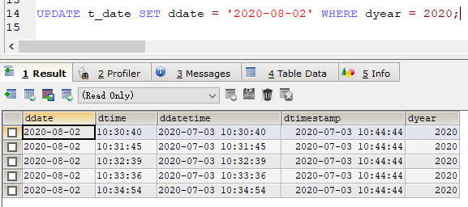

## 数据类型

### 数值型

（整数、小数、浮点数、定点数（涉及到钱））

#### 整型

* `tinyint` 微整型  

  取值范围：0-255（-128 到 127），占用空间：1字节

  <font color=red>0-255代表255个位置</font>

  ```sql
  CREATE TABLE t_num(
  numtiny TINYINT UNSIGNED
  );
  -- UNSIGNED代表没有符号
  -- 所以取值范围就是 0 到 255
  -- 有符号就是 -128 到 127
  ```

  

* `smallint` 小整型

  取值范围：0-6535，占用空间：2字节

* `mediumint` 中整型

  取值范围：，占用空间：3字节

* `int` 整型

  取值范围：，占用空间：4字节

  ```sql
  CREATE TABLE t_num(
  numtiny TINYINT UNSIGNED,
  numint INT(4) ZEROFILL
  -- 原本默认为int(10) 代表显示数字最大多少位（这里是和取值范围对应的）
  -- 在数字类型这里，显示多少位数字只和数字的大小有关系
  -- 所以，即使我们写了int(4)，我们任然可以存入4位以上的数据
      
  -- 那么(4)的作用在哪里呢？
  -- 显示最长长度是 4位数
  -- 如果你想展示的数字是0001，你写的是1，那就需要zerofill填充
  -- (4)的作用在于配合zerofill填充0
  -- 只要写一个zerofill，就代表了unsigned
  -- 所以负数的时候，就不能使用zerofill
  );
  ```

  

* `bigint` 大整型

  取值范围：，占用空间：5字节

#### 小数

* `float` （M，D）浮点数

  M 代表整个数字有多少位

  D 代表小数部分有多少位

  M一定大于D

  精度在7位，也就是说D最多设置7位左右，设置多了就会不精确

* `double` 双浮点数（双精度）

  精度在14位，设置多了就会不精确

* `decimal` 定点数（比较精确）

```sql
CREATE TABLE t_float(
-- (5,3)意味着整数只能有2位
numfl FLOAT(5,3),
numdo DOUBLE(5,3),
numde DECIMAL(5,3)
);
```


### 字符型

（较短的字符串 `char,varchar` 、较长的字符串 `text,blob`）

#### `char`（M）

M 代表字符串的长度，<font color=red>不变的</font>

（10）如果里面存5个，字符串长度规定了10，依然占10个字符的空间

**优点：**执行效率高一点儿

#### `varchar` （M）

M 代表字符串的长度，<font color=red>可变的</font>

（10）如果里面存5个，字符串长度规定了10个，根据实际情况占5个字符的空间

`varchar`有一位专门用来存字符长度，所以存的时候比较慢


### 日期型

#### Date 日期

#### time 时间

#### `datetime` 日期时间

#### `timestamp` 时间戳

时间戳会在数据每改变一次的时候更新一次

#### year 年

```sql
CREATE TABLE t_date(
ddate DATE,
dtime TIME,
ddatetime DATETIME,
dtimestamp TIMESTAMP,
dyear YEAR
);

INSERT INTO t_date VALUES(NOW(),NOW(),NOW(),NOW(),NOW());
```



```sql
-- 查看时区
SHOW VARIABLES LIKE '%time_zone%'
```


### 约束

#### 枚举 `enum`

只能选一个

```sql
create table t_enum(
el enum('a','b','c')
);
-- 只能存 a/b/c
INSERT INTO t_enum VALUES ('a');
```

#### 集合 `set`

可以选多个

```sql
CREATE TABLE t_set (
cs SET('a','b','c','d')
);
INSERT INTO t_set VALUES ('a');
INSERT INTO t_set VALUES ('a,b');
INSERT INTO t_set VALUES ('a,b,c');
```


## 列属性

列属性又称之为字段属性，在`mysql`中一共有6个属性：null，默认值，列描述，主键，唯一键和自动增长

### Null属性

代表字段为空

如果对应值为YES，那么说明字段可以为null

注意：

1. 在设计表的时候，尽量不要让数据为空（所以最好有null占位）


### 默认值

```sql
CREATE TABLE t_def(
id INT(4),
`name` VARCHAR(10),
age TINYINT(2) DEFAULT 18
);

INSERT INTO VALUES(1,'东', DEFAULT)
-- 或者
INSERT INTO t_def (id,NAME) VALUES(1,'东')
```


### 列描述

列描述：comment，是专门用于给开发人员进行维护的一个注释说明

基本语法：comment 字段描述

```sql
CREATE TABLE stuinfo (
id INT(4) COMMENT '该字段表示学生id',
`name` VARCHAR(10) COMMENT '该字段表示学生姓名',
age TINYINT(2) DEFAULT 10 COMMENT '该字段为学生年龄'
);
-- 查看创建语句
SHOW CREATE TABLE stuinfo;
```


### 主键

主要的键，`primary key` , 在一张表中，有且只有一个字段，里面的值具有唯一性。

##### 添加主键

在创建表时添加

```sql
CREATE TABLE stuinfo (
id INT(4) PRIMARY KEY,
`name` VARCHAR(10), 
age TINYINT(2)
);
-- 或者
CREATE TABLE stuinfo (
id INT(4),
`name` VARCHAR(10), 
age TINYINT(2),
PRIMARY KEY(id)
);
```

在创建表后添加

```sql
ALTER TABLE stuinfo ADD PRIMARY KEY(id);
```

##### 查看主键

```sql
DESC stuinfo;
```

##### 删除主键

```sql
ALTER TABLE stuinfo DROP PRIMARY KEY;
```

#### 主键约束

主键一旦增加，那么对应的字段有数据要求

1. 当前字段对应的数据不能为空
2. 当前字段对应的数据不能有任何重复

#### 主键分类

主键分类采用的是主键所对应的字段的业务意义分类

业务主键：主键所在的字段，具有业务意义（学生id，课程id）

逻辑主键：自然增长的整型（应用广泛）


### 自动增长

`auto_increment` 当给定某个字段该属性之后，该列的数据在没有提供确定数据的时候，系统

如果给定字段值，自动增长不会触发

```sql
-- 创建
CREATE TABLE stuinfo (
id INT(4) PRIMARY KEY AUTO_INCREMENT,
`name` VARCHAR(10), 
age TINYINT(2)
);
INSERT INTO stuinfo(`name`) VALUES ('东');
INSERT INTO stuinfo(`name`) VALUES ('东');
```

#### 修改自动增长

```sql
-- 修改下一次值为多少
ALTER TABLE stuinfo AUTO_INCREMENT = 8;
```

#### 删除自动增长

```sql
-- 重新设置字段
ALTER TABLE stuinfo MODIFY id INT;
```


