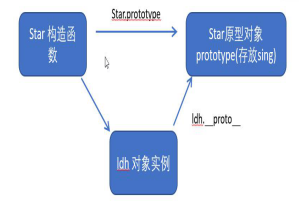
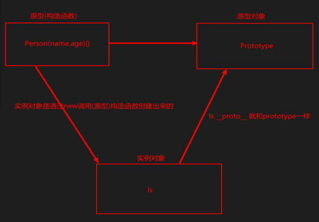
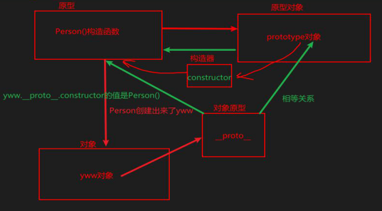
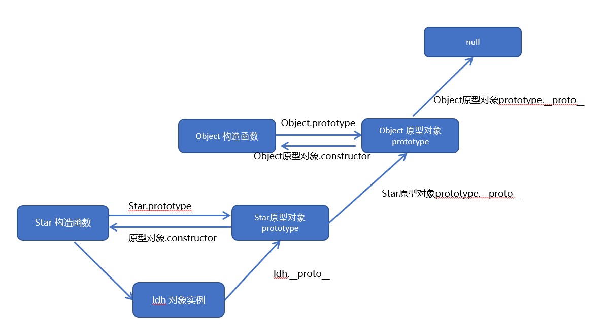
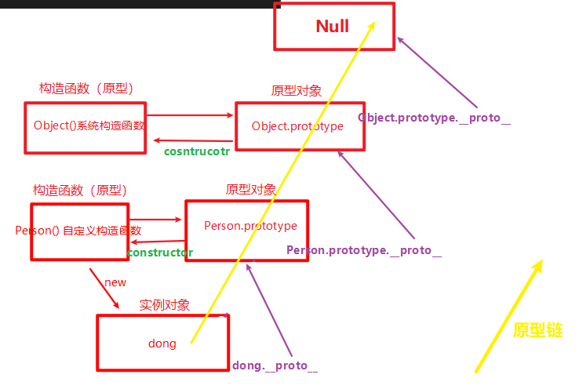

# 构造函数和原型

## 实例成员和静态成员

### 实例成员

在构造函数内部通过this添加的成员

实例成员只能通过实例化的对象访问，但是实例成员不能通过构造函数来访问

```js
function Person(name, age) {
    // 内部通过this添加的成员
    this.name = name;
    this.age = age;
};
let obj = new Person('zs', 18);
console.log(obj.age);  // 18
console.log(Person.age);  // undefined
```

### 静态成员

在构造函数上直接添加的成员

静态成员只能通过构造函数来访问，但是不能通过实例化的对象来访问

```js
function Person(name, age) {
    this.name = name;
    this.age = age;
};
// 在构造函数上直接添加
Person.sex = '男'
let obj = new Person('zs', 18);
console.log(obj.sex);  // undefined
console.log(Person.sex);  // 男
```


## 构造函数的问题

构造函数方法很好用，但是存在<font color=red>浪费内存</font>问题

```js
function Person(name, age) {
    this.name = name;
    this.age = age;
    this.sayHi = function () {
        console.log('您好');
    }
};

let zs = new Person('zs', 18);
let ls = new Person('ls', 22);
console.log(zs.sayHi == ls.sayHi);  // false
// false原因是俩个地址不同
// 所以说如果对于共用的相同的成员，构造函数实例化对象时比较浪费内存
// 功能相同地址不同的俩个函数，造成了内存浪费
```


## 构造函数原型prototype(对象)

构造函数通过原型分配的函数是所有对象都可以共享的

JavaScript 规定，每一个构造函数都有一个prototype属性，指向另一个对象，注意这个prototype就是一个对象，这个对象的所有属性和方法，都会被构造函数所拥有。

我们可以把那些不变的方法，直接定义在prototype对象上，这样所有对象的实例就可以共享这些方法了。

```js
function Person(name, age) {
    this.name = name;
    this.age = age;
};
// 如果公共方法不在构造函数中定义，而在构造函数的原型-prototype- 上定义，就可以达到方法共享，做到节省内存
Person.prototype.sayHi = function () {
    console.log('您好');
}
let zs = new Person('zs', 18);
let ls = new Person('ls', 22);
console.log(zs.sayHi === ls.sayHi);  // true  说明此时是同一个地址
```


## 对象原型 (`_proto_`)

实例化出来的对象都会用一个属性<font color=red>`__proto__`指向构造函数的prototype原型对象</font>，实例对象之所以可以使用构造函数 `prototype` 原型对象的属性和方法，就是因为对象有`__proto__`的存在。

`_proto_` 是非标准的（不能用）

原型（构造函数）的原型对象 `prototype` 是标准的（可以用）

#### 作用：

为原型对象的查找机制提供了一个方向，或者说是一条路线，开发中从来不用，只是为了解释为什么对象能调用原型对象的方法。






##  constructor 构造器

对象原型（`__proto__`）和构造函数（`prototype`）原型对象里面都有一个constructor属性，constructor 我们称为构造函数，因为它<font color=red>指回构造函数本身</font>。

#### 作用：

constructor 主要用于记录该对象引用于哪个构造函数，它可以让原型对象重新指向原来的构造函数



```js
// 构造器 constructor
function Person(name, age) {
    this.name = name;
    this.age = age;
};
Person.prototype.sayHi = function () {
    console.log('您好');
}
let yww = new Person('yww', 22);
// prototype上有一个构造器  constructor 值是 构造函数原型Person
console.log(Person.prototype);
// _proto_ 上也有一个构造器 constructor 值是 构造函数原型Person
console.log(yww.__proto__);
```

一般情况下，<font color=red>对象的共享方法都在构造函数的原型对象中设置</font>，如果有多个对象的方法，我们可以给原型对象采取<font color=red>对象形式赋值</font>，但是这样就<font color=red>会覆盖原型对象</font>原来的内容，这样<font color=red>修改后的原型对象constructor 就不再指向当前的构造函数</font>了。因此，我们需要在修改后的原型对象中，<font color=red>添加一个constructor指向原来的构造函数</font>。

```js
 function Star(uname, age) {
     this.uname = uname;
     this.age = age;
 }
 // 很多情况下,我们需要手动的利用constructor 这个属性指回 原来的构造函数
 Star.prototype = {
 // 如果我们修改了原来的原型对象,给原型对象赋值的是一个对象,则必须手动的添加constructor指回原来的构造函数
   constructor: Star, // 手动设置指回原来的构造函数
   sing: function() {
     console.log('我会唱歌');
   },
   movie: function() {
     console.log('我会演电影');
   }
}
var zxy = new Star('张学友', 19);
console.log(zxy)
```


## 原型链

每一个实例对象又有一个`__proto__`属性，指向的构造函数的原型对象，构造函数的原型对象也是一个对象，也有`__proto__`属性，这样一层一层往上找就形成了原型链。




```js
        // 构造函数（原型）
        function Person(name, age) {
            this.name = name;
            this.age = age;
        }

        // 原型对象
        Person.prototype.study = function () {
            console.log('学习');
        };

        // 实例对象
        let dong = new Person('dong', 22);
        // Person.prototype 是 dong 的原型对象
        console.log(Person.prototype === dong.__proto__);  // true
        // Object.prototype 是  Person.prototype 的原型对象
        console.log(Object.prototype === Person.prototype.__proto__);  // true
        // Object.prototype 的 原型对象 为 Null
        console.log(Object.prototype.__proto__);  // null
        // 所有对象都是通过Object实例化来的
```


## 原型链和成员的查找机制

任何对象都有原型对象，也就是prototype属性，任何原型对象也是一个对象，所以也有一个`__proto__`属性，然后就顺着找到了原型链

当访问一个对象的属性或方法时，

* 首先查找这个对象自身有没有该属性
* 如果没有，就查找他的原型对象（也就是 `__prototype__`原型对象）
* 如果还没有，就查找原型对象的原型对象
* 依此类推一直找到 `Object` 为止 

所以说：<font color=red> `__proto__` 对象原型的意义就在于为对象成员查找机制提供一个方向，或者说一条路线</font>



## 构造函数、实例对象、原型对象  的三角关系

1. **构造函数** 的prototype属性就是 **原型对象**
2. **实例对象** 是由 **构造函数** 创建的，**实例对象** 的`__proto__`属性指向**原型对象**
3. **构造函数的原型对象** 中constructor属性指向了 **构造函数** ，所以**实例对象**的`__proto__`中也有constructor属性指向 **构造函数** 


## 构造函数和原型中的this指向

**构造函数中的this指向实例对象**

**原型对象中的this也指向实例对象**

<font color=red>js是一门动态语言，一门弱类型语言，解释性语言，单线程脚本语言</font>

之所以说`js`是一门动态语言，是因为只有在代码执行的时候，才知道数据的类型和值

this也是等代码执行起来的时候，我们才知道this指向谁

```js
        // 构造函数（原型）
        function Person(name, age) {
            this.name = name;
            this.age = age;
        }

        // 原型对象
        Person.prototype.study = function () {
            console.log('学习');
        };

        // 实例对象
        let dong = new Person('dong', 22);
        let that;
        Person.prototype.study = function () {
            that = this;
        };
        dong.study();
        console.log(that === dong);  // true
		// 所以说： 原型对象中的this也指向实例对象
```


## 通过原型为数组扩展内置方法

```js
let arr = [1, 2, 3, 4];

Array.prototype.sum = function () {
    let sum = 0;
    for (let i = 0; i < this.length; i++) {
        sum += this[i];
    }
    return sum;
};

console.log(arr.sum()); // 10
```

```js
let arr = [1, 5, 4, 3];
// 给数组内置一个冒泡排序方法
/**
 * @param {*} flag true为降序，false为升序，默认为true
 */
// 第一种：从第一位开始排
Array.prototype.maoPaoFn1 = function (flag = true) {
    let that = this;
    for (let i = 0; i < that.length; i++) {
        for (let j = i + 1; j < that.length; j++) {
            if (flag) {
                if (that[i] < that[j]) {
                    let temp = that[i];
                    that[i] = that[j];
                    that[j] = temp;
                }
            }
            else {
                if (that[i] > that[j]) {
                    let temp = that[i];
                    that[i] = that[j];
                    that[j] = temp;
                }
            }
        }
    }
    return that;
};

// 第二种：改变原数组，且从最后一位往出排
Array.prototype.maoPaoFn2 = function (flag = true) {
    for (let i = 0; i < this.length - 1; i++) {
        for (let j = 0; j < this.length - i - 1; j++) {
            if (flag) {
                if (this[j] < this[j + 1]) {
                    let temp = this[j];
                    this[j] = this[j + 1];
                    this[j + 1] = temp;
                }
            }
            else {
                if (this[j] > this[j + 1]) {
                    let temp = this[j];
                    this[j] = this[j + 1];
                    this[j + 1] = temp;
                }
            }
        }
    }
}

let arrSort = arr.maoPaoFn1(false);
arr.maoPaoFn2();
console.log(arrSort);  // [ 1, 3, 4, 5 ]
```

