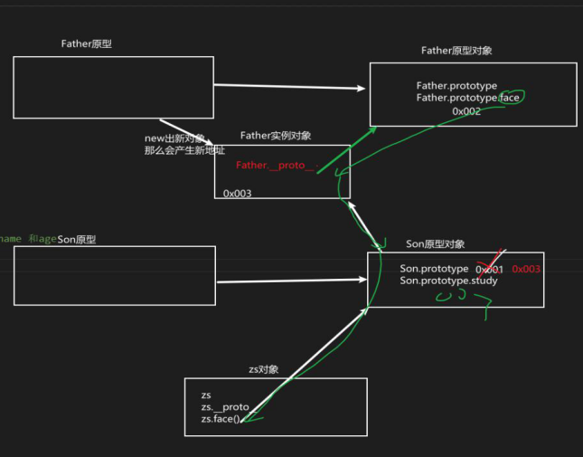

## Call 方法的使用

#### 作用

1. 可以调用函数
2. 可以修改this的指向，使用call()的时候，参数一是修改后的this指向，参数2、参数3...使用逗号隔开

```js
function fn() {
    console.log('您好');
    console.log(this.name); // dong
    console.log(arguments); // [Arguments] { '0': 1, '1': 2 }
};
let o = {
    name: 'dong',
    age: 18
};
// 参数一是指向哪个对象 ， 后面其它参数是给函数的实参
fn.call(o, 1, 2)
```


## 子构造函数继承父构造函数的属性

1. 先定义一个父构造函数
2. 再定义一个子构造函数
3. 让子构造函数继承父构造函数的属性（使用call方法）

```js
// 使用call去实现继承父构造函数的属性
function Father(name, age) {
    this.name = name;
    this.age = age;
};

function Son(name, age) {
    console.log(this);
    // 此时的this 指向 Son
    // 调用父构造函数的call方法，将父构造函数中的this指向变为子构造函数的this
    // 相当于在子构造函数中执行一遍父构造函数，但是指向目标是子构造函数
    Father.call(this, name, age);
};

let dong = new Son('dong', 22);
console.log(dong);
```


## 子构造函数实例对象继承父原型对象`Father.prototype`中的共享方法和属性

```js
// 使用call去实现继承父构造函数的属性
function Father(name, age) {
    this.name = name;
    this.age = age;
};

Father.prototype.face = function () {
    console.log('看面相');
};

function Son(name, age, score) {
    // 继承属性
    Father.call(this, name, age);
    this.score = score
};
// 继承Father原型对象中的共享方法和属性
// 直接让son原型对象的地址指向father原型对象，改变 实例对象 原本的原型链方向
Son.prototype = Father.prototype;
// 但是这样操作会导致一个问题：当我们给 Son.prototype添加方法时，也相当于在给 Father.prototype 添加方法，造成子级原型对象改变时会影响父级原型对象，所以这样是不太好的

let dong = new Son('dong', 22, 5);
dong.face(); // 看面相
// 这样可以成功，但是存在问题
```

解决问题



```js
// 使用call去实现继承父构造函数的属性
function Father(name, age) {
    this.name = name;
    this.age = age;
};

Father.prototype.face = function () {
    console.log('看面相');
};

function Son(name, age, score) {
    // 继承属性
    Father.call(this, name, age);
    this.score = score;
};
// 继承Father原型对象Father.prototype中的共享方法和属性
// 直接让son原型对象的地址指向father原型对象，改变 实例对象 原本的原型链方向
// Son.prototype = Father.prototype;
// 但是这样做存在一个问题就是：当我们给 Son.prototype添加方法时，也相当于在给 Father.prototype 添加方法，这样是不太好的
// 因此需要新的解决方法就是： 用父构造函数new一个实例对象，让父原型对象Father.prototype中的东西就可以通过这个 new Father().__proto__找到，而且因为这样是开辟一块新空间，得到一个新地址，然后我们将新地址赋值给子原型对象Son.prototype，就可以避免影响 Father.prototype，而且依然能找到Father.prototype中共享的方法
Son.prototype = new Father();
// 而且要记得将constructor改回来
Son.prototype.constructor = Son;
Son.prototype.study = function () {
    console.log('学习学习再学习');
};
// 所以当我们此时给 Son.prototype添加方法时，并不会影响 Father.prototype
let dong = new Son('dong', 22, 5);
dong.face();
```


## `ES5`新增方法

### 数组方法 `forEach` 遍历数组

```js
let arr = [1, 2, 34, 5, 5, 6];
// value代表arr的每个元素
// index代表arr的每个元素的索引
// array代表arr本身
arr.forEach(function (value, index, array) {
    console.log(value, index, array);
})
```

### 数组方法 `filter` 过滤数组

```js
let arr = [1, 2, 34, 5, 5, 6];
// 找出数组中的偶数并放到新数组中
let newArr = arr.filter((value, index) => {
    return value % 2 == 0;
});
console.log(newArr); // [ 2, 34, 6 ]
```

## 数组方法 `some` 

```js
let arr = [1, 2, 34, 5, 5, 6];
let flag = arr.some((value, index) => {
    // 只要找到满足条件的，立马中止循环，返回true
    // 如果一直没找到，最终返回false
    return value > 13;
});
console.log(flag);
```

