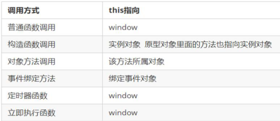

## 函数的定义方法

方式一：函数声明方式

```js
function fn() { }
```

方式二：函数表达式方式

```js
let fn = function () { }
```

方式三：new Function()

```js
// 函数的构造函数（万物皆对象）
// 方法一般都有参数和函数体  
// Function系统构造函数的参数必须都是字符串，前面是函数的参数，最后一个是函数体
// 所以不便书写，因此比较少用
let fn = new Function('a', 'b', 'console.log(a+b+"太麻烦了")');
fn('这', '样');  // 这样太麻烦了

// 所有函数都是 Function的实例对象
function aaa() {
};
console.log(aaa.__proto__ === Function.prototype); // true
```

### 函数的调用方式

1. 普通函数

2. 对象的方法

3. 构造函数

   主要就是用来创建对象

   ```js
   function Person(name,age){
   	this.name = name;
       this.age = age;
   }
   
   // new 调用了构造函数，实例化出来一个对象
   new Person('zs',18);
   ```

4. 指定事件的函数

   ```js
   document.body.addEventListener("click", ()=>{
       console.log('我点击的是body')
   })
   // 点击触发
   ```

5. 定时器函数

   ```js
   window.setInteral(function(){
       console.log(new Date())
   },1000);
   window.setTimeout(function(){
       console.log(new Date())
   },5000);
   ```

6. 立即执行函数（自调用函数）

   ```js
   // ()()
   (function(形参){
       函数体
   })(实参);
   
   // (())
   (function(形参){
       函数体
   }(实参));
   ```

   

## `this`

### 函数内部的this指向



### `apply` 方法

```js
// apply 方法
// 1. 调用函数
// 2. 改变this指向
// 3. 和call方法的不同：给函数的参数都放在一个数组中做为第二个参数

function fn(x, y) {
    console.log(this); // { name: 'dong' }
    console.log(x, y); // 1 2
}

let o = {
    name: 'dong'
}

fn.apply(o, [1, 2]);
// 相当于
fn.call(o, 1, 2)
```

### `bind` 方法

```js
// bind 方法
// 1.拷贝一个新方法，函数并不会直接被执行，而是返回一个复制出来的新方法
// 2.bind方法也可以改变this的指向 

function fn(x, y) {
    console.log(this); // { name: 'dong' }
    console.log(x, y); // 1 2
}

let o = {
    name: 'dong'
}

let newFn = fn.bind(o, 1, 2);
newFn();
```

#### call、apply、bind 三者的异同

* 共同点：都可以改变this指向
* 不同点：
  * call 和 apply 会直接调用函数，并且改变函数内部this指向，而bind不会直接调用
  * call 和 apply 传递的参数不一样，call传递参数使用逗号隔开，apply使用数组传递
  * bind 不会调用函数，可以改变函数内部this指向
* 应用场景：
  1. call 经常用来做继承
  2. apply 经常跟数组有关系，比如借助于数学对象实现数组最大值最小值
  3. bind 用于 不调用函数，但是还想改变this指向的情况，比如改变定时器内部的this指向

## 严格模式

### 什么是严格模式

JavaScript 除了提供正常模式外，还提供了严格模式（strict mode）。`ES5` 的严格模式是采用具有限制性 JavaScript变体的一种方式，即在严格的条件下运行 `JS` 代码。

严格模式在 `IE10` 以上版本的浏览器中才会被支持，旧版本浏览器中会被忽略。

严格模式对正常的 JavaScript 语义做了一些更改： 

1.消除了 `Javascript` 语法的一些不合理、不严谨之处，减少了一些怪异行为。

2.消除代码运行的一些不安全之处，保证代码运行的安全。

3.提高编译器效率，增加运行速度。

4.禁用了在 `ECMAScript` 的未来版本中可能会定义的一些语法，为未来新版本的 `Javascript` 做好铺垫。比如一些保留字如：class,`enum`,export, extends, import, super 不能做变量名

### 开启严格模式

严格模式可以应用到整个脚本或个别函数中。因此在使用时，我们可以将严格模式分为为脚本开启严格模式和为函数开启严格模式两种情况。

- 情况一 :为脚本开启严格模式

  - 有的 script 脚本是严格模式，有的 script 脚本是正常模式，这样不利于文件合并，所以可以将整个脚本文件放在一个立即执行的匿名函数之中。这样独立创建一个作用域而不影响其他
    script 脚本文件。

    ```js
    (function (){
      //在当前的这个自调用函数中有开启严格模式，当前函数之外还是普通模式
    　　　　"use strict";
           var num = 10;
    　　　　function fn() {}
    })();
    //或者 
    <script>
      　"use strict"; //当前script标签开启了严格模式
    </script>
    <script>
      			//当前script标签未开启严格模式
    </script>
    ```

- 情况二: 为函数开启严格模式

  - 要给某个函数开启严格模式，需要把“use strict”;  (或 'use strict'; ) 声明放在函数体所有语句之前。

    ```js
    function fn(){
    　　"use strict";
    　　return "123";
    } 
    //当前fn函数开启了严格模式
    ```

#### 严格模式中的变化

严格模式对JavaScript的语法和行为，都做了一些改变

```js
// 严格模式
"use strict";

// 1. 不能使用未声明的变量
// num = 10;
// console.log(num);  

// 2. 不能删除变量
// let num1 = 1;
// delete num1;

// 3. 全局作用域中函数中的this指向是undefined
console.log(this); // window
function fn() {
    console.log(this);  // undefined
};
fn();

// 4. 构造函数不加 new 调用，this指向是 undefined
function Star(name) {
    console.log(this);  // Star()
    this.name = name;
};
let ldh = new Star('ldh');
console.log(ldh);  // Star {name: "ldh"}

// 定时器的 this 还是指向 window
setTimeout(() => {
    console.log(this);
}, 2000)
```

[更多严格模式要求参考](https://developer.mozilla.org/zh-CN/docs/Web/JavaScript/Reference/Strict_mode)

## 高阶函数

高阶函数是对其他函数进行操作的函数，它接收函数作为参数或将函数作为返回值输出。


此时`fn` 就是一个高阶函数

函数也是一种数据类型，同样可以作为参数，传递给另外一个参数使用。最典型的就是作为回调函数。

同理函数也可以作为返回值传递回来

