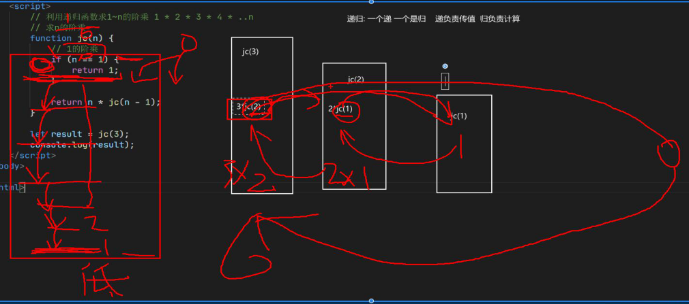

## 闭包

### 变量的作用域复习

`es5`中变量根据作用域的不同分为俩种：全局变量和局部变量

1. 函数内部可以使用全局变量
2. 函数外部不可以使用局部变量
3. 当函数执行完毕，本作用域内的局部变量会销毁

### 什么是闭包

闭包（closure）指有权访问另一个函数作用域中变量的函数。

简单理解就是一个作用域可以访问另外一个函数内部的变量

<font color=red>闭包首先必须是一个函数</font>

被访问的局部变量在哪个函数作用域内，哪个函数就是闭包函数

```js
function fn() {
    var a = 10;
    // a 就是被别的作用域访问的局部变量，所以a所在的函数fn就是闭包
    function fun() {
        console.log(a);
    }
    fun();
};

fn();
```


### 闭包的作用

作用：延申变量的作用范围

```js
function fn() {
   var num = 10;
   function fun() {
       console.log(num);
 	}
    return fun;
 }
var f = fn();
f();
```


### 闭包案例

点击`li`输出当前`li`的索引号

```html
<body>
    <ul class="nav">
        <li>榴莲</li>
        <li>臭豆腐</li>
        <li>鱼罐头</li>
        <li>大猪蹄子</li>
    </ul>

    <script>
        // 闭包作用：点击li输出当前li的索引号
        // 1. 找到nav中的li
        let aLi = document.querySelectorAll('li');
        // 2. 遍历li
        // for (var i = 0; i < aLi.length; i++) {
        //     aLi[i].index = i;
        //     // 绑定事件
        //     aLi[i].onclick = function () {
        //         // 这里访问到的 i 已经是4（在全局作用域） 
        //         console.log(i);
        //         // 所以这里就不能写 aLi[i] 了
        //         console.log(aLi[i].index);
        //     }
        // };
        // 问题：如果我们想从 事件处理函数中依然访问到 每个不同的i

        // 解决方案一：使用闭包函数来缓存（延长每个i的存在范围）
        for (var i = 0; i < aLi.length; i++) {
            // 写一个自调用函数，因为在es5中只有函数作用域，
            // 所以只能通过函数来把作用域
            (function (j) {
                aLi[j].index = j;
                aLi[j].onclick = function () {
                    // 这里访问到的 i 已经是4 
                    console.log(j);
                    console.log(this.index);
                }
            }(i));
        };

        // 解决方案二：获取 使用 es6 的 let
        // for (let i = 0; i < aLi.length; i++) {
        //     aLi[i].index = i;
        //     aLi[i].onclick = function () {
        //         // 这里访问到的 i 已经是4 
        //         console.log(i);
        //         console.log(this.index);
        //     };
        // };
    </script>
</body>
```

闭包应用-3秒钟之后,打印所有`li`元素的内容

```html
<body>
    <ul class="nav">
        <li>榴莲</li>
        <li>臭豆腐</li>
        <li>鱼罐头</li>
        <li>大猪蹄子</li>
    </ul>

    <script>
        // 闭包作用：3秒钟之后，打印所有li元素的内容
        let aLi = document.querySelectorAll('li');

        for (var i = 0; i < aLi.length; i++) {
            (function (j) {
                setTimeout(() => {
                    // 因为这里是回调函数在异步进程中，
                    // 所以当这里执行时，全局中的i 已经变成了 4
                    // 所以我们依然可以使用 一个个的自定义函数 来把 i 以 j 变相的 存在每个自定义函数中，
                    // 然后就可以使用 每个自定义函数作用域中的i了

                    // 所以在这里 自定义函数的作用就是 延伸变量的作用范围 ，就是一个闭包的作用
                    console.log(aLi[j].innerHTML);
                }, 3000)
            })(i);
        };
    </script>
</body>
```


## 递归

### 什么是递归

**递归：**如果一个函数<font color=red>在内部可以调用其本身</font>，那么这个函数就是递归函数（简单理解：函数内部自己调用自己，这个函数就是递归函数）

**注意：**写递归一定要有<font color=red>终止条件</font>，如果没有终止条件，会发生<font color=red>栈溢出</font>

```js
let num = 0;
function fn() {
    if (num == 6) {
        return;
    }
    console.log('我要打印6句话');
    num++;
    fn();
};

fn();
```

一个是递，一个是归，递负责传值，归负责计算



```js
// 计算阶乘 3! = 1 x 2 x 3  
function jie(n) {
    if (n == 1) {
        return 1;
    }
    return n * jie(n - 1);
}
console.log(jie(3));
```

```js
// 斐波那契数列 1,1,2,3,5,8,13,21
function fei(n) {
    if (n == 1 || n == 2) {
        return 1;
    }
    return fei(n - 1) + fei(n - 2);
}
console.log(fei(6));
```

**遍历数组**

```js
// 使用递归遍历数组
let data = [[1, 2, [3, [4, 5, 6, 7], 8], 9], 10, [11, 12]];
// 遍历
function bianLi(arr) {
    for (let i = 0; i < arr.length; i++) {
        if (typeof arr[i] == 'number') {
            console.log(arr[i]);
        } else {
            bianLi(arr[i])
        }

    }
}
bianLi(data);
```


### 浅拷贝

只是拷贝一层，更深层次的复杂类型只拷贝引用（只存了个地址）

```js
// 浅拷贝

// 方式一：
let oldObj = {
    name: 'dong',
    age: 18,
    msg: {
        code: 'hello world'
    }
};
let newObj = {};
// 浅拷贝，传入 拷贝对象和被拷贝对象（数组也可以）
function lightCopy(newObj, oldObj) {
    // 遍历对象/数组
    for (const key in oldObj) {
        newObj[key] = oldObj[key]
    }
}
lightCopy(newObj, oldObj);
// 拷贝完成后，我们将新对象中的 “复杂类型” 改变
newObj.msg.code = '变了';
// 然后打印 旧对象，会发现，旧对象也改变了，因为浅拷贝时，浅拷贝只是拷贝了对象中复杂类型的地址
console.log(oldObj);
// { name: 'dong', age: 18, msg: { code: '变了' } }


// 方式二：
// 系统构造函数Object原型自带的assign 可以实现浅拷贝
Object.assign(newObj, oldObj);
// 改变 新对象
newObj.msg.code = '又变了';
// 旧对象同样也会被改变
console.log(oldObj);
// { name: 'dong', age: 18, msg: { code: '又变了' } }
```


### 深拷贝

拷贝多层，每一层的数据都会拷贝（利用递归）

```js
// 深拷贝
let oldObj = {
    name: 'dong',
    age: 18,
    msg: {
        code: 'hello world'
    },
    score: [99, 98, 99]
};
let newObj = {};
// 深拷贝，传入 拷贝对象和被拷贝对象（数组也可以）
function deepCopy(newObj, oldObj) {
    // 遍历对象/数组
    for (const key in oldObj) {
        // 判断值是否为数组
        if (Array.isArray(oldObj[key])) {
            newObj[key] = [];
            deepCopy(newObj[key], oldObj[key]);
        }
        // 判断值是否为对象
        else if (oldObj[key] instanceof Object) {
            newObj[key] = {}
            deepCopy(newObj[key], oldObj[key]);
        }
        else {
            newObj[key] = oldObj[key];
        }
    }
}
deepCopy(newObj, oldObj);
// 这次改变 新对象中 引用类型的值
newObj.msg.code = 'sss';
newObj.score[0] = 0;
// 旧对象就不会改变了，也就是实现了深拷贝
console.log(oldObj);
```

