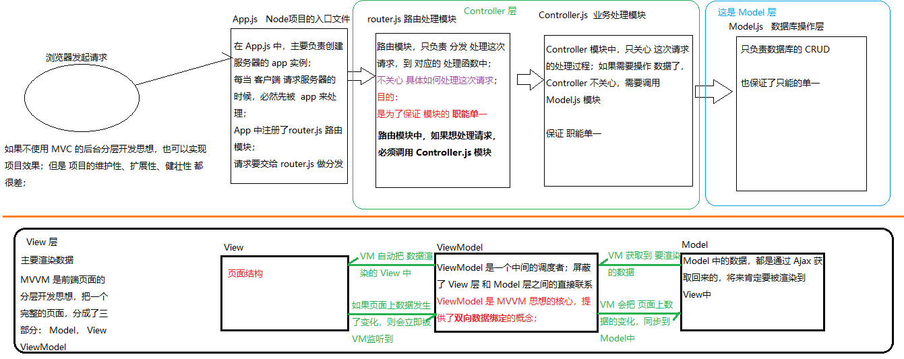

# Vue.js 基础

## Vue的指令

### 框架和库的区别

* 概念：小而巧的是库（例如jQuery，为了加强原生js的能力，不限制到底使用什么）；大而全的是框架（例如express，是Node的web开发框架，只能使用express提供的方法）框架的设计是为了限制我们的习惯，找平差距，规范团队代码。

  Angular是框架，Vue和React是库

* 框架：是一套完整的解决方案，对项目的侵入性比较大，项目如果需要更换框架，则需要重新架构整个项目

* 库（插件）：提供某个小功能，对项目的侵入性比较小，如果某个库无法完成某些需求，可以很容易切换其它库实现需求

### 为什么要学习框架（React Vue Angular）

* 企业角度：

  * 企业中需要使用流行框架提高项目的开发效率（本质目的：节约成本）

* 个人角度：

  * 接触到最新的开发模式

  * 最新的开发思想（比如MVVM的开发思想）

    以前的开发思想：让某某 怎么做到某件事（过程导向）

    现在的开发思想：想要看到啥效果（结果导向）

### 什么是Vue.js

* Vue.js 是前端的**主流框架之一**，和Angular.js、React.js 一起，并成为前端三大主流框架！
  - Angular.js  出现**最早**的前端框架，曾经很火，但是现在已经 被边缘化了；也不好学；
    - Angular 1.x     学起来好麻烦；
    - Angular 2.x ~ 5.x    学习起来相对简单；
  - React.js   是目前**最流行**的一个框架；是用的人最多的一个框架；但是，学习起来也比较难；因为在 React中，所有的功能，都要用 Javascript 来实现；
  - Vue.js 是目前**最火**的前端框架；Vue 学习起来非常容易； Vue 是中国人 `尤雨溪 ` 开发的； 文档非常友好；
* Vue.js 是一套构建用户界面的框架，**只关注图层(页面)的开发**，易于上手

### Node（后端）中的MVC 与 前端中的MVVM 之间的区别

* MVC 主要是后端的分层开发思想；把 一个完整的后端项目，分成了三个部分：
  - Model：（数据层）主要负责 数据库的操作；
  - View：（视图层）所有前端页面，统称为 View 层
  - Controller：（业务逻辑层）主要处理对应的业务逻辑；（对于后台来说，这是开发的重点）
* MVVM是**前端页面的分层开发思想**，主要关注于 **视图层** 分离，也就是说：MVVM把前端的视图层，分为了三部分Model，View，ViewModel
  * Model是页面中，需要用到的数据
  * View是页面中的HTML结构
  * ViewModel是一个中间的调度者，提供了双向数据绑定的概念
* 为什么有了MVC还要MVVM
  * 因为MVC是后端的开发思想，并没有明确定义前端的页面该如何开发
  * MVVM是前端的页面的开发思想，把每个页面，分成了三个部分，同时VM作为MVVM的核心，提供了双向数据绑定的概念，前端程序员，不需要手动渲染页面了，而且，页面数据发生变化时，也不需要程序员手动把数据的变化同步到Model中，这所有的操作，都是VM自动完成的
  * 有了MVVM的思想以后，前端只关心页面交互逻辑，不关心页面如何渲染



### Vue.js基本代码 和 MVVM 之间的对应关系

1. 注意：Vue中，不推荐程序员手动操作DOM元素，所以，在Vue项目中，没有极其变态的需求时，一般不要引入jQuery
2. Vue代码解析执行的步骤：
   * 当VM实例对象，被创建完成之后，把模板和数据进行绑定，存储到内存中
   * 当VM调用mount()方法时，把内存中已经渲染好的html结构插入到元素中去
3. 注意：每当VM实例对象，监听到data中数据发生了变化，就会立即重新解析，重新指向model内。


### Vue基础指令

####  Vue指令之 `插值表达式 {{ }}`

1. 使用：
   在指定的位置动态插入内容，例如：

   ```html
   <p>{{msg}}</p>
   ```

2. 在插值表达式中 使用简单的语句

3. 注意：插值表达式只能用在元素的 **内容区域** ，<font color=red>不能用在元素的属性节点中</font>（所以后面会有v-bind的出现）

```html
<body>
    <!-- M（数据） V（模板） VM（控制器 调度者） -->
    <!-- 1.写模板 -->
    <!-- vue是一个渐进式框架：一个页面中，不需要vue的地方可以不用，需要vue才用 -->
    <!-- 在id为app的div中任何代码都是由vue控制的 -->
    <div id="app">
        <!-- {{}} 名称为插值表达式 -->
        {{msg}}
    </div>

    <!-- 引入vue库文件 -->
    <!-- 当页面中引入vue库文件，那么全局对象window中就有了一个Vue的实例对象 -->
    <script src="./lib/vue-3.0.js"></script>

    <script>
        // <!-- 2.写数据 -->
        // 创建一个Vue实例，参数是一个对象，对象中包含一个data方法，用于返回数据，还可以有一个methods对象，用于存储方法
        let vm = Vue.createApp({
            data() {
                return {
                    msg: 'Hello Vue'
                }
            },
            methods: {}
        })

        // <!-- 3.写控制器，也可以称为：绑定器view model -->
        // mount()作用是把模板和数据渲染成一个有数据的html插入到指定元素中
        vm.mount('#app')
    </script>
</body>
```


#### Vue指令之 `v-cloak`

1. 使用（需要配合css属性选择器）

   ```html
       <style>
           [v-cloak] {
               display: none;
           }
       </style>
   
   <h1 v-cloak>{{msg}}</h1>
   ```

2. 解决的问题

   * 插值表达式有闪烁的问题（`v-cloak` 指令来解决闪烁问题）

3. 应用场景

   * 当网络比较卡的时候，我们可以为最外层的元素，添加`v-cloak`，防止用户看到插值表达式闪烁情况


#### Vue指令之 `v-text`

1. 基本使用
   在 元素的属性节点上，添加`v-text`指令，例如：

   ```html
   <p v-text="msg"></p>
   ```

2. 在`v-text`中 使用简单的语句

3. `v-text` 与 `{{}}` 的区别

   - 是否覆盖内容
   - 指令闪烁问题

4. 应用场景

   - 向指定元素的内容区域中，渲染指定的文本；


#### Vue指令之 `v-html`

1. 基本使用
   在 元素的属性节点上，添加`v-html`指令，例如：

   ```html
   <div v-html="msg"></div>
   ```

2. 应用场景
   当 服务器返回的数据中，包含的HTML的标签，此时，这些标签只能使用 `v-html` 来渲染；


#### Vue指令之 `v-bind:` 属性绑定

1. 基本使用

   - `v-bind:` 是为 html 属性节点动态绑定数据的，例如：

     ```html
     <button v-bind:title="titleStr">按钮</button>
     ```

2. 应用场景

   - 如果元素的属性值，需要动态地进行绑定，则需要使用`v-bind:` 指令

3. 简写形式

   - `v-bind:` 指令可以简写成 `:`，例如，可以简写成如下格式：

     ```html
     <button :title="titleStr">按钮</button>
     ```


#### Vue指令之 `v-on:` 事件绑定

1. 基本使用：
   `v-on:` 的作用，是为 HTML 元素，绑定 事件处理函数，例如：

   ```html
    <input type="button" value="按钮" v-on:click="事件处理函数名" />
   ```

2. 绑定事件处理函数并传参：

   ```html
   <input type="button" value="按钮" v-on:click="show(123)" />
   ```

3. 简写形式：
   `v-on:` 指令可以简写成 `@`，例如，可以简写成如下格式：

   ```html
   <input type="button" value="按钮" @click="事件处理函数名" />
   ```


#### 练习

```html
<body>
    <div id="app">
        <h1>{{msg}}</h1>
        <!-- v-text 相当于innerText，不能解析标签，但是v-text比innerText更安全一些 -->
        <h1 v-text='msg' v-cloak></h1>
        <!-- v-html 相当于innerHTML，可以解析标签，可以规避xss攻击 -->
        <!-- v-cloak 就是来解决闪烁问题的 -->
        <h1 v-html='msg' v-cloak></h1>
        <!-- v-bind:标签名='变量'/ :标签名='变量'  就是用来写标签的，因为插值表达式不能写在标签中 -->
        <a v-bind:title='title' :class='red1'>Lorem ipsum dolor sit amet consectetur adipisicing elit. Veritatis
            mollitia explicabo a
            odit aliquam ullam
            dolorum rem consequuntur consectetur temporibus! Quibusdam rerum laboriosam id eaque, ratione beatae
            possimus fugiat pariatur.</a>
        <!-- v-on 绑定事件 -->
        <button v-on:click='clickBtn'>点我看看</button>
        <!-- 简写 并 传参 -->
        <button @dblclick='dblclickBtn("袁旭东")'>双击我看看</button>
    </div>

    <script src="./lib/vue-3.0.js"></script>

    <script>
        let vm = Vue.createApp({
            data() {
                return {
                    msg: '<p>这是p标签</p>',
                    title: '文字',
                    red1: 'red'
                }
            },
            methods: {
                clickBtn() {
                    alert('您点击了button')
                },
                dblclickBtn(name) {
                    // this指向元素
                    alert(name + '双击了button，' + this.red1)
                }
            }
        })
        vm.mount('#app');
    </script>
</body>
```


### Vue调试工具`vue-devtools`的安装和使用

[Vue.js devtools - 翻墙安装方式 - 推荐](https://chrome.google.com/webstore/detail/vuejs-devtools/nhdogjmejiglipccpnnnanhbledajbpd?hl=zh-CN)

1.vue和jquery最大的区别 jquery调错特别简单 vue报错基本没法找到第几行

2.如果是简单代码vue-devtools

3.复杂项目 靠经验


### 跑马灯案例

```html
<body>
    <div id="app">
        <button @click="run">浪起来</button>
        <button v-on:click="stop">消停会</button>
        <h2>{{msg}}</h2>
    </div>

    <script src="./lib/vue-3.0.js"></script>
    <script>
        let that;
        let vm = Vue.createApp({
            data() {
                return {
                    msg: '稳住，我们能赢！！！',
                    interId: null
                }
            },
            methods: {
                // 运动
                run() {
                    that = this
                    // 节流阀
                    if (this.interId != null) return;
                    // 这里注意要使用 箭头函数 方便this指向问题
                    this.interId = setInterval(() => {
                        let end = this.msg.slice(1);
                        let start = this.msg.slice(0, 1);
                        this.msg = end + start;
                    }, 500);
                },
                // 停止
                stop() {
                    // 清除定时器
                    clearInterval(this.interId);
                    // 配合节流阀
                    this.interId = null;
                }
            }
        }).mount('#app');

    </script>
</body>
```

