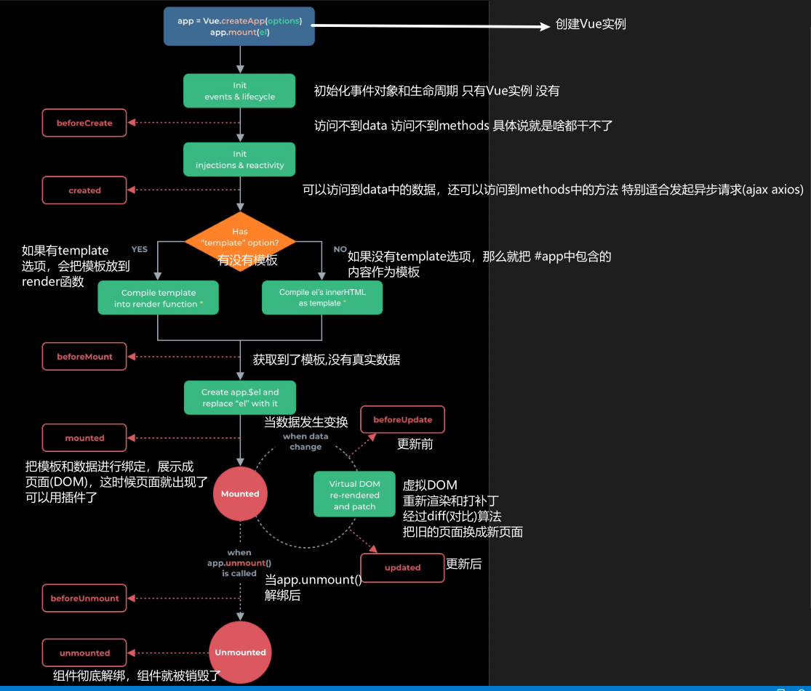

## 计算属性 `computed`

#### 计算属性与方法的区别：

1. computed是基于响应式依赖进行缓存的，触发条件是他的依赖变化了才会重新执行
2. 计算属性不需要主动调用，而methods中的方法就和普通函数一样需要主动调用
3. 计算属性是属性，用的时候不用加小括号但必须有返回值，而普通函数则可以有也可以没有，试具体需求而定
4. computed会节省大量性能消耗，而不是像methods中的方法一样每次调用都需要执行一遍输出结果，computed直接基于缓存变化而变化

```html
<body>
    <div id="app">
        <input type="number" v-model.number="num1">
        <br>
        <input type="number" v-model.number="num2">
        <br>
        <input type="text" disabled v-model="result">
        <input type="text" disabled v-bind:value="getSum()">
    </div>

    <script src="./lib/vue-3.0.js"></script>
    <script>
        let vm = Vue.createApp({
            data() {
                return {
                    num1: '',
                    num2: ''
                }
            },
            methods: {
                getSum() {
                    return this.num1 + this.num2
                }
            },
            computed: {
                result: function () {
                    return this.num1 + this.num2
                }
            }
        }).mount('#app')
    </script>
</body
```


## 侦听器 `watch`

在响应式地跟踪其依赖项时立即运行一个函数，并在更改依赖项时重新运行它。

* 使用watch来响应数据的变化
* 一般用于异步或者开销较大的操作
* watch中的属性，一定是data中已经存在的数据
* **当需要监听一个对象的改变时，普通的watch方法无法监听到对象内部属性的改变，只有data中的数据才能够监听到变化，此时就需要deep属性对对象进行深度监听**

```html
<body>
    <div id="app">
        <input type="text" v-model="word">
    </div>

    <script src="./lib/vue-3.0.js"></script>
    <script>
        let vm = Vue.createApp({
            data() {
                return {
                    word: ''
                }
            },
            // 侦听 (尽可能多用computed 替代 watch)
            watch: {
                word: function (newValue, oldValue) {
                    console.log("新：" + newValue);
                    console.log("旧：" + oldValue);
                }
            }
        }).mount('#app')
    </script>
</body>
```


#### 与computed的不同之处

1. computed 计算属性的回调函数方法可以直接在页面中通过插值表达式来获取使用，此时我们不需要在data数据域中再定义一个与方法名相同的属性
2. watch中的方法名必须是data数据域中所存在的，否则无法使用


#### 总结：

* 普通方法：需要调用
* `computed` 和 `watch` 自动执行
* 执行效率：`computed > watch > methods`
* watch监听的data中的属性，computed监听的是和功能相关的属性，methods中是事件调用
* watch监听的必须在data中出现，computed和methods则不强制


## 生命周期




```html
<body>
  <div id="app">
    <div>{{msg}}</div>
    <button @click='update'>更新</button>
    <button @click='destroy'>销毁</button>
  </div>
  <script type="text/javascript" src="./lib/vue-3.0.0.js"></script>
  <script type="text/javascript">
    /*
      Vue实例的生命周期
      
    */
    var vm = Vue.createApp({
      data() {
        return {
          msg: '生命周期'
        }
      },
      methods: {
        update: function () {
          this.msg = 'hello';
        },
        destroy: function () {
          console.log(this);
          // this.$forceUpdate();

          this.$unmounted();
        }
      },
      // 可以在钩子函数 created、beforeMount、mounted 中进行调用，因为在这三个钩子函数中，data 已经创建，可以将服务端端返回的数据进行赋值。

      // 但是推荐在 created 钩子函数中调用异步请求，因为在 created 钩子函数中调用异步请求有以下优点：

      // 能更快获取到服务端数据，减少页面loading 时间；
      // ssr不支持 beforeMount 、mounted 钩子函数，所以放在 created 中有助于一致性；

      // 在实例初始化之后,数据观测和事件配置之前被调用 此时data和methods以及页面的DOM结构都没有初始化 什么都做不了
      // beforeCreate: function () {
      //   console.log('beforeCreate');
      // },
      // // 在实例创建完成后被立即调用 此时data和methods已经可以使用 但是页面还没有被渲染出来
      // created: function () {
      //   console.log('created');
      // },
      setup: function () {
        console.log('created');
      },
      // 在挂载开始之前被调用 此时页面上还看不到真是数据 只是一个模板而已
      beforeMount: function () {
        console.log('beforeMount');
      },
      // el被新创建的vm.$el替换,并挂载到实例上去之后调用该钩子.数据已经真是渲染到页面上 在这个钩子函数里面我们可以使用一些第三方的插件

      // 在钩子函数 mounted 被调用前，Vue 已经将编译好的模板挂载到页面上，所以在 mounted 中可以访问操作 DOM。
      mounted: function () {
        console.log('mounted');
      },
      // 数据更新时调用,发生在虚拟DOM打补丁之前.页面上数据还是旧的
      beforeUpdate: function () {
        console.log('beforeUpdate');
      },
      // 由于数据更新导致的虚拟DOM重新渲染和打补丁,在这之后会调用该钩子,页面上的数据已经替换成最新的了
      updated: function () {
        console.log('updated');
      },
      // 实例销毁之前调用
      beforeUnmount: function () {
        console.log('beforeDestroy');
      },
      // 实例销毁之后调用
      unmounted: function () {
        console.log('destroyed');
      }
    }).mount('#app')

    // https://v3.cn.vuejs.org/guide/composition-api-lifecycle-hooks.html
    // https://www.vuemastery.com/courses/vue-3-essentials/lifecycle-hooks/

    // https://blog.csdn.net/kk2442687723/article/details/108749945
  </script>
</body>
```

### 钩子函数

- 事物从出生到死亡的过程
- `Vue`实例从创建 到销毁的过程 ，这些过程中会伴随着一些函数的自调用。我们称这些函数为钩子函数

#### 常用的 钩子函数(2.0)

| `beforeCreate`  | 在实例初始化之后，数据观测和事件配置之前被调用 此时data 和 methods 以及页面的DOM结构都没有初始化   什么都做不了 |
| --------------- | ------------------------------------------------------------ |
| created         | 在实例创建完成后被立即调用此时data 和 methods已经可以使用  但是页面还没有渲染出来 |
| `beforeMount`   | 在挂载开始之前被调用   此时页面上还看不到真实数据 只是一个模板页面而已 |
| mounted         | el被新创建的`vm.$el`替换，并挂载到实例上去之后调用该钩子。  数据已经真实渲染到页面上  在这个钩子函数里面我们可以使用一些第三方的插件 |
| `beforeUpdate`  | 数据更新时调用，发生在虚拟DOM打补丁之前。   页面上数据还是旧的 |
| updated         | 由于数据更改导致的虚拟DOM重新渲染和打补丁，在这之后会调用该钩子。 页面上数据已经替换成最新的 |
| `beforeDestroy` | 实例销毁之前调用                                             |
| destroyed       | 实例销毁后调用                                               |