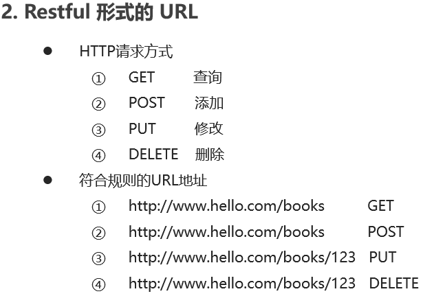

## 接口调用方式

* 原生Ajax
* 基于`jQuery`的Ajax
* fetch
* `axios`


.

.

### 异步

- JavaScript的执行环境是「单线程」
- 所谓单线程，是指JS引擎中负责解释和执行JavaScript代码的线程只有一个，也就是一次只能完成一项任务，这个任务执行完后才能执行下一个，它会「阻塞」其他任务。这个任务可称为主线程
- 异步模式可以一起执行**多个任务**
- `JS ` 中常见的异步调用
  - 定时任何
  - Ajax
  - 事件函数

### Promise

* 主要解决异步深层嵌套的问题
* promise提供了简洁的`API`，使得异步操作更加容易

#### 复习原生`js`发起Ajax请求

```html
<body>
    <button>发请求</button>
    <script>
        // 原生ajax
        let oBtn = document.querySelector('button');
        oBtn.onclick = function () {
            // 实例化xmlhttprequest对象
            let xhr = new XMLHttpRequest();
            console.log(xhr.readyState); // 0
            // 设置请求方式，和请求地址 
            xhr.open('get','http://localhost/data1');
            // 设置请求头（get请求不用设置请求头，但是post必须设置）
            console.log(xhr.readyState); // 1
            // 发送请求数据
            xhr.send(null);
            // 监听并处理响应
            xhr.onreadystatechange = function () {
                console.log(xhr.readyState); // 2  3  4
                if (xhr.readyState==4 && xhr.status==200) {
                    console.log(xhr.responseText);
                }
            }
        }
    </script>
</body>
```

#### Promise的基本使用

````html
<body>
    <script>
        // 从语法上讲，promise是一个对象（构造函数）
        // 我们使用new来构建一个Promise  Promise的构造函数接收一个参数，是函数，
        // 并且传入两个参数：resolve，reject
        // 分别表示异步操作执行成功后的回调函数和异步操作执行失败后的回调函数
        let p = new Promise(function (resolve, reject) {
            // resolve 如果是正常的响应，那么就把结果传给resolve
            // reject 如果是错误的响应，那么就把结果传给reject
            // 在这里实现异步任务，然后用resolve和reject接收（注意：resolve和reject只能执行一个）
            setTimeout(() => {
                let flag = true;
                if (flag) {
                    resolve('这是正确的结果');
                }
                else {
                    reject('这是错误的结果');
                }
            }, 1000);
        });
        // 方式一：获取结果（then获取成功的回调，catch获取失败的回调）
        p.then(function (result) {
            console.log(result);
        }).catch((err) => {
            console.log(err);
        })
        // 方式二：获取结果（默认then中第一个回调函数是成功的回调函数，
        //            第二个回调函数是失败的回调函数）
        p.then(function (result) {
            console.log(result);
        }, function (err) {
            console.log(err);
        })


        // 如果你在.then方法中return了结果，
        // 那么后面的.then可以继续拿到前面.then方法return过来结果
        p.then(function (result) {
            return '123';
        }).then((result) => {
            console.log(result); // 123
        })

        // 使用async/await获取结果
        async function waitwait(params) {
            let result = await p;
            console.log(result);
        }
        waitwait();
    </script>
</body>
````

#### 基础Promise发送Ajax请求

````html
<body>
    <button>点我看看</button>
    <script>
        let oBtn = document.querySelector('button');

        oBtn.onclick = function () {
            // 面条式解决回调地狱
            queryData('http://localhost/data1').then((result) => {
                console.log(result);
                // 利用return继续返回一个promise对象，后面的then就可以继续接收到请求数据了
                return queryData('http://localhost/data2');
            }).then((result)=>{
                console.log(result);
                return queryData('http://localhost/data3');
            }).then((result)=>{
                console.log(result);
            })
        };

        // 请求，返回一个 promise对象
        function queryData(url) {
            let p = new Promise(function (resolve,reject) {
                let xhr = new XMLHttpRequest();
                xhr.open('GET', url);
                xhr.send(null);
                xhr.onreadystatechange = function () {
                    if(xhr.readyState!==4) return;
                    if (xhr.readyState==4 && xhr.status==200) {
                        resolve(xhr.responseText);
                    } else {
                        reject('服务器错误')
                    }
                }
            });
            return p;
        }
    </script>
</body>
````

#### Promise 基本方法


