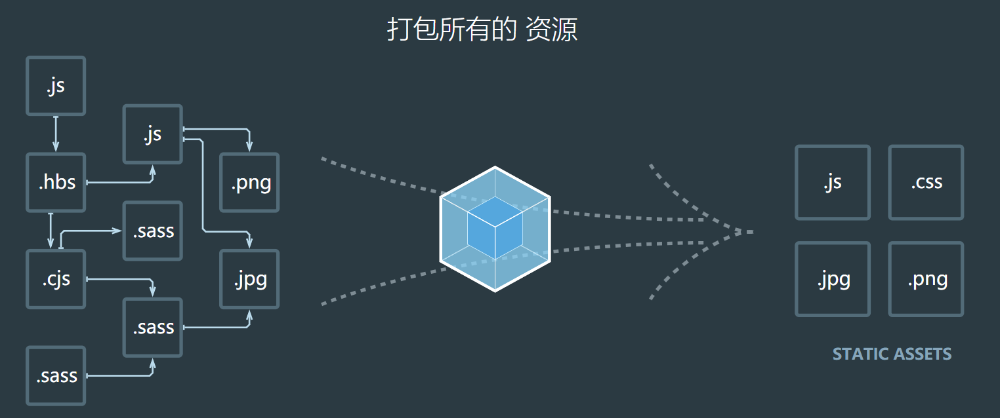
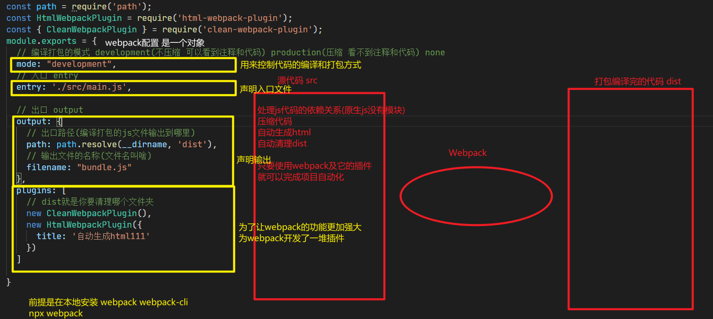

# `Webpack`

### 概述

通过`ts`，`es6`等开发的应用不能直接放到服务器，因为浏览器不解析，那么就可以通过`webpack`转化生成浏览器可以识别并执行的代码。

目前市场上的打包工具：`rollup、webpack、gulp/grunt`

### `Webpack` 是什么

  官方解释：`webpack`是一个现代的JavaScript应用的静态模块打包工具
  也就是说 `webpack`是一种前端资源构建工具，一个静态模块打包器(module bundler),
  在`webpack`看来，前端的所有资源文件(`js/json/css/img/less/...`)都会作为模块处理
  它将根据模块的依赖关系进行静态分析，打包生成对应的静态资源(bundle)
  **一句话，`webpack`的功能就是模块和打包**

  `webpack`为了正常运行必须依赖node环境，Node环境为了正常执行很多代码，必须依赖很多包，`npm`（node packages manager）工具是为了管理Node的包。



## `webpack`的五个核心概念

### Entry

  入口(entry)指示 `webpack`以哪个文件为入口起点开始打包，分析构建内部依赖图

### Output

  输出(Output)指示 `webpack`打包后的资源bundles输出到哪里去，以及如何命名

### Loader

  Loader让`webpack`能够去处理哪些非JavaScript文件(`webpack`自身只能理解JavaScript),类似于现实社会中的翻译官角色

### `Plugin`

  插件(`Plugin`)可以用于执行范围更广的任务，插件的范围包括，从打包优化和压缩，一直到重新定义环境中的变量等.

### Mode

  模式(Mode)指示`webpack`使用相应模式的配置

| 选项        | 描述                                                         | 特点                       |
| ----------- | ------------------------------------------------------------ | -------------------------- |
| development | `会将process.env.NODE_ENV的值设为development，启用NamedChunksPlugin和NamedModulesPlugin` | 能让代码本地调式运行的环境 |
| production  | `会将process.env.NODE_ENV的值设为production，启用FlagDependencyUsagePlugin，FlagincludeChunksPlugin,ModuleConcatenationPlugin,NoEmitOnErrorsPlugin, OcfurrenceOrderPlugin, SideEffectsFlagPlugin和UglifyJsPlugin` | 能让代码优化上线运行的环境 |



## `webpack` 的简单使用

#### 第一步：下载 `webpack`

```
npm install --save-dev webpack
npm install --save-dev webpack-cli
```


#### 第二步：书写 `webpack` 的配置文件

`webpack.config.js` 

```js
const path = require('path');

module.exports = {
    // 打包方式
    // development不压缩，可以看到注释和代码
    // production 压缩，看不到注释和代码
    // 入口 entry
    entry: './src/main.js',
    // 出口 output
    output: {
        // 出口路径（编译打包的js文件输出到哪里）
        path: path.resolve(__dirname, 'dist'),
        // 输出文件的名称
        filename: 'bundle.js'
    }
}
```

`package.json` 

```json
// 注意package.json中最好删除"main" 添加 "private": true 私有化
// 确保我们安装包是私有的(private)，并且移除 main 入口
// 这可以防止意外发布你的代码
  "private": true,
  "scripts": {
    "build": "webpack"
  },
```


#### 第三步：书写项目代码

```
import _ from "lodash";

let str = "sdsdfsdfsdfsdfjsdkfjsdkfksd";

// 把小写字母变成大写字母
console.log(_.upperCase(str));
```


#### 第四步：运行编译打包项目代码

```shell
  # 如果package.json有下列配置
  scripts: {
    "build": "webpack"
  }
  # 就运行
  npm run build
  # 否则运行
  npx webpack
```


### 自动生成 `index.html`

第一步：下载 `html-webpack-plugin`

```shell
npm install --save-dev html-webpack-plugin
```

第二步：引入 `html-webpack-plugin`

```js
const HtmlWebpackPlugin = require('html-webpack-plugin');
```

第三步：使用

```js
   plugins: [
     new HtmlWebpackPlugin({
      title: 'Output Management'
     })
   ],
```


### 清理 /dist 文件夹

第一步: 下载`clean-webpack-plugin`

```shell
 npm install clean-webpack-plugin --save-dev
```

第二步: 引入`html-webpack-plugin`

```js
const { CleanWebpackPlugin } = require('clean-webpack-plugin');
```

第三步: 使用

```js
   plugins: [
      new CleanWebpackPlugin(),
     new HtmlWebpackPlugin({
      title: 'Output Management'
     })
   ],
```


### 加载`CSS`文件

为了从 JavaScript 模块中 `import` 一个 `CSS` 文件，你需要在 [`module` 配置中](https://www.webpackjs.com/configuration/module) 安装并添加 [style-loader](https://www.webpackjs.com/loaders/style-loader) 和 [css-loader](https://www.webpackjs.com/loaders/css-loader)

*`webpack` 根据正则表达式，来确定应该查找哪些文件，并将其提供给指定的 loader。在这种情况下，以* `.css` *结尾的全部文件，都将被提供给* `style-loader` *和* `css-loader`*。*

第一步：引入

```shell
npm install --save-dev style-loader css-loader
```

第二步：配置

```js
  // loader的使用
  module: {
     rules: [
       {
         test: /\.css$/,
         use: [
           'style-loader',
           'css-loader'
         ]
       }
     ]
   }
```

第三步：添加`css`文件，并导入主入口的流程中

然后`webpack`就会把`css`文件中的样式用操作DOM的方式，以字符串形式写入我们document的style标签中


## 编译打包`.vue`文件

第一步: 安装 `vue vue-loader-v16  @vue/compiler-sfc vue-template-compiler`

第二步: 使用

```js
// 引入vue-loader插件
const VueLoaderPlugin = require('vue-loader-v16/dist/plugin.js').default

// 在modle中设置vue-loader解析 .vue文件
 {
  test: /\.vue$/,
  loader: 'vue-loader-v16'
}

// 在plugins中添加
new VueLoaderPlugin(),
// 并设置一个html的输出模板
new HtmlWebpackPlugin({
    template: './public/index.html'
})
```

第三步: 写项目代码

```js
// 注意这里需要安装 npm i vue@next
import { createApp } from "vue";
// 引入要解析的vue文件
import App from "./App.vue";
// 创建vue根组件，并绑定到模板中的#app
createApp(App).mount("#app");
```

第四步: 书写根组件

```vue
<template>
  <h1>{{ msg }}</h1>
</template>

<script>
export default {
  data() {
    return {
      msg: "Hello Vue222",
    };
  },
};
</script>

<style>
h1 {
  background-color: red;
  color: yellow;
}
</style>
```

