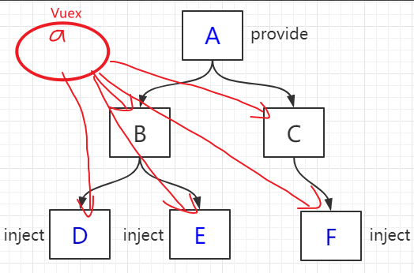

## VueX

### VueX简介



VueX是实现组件全局状态（数据）管理的一种机制，可以方便的实现组件之间的数据共享

使用VueX管理数据的好处：

* 能够在vueX中管理共享的数据，便于开发和后期进行维护
* 能够高效的实现组件之间的数据共享，提高开发效率
* 存储在vueX中的数据是响应式的，当数据发生改变时，页面中的数据也会同步更新

#### 注意：

不是任何数据都适合放在vueX中的，一般情况下，只有组件之间共享的数据，才有必要存储到vueX中，对于组件中的私有数据，依旧存储在组件自身的data中即可

### VueX的基本使用

1. 安装

   ```shell
   # If using Vue 3.0 + Vuex 4.0:
   npm install vuex@next --save
   ```
2. 配置（store/index.js）

   ```js
   // 引入VueX
   import { createStore } from "vuex";
      
   export default createStore({
     // 用来存储数据和应用状态
     // 注意这里的值只可读，不可以直接修改
     state() {
       return {
       }
     },
       
     // mutations中用来存储方法（是改变store状态的执行者）
     // 这些方法是专门来修改state中的数据状态的
     // 注意：这里不可以写异步操作，因为在mutation的异步中修改state中数据时，不会记录到数据的改变
     mutations: {},
       
     // actions中也是用来存储方法
     // 但是actions中可以执行异步操作，适合用于各种事务处理
     // 然后再事务处理后，触发mutaions中的方法去改变state数据（便可以有数据改变的记录）
     actions: {},
       
     // 类似于 computed 计算属性，可以基于getters和state中已有的数据 计算出新的返回值
     getters: {}
   })
   ```

   

3. 挂载（src/main.js）

   ```js
   import { createApp } from "vue";
   import App from "./App.vue";
   import store from "./store";
   createApp(App)
     .use(store)
     .mount("#app");
   ```

   

## VueX的核心概念

### State(类似于Vue中的data选项)

State提供唯一的公共数据源，所有共享的数据都要统一放到Store的State中进行存储

### mutation

用于修改Store中的数据。

1. 只能通过mutation 变更Store 数据，不可以直接操作Store 中的数据。
2. 通过这种方式虽然操作起来稍微繁琐一些，但是可以集中监控所有数据的变化。

### action

Action 用于处理异步任务。
如果通过异步操作变更数据，必须通过Action，而不能使用Mutation，
但是在Action 中还是要通过触发Mutation 的方式间接变更数据。

### getter

Getter 用于对Store 中的数据进行加工处理形成新的数据。

* Getter 可以对Store 中已有的数据加工处理之后形成新的数据，类似Vue 的计算属性。
* Store 中数据发生变化，Getter 的数据也会跟着变化

### 示例

`store/index.js` 

```js
import { createStore } from 'vuex';

export default createStore({
  // 用来存储数据和应用状态
  // 注意：这里的值只可读，不可以直接修改
  state() {
    return {
      books: [
        {
          id: 1,
          name: '倚天屠龙记',
          price: 20
        }
      ]
    }
  },
  // mutations中用来存储方法（是改变store状态的执行者）
  // 存储在这里方法是专门来修改state中的数据状态的（因为经过mutations方法修改的数据会有变化记录）
  // 注意：这里不可以写异步操作，因为在mutation的异步中修改state中数据时，不会记录到数据的改变
  mutations: {
    removeBook(state, id) {
      // mutations中的方法 会默认第一个参数为state，后面是传来的参数
      state.books = state.books.filter(ele => ele.id != id);
    }
  },
  // actions中也是用来存储方法
  // 但是actions中可以执行异步操作，适合用于各种事务处理
  // 然后再事务处理后，触发mutaions中的方法去改变state数据（便可以有数据改变的记录）
  actions: {
    removeBookAfterSeconds(context, id) {
      // actions中的方法，会默认第一个参数为context上下文，在这里相当于store对象，可以使用store对象的方法commit,dispatch执行mutations和actions等等
      setTimeout(() => {
        context.commit('removeBook', id)
      }, 2000);
    }
  },
  // 类似于 computed 计算属性，可以基于getters和state中已有的数据 计算出新的返回值
  getters: {
    nums(state) {
      return state.books.length
    }
  }
})
```

挂载在实例上以后，在组件中使用

```vue
<template>
  <div>
    <h3>图书管理：VueX 练习</h3>
    <p>共有 {{ nums }} 本书</p>
    <table border="1" cellpadding="5">
      <thead>
        <th>id</th>
        <th>书名</th>
        <th>价格</th>
        <th>操作</th>
        <th>异步操作</th>
      </thead>
      <tbody>
        <tr v-for="item in books" :key="item.id">
          <td v-text="item.id"></td>
          <td v-text="item.name"></td>
          <td v-text="item.price"></td>
          <td><a href="" @click.prevent="removeBook(item.id)">删除</a></td>
          <td>
            <a href="" @click.prevent="removeBookAfterSeconds(item.id)"
              >2秒删除</a
            >
          </td>
        </tr>
      </tbody>
    </table>
  </div>
</template>

<script>
// 引入 vuex
import { mapState, mapGetters, mapMutations, mapActions } from "vuex";
    
export default {
  name: "App",
  computed: {
    // 方式一：通过实例身上的$store对象中的state对象获取数据状态
    // books() {
    //   return this.$store.state.books;
    // },
    // 方式二：通过es6的扩展运算符将store对象中的state和getters放到这里
    ...mapState(["books"]),
    ...mapGetters(["nums"])
  },
  methods: {
    // 方式一：通过$store的commit方法执行vuex中mutations的方法（第一个参数是方法名，后面的参数是给方法传递的参数）
    // removeBook(id) {
    //   this.$store.commit("removeBook", id);
    // },
    // 通过$store的dispatch方法执行vuex中actions的方法（第一个参数是方法名，后面的参数是给方法传递的参数）
    // removeBookAfterSeconds(id) {
    //   this.$store.dispatch("removeBookAfterSeconds", id);
    // },
    // 方式二：
    ...mapMutations(["removeBook"]),
    ...mapActions(["removeBookAfterSeconds"])
  }
};
</script>
```


> https://www.v2ex.com/t/347227
> https://bigdata.bihell.com/language/javascript/vue/vuex.html#揭开-vuex-的神秘面纱
> https://cn.vuejs.org/v2/guide/state-management.html#简单状态管理起步使用