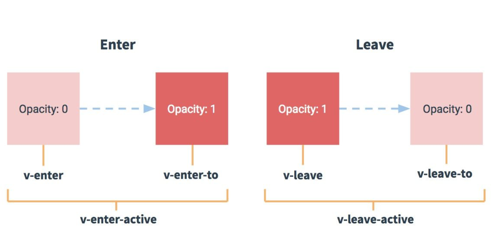

# day19

## Vue动画

Vue 提供了一些抽象概念，可以帮助处理过渡和动画，特别是在响应某些变化时。这些抽象的概念包括：

在 CSS 和 JS 中，使用内置的 `<transition>` 组件来钩住组件中进入和离开 DOM。
过渡模式，以便你在过渡期间编排顺序。
在处理多个元素位置更新时，使用 `<transition-group>` 组件，通过 FLIP 技术来提高性能。
使用 watchers 来处理应用中不同状态的过渡。

### 过渡和动画

#### 概念

过渡: 顾名思义，从一个状态向另外一个状态的过程，新的状态替换另旧的状态。说白了就是过渡
动画: 就是能经历很多状态阶段产生的效果。

#### transition标签



| 过渡类型       | 说明                                 |
| -------------- | ------------------------------------ |
| v-enter-from   | 定义进入过渡的开始状态.在元素被插入之前生效，在元素被插入之后的下一帧移除 |
| v-enter-active | 定义进入过渡生效时的状态.在整个进入过渡的阶段中应用，在元素被插入之前生效，在过渡/动画完成之后移除。这个类可以被用来定义进入过渡的过程时间，延迟和曲线函数 |
| v-enter-to     | 定义进入过渡的结束状态.在元素被插入之后下一帧生效 (与此同时 v-enter-from 被移除)，在过渡/动画完成之后移除 |
| v-leave-from   | 定义离开过渡的开始状态.在离开过渡被触发时立刻生效，下一帧被移除 |
| v-leave-active | 定义离开过渡生效时的状态.在整个离开过渡的阶段中应用，在离开过渡被触发时立刻生效，在过渡/动画完成之后移除。这个类可以被用来定义离开过渡的过程时间，延迟和曲线函数|
| v-leave-to     | 离开过渡的结束状态.在离开过渡被触发之后下一帧生效 (与此同时 v-leave-from 被删除)，在过渡/动画完成之后移除 |

```html
<!DOCTYPE html>
<html lang="en">

<head>
  <meta charset="UTF-8">
  <meta name="viewport" content="width=device-width, initial-scale=1.0">
  <title>Document</title>
  <style>
    .chart {
      width: 200px;
      height: 50px;
      background-color: hotpink;
    }

    /* 进入和离开的整个过程 */
    .v-enter-active,
    .v-leave-active {
      transition: width 3s;
    }

    /* 进入初始状态和离开的结束状态 */
    .v-enter,
    .v-leave-to {
      width: 0px;
    }

    /* 进入的结束状态和离开的开始状态 */
    .v-enter-to,
    .v-leave {
      width: 200px;
    }
  </style>
</head>

<body>
  <div id="app">
    <button @click="toggle">改变图形宽度</button>
    <hr>
    <transition>
      <!-- 设定新增过渡的div标签 -->
      <div class="chart" v-if="show"></div>
    </transition>

  </div>
  <script src="./lib/vue-3.0.0.js"></script>
  <script>
    let app = Vue.createApp({
      data() {
        return {
          show: false
        }
      },
      methods: {
        toggle() {
          this.show = !this.show;
        }
      }
    }).mount('#app');
  </script>
</body>

</html>
```

#### 自定义类名

对于这些在过渡中切换的类名来说，如果你使用一个没有名字的 `<transition>`，则 v- 是这些class名的默认前缀。如果你使用了 `<transition name="box">`，那么 v-enter-from会替换为 box-enter-from。

```html
<!DOCTYPE html>
<html lang="en">
<head>
  <meta charset="UTF-8">
  <meta name="viewport" content="width=device-width, initial-scale=1.0">
  <title>Document</title>
  <style>
    .chart{
        width: 200px;
        height: 50px;
        background-color: hotpink;
    }

    /* 进入和离开的整个过程 */
    .box-enter-active,
    .box-leave-active {
      transition: width 3s;
    }
    /* 进入初始状态和离开的结束状态 */
    .box-enter,
    .box-leave-to {
      width: 0px;
    }
    /* 进入的结束状态和离开的开始状态 */
    .box-enter-to,
    .box-leave {
      width: 200px;
    }
  </style>
</head>
<body>
  <div id="app">
    <button @click="toggle">改变图形宽度</button>
    <hr>
    <transition name="box">
      <!-- 设定新增过渡的div标签 -->
      <div class="chart" v-if="show"></div>
    </transition>
  </div>
  <script src="./lib/vue-3.0.0.js"></script>
  <script>
    let app = Vue.createApp({
      data(){
       return {
        show: true
       }
      },
      methods: {
        toggle(){
          this.show = !this.show;
        }
      }
    }).mount('#app');
  </script>
</body>
</html>
```

#### @keyframes创建CSS动画

CSS 动画用法同 CSS 过渡，区别是在动画中 v-enter-from 类名在节点插入 DOM 后不会立即删除，而是在 animationend 事件触发时删除。

```html
<!DOCTYPE html>
<html lang="en">

<head>
  <meta charset="UTF-8">
  <meta name="viewport" content="width=device-width, initial-scale=1.0">
  <title>Document</title>
  <style>
    .chart {
      position: absolute;
      top: 50%;
      left: 50%;
      margin-left: -100px;
      margin-top: -25px;
      width: 200px;
      height: 50px;
      background-color: hotpink;
    }

    /* 进入和离开的整个过程 */
    @keyframes bac {
      0% {
        transform: scale(1);
        background-color: hotpink;
      }

      50% {
        transform: scale(5);
        background-color: red;
      }

      100% {
        transform: scale(1);
        background-color: hotpink;
      }
    }

    .box-enter-active,
    .box-leave-active {
      transition: width 3s;
      animation: bac 3s;
    }

    /* 进入初始状态和离开的结束状态 */
    .box-enter-from,
    .box-leave-to {
      /* width: 0px;
      height: 0px; */
    }

    /* 进入的结束状态和离开的开始状态 */
    .box-enter-to,
    .box-leave-from {
      width: 200px;
      height: 50px;
    }
  </style>
</head>

<body>
  <div id="app">
    <button @click="toggle">改变图形宽度</button>
    <hr>
    <transition name="box">
      <!-- 设定新增过渡的div标签 -->
      <div class="chart" v-if="show"></div>
    </transition>

  </div>
  <script src="./lib/vue-3.0.0.js"></script>
  <script>
    let app = Vue.createApp({
      data() {
        return {
          show: true
        }
      },
      methods: {
        toggle() {
          this.show = !this.show;
        }
      }
    }).mount('#app');
  </script>
</body>

</html>
```

### 多个元素过渡

#### 不同标签元素过渡

不同标签元素可以使用 v-if 和 v- else 进行过渡

```html
<!DOCTYPE html>
<html lang="en">

<head>
  <meta charset="UTF-8">
  <meta name="viewport" content="width=device-width, initial-scale=1.0">
  <title>Document</title>
  <style>
   	.fade-enter,.fade-leave-to{
			opacity: 0;
		}
		.fade-enter-active,.fade-leave-active{
			transition: opacity .5s;
		}
  </style>
</head>

<body>

  <div id="app">
    <transition name="fade">
      <ul v-if="items.length > 0">
        <li>小明</li>
        <li>小红</li>
      </ul>
      <p v-else>抱歉，没有找到哦~</p>
    </transition>
  </div>
  <script src="./lib/vue-3.0.0.js"></script>
  <script>
    let app = Vue.createApp({
      data() {
        return {
          items:[1,2,3,4]
        }
      },
      mounted(){
        let that =this;
        setTimeout(function(){
          that.items.length =0;
        },5000)
      }
    }).mount('#app');
  </script>
</body>

</html>
```

#### 相同标签元素过渡

当有相同标签的元素切换时，需要通过 key 特性设置唯一值来标记。

```html
<!DOCTYPE html>
<html lang="en">

<head>
  <meta charset="UTF-8">
  <meta name="viewport" content="width=device-width, initial-scale=1.0">
  <title>Document</title>
  <style>
  /* 进入和离开的整个过程 */
  .v-enter-active,
    .v-leave-active {
      transition: all 0.5s;
    }

    /* 进入初始状态和离开的结束状态 */
    .v-enter,
    .v-leave-to {
      /* width: 0px; */
      opacity: 0;
    }

    /* 进入的结束状态和离开的开始状态 */
    .v-enter-to,
    .v-leave {
      /* width: 200px; */
      opacity: 1
    }
  </style>
</head>

<body>
    <div id="app">
      <button @click="saving=!saving">切换编辑或保存</button>
      <transition >
          <button v-if="saving" key="save">保存</button>
          <button v-else key="edit"> 编辑</button>
      </transition>
  </div>
  <script src="./lib/vue-3.0.0.js"></script>
  <script>
    let app = Vue.createApp({
      data() {
        return {
          saving: true
        }
      }
    }).mount('#app');
  </script>
</body>

</html>
```

### 多个组件过渡

### 列表过渡

#### 列表的增删过渡

```html
<!DOCTYPE html>
<html lang="en">

<head>
  <meta charset="UTF-8">
  <meta name="viewport" content="width=device-width, initial-scale=1.0">
  <title>Document</title>
  <style>
    .list-item {
      display: inline-block;
      margin-right: 20px;
      background-color: hotpink;
      border-radius: 50%;
      width: 30px;
      height: 30px;
      text-align: center;
      line-height: 30px;
      color: #fff;
    }

    .list-enter-active,
    .list-leave-active {
      transition: all 1s;
    }

    .list-enter,
    .list-leave-to {
      opacity: 0;
      transform: translateY(30px);
    }
  </style>
</head>

<body>
  <div id="app">
    <button @click="remove">随机移除一个数字</button>
    <transition-group name="list" tag="p">
      <span v-for="item in items" :key="item" class="list-item">{{item}}</span>
    </transition-group>
  </div>
  <script src="./lib/vue-3.0.0.js"></script>
  <script>
    let app = Vue.createApp({
      data() {
        return {
          items: [1, 2, 3, 4, 5],
          netNum: 6
        }
      },
      methods: {
        randomindex() {
          return Math.floor(Math.random() * this.items.length)
        },
        remove() {
          this.items.splice(this.randomindex(), 1)
        }
      }
    }).mount('#app');
  </script>
</body>

</html>
```

#### 列表的交错过渡

## 参考资料

> https://zhuanlan.zhihu.com/p/213725388