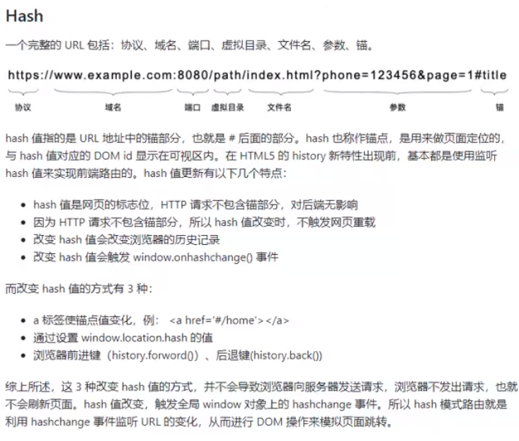

## `ref`

### 什么是 `ref` 引用

ref 被用来给元素或子组件注册引用信息。引用信息将会注册在父组件的$refs对上。如果在普通的DOM元素上使用，引用指向的就是DOM元素；如果用在子组件上，引用就指向组件

```html
    <p ref="eleP">
      Edit <code>components/HelloWorld.vue</code> to test hot module
      replacement.
    </p>
    <button @click="getDOM">获取DOM元素</button>
```

用`this.$ref` 获取

```js
  methods: {
    getDOM() {
      console.log(this.$refs.eleP);
      // 移除自身
      this.$refs.eleP.parentElement.removeChild(this.$refs.eleP);
    },
  },
```

注：Vue 实例还暴露了一些有用的实例属性与方法。它们都有前缀 `$`，以便与用户定义的属性区分开来


## `$nextTick`

在下次DOM更新循环结束之后执行延迟回调。<font color=red>在修改数据之后立即使用这个方法，获取更新后的DOM</font>

#### 应用场景

需要在视图更新之后，基于新的视图进行操作

```vue
<template>
  <div>
    <button @click="toggleEle">控制h2标签的显示和隐藏</button>
    <h2 v-if="showH2" id="two">这是h2标签</h2>
  </div>
</template>

<script>
export default {
  data() {
    return {
      showH2: false,
    };
  },
  methods: {
    toggleEle() {
      // 显示h2标签
      this.showH2 = true;
      // 此时必须使用nextTick 延迟 执行， 在下次DOM更新循环结束之后，再获取更新后的DOM
      this.$nextTick(() => {
        console.log(document.getElementById("two"));
      });
    },
  },
};
</script>
```


## 动态组件

### Component元素

在 `Vue3` 中为我们提供了一个component内置组件，该组件可以渲染一个“元组件”为动态组件。根据is的值，来决定那个组件被渲染。如果is的值是一个字符串，它既可以是HTML标签名称也可以是组件名称

<font color=red>`router-view` 就是用component实现的</font>

```vue
<template>
  <div>
    <component
      :is="toggleFlag ? 'ComTwo' : 'ComOne'"
      @click="changeFlag"
    ></component>
  </div>
</template>

<script>
import ComOne from "./components/ComOne.vue";
import ComTwo from "./components/ComTwo.vue";

export default {
  data() {
    return {
      toggleFlag: true,
    };
  },
  methods: {
    changeFlag() {
      this.toggleFlag = !this.toggleFlag;
    },
  },
  components: {
    ComOne,
    ComTwo,
  },
};
</script>

```


### keep-alive元素

keep-alive是Vue提供的一个抽象组件，主要用于保留组件状态或避免重新渲染。

<keep-alive>包裹动态组件时，会缓存不活动的组件实例，而不是销毁他们。

<keep-alive>是一个抽象组件，它自身不会渲染一个Dom元素，也不会出现在父组件链中

但是keep-alive会把其包裹的所有组件都缓存起来。

```vue
<template>
  <div>
    <!-- 切回ComOne时，ComOne数据会缓存下来 -->
    <keep-alive>
      <component
        :is="toggleFlag ? 'ComTwo' : 'ComOne'"
        @click="changeFlag"
      ></component>
    </keep-alive>
    <!-- 再来一个 -->
    <keep-alive>
      <ComTwo v-if="toggleFlag"></ComTwo>
      <ComOne v-else></ComOne>
    </keep-alive>
  </div>
</template>

<script>
import ComOne from "./components/ComOne.vue";
import ComTwo from "./components/ComTwo.vue";

export default {
  data() {
    return {
      toggleFlag: true,
    };
  },
  methods: {
    // 切换组件
    changeFlag() {
      this.toggleFlag = !this.toggleFlag;
    },
  },
  components: {
    ComOne,
    ComTwo,
  },
};
</script>

```

`ComOne.vue`

```vue
<template>
  <div>
    <h2>ComOne</h2>
    <p>{{ content }}</p>
  </div>
</template>

<script>
export default {
  data() {
    return {
      content: "111",
    };
  },
  mounted() {
    setTimeout(() => {
      this.content = "2222";
    }, 2000);
  },
};
</script>

<style>
</style>
```


## 自定义指令

```js
const derectiveHas = {
  /**
   * 所绑定元素所在页面的生命周期mounted时
   * @param {*} el 绑定的元素
   * @param {*} binding  binding.value获取指令的值
   * @param {*} vnode Vue生成的虚拟节点
   * @param {*} preVnode vue生成虚拟节点的前一个虚拟节点
   */
  mounted(el, binding, vnode, preVnode) {
    console.log(el, binding.value, vnode, preVnode);
  }
}

createApp(App).directive('has', derectiveHas).mount('#app')
```

````vue
<template>
  <div>############# TryDirective ############</div>
  <div v-has="permissions"></div>
  <div>##################################</div>
</template>

<script>
export default {
  data() {
    return {
      permissions: ["del", "add"],
    };
  },
};
</script>

<style>
</style>
````


## 路由

### 什么是路由

在web开发中，"route"是指根据url分配到对应的处理程序

原理和路由器原理相同，简单概述下：

不同的请求地址会交给路由处理来转发给相应的控制器处理

所以说路由就可以在转发前修改转发地址，


### 前端路由




