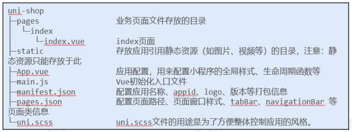
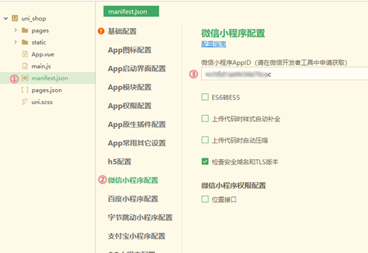
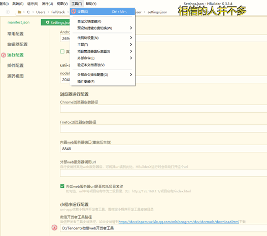
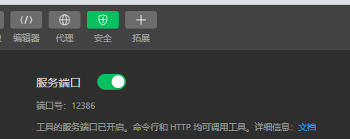

# 小程序-UniApp

### 简介

`uni-app`是一个使用Vue.js开发所有前端应用的框架。开发者编写一套代码，可发布到iOS、Android、H5、以及各种小程序（微信、支付宝、百度、头条、QQ、钉钉、淘宝）

### 下载

`uni-app`支持通过 可视化界面、vue-cli命令行，俩种方式快速创建项目。

可视化的方式比较简单，`HBuilderX` 内置相关环境，开箱即用，无需配置node.js

`HBuilderX` 是通用的前端开发工具，但为`uni-app`做了特别强化

下载App开发版，可开箱即用；

下载标准版，在运行或发行`uni-app`时，会提示安装`uni-app`插件，插件下载完成后方可使用。

### 创建项目

#### 目录解构

#### 设置项目的appID

#### 配置微信开发者工具的安装路径

#### 设置微信开发者工具

在 设置 -> 安全设置 面板中，

开启"微信开发者工具"的服务端口

并设置不使用任何代理

#### 新建页面

#### 删除默认的index首页

1. 在`HBuilderX`中，把pages目录下的index首页文件  删除掉
2. 同时，把 page.json 中记录的index首页路径删除掉
3. 为了防止小程序运行失败，在微信开发者工具中，手动删除pages目录下的index首页文件夹