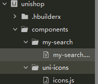

## 分类页面


​                             

## `uni.getSystemInfo()`

可以从此方法获取屏幕高度

```js
			// 获取屏幕高度
			this.wh = uni.getSystemInfoSync().windowHeight;
```


## 组件属性失效问题

```html
<scroll-view scroll-y="true" class="right-cates" :scroll-top="rightScrollTop">
</scroll-view>
```

```json
	export default {
		data() {
			return {
				// 右侧分类的滚动条位置
				rightScrollTop: 0
			};
		},
	}
```

这里的`scroll-top` 的绑定的值 默认为 0，当我们想让滚动窗口返回顶部时，修改这个 `rightScrollTop`为0时，会发现没有作用

这是因为 <font color=red>给组件修改的值和之前的旧值是一致的，所以不会同步到view层</font>

原因和props的单向数据流特性有关

所以，我们可以通过类似如下的方式去修改组件属性值，让其生效

```js
// 重置滚动条位置  
this.rightScrollTop= this.rightScrollTop==0?1:0;
```


## `easycom`

`HBuilderX 2.5.5`起支持`easycom`组件模式。

传统vue组件，需要安装、引用、注册，三个步骤后才能使用组件。`easycom`将其精简为一步。 <font color=red> 只要组件安装在项目的components目录下，并符合`components/组件名称/组件名称.vue`目录结构。就可以不用引用、注册，直接在页面中使用</font>

只要组件在这里，



`easycom`就可以自动加载组件，在页面中使用时无须引入


* 并且`easycom`打包后会自动剔除没有使用的组件
* `easycom`是自动开启的，不需要手动开启，有需求时可以在`pages.json`的`easycom`节点进行个性化设置


## flex布局（水平垂直居中）

```css
.search {
// flex布局		
display: flex;
// 主轴居中
justify-content: center;
// 侧轴居中
align-items: center;
}
```


## `sticky`定位

`position: sticky;`

使用这个样式时，必须有top/left结合使用，否则不生效，可以让搜索框粘贴固定在屏幕的某一位置

注意：用`z-index`提高层级