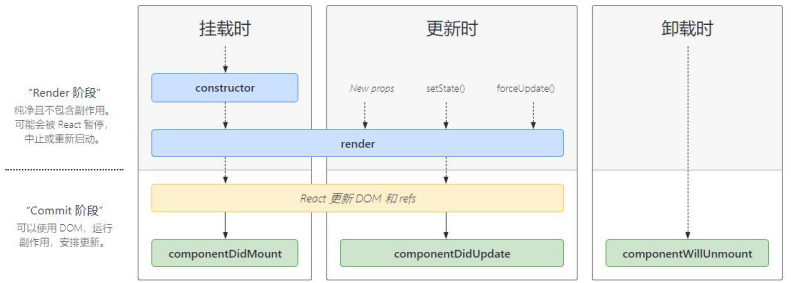

## 组件的生命周期

### 什么是生命周期

* 组件的生命周期：组件从被创建到挂载到页面中运行，再到组件不用时卸载的过程
* 意义：组件的生命周期有助于理解组件的运行方式、完成更复杂的组件功能、分析组件错误原因等
* 生命周期的每个阶段总是伴随着一些方法调用，这些方法就是生命周期的钩子函数。
* 钩子函数的作用：为开发人员在不同时机操作组件提供了机会
* 只有类组件才有生命周期

### 生命周期的阶段



#### 创建时（挂载阶段）

执行时机：组件创建时（页面加载时）

##### 执行顺序：`constructor()` → `render()` → `componentDidMount()`

##### 函数的作用：

* `constructor()` ：初始化state、为事件处理函数绑定this

* `render()`：渲染UI

* <font color=red>`componentDidMount()`</font>：组件挂载（完成DOM渲染）后执行

  作用：

  * 发送网络请求
  * 进行DOM操作

```jsx
import React from "react"

class LifeCycle extends React.Component {
  constructor() {
    super();
    console.log("组件挂载--constructor");
  }

  componentDidMount() {
    console.log("组件挂载--componentDidMount");
  }

  render() {
    console.log("组件挂载--render");
    return (
      <div></div>
    )
  }
}

// 执行顺序：
// 组件挂载--constructor
// 组件挂载--render
// 组件挂载--componentDidMount

export default LifeCycle
```


#### 更新时（更新阶段）

##### 执行时机：

* <font color=#3aafa5>`setState() `</font>
* <font color=#3aafa5>组件接收到新的props</font>
* <font color=#3aafa5>`forceUpdate()`</font>

以上三者任意一种变化，都会触发更新，重新渲染

##### 执行顺序：`render()` → `componentDidUpdate(prevProps, prevState)`

##### 函数的作用：

* `render()`：每次组件渲染都会触发

  作用：渲染UI

* <font color=red>`componentDidUpdate()`</font>：组件更新（完成DOM更新）后执行

  作用：

  * 发送网络请求
  * 进行DOM操作

  注意：<font color=red>尽量不要使用 `setState()`，如果一定要用，必须放在一个`if ` 条件中</font>


#### 卸载时（卸载阶段）

##### 执行时机：

组件从页面中消失

##### 函数的作用：

<font color=red>`componentWillUnmount()`</font>：当组件卸载时触发（从页面中消失）

作用：执行清理工作（清理定时器，解绑事件等）

### 不常用的钩子函数

#### `getSnapshotBeforeUpdate(prevProps, prevState)`

在最近一次渲染输出（提交到DOM节点）之前调用。它使得组件能在发生更改之前从DOM中捕获一些信息（例如：滚动位置）

此生命周期方法的任何返回值将作为参数传递给 `componentDidUpdate()`


## React 中 功能组件复用

如果两个组件中的部分功能相似或相同，该如何处理？

处理方式：<font color=#3aafa5>复用相似的功能</font>

复用功能需要复用那些东西？

`1.state 2.操作state的方法` <font color=#3aafa5>（组件的状态逻辑）</font>

### 方式

* <font color=red>render-props模式</font>
* <font color=red>高阶组件（HOC）</font>

注意：这两种方式不是新的API，而是利用React自身特点的 <font color=#3aafa5>编码技巧</font>，演化而成的固定模式（写法）


## render-props 模式

***通过编码技巧，实现功能复用的一种写法***

### 实现方式：

* 创建组件，在组件中<font color=red>提供复用的状态逻辑代码</font>（状态、操作状态的方法）
* 将要<font color=red>复用的状态</font>作为<font color=red> `props.render(state)` 方法的默认参数</font>，让外部传入`render`函数时可以使用
* 使用 `props.render()` 的<font color=red>返回值</font>作为要渲染的内容

### 解决什么问题

例如：当我们想使用某一功能组件 `MovePosition` 中的 同步鼠标坐标信息 的功能时，想使用此功能的组件，必须作为子组件放在 `MovePosition` 功能组件中，进而通过props使用功能组件提供的状态，这样的话，当我们有多个组件想使用此功能时，必须写两次这样的功能组件，这样就没有了功能复用的意义

* `MoveCat` 组件要使用此功能，需要写一个`MovePosition1`，将 `x、y` 坐标信息传递给子组件

```jsx
import React from "react";
// 导入想使用此功能的MoveCat组件
import MoveCat from "../MoveCat";

class MovePosition1 extends React.Component {
  // 初始化数据，记录鼠标坐标
  state = {
    x: 0,
    y: 0
  }

  // 一定要在组件挂载完成后，绑定DOM事件
  componentDidMount() {
    // 监听鼠标在窗口中的 坐标位置
    window.addEventListener("mousemove", (e) => {
      // 更新鼠标坐标数据
      this.setState({
        x: e.clientX,
        y: e.clientY
      })
    })
  }

  render() {
    return (
      <div>
        {/* 俩个组件想使用此功能时，必须写两次这样的功能组件 */}
        {/* 这样就没有功能复用的意义了 */}
        <MoveCat x={this.state.x} y={this.state.y}></MoveCat>
      </div>
    );
  }
}

export default MovePosition1;
```

* `CurPosition` 组件要使用此功能，还要再写一遍此功能 `MovePosition2`，将 `x、y` 坐标信息传递给子组件

```jsx
import React from "react";
// 导入想使用此功能的CurPosition组件
import CurPosition from "../CurPosition";

/* 还要再写一遍此功能 */
class MovePosition2 extends React.Component {
  // 初始化数据，记录鼠标坐标
  state = {
    x: 0,
    y: 0
  }

  // 一定要在组件挂载完成后，绑定DOM事件
  componentDidMount() {
    // 监听鼠标在窗口中的 坐标位置
    window.addEventListener("mousemove", (e) => {
      // 更新鼠标坐标数据
      this.setState({
        x: e.clientX,
        y: e.clientY
      })
    })
  }

  render() {
    return (
      <div>
        <CurPosition x={this.state.x} y={this.state.y}></CurPosition>
      </div>
    );
  }
}

export default MovePosition2;
```

#### 解决复用问题

在上面的情况下，我们如果想要实现 <font color=red>只写一遍功能组件，多次复用</font>的话，就要做到要让 `render()` 中要渲染的组件，可以从外面传进来（所以要用到`props`）

**解决思路：**<font color=red>使用 props</font> 去<font color=red>接收一个渲染函数</font>，调用接收到的渲染`props.render()` <font color=#c0000>return</font> 给自身的render函数，并在调用时，<font color=red>传递</font> 功能组件中实现的<font color=red>状态数据</font>作为默认参数，让外部可以使用

根据思路，改写 `MovePostion` 功能组件

```jsx
import React from "react";

// 功能组件  （提供鼠标当前坐标信息）
class MovePosition extends React.Component {
  // 初始化数据，记录鼠标坐标
  state = {
    x: 0,
    y: 0
  }

  // 一定要在组件挂载完成后，绑定DOM事件
  componentDidMount() {
    // 监听鼠标在窗口中的 坐标位置
    window.addEventListener("mousemove", (e) => {
      // 更新鼠标坐标数据
      this.setState({
        x: e.clientX,
        y: e.clientY
      })
    })
  }

  render() {
    // 想让render函数中实际返回的React元素，可以从外界传递进来
    // 那么就使用 props 去接收一个渲染函数，并传递给此渲染函数 功能组件中实现的状态数据，作为默认参数
    return this.props.render(this.state);
    // 让功能组件被使用才决定 -> 内部要渲染的内容
  }
}

export default MovePosition;
```

然后我们就可以**随意复用**此功能了

**使用时：**传入<font color=red> `render(功能组件提供的状态数据)` 渲染函数</font>，在函数内<font color=#3aafa5>返回</font> <font color=red> 要使用此功能的内容结构 / 组件</font>，并<font color=#3aafa5>使用默认参数</font>中提供的状态数据

```jsx
import React from "react"
import './App.css';
// 导入
// import LifeCycle from "./components/LifeCycle";
// 导入功能组件
import MovePosition from './components/MovePosition';
// 导入使用 功能 的组件
import MoveCat from "./components/MoveCat";
import CurPosition from "./components/CurPosition";

class App extends React.Component {

  render() {
    return (
      <div>
        {/* 多次使用此功能，用于不同组件 */}

        {/* 使用功能组件，传入render函数，函数中返回：要使用此功能的组件 */}
        <MovePosition render={(positions) => {
          return (
            // 将功能组件提供的position 传递给组件使用
            <MoveCat x={positions.x} y={positions.y} />
          )
        }}></MovePosition>

        {/* 复用 */}
        <MovePosition render={(positions) => {
          return (
            <CurPosition x={positions.x} y={positions.y} />
          )
        }}></MovePosition>
      </div>
    );
  }
}

export default App;
```

#### `props.children`

每个组件都可以获取到 `props.children`。它可以获取到<font color=red>组件的开始标签和结束标签之间的内容</font>

利用`props.children`可以直接写到组件标签内部的特性，<font color=red>不必再传render函数</font>，<font color=red>直接</font>在功能组件标签之间<font color=red>写render的函数</font>

```jsx
import React from "react"
import './App.css';
// 导入
// import LifeCycle from "./components/LifeCycle";
// 导入功能组件
import MovePosition from './components/MovePosition';
// 导入使用 功能 的组件
import MoveCat from "./components/MoveCat";
import CurPosition from "./components/CurPosition";

class App extends React.Component {

  render() {
    return (
      <div>
        {/* 利用props.children可以直接写到标签内部的特性，不必再传render函数 */}
        <MovePosition>
          {positions => {
            return (
              <MoveCat x={positions.x} y={positions.y} />
            )
          }}
        </MovePosition>

        {/* 复用 */}
        <MovePosition >
          {positions => {
            return (
              <CurPosition x={positions.x} y={positions.y} />
            )
          }}
        </MovePosition>
      </div>
    );
  }
}

export default App;
```

