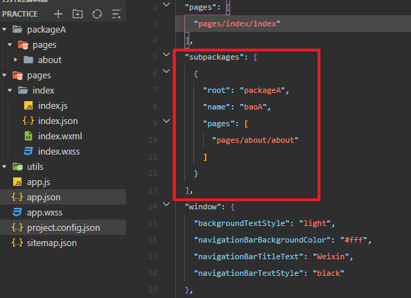

## 分包

分包指的是把一个完整的小程序项目，按照需求划分为不同的子包，在构建的时候打包成不同的分包，用户在使用时按需进行加载

### 好处：

* 可以优化小程序首次启动的下载时间
* 在多团队共同开发时可以更好的解耦协作

### 分包的加载规则

1. 在小程序启动的时候，默认会下载主包并启动主包内页面，tabBar页面需要放到主包中
2. 当用户进入分包内某个页面时，客户端会把对应分包下载下来，下载完成后再进行展示，非tabBar页面可以按照功能的不同，划分为不同的分包之后，进行按需下载

#### 目前，小程序分包的大小有以下俩个限制：

* 整个小程序所有分包大小不超过 `20M`（主包+所有分包）
* 单个分包、主包大小不能超过 `2M`

### 打包原则和引用原则

打包原则：

1. 小程序会按subpackages的配置进行分包，subpackages之外的目录将被打包到主包中
2. 主包也可以有自己的pages（即最外层的pages字段）
3. tabBar页面必须在主包内
4. 分包之间不能互相嵌套

引用原则：

1. 主包无法引用分包内的私有资源
2. 分包之间不能互相引用私有资源
3. 分包可以引用珠宝内的公共资源




### 独立分包

开发者可以按需，将某些具有一定功能独立性的页面配置到独立分包中

原因：

* 当小程序从普通的分包页面启动时，需要首先下载主包
* 而独立分包不依赖主包即可运行，可以很大程度上提升分包页面的启动速度

#### 配置方法：`"independent": true`


### 分包预下载

在进入小程序的某个页面时，有框架自动预下载可能需要的分包，从而提升进入后续分包页面时的启动速度

#### 配置

预下载分包的行为，会在进入指定的页面时触发。在`app.json`中，使用`preloadRule`节点定义分包的预下载规则

```json
  "preloadRule": {
    // 在哪个页面的时候预加载
    "pages/index/index": {
      // 网络情况
      "network": "all",
      // 预加载的包名或者包路径
      "packages": ["baoA"]
    }
  },
```


## 自定义tabBar

步骤

1. 在app.json中配置tabBar的配置信息
2. 创建tabBar自定义的组件
3. 开发tabBar代码
4. 在页面中使用

https://developers.weixin.qq.com/miniprogram/dev/framework/ability/custom-tabbar.html

### 注意：

* 自定义tabBar时，tabBar自定义组件虽然不属于页面page的一部分，但是`switchTab`切换页面时，还是会<font color=red>重新加载tabBar</font>，所以tabBar中的数据需要放到共享数据中，使用共享库来管理数据。