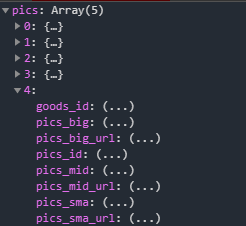

## 商品详情页


### 使用`uni.previewImage()` 方法 预览图片

预览图片时，需要传入，图片地址的数据列表

如果我们拿到的商品信息是这样的



我们可以使用`es6`的 `map` 方法 将其对象数组，转为我们需要的图片地址的字符串数组

```js
// 预览图片
uni.previewImage({
	// 图片数组，使用map方法，将图片地址组成一个新数组
	urls: this.goods_details.pics.map(value => value.pics_big_url),
	// 传入图片索引
	current: index
})
```


### 使用  `rich-text` 富文本

```html
		<!-- 商品详情介绍 start -->
		<view class="introduce">
			<rich-text :nodes="goods_details.goods_introduce"></rich-text>
		</view>
		<!-- 商品详情介绍 end -->
```

使用富文本展示节点内容时，有时候会遇到<font color=red> 图片有缝隙，图片格式与环境不匹配</font> 等问题

所以我们需要`replace`方法特殊处理节点内容，再使用

```js
// 解决商品介绍的图片显示问题
this.goods_details.goods_introduce = this.goods_details.goods_introduce.replace(/
```

```js
		data() {
			return {
				// 购物导航选项
				goodsNavOptions: [{
					icon: 'shop',
					text: '店铺'
				}, {
					icon: 'cart',
					text: '购物车',
					// 购物车数量
					info: ''
				}],
				// 购物按钮组
				buttonGroup: [{
						text: '加入购物车',
						backgroundColor: '#ff0000',
						color: '#fff'
					},
					{
						text: '立即购买',
						backgroundColor: '#ffa200',
						color: '#fff'
					}
				]
			};
		},
```


### 解决插值表达式闪烁问题

使用`uni-app`时，模板中的 `{{}}` 插值表达式，会有渲染闪烁的问题

可以使用 `v-if` 判断是否有值 来解决

```html
<view v-if="goods_details">
			<!-- 价格 -->
			<view class="infos-price">
				&yen; {{goods_details.goods_price}}
			</view>
</view>
```


## 创建共享库

如果我们需要在全局做到数据共享，并实现响应式同步

那就需要用 vuex 来创建 store 共享库，

<font color=red>而且uni-app 内置了 vuex，所以我们使用时，只需正确引入即可</font>

### 创建store

新建store文件夹，`store.js`文件

```js
// 引入vuex
import Vuex from "vuex";
// 挂载到vue上
import Vue from 'vue'
Vue.use(Vuex);
// 导入modules
import storeCart from "./storeCart.js";

// 创建共享库 并导出
export default new Vuex.Store({
	// 开启严格模式
	// 我们使用vuex中的state数据时，如果不通过mutation方法，直接去更改state值，
	// 其实也可以更改数据，甚至还可以实时响应，但是这样会导致数据追踪出问题，
	// 所以开启严格模式，让state数据必须在mutation方法下去更新，否则报错
	strict: true,
	modules: {
		// 购物车共享库
		storeCart: storeCart
	}
})
```

#### 注意：

* 使用 严格模式，让state数据必须通过mutation方法更新

### 创建 modules

创建modules时，需要开启 `namespaced:true ` 让模块成为带命名空间的模块，否则此模块只是加入到全局模块 

* 使用getters，统计出购物车商品的总数 `cart_total`
* 使用find()方法，加入购物车时，寻找购物车中是否有对应商品，如果存在：数量加一；如果不存在，新增商品

```js
export default {
	// 开启namespaced 
	// 如果希望你的模块具有更高的封装度和复用性，你可以通过添加 namespaced: true 的方式使其成为带命名空间的模块。
	// 当模块被注册后，它的所有 getter、action 及 mutation 都会自动根据模块注册的路径调整命名
	// https://vuex.vuejs.org/zh/guide/modules.html#带命名空间的绑定函数
	// 开启命名空间，可以帮助分离不同模块中的同名muations和actions
	namespaced: true,
	state() {
		return {
			// 购物车
            // 如果本地有cart数据，使用本地数据，如果本地没有数据，赋值为空数组
			cart: uni.getStorageSync('cart') || []
		}
	},
    // 使用
	getters: {
		cart_total(state) {
			let total = 0;
			// 统计商品数量，累加
			state.cart.forEach(val => {
				total += val.goods_count
			});
			
			return total;
		}
	},
	mutations: {
		/**
		 * 添加到购物车
		 * @param {Object} state 共享数据
		 * @param {Object} payload 传来的商品信息 
		 */
		addToCart(state, payload) {
			// 如果购物车中已有此商品
			// find 方法在找到元素时，会返回元素本身，否则返回undefined
			const findRes = state.cart.find(val => val.goods_id === payload.goods_id);
			if (findRes) {
				// 已有的话
				findRes.goods_count += 1;
			} else {
				// 没有的话，添加
				state.cart.unshift(payload);
			}
			// 同步购物车信息到本地
			this.commit("storeCart/saveToStorage");
		},
		/**
		 * 将购物车中的信息持久化
		 */
		saveToStorage(state) {
			uni.setStorageSync("cart", state.cart);
		}
	}
}

```

#### 实现共享数据持久化

* 在mutations方法中添加一个同步到本地的方法 `saveToStorage`

* 方法中 使用 `setStorage()` 将 state中的数据存储到 本地

* 在每次更新相关数据时，使用 `this.commit('指定命名空间模块', "saveToStorage")` 保存 <font color=red>注意：不能使用 `this.saveToStorage`</font>

* 实现数据持久化后，就可以在state中，使用 `getStorage()` 方法，来初始化共享库中的数据了

  ```js
  	state() {
  		return {
  			// 购物车
              // 如果本地有cart数据，使用本地数据，如果本地没有数据，赋值为空数组
  			cart: uni.getStorageSync('cart') || []
  		}
  	},
  ```


### 在页面中使用 `store` 共享库的数据

* 使用computed和`mapState()`等方法，映射数据或方法

  ```js
  		computed: {
              // 没有开启命名空间以前的方式
  			// ...mapState({num: (state)=>state.storeCart.count})
              
              // 开启命名空间以后的方式
  			// 或者 在对应module开启命名空间（namespaced: true）的条件下，这样获取数据
  			...mapGetters("storeCart", ['cart_total'])
  		},
  ```

* 映射之后，我们需要在data的配置数据中使用 `cart_total` 数据，来显示购物车徽章信息

  但是data中无法使用computed的数据

  所以，我们需要使用 <font color=red>watch方法进行监听-->修改配置中的info，并使用 `immediate: true` 实现一进入页面立即执行</font>，实现首次渲染

  ```js
  		data() {
  			return {
  				// 购物导航选项
  				goodsNavOptions: [{
  					icon: 'shop',
  					text: '店铺'
  				}, {
  					icon: 'cart',
  					text: '购物车',
  					// 购物车数量 徽章
  					info: ''
  				}]
  			};
  		},
  		watch: {
  			// 监听 购物车中商品的总数
  			cart_total: {
  				// 立即执行
  				immediate:true,
  				handler(newVal) {
  					// 找到购物车索引
  					const index = this.goodsNavOptions.findIndex(val=>val.text==='购物车')
  					// 更新购物车徽章
  					this.goodsNavOptions[index].info = newVal;
  				}
  			}
  		}
  ```

#### 总结：

* 有时，我们在 **共享库中的数据** 需要在 data中使用，但是数据是computed来的，所以，我们需要使用`watch+immediate` 通过监听同步到 data 数据中


