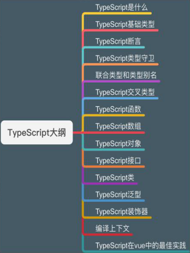
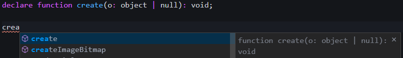
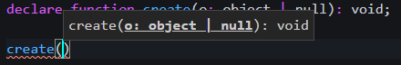

# TypeScript



TS可以使项目更加工程化

## TypeScript 简介

### 为什么要学习TypeScript

是一种由微软开发的自由和开源的编程语言。

是JavaScript的一个<font color=red>超集</font>，而且本质上向这个语言<font color=red>添加了可选的静态类型和基于类的面向对象编程</font>。

因为JavaScript是弱类型，很多错误只有在运行时才会被发现。

而TypeScript是<font color=red>强类型</font>，它提供了一套<font color=red>静态检测机制</font>，可以帮助我们<font color=red>在编译时就发现错误</font>。

学习它可以让我们的<font color=red>代码更加健壮</font>，减少团队的无效沟通

### TypeScript 是什么

我们编写好的TS代码最终都会编译成JS

### TypeScript 和 Javascript 的区别


### 安装

```shell
npm install -g typescript
// typescript complie 编译器
tsc -v
```

### 编译

```shell
tsc 文件名

# 还可以使用
tsc 文件名 -w
# 进行监听式编译

# 或者在一个有tsconfig.json配置文件的项目中
tsc -w
```

### 声明变量和函数

```typescript
// ts文件中同样可以写js
// let a = 10;
// let b = false;
// let c = "您好";

// console.log(a, b, c);

// 声明一个变量
// 语法：关键字 变量名:数据类型 = 值
let num: number = 10;
// num = "ls" 报错

// 声明一个函数
/**
 * 
 * @param a 任意元素数组
 * @param b 数字
 */
function aler(a: any[], b: number) {
  console.log(a.length + 10);
}

aler([1], 2);
```


## TypeScript 基本类型

### 介绍

为了让程序有价值，我们需要能够处理最简单的数据单元：数字，字符串，结构体，布尔值等。 TypeScript支持与JavaScript几乎相同的数据类型，此外还提供了实用的枚举类型方便我们使用。

#### 布尔值

```ts
// 布尔
let flag: Boolean = true;
```


#### 数字

``` ts
// 数字
let num: Number = 10;
let num1: Number = 0b10001; // 二进制
let num2: Number = 0x001; // 16进制
```

编译结果

``` js
// 数字
var num = 10;
var num1 = 17; // 二进制
var num2 = 0x001; // 16进制
```


#### 字符串

``` ts
// 字符串
let str: String = "abcd";
// 可以使用模板字符串
let str2: String = `${str}+abcd`
```

编译结果

```js
// 字符串
var str = "abcd";
// 可以使用模板字符串
var str2 = str + "+abcd";
```


#### 数组

``` ts
// 数组
// 方式一：在元素类型后面接上 []
// 表示由此类型元素组成的一个数组
let arr: Number[] = [1, 2, 3];
// 方式二：使用数组泛型, Array<元素类型>
let arr1: Array<String> = ['1', '2', '3'];
```

编译结果

``` js
// 数组
// 方式一：在元素类型后面接上 []
// 表示由此类型元素组成的一个数组
var arr = [1, 2, 3];
// 方式二：使用数组泛型, Array<元素类型>
var arr1 = ['1', '2', '3'];
```


#### 元组

元组类型允许表示一个已知元素数量和类型的数组，<font color=red>各元素的类型不必相同</font>

```ts
// 元组 Tuple
// 正确
let tuple: [String, Number] = ['100', 11];
// 错误
// let tuple2: [String, Number] = [100, '11'];
```

编译结果

```js
// 元组 Tuple
// 正确
var tuple = ['100', 11];
// 错误
// let tuple2: [String, Number] = [100, '11'];
```


#### 枚举

`enum`类型是对JavaScript标准数据类型的一个补充，像C#等其它语言一样，使用枚举类型可以为一组数值赋予友好的名字

枚举项的值底层是数值类型，所以赋值一个数值不会报错，这个值可以打印

```ts
// 枚举
enum Color { Red, Green, Blue };
console.log(Color.Red); // 0  默认是从 0 开始
console.log(Color[0]); // Red

// 或者，我们可以手动改成从 2 开始编号
enum Colors { Red = 2, Green, Blue };
console.log(Colors.Green); // 3

// 也可以全部手动赋值
console.log(Colors);
// {2: "Red", 3: "Green", 4: "Blue", Red: 2, Green: 3, Blue: 4}

//---------------------------------
// 枚举 （从中间赋值）
enum Color { Red, Green = 2, Blue };
console.log(Color);
// { '0': 'Red', '2': 'Green', '3': 'Blue', Red: 0, Green: 2, Blue: 3 }
// 使用
let bgColor: Color = Color.Green;
console.log(Color.Red); // 0
console.log(Color.Green); // 2
console.log(Color.Blue); // 3
```

编译结果

```js
// 枚举
var Color;
(function (Color) {
    Color[Color["Red"] = 0] = "Red";
    Color[Color["Green"] = 1] = "Green";
    Color[Color["Blue"] = 2] = "Blue";
})(Color || (Color = {}));
;
console.log(Color.Red); // 0  默认是从 0 开始
console.log(Color[0]); // Red
// 或者，我们可以手动改成从 2 开始编号
var Colors;
(function (Colors) {
    Colors[Colors["Red"] = 2] = "Red";
    Colors[Colors["Green"] = 3] = "Green";
    Colors[Colors["Blue"] = 4] = "Blue";
})(Colors || (Colors = {}));
;
console.log(Colors.Green); // 3
// 也可以全部手动赋值
console.log(Colors);
// {2: "Red", 3: "Green", 4: "Blue", Red: 2, Green: 3, Blue: 4}
```


#### Any

有时候，我们会想要为那些在编程阶段还不清楚类型的变量指定一个类型。这些值可能来自于动态的内容，比如来自用户输入或第三方代码库。

这种情况下，我们不希望类型检查器对这些值进行检查而是直接让它们通过编译阶段的检查，那么我们可以使用any类型来标记这些变量

```ts
// Any
let notSure: any = 4;
console.log(notSure.toFixed(2));

notSure = "true";
console.log(notSure.indexOf("r"));

// 数组里使用
let list: any[] = [1, true, "free"];
console.log(list);
```

编译结果

```js
// Any
var notSure = 4;
console.log(notSure.toFixed(2));
notSure = "true";
console.log(notSure.indexOf("r"));
// 数组里使用
var list = [1, true, "free"];
console.log(list);
```


#### 更正

基础类型的声明都用 小写


#### Void

表示没有任何类型，当一个函数没有返回值时，你通常会见到其返回值类型是void

```ts
// void
function fn1(): void {
  // 只能返回 undefined 和 null
  return undefined;
}
```


#### Null 和 Undefined

默认情况下 `null` 和 `undefined` 是所有类型的子类型，就是说你可以把 `null` 和 `undefined` 赋值给 `number` 类型的变量

```typescript
// Null 和 Undefined
let u: undefined = undefined;
let n: null = null;

// 在非严格模式下，null 和 undefind的字面量可以赋值给 任意类型的变量
let num: number = null;
let str: string = undefined;
```

##### 注意：

在严格模式下，undefined类型的值只能是undefined

同理，null类型的值只能是null

在非严格模式下，不区分undefined和null，他们被ts归为一类


#### Unknown类型

```ts
// unknow 类型 和 any 类型一样，同样是顶级类型
// unknow代表未知类型
let a: unknown;
a = 5;
a = true;
// unknown 类型只能赋值给any类型和unknown类型本身
let c: unknown = a;
```


#### Never

`never`类型表示的是那些永不存在的值的类型

用来告知编译器某处代码永远不会执行,从而获得编译器提示

```ts
// Never
let nev: never;
// 遇到一个联合类型时
// 可以使用 never 收窄类型
```


#### Object

Object 表示非原始类型，也就是除了 number, string, boolean, symbol, null或undefined之外的类型

```js
let o: object = { prop: 0 };
```

例如，当我们引入外界的一些API时，我们使用这些API时，是没有提示信息，那么我们可以使用 `declare` 声明此函数的参数返回值信息

注意：<font color=red>`declare` 声明后的函数、变量，不会出现在编译后的 js代码中，只起到声明，并且让我们的编辑器有提示的作用</font>

实际情景：例如我们引入jQuery时

```ts
// 从外界引入一个create方法API，但是我们不知道create如何使用，所以使用declare声明函数信息
declare function create(o: object | null): void;

// 使用此API时就可以看到如下图编辑器的提示信息
create({ name: 'dong' });
create(null);
```






#### 类型断言

<font color=red>用来覆盖 TypeScript 的类型推断</font>

有时候你会遇到这样的情况，你会比TypeScript更了解某个值的详细信息。通常这会发生在你清楚地知道一个实体具有比它现有类型更确切的类型。

通过类型断言这种方式可以告诉编译器，“相信我，我知道自己在干什么”。类型断言好比其他语言里的类型转换，但是不进行特殊的数据检查和解构。它没有运行时的影响，只是在编译阶段起作用。

<font color=red>使用 `尖括号 / as` 断言语法，即可避免编译报错</font>

```ts
// 类型断言
let someValue: unknown = "10";

// 因为someValue类型未知，所以使用length属性时会报错
// let strLength: number = someValue.length;  // 报错

// 尖括号语法
let strLength: number = (<string>someValue).length;  // okay

// as语法 （重要）
let strLength1: number = (someValue as string).length; // okay


console.log(strLength, strLength1);  // 2 2
```


#### 确定赋值断言

允许在<font color=red>实例属性和变量声明后面放置一个!号</font>，从而告诉TypeScript该属性会被明确的赋值

```ts
let num: number;
getNum(2);
console.log(num * 2);  // 报错 Variable 'num' is used before being assigned.
// 编译器会认为未赋值前使用

function getNum(count: number) {
  num = count;
}
```

```ts
// 在变量声明后面放置一个!号， 断言此变量一定会赋值
let num!: number;
getNum(2);
console.log(num * 2);  // 4   okay

function getNum(count: number) {
  num = count;
}
```


#### 非空断言

在上下文中当类型检测器无法断定类型时，一个新的后缀表达式操作符 `|` 可以用户断言操作对象是非 null 和 非 undefined 类型。具体而言，`x!` 将从 x 值域中（可以且只可以）排除 null 和 undefined

```ts
// 非空断言
// 例一
let x: undefined | string;
changeX()
let res: string = x!;
function changeX() {
  x = '1';
}

// 例二
function fn1(str: string | null | undefined) {
  // let res: string = str; // 报错 Type 'undefined' is not assignable to type 'string'.
  let res: string = str!; // okay 
}
```

