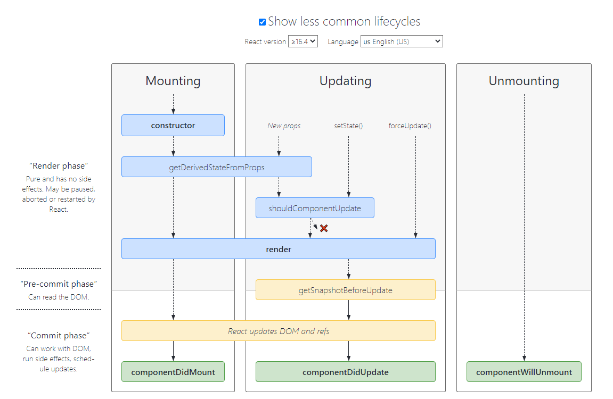

## 高阶组件（HOC）

<font color=red>用来复用功能</font>

### 什么是高阶组件

##### 本质：实际上就是一个<font color=red>函数</font>，这个函数能够<font color=red>接收</font>一个<font color=red>参数组件</font>，然后，<font color=red>返回</font>一个<font color=red>增强后的组件</font>

* 参数组件：就是需要被包装的组件，这个组件中可以<font color=#51b1ff>通过props来接收</font>到<font color=#51b1ff>复用的状态逻辑</font>的

* 返回的组件：增强后的组件

#### 创建高阶组件

```jsx
import React from "react";

// 创建一个高阶组件 （with开头）

/**
 * 带有 鼠标坐标位置 的功能 的高阶组件
 * @param {*} WrappedComponent 准备被包装的组件
 * @returns 包装过的新组件（增强后的组件）
 */
const withMousePosition = (WrappedComponent) => {
  // 内部声明一个 提供功能 的组件
  class MovePosition extends React.Component {
    state = {
      x: 0,
      y: 0
    }

    componentDidMount() {
      window.addEventListener("mousemove", (e) => {
        this.setState({
          x: e.clientX,
          y: e.clientY
        })
      })
    }

    render() {
      // 组件最终渲染的内容 由 传入的组件决定，但是带有高阶组件中提供的状态功能
      return <WrappedComponent {...this.state}></WrappedComponent>
    }
  }

  // 返回 增强后的组件
  return MovePosition;
}


// 导出 高阶组件  让其它组件使用
export default withMousePosition;
```

#### 使用高阶组件

```jsx
// 导入 高阶组件
import withMousePosition from "../MovePosition"

// 创建一个函数组件
function CurPosition(props) {
  // 组件中通过props 使用高阶组件提供的功能（可复用的状态逻辑）
  return (
    <div>坐标位置{props.x}--{props.y}</div>
  )
}

// 使用 高阶组件 包装 普通的函数组件，然后导出
export default withMousePosition(CurPosition);
```

#### 给高阶组件添加 `displayName`

`displayName`：用于<font color=red>设置 `react-dev-tools` </font>(浏览器中的react调试插件) 中组件的<font color=red>展示名字</font>

##### 注意：

* 该属性仅仅用于设置展示名称，并不会对组件功能产生影响，所以，如果不想在 `react-dev-tools` 中进行区分，实际上，可以省略该设置

```jsx
function withMousePosition(WrappedComponent) {
  class withMousePosition extends React.Component {/* ... */}
    
  // 设置 displayName
  WithSubscription.displayName = `WithSubscription(${getDisplayName(WrappedComponent)})`;
    
  return withMousePosition;
}

// 使用组件本身的displayName
function getDisplayName(WrappedComponent) {
  return WrappedComponent.displayName || WrappedComponent.name || 'Component';
}
```


### 给高阶组件传递属性

当我们使用高阶组件时，我们有时需要给<font color=#49bc84>被包装的组件</font>传递一些数据 `props`，但是 <font color=#49bc84>直接</font>在包装后的组件标签上传递属性时，<font color=red>`props`其实只是被<font color=#49bc84>高阶组件</font>拿到了</font>，但是<font color=red>没有</font>被高阶组件中的被包装组件拿到，所以，我们要<font color=#49bc84>在高阶组件中</font>，<font color=red>将接收到的 `props` 透传</font>给 <font color=#49bc84>被包装的组件</font>，这样，被包装的组件中才能使用外部传来的 `props`

##### 目的：<font color=#d45fd3>防止props丢失问题</font>（让被包装组件可以使用外部传来的props）

```jsx
// 创建一个高阶组件 （with开头）
const withMousePosition = (WrappedComponent) => {

  class MovePosition extends React.Component {
    .....

    render() {
      // 将 this.props 高阶组件收到的 props 透传给 被包装组件
      return <WrappedComponent {...this.state} {...this.props}></WrappedComponent>
    }
  }

  // 返回 增强后的组件
  return MovePosition;
}
```


## `setState()` 的说明

### 更新数据

* `setState()` 是<font color=red>异步</font>更新数据的
* 注意：使用该语法时，后面的 `setState()` 不要依赖于前面的 `setState()`
* 可以多次调用 `setState()` ，<font color=red>只会触发一次渲染</font>

```jsx
import React from "react";

class SetStateCom extends React.Component {
  state = {
    num: 0
  }

  componentDidMount() {
    this.setState({
      num: this.state.num + 1
    })
    // num: 0
    this.setState({
      num: this.state.num + 1
    })
    // num: 0
    this.setState({
      num: this.state.num + 1
    })
    // num: 0
  }

  render() {
    console.log(this.state.num); // 1
    console.log("只触发了一次更新渲染");

    return (
      <div>{this.state.num}</div>
    )
  }
}

export default SetStateCom;
```


### 推荐语法

推荐使用语法：

```jsx
this.setState((state,props)=>{
    return {
        ....
    }
})
```

* 参数state：表示 **最新的state**
* 参数props：表示 **最新的props** 

```jsx
import React from "react";

class SetStateCom extends React.Component {
  state = {
    num: 0
  }

  componentDidMount() {
    this.setState((newState, newProps) => {
      return {
        num: newState.num + 1
      }
    })
    // num: 1
    this.setState((newState, newProps) => {
      return {
        num: newState.num + 1
      }
    })
    // num: 2
    this.setState((newState, newProps) => {
      return {
        num: newState.num + 1
      }
    })
    // num: 3
  }

  render() {
    console.log("同样只触发了一次更新渲染");

    return (
      <div>{this.state.num}</div>
    )
  }
}

export default SetStateCom;
```


### `setState()`的 第二个参数 

<font color=red>状态更新完成后，立即执行的回调函数</font>

**场景：**在状态更新（页面完成重新渲染）后立即执行某个操作

**语法：**<font color=red>`this.setState(updater, [callback])`</font>

```jsx
this.setState((state,prop)=> {}, ()=>{})
```


## JSX语法的转化过程

* JSX 仅仅是 `createElement()` 方法的<font color=#d44fbd>语法糖</font>（简化语法）
* JSX 语法被 `@babel/preset-react` 插件编译为 `createElement()` 方法，进而生成 React 元素
* React 元素：是一个对象，用来描述你希望在屏幕上看到的内容

## 组件更新机制

* `setState()` 两个作用：<font color=red>修改state、更新组件UI</font>
* 过程：父组件重新渲染时，也会重新渲染子组件。但只<font color=red>会渲染当前组件子树</font>（当前组件及其所有子组件）


## 组件性能优化

### 减轻state

* 减轻 state：<font color=red>只存储</font>跟组件<font color=red>渲染相关的数据</font>（影响视图层的数据）
* **注意：**
  * 不用做渲染的数据不要放在 state中，比如定时器id等
  * 对于需要在<font color=#51b0fe>多个方法中用到的数据</font>，应该<font color=#51b0fe>放在this中</font>


### 避免不必要的重新渲染

由于组件更新机制：父组件更新会引起子组件也被更新

所以造成问题：子组件没有任何变化时，也会重新渲染

##### <font color=red>如何避免</font>不必要的重新渲染呢？

使用下图中的 钩子函数<font color=red> `shouldComponentUpdate(nextProps, nextState)`</font>

##### 触发时机：更新阶段的钩子函数，在组件重新渲染（`render()`）前执行

 `shouldComponentUpdate(nextProps, nextState)` 的<font color=red>返回值</font> 可以 决定该组件<font color=red>是否重新渲染</font>，返回 `true` 表示重新渲染，false 表示不重新渲染

所以，<font color=#fd4236>我们在 `shouldComponentUpdate` 中比较数据是否发生变化，去决定组件是否重新渲染，就可以做到性能优化</font>

https://projects.wojtekmaj.pl/react-lifecycle-methods-diagram/




### 纯组件 -- `PureComponent`

##### 和 `React.Component` 区别：

* `PureComponent` 内部<font color=red>自动实现了 `shouldComponentUpdate` 钩子</font>，不需要手动比较

##### 原理：

* 纯组件内部通过 对比 前后两次 `props` 和 `state` 的值，来决定是否重新渲染组件

##### 注意：

* 纯组件内部的对比是<font color=red> `shallow compare` （浅层对比）</font>
* 所以 state 和 props 中属性值为引用类型的 状态，应该创建新数据<font color=blue>重新赋值</font>，不要直接修改原数据（否则会造成纯组件中的浅层对比，检查不出数据的变化）


