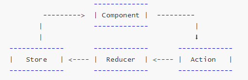

## Redux

### 为什么要学习Redux

React是一个用于构建用户界面的Javascript库，并不是Web应用的完整解决方案

关于如何组织代码、如何完成组件之间的通信，React解决的并不是很好，对于大型复杂的应用来说，这两反面恰恰是关键。因此，只用React是没法开发大型且复杂的应用的。

为了解决这个问题，2014年Facebook提出了Flux架构的概念。

2015年，Redux出现，将Flux与函数式编程结合在一起，成为了当下最热门的前端架构。

所以，当应用程序复杂的时候，如果我们想要很好的管理、维护、追踪、控制状态(数据)时，我们就需要使用Redux

### Redux是什么

Redux是JavaScript状态管理的容器，提供了可预测化的状态管理

可以让你构建一致化的应用，运行于不同的环境（客户端、服务器、原生应用），并且易于测试。不仅于此，它还提供了很好的开发体验。

Redux 除了和 React一起用外，还支持其它界面库（Vue），它体小精悍（只有2kB）

#### 设计思想：

* Web应用是一个状态机，视图与状态是一一对应的
* 所有的状态，集中保存在一个对象里面


### 什么是可预测的状态管理

就是：数据在什么时候，因为什么，发生了什么改变，都是可以控制和追踪的

###  Redux的应用场景

1. 某个组件的状态，需要共享
2. 某个状态需要在任何地方都可以拿到
3. 一个组件需要改变全局状态
4. 一个组件需要改变另一个组件的状态

### Redux核心理念

* 通过 store 来保存数据
* 通过 action 来修改数据
* 通过 reducer 将store和action串联起来 

 


### Redux 三大原则

#### 单一数据源

1. 整个应用程序的state只能存储在一个store中
2. Redux并没有强制让我们不能创建多个Store，但是那样做并不利于数据的维护
3. 单一的数据源可以让整个应用程序的state变得方便维护、追踪、修改

#### State是只读的

* 唯一修改State的方法一定是触发action，不要试图在其他地方通过任何的方式修改State
* 这样就确保来视图或网络请求都不能直接修改state，他们只能通过action来描述自己想要如何修改state
* 这样可以保证所有的修改都被集中化处理，并且严格按照顺序来执行，所以不需要担心 `race condition` 的问题

#### 使用纯函数来执行修改

* 通过reducer将旧state和action联系在一起，并且返回一个新的state
* 随着应用程序的复杂度增加，我们可以将reducer拆分成多个小的reducers，分别操作不同state tree的一部分
* 但是所有的reducer都应该是纯函数，不能产生任何副作用

#### 纯函数

##### 定义：

* 如果函数的调用参数相同，则永远返回相同的结果。它不依赖于程序执行期间函数外部任何状态或数据的变化，必须只依赖于其输入参数。
* 该函数不会产生任何可观察的副作用，例如网络请求，输入和输出设备或数据突变（mutation）。

这就是纯的函数。 如果一个函数符合上述 2 个要求，它就是纯函数。 

##### 什么是可观察的副作用

  一个可以被观察的副作用是在函数内部与其外部的任意交互。这可能是在函数内修改外部的变量，或者在函数里调用另外一个函数等。

  注: 如果纯函数调用纯函数，则不产生副作用依旧是纯函数。
  副作用来自，但不限于：

1. 进行一个 HTTP 请求
2. Mutating data
3. 输出数据到屏幕或者控制台
4. DOM 查询/操作
5. Math.random()
6. 获取的当前时间

副作用本身并不是毒药，某些时候往往是必需的。 但是，对于要保持纯粹的函数，它不能包含任何副作用。当然，并非所有函数都需要是纯函数。

##### 纯函数的例子

以下是一个计算产品税后价格（英国税率是20%）的纯函数的例子：

```js
function priceAfterTax(productPrice) { return (productPrice * 0.20) + productPrice;}
```

它符合我们所说的两条纯函数的定义。不依赖于任何外部输入，不改变任何外部数据、没有副作用。
即使你用同样的输入运行运行这个函数 100,000,000 次它依旧产生同样的结果。

##### 非纯函数的例子

我们已经看了纯函数的例子，现在一起来看一个非纯函数（Impure function）的 JavaScript 例子:

```js
var tax = 20;
function calculateTax(productPrice) {
    return (productPrice * (tax/100)) + productPrice;
}
```

其中函数的计算结果取决于外部 tax 变量，而纯函数不能依赖外部变量。它没有满足定义中的第一个要求，因此这个函数是不纯的。


### 简单使用Redux

```js
// 引入redux
const redux = require("redux");

// 创建初始化状态
const initialState = {
  count: 0,
  aaaa: 1
}

// 创建 action （修改数据）
const editCount = (newCount) => ({ type: "Edit_COUNT", count: newCount })


/**
 * 创建 reducer  串联 数据和action
 * reducer会在创建时，执行第一遍，初始化数据
 * @param {*} state 现在的数据状态
 * @param {*} action 
 * @returns 
 */
function reducer(state = initialState, action) {
  console.log("==============");
  console.log(state);
  switch (action.type) {
    // 匹配action类型
    case "Edit_COUNT":
      // 修改数据
      return { ...state, count: action.count };
    default:
      return state;
  }
}

// 创建store 
// 参数是固定的 reducer
const store = redux.createStore(reducer);


// 获取数据
// console.log(store.getState());  // { count: 0, aaaa: 1 }

// 修改数据
store.dispatch(editCount(2))
console.log(store.getState());  // { count: 2, aaaa: 1 }

// 监听数据（订阅：subscribe）
store.subscribe(() => {
  console.log("000000000000000");
})
```


### 项目中使用

* 创建 `store` 文件夹
* 创建文件：
  * `store.js` 创建共享库，应用中间件
  * `reducer.js` 存放初始数据，reducer处理函数
  * `action.js` 编写action函数，导出
  * `constants.js` 存放action.type常量字符串，导出