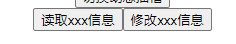

### 组件缓存

目标：组件切换会导致组件被频繁销毁和重新创建，性能不高，而且不可以缓存状态

推荐使用：`component + keep-alive`

```vue
    <!-- ------keep-alive 和 内部组件的 activated + deactivated 钩子函数结合使用----- -->
    
    <keep-alive>
      <component :is="comName"></component>
    </keep-alive>
    <!-- ------keep-alive 和 内部组件的 activated + deactivated 钩子函数结合使用----- -->


<script>
import WorldCom from "./components/HelloWorld.vue";
import EarthCom from "./components/HelloEarth.vue";

export default {
  name: "App",
  data() {
    return {
      comName: "HelloWorld",
    };
  },
  components: {
    // 读取动态组件名
    [WorldCom.name]: WorldCom,
    [EarthCom.name]: EarthCom,
  },
};
</script>
```


### 插槽

* 默认插槽
* 具名插槽
* 作用域插槽
* 动态插槽

`SlotCom.vue`

```vue
<template>
  <div>
    <!-- 动态插槽名 -->
    <div style="color: orange">
      <slot name="dynamicTwo"></slot>
    </div>

    <!-- 默认插槽 -->
    <div style="color: red">
      <slot></slot>
    </div>

    <!-- 具名插槽 -->
    <div style="color: green">
      <slot name="named"> </slot>
    </div>

    <!-- 作用域插槽 -->
    <div style="color: blue">
      <slot name="scope" :data="scopeData"></slot>
    </div>

    <!-- 动态插槽名 -->
    <div style="color: yellow">
      <slot name="dynamicOne"></slot>
    </div>
  </div>
</template>

<script>
export default {
  data() {
    return {
      scopeData: {
        str: "作用域插槽（让使用插槽的人可以使用插槽内部的数据）",
      },
    };
  },
};
</script>

<style>
</style>
```

`App.vue` 使用插槽

```vue
<template>
  <div>
    <!-- ------------------ 插槽 start ---------------------- -->
    <SlotCom>
      <!-- 默认插槽 start -->
      默认插槽
      <!-- 默认插槽 end -->

      <!-- 具名插槽 start -->
      <template v-slot:named>具名插槽</template>
      <!-- 具名插槽 end -->

      <!-- 作用域插槽 start -->
      <template v-slot:scope="scope">{{ scope.data.str }}</template>
      <!-- 作用域插槽 end -->

      <!-- 动态插槽 start  # 代替 v-slot -->
      <template #[dynamicName]>动态插槽</template>
      <!-- 动态插槽 end -->
    </SlotCom>
    <button
      @click="
        dynamicName = dynamicName == 'dynamicOne' ? 'dynamicTwo' : 'dynamicOne'
      "
    >
      切换动态插槽
    </button>
    <!-- ------------------ 插槽 end ---------------------- -->
  </div>
</template>

<script>
import SlotCom from "./components/SlotCom";

export default {
  name: "App",
  data() {
    return {
      dynamicName: "dynamicOne",
    };
  },
  components: {
    SlotCom,
  },
};
</script>

<style>
</style>

```


### 自定义指令

用来让 **被绑定元素**  在生命周期的<font color=red>某些时刻</font>，执行某些DOM操作等等

```js
// register
app.directive('my-directive', {
  created() {},
  beforeMount() {},
  mounted() {},
  beforeUpdate() {},
  updated() {},
  beforeUnmount() {},
  unmounted() {}
})
```

##### `Vue2` 的钩子函数和现在的很不同

* `bind` 绑定到元素时调用
* `inserted` 插入父节点时调用
* `update` 组件实例更新
* `componentUpdated` 
* `unbind` 解绑时调用

#### 提供的参数

* `el` 绑定的Dom元素

* `binding`

  * <font color=red>`instance`</font>  组件实例（可用于 **获取 数据状态** 等操作）

  * <font color=red>`value`</font> 传递给指令的值

  * `oldValue` 上次的值

  * <font color=red>`arg` </font> 传递给指令的参数

  * `modifiers` 一个包含修饰器的对象

    ```vue
    <!-- 这里sss就是一个修饰器，modifiers: {sss: true} -->
    <div v-has.sss></div>
    ```

  * `dir` 定义指令的对象

* `vnode`

  真实DOM元素的蓝图

* `prevNode`

  之前的虚拟节点，只能在 `update` 相关钩子函数中使用。

```vue
<template>
  <div>
    <button v-has:[xxx]="'读取权'">读取</button>
    <button v-has:[xxx]="'删除权'">删除</button>
    <button v-has:[xxx]="'修改权'">修改</button>
  </div>
</template>

<script>
export default {
  data() {
    return {
      permissions: ["修改权", "读取权"],
      xxx: "xxx信息",
    };
  },
  directives: {
    has: {
      created(el, binding) {
        // 获取参数数据，添加到元素中
        el.innerText += binding.arg;
        // binding.instance   当前组件实例
        if (!binding.instance.permissions.includes(binding.value)) {
          // 没有当前权限，隐藏按钮
          el.style.display = "none";
        }
      },
    },
  },
};
</script>

<style>
</style>
```

最后经过指令处理，渲染结果：

 

