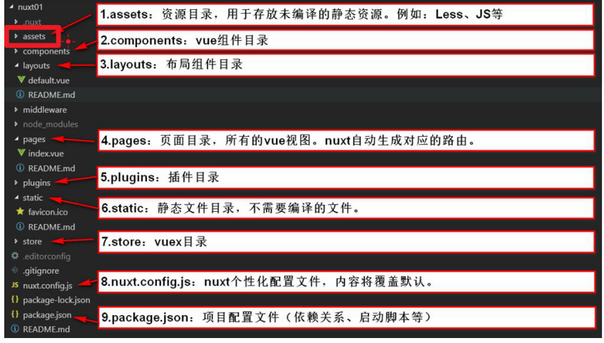

# Nuxt

## 客户端和服务端渲染

### 客户端渲染

`JS` 代码是在浏览器中运行的


##### 优点：

* 代码在客户的浏览器中运行，所以消耗的是客户的CPU和内存等资源，减轻服务器的压力

##### 缺点：

* 页面中没有初始数据（查看页面源代码可以看到并没有数据），所以 **不利于SEO优化**

##### 原因：

* 查看源代码时，看不到渲染出来的数据，因为：数据是 js 运行之后渲染出来的，所有页面中是没有初始数据的

### 什么是SEO

<font color='red'>搜索引擎优化</font>

#### 原理

通过 “爬虫” 的程序来抓取每个页面的数据，但是注意它抓取时页面并<font color='red'>不会执行`JS`</font>，所以对于前面的页面，搜索引擎抓取不到任何数据，就无法再搜索引擎中搜索出来


##### 如何让网站排名考前

* SSR（服务器端渲染）<font color='red'>让我们的数据在一开始的页面结构中体现出来</font>
  * 百度有一个爬虫系统，会自动从网站中抓取网页到他们的数据库（不会执行JS代码）
  * 当有人在百度中搜索时，会到数据库中找出相应的网页显示

### 服务端渲染（SSR: ServerSide Render）

#### 用途：

* 解决SEO

Nuxt的实现原理，<font color='orange'>其实就是模拟了一个服务端把Vue框架的代码执行完，然后返回给客户的浏览器</font>


## Nuxt 是什么

是一个基于 `Vue.js` 的通用应用框架

通过对客户端、服务端基础架构的抽象组织，`Nuxt.js` 主要关注的是应用的 **UI渲染**

作为框架，`Nuxt.js` 为 <font color=red>`客户端、服务端`</font> 这种典型的应用架构模式提供了许多有用的特性，例如**异步数据加载、中间件支持、布局支持**等。

`Nuxt.js` 预设了利用 `Vue.js` 开发服务端渲染的应用所需要的各种配置。

除此之外，我们还提供了一种命令叫 `nuxt generate`， 为基于Vue.js 的应用提供生成对应的静态站点的功能。

我们相信这个命令所提供的功能，是向开发集成各种微服务的Web应用迈开的新一步。

### 特色：

* 可以切换 <font color=red>静态站点开发</font> 或者  <font color=red>按需服务端渲染</font>
* 服务端渲染 可以在组件中拿到任何资源
* 便于高效团队协作的文件结构和规范
* `meta 标签` 管理和更快内容检索速度，利于SEO优化
* 自动导入组件
* 模块化的生态系统


## 如何使用

### 脚手架创建项目

```shel
yarn create nuxt-app 项目名
```

也可以手动搭建

### 运行项目

```shell
yarn serve
```

<font color='red'>Nuxt 会创建一个 `.nuxt` 文件夹，里面准备好了部署到服务器上的所有东西</font>

### 脚手架项目

#### 详细目录介绍



#### `nuxt.config.js`

* 自动导入组件

  ```js
  components: true // 自动导入组件
  ```


#### 页面组成

`Nuxt.js` 中每个页面都由三个层级的文件组成

1. <font color='orange'>布局文件（根组件）</font>：保存在layouts目录中，所有页面都是布局文件中的子组件
2. <font color='orange'>页面组件（页面）</font>：保存在pages目录，一个文件就是一个路由页面
3. <font color='orange'>组件文件（组件）</font>：保存在`components`中，在每个页面中使用的组件


* 布局文件

  每个页面组件的默认布局文件是 `layouts/default.vue`

  ```jsx
  // 在布局文件中
  <template>
    <div>
      <h2>布局 layouts</h2> 
      <!-- 占位标签 Nuxt（页面组件将来插入的位置） -->
      <Nuxt />
    </div>
  </template>
  ```


#### 自定义错误文件

在 `layouts` 中添加 `error.vue`


### 路由

`Nuxt.js` 会依据 `pages`  目录结构<font color=red>自动生成 `vue-router` 模块的路由配置</font>

* 页面之间使用路由，我们建议使用 `<nuxt-link>`

  `<nuxt-link>` 会在被匹配时，再根据是否精准匹配，自动添加 **激活类名** --<font color='cornflowerblue'> `.nuxt-link-active/.nuxt-link-exact-active` 模糊匹配 / 精确匹配</font>

| 文件配置                | 对应的路由配置 |
| :---------------------- | :------------- |
| `pages/index.vue`       | `/`            |
| `pages/about/user.vue`  | `/about/user`  |
| `pages/about/index.vue` | `/about`       |


#### 路径参数（动态路由）

在 `Nuxt.js` 里面定义带参数的动态路由，需要创建对应的<font color=red> **以下划线作为前缀** 的 Vue文件 或 目录</font>

以下目录结构：

```bash
pages/
--| _slug/
-----| comments.vue
-----| index.vue
--| users/
-----| _id.vue
--| index.vue
```

Nuxt.js 生成对应的路由配置表为：

```js
router: {
  routes: [
    {
      name: 'index',
      path: '/',
      component: 'pages/index.vue'
    },
    {
      name: 'users-id',
      path: '/users/:id?',
      component: 'pages/users/_id.vue'
    },
    {
      name: 'slug',
      path: '/:slug',
      component: 'pages/_slug/index.vue'
    },
    {
      name: 'slug-comments',
      path: '/:slug/comments',
      component: 'pages/_slug/comments.vue'
    }
  ]
}
```

##### 参数校验

```js
export default {
  validate({ params }) {
    // 必须是number类型
    return /^\d+$/.test(params.id)
  }
}
```

##### 页面中使用参数

`pages/user/_name/_nickname.vue`

```vue
<template>
  <div>
    <!-- 使用params获取name和nickname -->
    <span> 用户昵称{{ $route.params.nickname }} </span>
    <span> 用户姓名{{ $route.params.name }} </span>
  </div>
</template>
```

#### 查询参数

要知道，查询参数是不利于 `SEO`的，百度在抓取我们的页面时，只会抓取一个页面

* 例如 `content?id=1` 只会这样抓一次

##### 获取使用

```jsx
<span>查询参数 {{ $route.query.age }}</span>
```

#### 注意：

* <font color='red'>推荐使用路径参数</font>