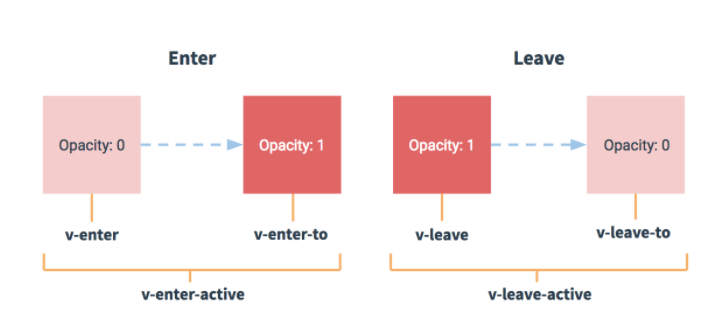

### 嵌套路由

定义一个嵌套路由的父组件时，我们需要去创建<font color='red'>一个同名的 `.vue` 文件，一个同名的文件夹</font>（用来存放 子视图`children views`）

```js
// 页面结构

pages/
--| users/  //（上述的同名文件夹）
-----| _id.vue //（子路由）
-----| index.vue //（<nuxt-child>的默认内容）
--| users.vue //（上述的同名文件）
```

##### `<NuxtChild />`

用来展示嵌套路由的子路由

默认显示同名文件夹下的<font color='red'> `index.vue`</font>，如果匹配到子路由，<font color='red'>显示对应的子路由</font>

```vue
<template>
  <div>
    <h2>Parent页面（二级路由）</h2>
    <!-- 子路由视图 占位符 -->
    <NuxtChild />
    <div>
      <nuxt-link to="/parent/child1">Child1</nuxt-link>
      <nuxt-link to="/parent/child2">Child2</nuxt-link>
    </div>
  </div>
</template>
```


### 动画

`Nuxt` 使用了 `Vue` 的动画组件，让我们在路由之间可以创建好看的动画（用法参照 `Vue` 的 `transition component` ）

 

#### 全局设置 （Global Settings）

`Nuxt` 默认的动画名是<font color='cornflowerblue'> `page`</font> 

想要加一个渐变动画，给你 `APP`的所有页面，你只需要将这个CSS文件共享给全部路由

`our global css in  assets/main.css`

```css
.page-enter-active,
.page-leave-active {
  transition: opacity 0.5s;
}
.page-enter,
.page-leave-to {
  opacity: 0;
}
```

每个模板 `layout` 也有默认的动画配置

```js
{
  name: 'layout',
  mode: 'out-in'
}
```

```css
/* 对应的动画样式 */
.layout-enter-active,
.layout-leave-active {
  transition: opacity 0.5s;
}
.layout-enter,
.layout-leave-active {
  opacity: 0;
}
```

我们还可以在 `nuxt.config.js` 中修改默认的 模板动画配置 ，<font color='red'>通过 `layoutTransition`</font>

```js
export default {
  layoutTransition: 'my-layouts'
  // or
  layoutTransition: {
    name: 'my-layouts',
    mode: 'out-in'
  }
}
```

页面的默认动画配置也可以修改， <font color='red'>通过 `pageTransition`</font>

```js
export default {
  pageTransition: 'my-page'
  // or
  pageTransition: {
    name: 'my-page',
    mode: 'out-in',
    beforeEnter (el) {
      console.log('Before enter...');
    }
  }
}
```


#### `transition` 设置

我们可以为每个路由自定义动画，只需<font color='red'> 在页面组件中 添加 `transition` 配置</font>

```js
// 我们可以设置三种类型

export default {
  // Can be a String  字符串，会被用来作为 `transition.name`
  transition: ''
  // Or an Object 
  transition: {}
  // or a Function
  transition (to, from) {}
}
```

* <font color='red'>字符串</font>

  会被用来作为 `transition.name`，`Nuxt` 便会像下面这样 **使用设置的字符串**

  ```html
  <transition name="home"></transition>
  ```

  <font color='cornflowerblue'>这个包装过程会自动完成，我们不需要添加 `<transition>`组件到`pages 或者 layouts` 中</font>

  我们只需要添加好相应名字的动画样式

  ```html
  <style>
    .home-enter-active, .home-leave-active { transition: opacity .5s; }
    .home-enter, .home-leave-active { opacity: 0; }
  </style>
  ```

* <font color='red'>对象</font>

  一般可以设置两个属性，一个设置<font color='red'> `name`</font>， 一个设置<font color='red'> `mode` </font>模式

  ```js
  export default {
    transition: {
      name: 'home',
      mode: 'out-in' // 默认为 out-in
    }
  }
  ```

  `Nuxt`会用这些设置，转为下面的动画组件

  ```html
  <transition name="home" mode="out-in"></transition>
  ```

  `transition` 对象可以设置许多属性，例如：<font color='orange'>`name` `mode` `css` `duration` 等等</font>，可以参考 `Vue` 的文档。

  还可以添加一些 `JavaScript hooks`，例如

  ```js
  export default {
    transition: {
      afterLeave(el) {
        console.log('afterLeave', el)
      }
    }
  }
  ```

* <font color='red'>函数 Function</font>

  可以使用路由的 `to` 和 `from`

  ```js
  export default {
    transition(to, from) {
      if (!from) {
        return 'slide-left'
      }
      // 通过页面增减情况，决定使用 左滑或右滑 的动画
      return +to.query.page < +from.query.page ? 'slide-right' : 'slide-left'
    }
  }
  ```

  

##### `Transition Mode` 动画模式

默认的动画模式是 `out-in`， 如果你想<font color='red'> 同时</font>运行 `leaving` 和 `entering` 动画，你可以<font color='red'>将 `mode` 设置为 `''`</font>

```js
export default {
  transition: {
    name: 'home',
    mode: ''
  }
}
```


## 中间件（`Middleware directory`）

`middleware` 文件夹 包含你应用的所有中间件。中间件 让我们可以去 <font color='red'>自定义一些方法，在页面`page`或者模板`layout`渲染前运行</font>。

#### 概念

就是一个函数，会在每一次请求路由之前被执行

#### 应用场景

* 可以用来做权限验证

#### 默认参数

* `context` 

  ```js
  export default function (context) {
    // Add the userAgent property to the context
    context.userAgent = process.server
      ? context.req.headers['user-agent']
      : navigator.userAgent
  }
  ```

#### 使用

<font color='red'>中间件的文件名，就是中间件的名字</font>

在通用模式下，中间件会在服务端被调用一次（第一次请求时、刷新页面时），跳转路由时在客户端被调用

中间件会按照下面的顺序<font color='orange'> 依次执行</font>

1. <font color='cornflowerblue'>`nuxt.config.js` 中的 `middleware` </font>（**`Router Middleware`路由中间件** ）

   **注意：**

   在`nuxt.config.js` 中配置中间件，需要添加 以 `router.middleware` 的形式添加，因为中间件本来就是在路由切换中使用的

   ```js
   export default {
     router: {
       middleware: 'name'
     }
   }
   ```

2. <font color='cornflowerblue'>匹配的`layouts`</font>中的 `middleware`

3. <font color='cornflowerblue'>匹配的`pages`</font>中的`middleware`

   `pages` 和 `layouts` 中添加：

   ```js
   export default {
     middleware: 'auth'
   }
   ```

如果只配置一个中间件，可以给一个<font color='orange'>字符串</font>

同时配置多个中间件，可以给一个<font color='orange'>数组</font>

#### 匿名中间件

如果某个页面，只需要一个中间件，你可以直接给其配置一个<font color='orange'>函数</font>

```vue
<template>
  <h1>Secret page</h1>
</template>

<script>
  export default {
    middleware({ store, redirect }) {
      // If the user is not authenticated
      if (!store.state.authenticated) {
        return redirect('/login')
      }
    }
  }
</script>
```

#### 注意：

* 中间件会在前后端都执行，所以写代码时要判断环境


## 插件（`Plugins directory`）

`plugins` 文件夹用来放置 <font color='red'>想在实例化Vue应用之前 运行或注册的 `JS 插件`</font>

在 `plugins`中，我们可以通过三种方式去扩展 `Nuxt` 插件

这是我们用来<font style="color:#ff0;background-color:#000">添加 vue插件、注册方法和常量</font>的地方。

#### 使用

* 在 `plugins` 文件夹中创建文件（文件内容根据下面的三种情况来定）

* 在 `nuxt.config.js` 中通过 `plugins` 添加路径 配置

  值为 `Array` 类型，可以是<font color='red'>字符串数组</font>，也可以是<font color='red'>对象数组</font>

  ```js
  // 字符串数组 形式 
  plugins: [
    '~/plugins/vant.js', // 客户端、服务端都执行
      '~/plugins/xxx.server.js', // 文件加后缀 .server 表示只在服务端执行
      '~/plugins/xxx.client.js' // 文件加后缀 .client 表示只在客户端运行
   ],
    
  // 对象数组 形式
  plugins: [
      { src: "~/plugins/xxxPlugins.js", mode: "client" },
      { src: "~/plugins/xxxPlugins.js", mode: "server" },
      { src: "~/plugins/xxxPlugins.js" },
  ],
  ```
  

#### 注意：

* 只会在进入`nuxt`应用前执行，但是：如果我们没有指定客户端或者服务端时，会在<font color='orange'>两端注册两次</font>
* 每次我们<font style="color:red;">想使用 `Vue.use()` </font>时，我们就要以上述方式使用

#### `injected in $root & context`

在<font color='orange'>客户端或者服务端</font>注册可用的 <font color='red'>值 或 方法</font> （`$root` 指向 Vue根实例）

`/plugins/hello.js`

```js
export default (context, inject) => {
  inject('hello', (msg) => {
    console.log(msg);
  })
}
```

在`nuxt.config.js` 中配置

```js
export default function (context, inject) {
  // 注册 hello 方法 // 
  if (process.server) {
    // 只在服务端注册的话，只能在服务端渲染的时候使用（通过Vue实例/context都可以获取），到了客户端就没有这个插件了
    console.log("在服务端注册了 hello方法");
  } else {
    // 只在客户端注册的话，只能在客户端使用（通过Vue实例/context都可以获取）
    inject("hello", msg => {
      console.log("hello，" + msg);
    })
    console.log("在客户端注册了 hello方法");
  }
}
```

在组件中使用

```vue
<script>
export default {
  asyncData({ $hello, app }) {
    // 不论注册到了哪一段，两种方式都可以获取（通过Vue实例/context都可以获取）
    console.log(app.$hello);
    console.log($hello);
  },
};
</script>
```

##### 注意：

* 只在服务端注册的话，只能在服务端渲染的时候使用（<font style="color:#ff0;background-color:#000">通过Vue实例/context都可以获取</font>），到了客户端就没有这个插件了
* 只在客户端注册的话，只能在客户端使用（<font style="color:#000;background-color:#ff0">通过Vue实例/context都可以获取</font>）
* <font color='red'>也就是说 `inject` 不管在哪个端注册，都会给 `Vue实例` 和 `context` 各注册一次</font>


#### `Vue plugin`

<font color='cornflowerblue'>通过 `vue.use(xxxx)`，挂载 `vue 插件`</font>

##### 添加 `vant` 插件：

`/plugins/vant.js`

```js
import Vue from "vue";
import vant from "vant";

Vue.use(vant);
```

`nuxt.config.js`

```js
  css: [
    "vant/lib/index.css"  // 添加全局样式
  ],
  plugins: [ 
    "~/plugins/vant.js"   // 添加插件
  ],
```

组件中即可使用

##### 注意：

* 像 `vant` 等<font color='red'>UI插件，是要在服务端和客户端都去注册的</font>，因为如果只在客户端注册的话
  * 服务端渲染时，会报错
  * 客户端接收到HTML后，页面已经展示到浏览器上，UI插件虽然挂载到了Vue实例上，但是要等到Mounted之后，实例才被替换成新Vue实例后，UI插件才会有作用，所以会有<font color='red'>闪屏</font>的现象


#### `External packages or modules`

<font color='cornflowerblue'>在`Nuxt`中使用第三方包或模块</font>

##### 使用 `axios` 做错误处理

`plugins/axios.js`

```js
// 给 axios 添加错误处理
export default function ({ $axios, redirect }) {
  $axios.onError(error => {
    if (error.response.status === 500) {
      redirect('/sorry')
    }
  })
}
```

`nuxt.config.js`

```js
module.exports = {
  modules: ['@nuxtjs/axios'],
  plugins: ['~/plugins/axios.js']
}
```

##### 注意：

* 我们的 `axios` 也可以直接引入使用

  ```vue
  <script>
  import axios from 'axios'
  
  export default {
      async asyncData ({ params }) {
        const { data: post }  = await axios.get(`https://api.nuxtjs.dev/posts/${params.id}`)
        return { post }
      }
  }
  </script>
  ```

  如果我们得到一个在模块外不能使用`import` 语句的错误，我们可能需要把 包 添加到 `nuxt.config.js` 中 <font color='red'>`build.transpile` </font>选项中

  ```js
  build: {
    // You can extend webpack config here
    transpile: ['npm-package-name'],
  },
  ```

  