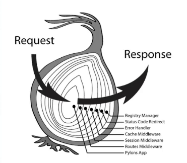
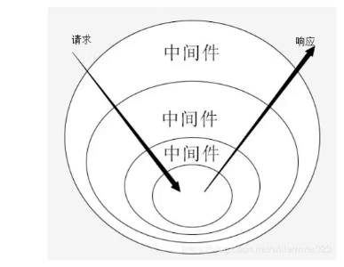

# Koa

### 介绍

* koa是由 Express 原班人马打造的，致力于成为一个<font color='red'>更小、更富有表现力、更健壮</font>的Web框架
* 使用 koa 编写 web 应用，可以免除重复繁琐的回调函数嵌套，并极大的提升错误处理的效率
* <font style="color:#000;background-color:#ff0">koa 不在内核方法中绑定任何中间件</font>，它的特点是优雅、简洁、表达力强、自由度高。
* 本身代码只有1000多行，它仅仅提供了一个轻量优雅的函数库
* 所有功能都通过插件实现，很符合 `Unix` 哲学，使得编写 Web 应用变得得心应手
* 最大的特点就是 可以 <font style="color:#000;background-color:#ff0">避免异步嵌套</font>

#### 理念

在理念上，Koa旨在“修复和替换节点”，而Express旨在“增加节点”，包含许多其他 框架功能，如路由和模板。而koa则没有。因此，Koa可被视为<font color='red'>node.js的http模块的抽象</font>，其中 Express是node.js的应用程序框架。

* 如果想接近 传统node.js 样式编码，建议使用Express
* 如果想摆脱回调，请使用 Koa

#### 功能区别

* <font color='orange'>通过`try/catch` 更好的处理错误</font>
* 不同Express，<font color='cornflowerblue'>不提供路由</font>
* <font color='cornflowerblue'>不提供许多便捷设施</font>，例如：发送文件
* Koa<font color='cornflowerblue'>对中间件的依赖较少</font>

### 准备

Koa2需要`node.js 7.6` 以后的版本，因为 7.6之后，开始完全支持 `async/await`

### 简单使用

#### 安装

```shell
npm init -y
npm i koa
```

#### 开启服务

```
const Koa = require("koa");
// 创建应用
const app = new Koa();

// 设置中间件
app.use(async ctx => {
  // 返回结果
  ctx.body = "Hello world"
});

// 监听端口
app.listen(8000, () => {
  console.log('http://localhost:8000');
})
```

#### 中间件

`app.use()`

* 参数：

  * <font color='red'>`context` 上下文，可以用来获取 `request` 请求对象，`response` 对象 </font>
  * `next` 进入下一个中间件

  

## 路由

如果依靠 `ctx.request.url` 去手动处理路由，将会写很多处理代码，这时候就需要对应的路由的中间件对路由进行控制，这里介绍一个比较好用的路由中间件 <font color='red'>`koa-router`</font>

* 文档：https://github.com/koajs/router/blob/master/API.md

### 使用

`routes/index.js`

```js
// 导入路由
const Router = require('koa-router');

// 创建路由
const router = new Router();

// 路由配置
router.get("/", async (ctx, next) => {
  ctx.body = '这是首页'
})

// 导出
module.exports = router;
```

`app.js`

````js
const Koa = require("koa");
const app = new Koa();

// 导入路由
const router = require('./routes');

// 挂载路由
app.use(router.routes(), router.allowedMethods())

// 监听端口
app.listen(8000, () => {
  console.log('http://localhost:8000');
})
````

* `router.routes()`

  返回 路由中间件

* `router.allowedMethods()`

  返回 分离中间件。作用是 访问 options 请求返回 1，状态码为200，并且可以返回 405 表示请求没有被允许

#### 创建子路由

```js
// 在生成路由实例时，设置前缀
const homeRouter = new Router({
  // 设置前缀
  prefix: '/api'
})
```

#### 获取请求参数

* <font color='red'>`ctx.query`</font> 获取 `get` 请求参数

  `ctx.querystring` 获取 `get` 请求参数字符串

* <font color='red'>`ctx.request.body`</font> 获取 `post` 请求参数 <font color='red'>（需要安装使用 `koa-bodyparser` 解析）</font>

  

#### 静态资源托管

需要安装<font color='red'> `koa-static` </font>

```shell
npm i koa-static
```

使用

```js
// 静态资源托管
app.use(require("koa-static")(__dirname + "/public"))
```


## 洋葱模型

在我们编写 http 服务的时候，当业务越来越复杂的时候，就难以写出清晰、高质量、健壮的代码

 

<font color='red'>洋葱模型，可以让我们很清晰的看到，一个请求从外到里一层一层的经过中间件，响应时从里到外一层一层的经过中间件。</font>

#### 本质：

* <font style="color:#000;background-color:#ff0">Promise.resolve()的递归</font>


## 解决跨域

`koa`项目 可以使用 `koa-cors` 来解决跨域问题

#### 安装

```shell
npm install koa2-cors --save
```

#### 使用

```js
const Koa = require('koa');
const cors = require('koa2-cors');
const app = new Koa();

app.use(cors());
//或者
app.use(
    cors({
        origin: function(ctx) { //设置允许来自指定域名请求
            if (ctx.url === '/test') {
                return '*'; // 允许来自所有域名请求
            }
            return 'http://localhost:8080'; //只允许http://localhost:8080这个域名的请求
        },
        maxAge: 5, //指定本次预检请求的有效期，单位为秒。
        credentials: true, //是否允许发送Cookie
        allowMethods: ['GET', 'POST', 'PUT', 'DELETE', 'OPTIONS'], //设置所允许的HTTP请求方法
        allowHeaders: ['Content-Type', 'Authorization', 'Accept'], //设置服务器支持的所有头信息字段
        exposeHeaders: ['WWW-Authenticate', 'Server-Authorization'] //设置获取其他自定义字段
    })
);
```

#### 自己实现

```js
app.use(async (ctx, next)=> {
  ctx.set('Access-Control-Allow-Origin', '*');
  ctx.set('Access-Control-Allow-Headers', 'Content-Type, Content-Length, Authorization, Accept, X-Requested-With , yourHeaderFeild');
  ctx.set('Access-Control-Allow-Methods', 'PUT, POST, GET, DELETE, OPTIONS');
  if (ctx.method == 'OPTIONS') {
    ctx.body = 200; 
  } else {
    await next();
  }
});
```

### 跨域问题本质

* 是因为浏览器之间的同源策略（同域名，同IP，同端口）导致的，所以服务器与服务器之间就不存在跨域问题。

