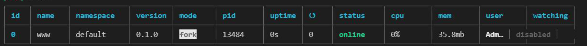

## 乐淘项目

#### 后端开发流程

* 后端开发流程，先看设计稿，有多少页面，<font color='red'>**每个页面需要用到哪些接口**</font>，以及接口功能，提前思考

* 先要<font color='red'>**设计数据库**</font>中需要拿到多少个表，表里需要用到哪些字段，数据库中表设计完成之后

* 使用<font color='red'> **`Koa` 完成接口的开发**</font>，使用<font color='red'>**postman进行接口测试**</font>，是否可以正常使用
* 发布测试环境给前端联调（后端开发过程中，前端<font color='red'>**可用mock等模拟数据同时进行开发**</font>）

### 分析需求

#### 分析页面接口

首页、分类页、购物车、会员中心页面

* 首页需要的接口：
  * **banners** 接口（轮播图）
  * **grids** 宫格接口
  * **sport** 运动专区的接口 （提供运动专区的数据）
  * **brandList**  品牌专区
* 分类页面
  * 一级分类：`oneCategoryList` 提供一级分类表 数据库中需要新建分类表
  * 二级分类：`twoCategoryList` 根据id获取二级分类数据

### 技术栈

**后端开发语言**： `Koa `

**数据库**：`mysql`

**服务器**：腾讯云 window server 2012

**扩展技术栈**：微信支付，短信验证，JWT权限，用户信息加密


### 项目初始化

#### 后端koa项目

使用 koa脚手架 `koa-generator` ，搭建后台项目

<font color='red'>`koa 生成器` 会生成满足koa开发的一系列相关默认配置和文件</font>

```shell
npm i -g koa-generator
```

下载包

```shell
yarn
```

根据 `package.json` 中`scripts` 配置，启动项目

```shell
# 使用 nodemon 启动
yarn dev
```

##### 分析脚手架搭建的 koa 服务

```js
const Koa = require('koa') // 导入koa
const app = new Koa() // 创建服务
const views = require('koa-views') // 处理views静态资源, 支持 ctx.render
const json = require('koa-json') // json 格式化
const onerror = require('koa-onerror') // 处理异常
const bodyparser = require('koa-bodyparser') // 解析post请求中的body
const logger = require('koa-logger') // 记录日志

const index = require('./routes/index') // 导入路由
const users = require('./routes/users')

// error handler 错误处理
onerror(app)

// middlewares 中间件
app.use(bodyparser({
  enableTypes: ['json', 'form', 'text']
}))
app.use(json())
app.use(logger())
app.use(require('koa-static')(__dirname + '/public'))

app.use(views(__dirname + '/views', {
  extension: 'pug'
}))

// logger 记录操作日志
app.use(async (ctx, next) => {
  const start = new Date()
  await next()
  const ms = new Date() - start
  console.log(`${ctx.method} ${ctx.url} - ${ms}ms`)
})

// routes
app.use(index.routes(), index.allowedMethods())
app.use(users.routes(), users.allowedMethods())

// error-handling 错误处理
app.on('error', (err, ctx) => {
  console.error('server error', err, ctx)
});

module.exports = app

```


##### `pm2` 

`package.json` 中 有<font color='orange'> `"prd": "pm2 start bin/www"`</font>

表示 用 `pm2` 在生产环境下，启动项目

<font style="color:#000;background-color:#ff0">`pm2` 是一个 `node.js`项目 生产环境下进程的管理器</font>

<font color='red'>可以用来全天候守护我们的应用进程在线</font>




#### 服务器集群

高并发的两种情况

* `高 IO` （`IO`密集型）

  `in-out` 读写能力要高（登录、注册）

  * 需要注重 服务器的磁盘要好

  * <font style="color:#000;background-color:#ff0">主从复制，读写分离</font>

    主服务器专门用来写数据，从服务器用来读取数据，将主服务器的数据同步到从服务器

    非关系数据库：noSql，内存数据库（进程外session）

* `高 CPU` 

  计算能力要高

