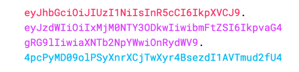
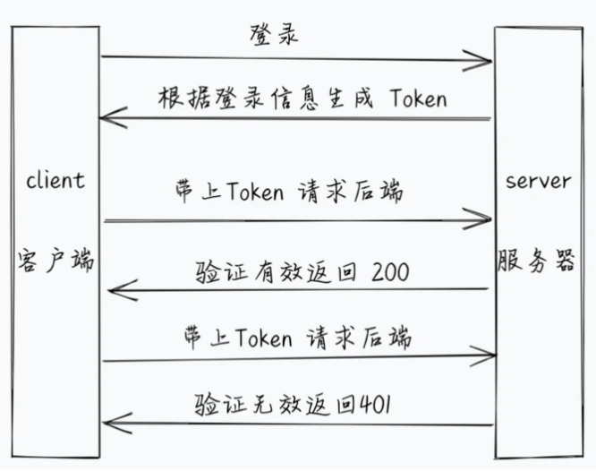

## JWT

### 什么是Json网络令牌

JSON Web Token（JWT）是一个开放标准，用于在各方之间作为JSON对象安全的传输信息。就是通过用户名和密码来生成token确认用户的身份，确认过身份的用户称为 <font color='red'>**授权用户**（Authenticated user）</font>

是目前最流行的跨域认证解决方案，基本的实现是<font color='orange'>服务端认证后，生成一个 `JSON` 对象，发给客户端，客户端与服务端通信的时候，都要在请求头带上这个 `JSON` 对象</font>

### Json Web Token 结构

<font color='red'>有三部分，由 `.` 分割</font>

 

* 第一部分：

  可以解析出 加密的算法和类型

  ```js
  {"alg":"HS256","typ":"JWT"}
  ```

* 第二部分：

  可以解析出 载荷  `payload`

  ```js
  {"username":"letao","password":"123456","iat":1634524068,"exp":1634527668}
  ```

* 第三部分：

  是第一部分和第二部分的 在加上 `secret`-加盐  一起生成的签名

##### 注意：

* 因为 加密的token其实是有可能被解析出信息的，所以我们<font style="color:#000;background-color:#ff0">不应将令牌保留的时间超过所需时间</font>。 

### JSON网络令牌如何工作

在身份验证中，当用户使用其凭据成功登录时，我们要给用户 `JSON Web Token`，由于令牌是凭证，因此要非常小心以防止出现安全问题

每当用户想要访问受保护的路由或资源时，用户代理应该发送 `JWT`，通常在使用 Bearer模式的 Authorization标头中

```
Authorization: Bearer <token>
```



### 在Koa中实现

* 在全局中配置 加盐

  ```js
  // JWT加密用的secret salt
  module.exports.jwtSecret = "letao";
  ```

* <font style="color:#000;background-color:#ff0">使用 `jsonwebtoken` 生成令牌</font>

* <font style="color:#000;background-color:#ff0">使用 `koa-jwt` 校验令牌，阻止路由</font>

#### `jsonwebtoken`

##### 安装

```shell
yarn add jsonwebtoken
```

##### 使用

用户登录成功时，返回token

```js
// 登录 控制器
module.exports.login = async (ctx) => {
  // 获取注册信息
  const { username, password } = ctx.request.body;

  //  查询用户名和密码是否正确
  const res = await userFindByNameAndPwd(username, cryptoPaddWord(password + SALT));

  if (res.length != 0) {
    // 生成token
    const token = jwt.sign(
      {
        username,
        password
      },
      // 设置salt
      jwtSecret,
      {
        // 设置有效期
        expiresIn: '1h'
      }
    )

    // 登录成功，返回token
    return ctx.body = {
      status: 200,
      data: {
        token
      },
    }
  }

  // 登录失败
  ctx.body = {
    status: 0,
    message: "用户名和密码错误，登录失败"
  }
}
```

#### `koa-jwt`

##### 安装

```shell
yarn add koa-jwt
```

##### 使用

在路由前使用 jwt 校验token，放行 登录、注册等接口

`src/app.js`

```js
const jwt = require("koa-jwt");
const { jwtSecret } = require('./config');

// 如果我们不想暴露 koa-jwt的错误给用户，我们可以自定义一个token校验错误 返回自定义的信息
app.use(function (ctx, next) {
  return next().catch((err) => {
    if (401 == err.status) {
      ctx.status = 401;
      ctx.body = 'Protected resource, use Authorization header to get access\n';
    } else {
      throw err;
    }
  });
});

// 必须通过token校验才能到达这里之后的中间件，除了指定的部分路由可以直接放行
app.use(jwt({ secret: jwtSecret }).unless({ path: [/^\/users\/login/, /^\/users\/register/, /^\/sendSms/] }));

// routes
app.use(index.routes(), index.allowedMethods())
app.use(users.routes(), users.allowedMethods())
app.use(sendSms.routes())
app.use(cates.routes(), cates.allowedMethods())
```

