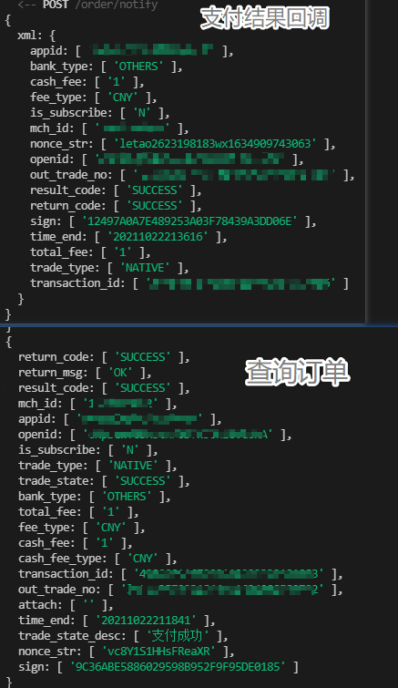

## 微信支付

（本文参照微信支付 `V1` 版本，`V1`版本的交互都是xml格式）

开通微信支付功能，首先要注册 **微信公众号账号，微信支付商户账号**，并将两者绑定。

使用微信支付功能，必须有营业执照等证明开可以开通。

微信支付文档地址：https://pay.weixin.qq.com/wiki/doc/api/index.html

我们下面使用扫码支付 --- 微信支付的 `Native` 类型，生成二维码，让用户扫一扫完成支付。

#### 微信公众号注册

需要公众号认证后，才可以申请微信支付，认证费：300元/次

* 然后需要提交资料申请微信支付
* 审核通过后，开户信息会通过邮件、公众号发送给联系人。要按照指引填写财付通备付金汇入的随机金额，完成账户验证。
* 然后，签署线上电子协议

### 准备素材

* 扫码支付 `Native` API文档
* 公众号 `APPID` 
* 微信商户号、配置回调链接
* 在 微信商户号中 关联 公众号 `APPID` 
* 微信商户的 API 密钥

### 使用步骤


#### 生成订单（生成支付二维码）

* <font color='red'>提前准备需要的参数，比如：签名、随机字符串等</font>

  将部分参数准备到 `/config/wx.js` 中 或者 `.env` 文件中

  ```js
  // 微信下单地址
  module.exports.orderUrl = "https://api.mch.weixin.qq.com/pay/unifiedorder";
  
  // appID
  module.exports.app_id = "xxx"
  
  // 商户号
  module.exports.mch_id = "xx";
  
  // 微信回调地址
  module.exports.notify_url = "/xxx/xxx";
  
  // 微信商户密钥
  module.exports.key = "xxx";
  ```

  准备参数

  ```js
  // body, spbill_create_ip, total_fee, trade_type 要前端请求时 获取
  
  const params = {
      appid // 公共号id,
      mch_id, // 商户号id
      nonce_str, // 32位以内的随机字符串
      // sign, // 签名
      body, // 商品描述
      out_trade_no, // 商户订单号 
      total_fee, // 金额
      spbill_create_ip, // 终端ip
      notify_url, // 微信服务器回调的地址
      trade_type // 支付类型
  }
  ```

  准备 `nonce_str` 参数时，为了避免重复，要在 `utils/index.js` 中封装生成唯一字符串的方法

  ```js
  //#region 生成一个32位以内的随机字符串，而且是不重复的
  module.exports.getRandomStr = () => {
    return "letao" + this.getRandomByLength(10) + "wx" + new Date().getTime();
  }
  //#endregion
  
  //#region 生成商户订单号
  module.exports.getTrade_no = () => {
    return this.getRandomStr()
  }
  //#endregion
  ```

* <font style="color:#000;background-color:#ff0">签名需要根据其它参数，使用微信规定的算法算出</font>

  ```js
  //#region 根据微信支付文档 生成签名算法
  // 导入商户密钥
  const { key } = require("../config/ws")
  // 生成签名
  module.exports.createSign = (args) => {
    let stringA = "";
    // 以字典序 组成key=value的格式
    Object.keys(args).sort().forEach(val => {
      stringA += val + "=" + args[val] + "&"
    })
    // 加上密钥
    stringSignTemp = stringA + `key=${key}`;
    // MD5加密
    return crypto.createHash("MD5").update(stringSignTemp).digest('hex').toUpperCase();
  }
  //#endregion
  ```

  ```js
    // 生成签名并添加
    params.sign = createSign(params);
  ```

* <font style="color:#000;background-color:#ff0">将 `params` 数据转换为 `xml` 格式的数据，向微信接口`https://api.mch.weixin.qq.com/pay/unifiedorder`发起请求</font>

  `orderCtrl.js` 中

  ```js
    // 将数据整理为xml格式
    const paramsInXML =
      `
        <xml>
          <appid>${app_id}</appid>
          <body>${body}</body>
          <mch_id>${mch_id}</mch_id>
          <nonce_str>${params.nonce_str}</nonce_str>
          <notify_url>${notify_url}</notify_url>
          <out_trade_no>${params.out_trade_no}</out_trade_no>
          <spbill_create_ip>${spbill_create_ip}</spbill_create_ip>
          <total_fee>${total_fee}</total_fee>
          <trade_type>${trade_type}</trade_type>
          <sign>${params.sign}</sign>
        </xml>
    `
    // 发送数据  创建订单
    const res = await createOrder(orderUrl, paramsInXML);
  ```

  `utils/index.js` 封装创建支付订单的接口

  ##### `xml2js`

  <font style="color:#000;background-color:#ff0">需要安装 `xml2js` 来解析，下单接口返回的 `xml` 数据</font>

  ```js
  //#region 微信创建订单
  // 解析xml格式数据
  const xml = require('xml2js')
  const { default: axios } = require("axios");
  /**
   * 创建订单
   * @param {*} url 
   * @param {*} params 
   * @returns 
   */
  module.exports.createOrder = (url, data) => {
    return new Promise(async (resolve, reject) => {
      // 发起 创建订单请求
      const res = await axios({
        url,
        method: "POST",
        data
      });
      // 使用xml解析 微信返回结果
      xml.parseString(res.data, (err, data) => {
        const { return_code, result_code, return_msg } = data.xml;
        // 成功的话，返回成功信息
        if (return_code[0] === "SUCCESS" && result_code[0] === 'SUCCESS' && return_msg[0] === 'OK')
          return resolve(data.xml);
        // 失败的话，返回失败信息
        reject(data);
      })
    })
  }
  //#endregion
  ```

* 调用下单接口，拿到下单接口 `createOrder` 返回的核心内容

  ```js
      "return_code": [
        "SUCCESS"
      ],
      "return_msg": [
        "OK"
      ],
      "result_code": [
        "SUCCESS"
      ],
      "mch_id": [
        "1473426802"
      ],
      "appid": [
        "wx8397f8696b538317"
      ],
      "nonce_str": [
        "zTNvs5An4CqT0TmP"
      ],
      "sign": [
        "F667F10737AACB0ACED3E71F62956B84"
      ],
      "prepay_id": [
        "wx192206264791203d267effab70bca90000"
      ],
      "trade_type": [
        "NATIVE"
      ],
      "code_url": [
        "weixin://wxpay/bizpayurl?pr=aIm7WmZzz"
      ],
  ```

* <font style="color:#000;background-color:#ff0">将 `code_url` 使用 `qrcode` 转换为二维码图片 `databaseUrl 地址`，返回给前端</font>

  ##### 需要下载 `qrcode` 插件

  ```js
    // 发送数据  创建订单
    const res = await createOrder(orderUrl, paramsInXML);
  
  	// 这里我们应该 先在数据库中添加订单数据.....（订单状态为未支付）
  
    // 成功时
    if (res.return_code[0] === "SUCCESS") {
      // 将支付链接转为二维码
      const qr_url = await QRCode.toDataURL(res.code_url);
      // 发送给前端
      return ctx.body = {
        status: 200,
        data: { ...res, qr_url }
      }
    }
  
    ctx.body = {
      status: 0,
    message: "创建订单失败"
    }
  ```
  

#### 支付结果通知

在上面下单接口中，我们给微信提供了一个参数：<font color='red'>`notify_url` </font> 例如：`https://xxxx.com/pay/notify`

当用户扫码支付后，微信会接受到支付结果的信息，然后会通过 `notify_url` 指定的地址向我们的服务器发起请求，通知我们支付结果。

##### 要求：

* `notify_url` 必须是可以直接访问的url，不能携带参数
* 公网域名必须是 `https` ，如果是专线接入，使用专线NAT IP或者私有回调域名可使用 `http`

##### 通知参数：

| 字段名     | 变量值      | 示例值   | 描述             |
| ---------- | ----------- | -------- | ---------------- |
| 返回状态码 | return_code | SUCCESS  | 表示交易是否成功 |
| 返回信息   | return_msg  | 签名失败 | 返回信息         |

成功时，还会带有更多参数：`appid, mch_id, nonce_str, sign, result_code, openid, trade_type, total_fee, time_end` 还有 <font color='orange'>`transaction_id 微信支付订单号` 和 `out_trade_no 商户订单号`  </font>等

##### 解析post请求中xml格式的body

需要使用 `koa-xml-body` 来获取 `body` 中的 xml数据

```js
const koa = require('koa')
const xmlParser = require('koa-xml-body')

const app = koa()
app.use(xmlParser()) // 注意：要放在bodyParser之前
app.use(bodyParser())
```

##### 注意：

* <font color='red'>**一定要给微信返回响应（xml格式）**</font>

  | 字段名     | 变量值      | 示例值       | 描述             |
| ---------- | ----------- | ------------ | ---------------- |
| 返回状态码 | return_code | SUCCESS/FAIL | 表示交易是否成功 |
| 返回信息   | return_msg  | OK           | 返回信息         |

  ```xml
  <xml>
    <return_code><![CDATA[SUCCESS]]></return_code>
    <return_msg><![CDATA[OK]]></return_msg>
  </xml>
  ```

  <font color='red'>**不然微信会在一定时间内，一直轮询此接口。**</font>


#### 查询订单

URL地址：https://api.mch.weixin.qq.com/pay/orderquery

##### 参数：

（xml格式）

| 字段名     | 变量名         | 示例值                           | 描述                                                    |
| ---------- | -------------- | -------------------------------- | ------------------------------------------------------- |
| 公众账号ID | appid          | wxd678efh567hg6787               | 公众账号ID                                              |
| 商户号     | mch_id         | 1230000109                       | 微信支付分配的商户号                                    |
| 微信订单号 | transaction_id | 1009660380201506130728806387     | 微信的订单号，<font color='red'>**建议优先使用**</font> |
| 商户订单号 | out_trade_no   | 20150806125346                   | 商户系统内部订单号                                      |
| 随机字符串 | nonce_str      | C380BEC2BFD727A4B6845133519F3AD6 | 随机字符串                                              |
| 签名       | sign           | 5K8264ILTKCH16CQ2502SI8ZNMTM67VS | 签名算法计算得出的签名值                                |

```xml
<xml>
   <appid>wx2421b1c4370ec43b</appid>
   <mch_id>10000100</mch_id>
   <nonce_str>ec2316275641faa3aacf3cc599e8730f</nonce_str>
   <transaction_id>1008450740201411110005820873</transaction_id>
   <sign>FDD167FAA73459FD921B144BAF4F4CA2</sign>
</xml>
```

##### 注意：

* <font style="color:#000;background-color:#ff0">`transaction_id` 和 `out_trade_no` 两个中 选用其中一个即可</font>

##### 返回结果：

成功时：

 

更多信息参见微信文档

