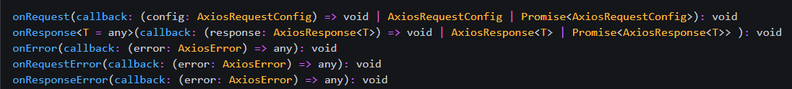

### 封装 `@nuxt/axios` 请求

#### 了解 `@nuxt/axios`

##### 使用

* 在组件 `asyncData` 中通过 `$store` 使用

  ```js
  async asyncData({ $axios }) {
    const ip = await $axios.$get('http://icanhazip.com')
  }
  ```

* 在 **methods/created/mounted/** 等方法中 以及 `Store/Actions`中 通过 `this.$store` 使用

  ```js
  // In store
  {
    actions: {
      async getIP ({ commit }) {
        const ip = await this.$axios.$get('http://icanhazip.com')
        commit('SET_IP', ip)
      }
    }
  }
  ```

##### **`$`** 

<font color='red'>`axios.$get()` 是通过 `axios.get()` 封装得到，可以直接获取 响应数据中的 `data`</font>

##### 扩展 `axios` 



`@nuxt/axios` 将 `axios` 中的拦截器 `axios.interceptors.request.use() 请求拦截器` 和 `axios.interceptors.response.use() 响应拦截器` 进一步封装为<font color='red'> **`$axios.onRequest()` 和 `$axios. onResponse`**</font>

并且添加了 <font color='orange'>错误拦截器`$axios.onError(err=>{})` 可以通过 `err.response.status` 获取 `http响应code`</font>

另外，`@nuxt/axios` 还封装了 <font color='orange'>**`$axios.setToken` 帮助我们便捷的设置 token**</font>

所以我们可以通过封装好的拦截器，扩展请求配置

首先准备状态码对应信息

`/plugins/axios/httpcode.js`

```js
export const httpcode = {
  400: "请求错误（400）",
  401: "未授权，请重新登录（401）",
  403: "未登录，请重新登录（403）",
  404: "Not Found 请求出错（404）",
  412: "未找到有效session（412）",
  408: "请求超时（408）",
  500: "服务器错误（500）",
  501: "服务未实现（501）",
  502: "网络错误（502）",
  503: "服务不可用（503）",
  504: "网络超时（504）",
  505: "HTTP版本不受支持（505）",
}
```

`/plugins/axios/index.js`

```js
import { Toast } from "vant";
import { httpcode } from "./httpcode";

export default function ({ $axios, store, redirect }) {
  // 请求拦截器
  $axios.onRequest(() => {
    const token = store.state.token;
    // 如果存在token
    // 使用 @nuxt/axios提供的 setToken 设置 token
    token && $axios.setToken(token, "Bearer");
  });

  // 响应拦截器
  $axios.onResponse((res) => {
    // 请求结果失败
    const { status, message } = res;
    // 提示错误信息
    if (!status) Toast(message);
    return res;
  });


  // 拦截到错误时
  $axios.onError(err => {
    // 提示错误信息
    Toast.fail(httpcode[err.response.status])
    // 404
    if (err.response.status === 404) return redirect("404");
    // 未鉴权
    if (err.response.status === 401) {
      // 跳转登录页
      redirect("/login")
      // 为了解决跳转路由后还会显示错误页面的问题，在返回Promise.reject()之前返回Prmoise.resolve(),防止跳转到错误页
      // 因为$get()等方法是直接获取get()结果内部的data，所以，我们给出Promise.reject({data:{}}), 
      // 最起码让$get()拿到空对象{}，再次防止跳转到错误页，因为外界解构赋值时，不会出错
      return Promise.resolve({ data: {} })
    };
  })
}
```

`nuxt.config.js` 中添加插件

```js
  plugins: [
    "~/plugins/vant.js",
    // 封装axios
    "~/plugins/axios",
  ],
```

#### 封装 API 接口

<font style="color:#000;background-color:#ff0">为了统一管理接口</font>

在 `/plugins/axios/api.js` 中<font style="color:#000;background-color:#ff0">封装`$api`对象，`inject` 注入全局</font>

```js
export default ({ $axios }, inject) => {
  inject('api', {
    /**
     * 获取首页轮播图数据
     * @returns {Promise}
     */
    IndexBanners() {
      return $axios.$get("/banners");
    },
    /**
    * 获取宫格数据
    * @returns {Promise}
    */
    IndexGridList() {
      return $axios.$get("/gridList");
    },
    /**
    * 获取运动专区数据
    * @returns {Promise}
    */
    IndexSports() {
      return $axios.$get("/sports");
    },
  })
}
```

`nuxt.config.js` 中添加插件

```js
  plugins: [
    "~/plugins/vant.js",
    // 封装axios
    "~/plugins/axios",
    // 统一管理接口
    "~/plugins/axios/api"
  ],
```

#### 配置 `axios` 请求代理

```js
  modules: [
    // https://go.nuxtjs.dev/axios
    '@nuxtjs/axios',
  ],

  // Axios module configuration: https://go.nuxtjs.dev/config-axios
  axios: {
    proxy: true,
    // 加前缀
    prefix: "/api"
  },
  // 配置代理
  proxy: {
    '/api/': { target: 'http://colorfullife.top:3002', pathRewrite: { '^/api/': '' } }
  },
```

