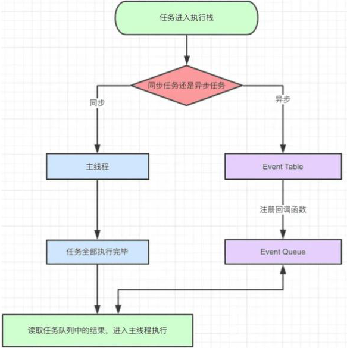
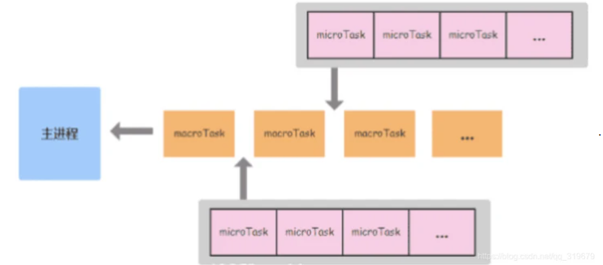

## JS事件环 `Event Loop`

也叫做事件循环，是指浏览器或Node环境的一种解决 JS 单线程运行时不会阻塞的一种机制，也就是实现异步的原理。

#### 概念：

* 宏任务（MacroTask）：

  script标签、setTimeout、setInterval、setImmediate、dom操作、用户交互、网络请求、I/O、UI渲染。

* 微任务（MircoTask）：

  Promise的 then、catch、process.nextTick

#### 执行顺序图：

 

#### 每一次循环，都是首先从宏任务开始，微任务结束：



#### 案例：

```js
// 同步代码
console.log('1');
// 第二个宏任务
setTimeout(function () {
    // 同步代码
    console.log('2');
    new Promise(function (resolve) {
        // 同步
        console.log('3');
        resolve();
    }).then(function () {
        // 微任务队列
        console.log('4')
    })
    // 第四个宏任务
    setTimeout(function () {
        console.log('5');
        new Promise(function (resolve) {
            console.log('6');
            resolve();
        }).then(function () {
            console.log('7')
        })
    })
    // 同步
    console.log('14');
})
// 
new Promise(function (resolve) {
    // 同步
    console.log('8');
    resolve();
}).then(function () {
    // 微任务
    console.log('9')
})
// 第三个宏任务
setTimeout(function () {
    console.log('10');
    new Promise(function (resolve) {
        // 同步
        console.log('11');
        resolve();
    }).then(function () {
        console.log('12')
    })
})
// 同步
console.log('13')

// 1.主进程的第一个宏任务执行   每一个宏任务执行完毕要 清空当前微任务队列
// 1 8 13  第一个宏任务 整体代码执行完成    同步代码执行
    // 第一宏任务的微任务队列      9   
    // 1  8  13  9  


// 2. 主进程第二个宏任务   2 3 14  同步
    // 第二个宏任务对应微任务队列 
    //  2 3 14 4 

// 3. 主进程的第三个宏任务 10  11  12 


// 4.第四个宏任务  5  6  7 

// 1 8 13 9  2 3 14 4  10 11 12  5 6 7


// 2 3 14
// 4 10 11 12  5 6 7 
```

#### 总结：

1. 主线程自上而下一次执行所有代码
2. 同步任务直接进入到主线程被执行
3. 异步任务进入到 `Event Table`，当异步任务有结果后，将相应的回调函数进行注册，放入 `Event Queue`
4. 主线程任务执行完空闲下来后，从 `Event Queue（FIFO）` 读取任务，放入主线程执行
5. 放入主线程的 `Event Queue` 任务继续从第一步开始，如此循环执行
6. 每执行一次宏任务会把当前微任务队列清空，再执行下一个宏任务，以此类推


## 函数柯里化

方法调用时，**多个参数的函数** 拆分成 **一个依次单独接收参数的函数** 调用

  ``` fn(a, b) => f(a)(b)    ```

```js
function add(a, b) {
  return a + b;
}

// 柯里化
function addCurry(a) {
  return function (b) {
    return a + b;
  }
}

console.log(add(5, 5));
console.log(addCurry(5)(5));

// 用来 封装校验类型函数
function isType(type, value) {
  return Object.prototype.toString.call(value) === `[object ${type}]`;
}

// 柯里化 某个函数
const curry = (fn) => {
  const inner = (args = []) => {
    console.log(args);
    return fn.length === args.length ? fn(...args) : (...newArgs) => inner([...args, ...newArgs])
  }
  return inner()
}


console.log(curry(isType)("String")('1')); // true
```

