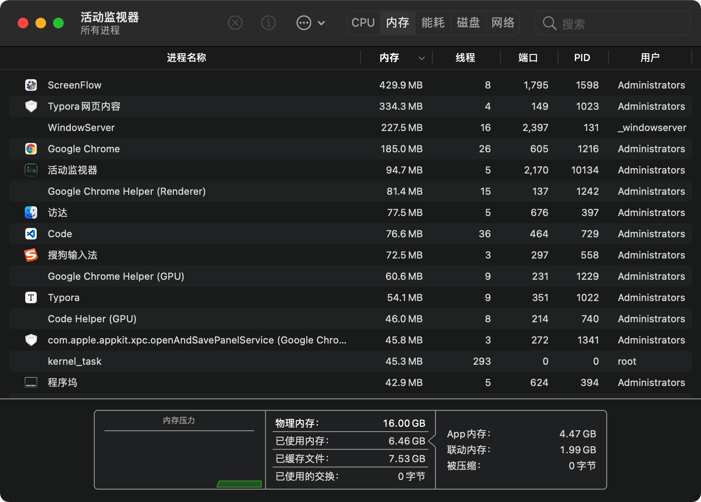
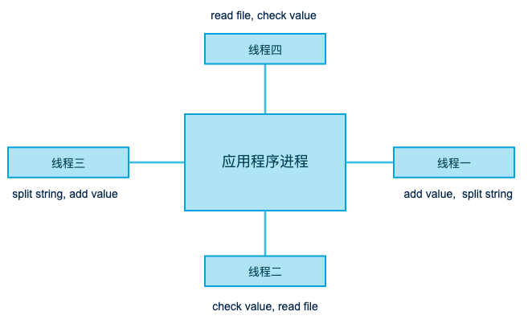
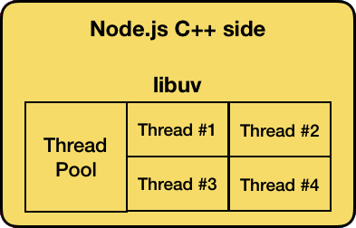
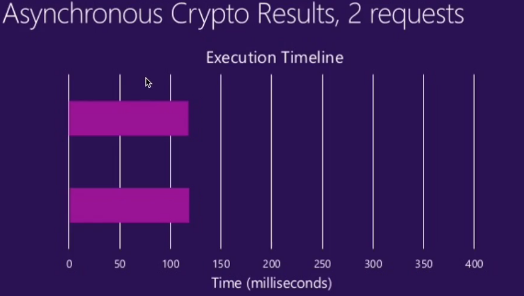
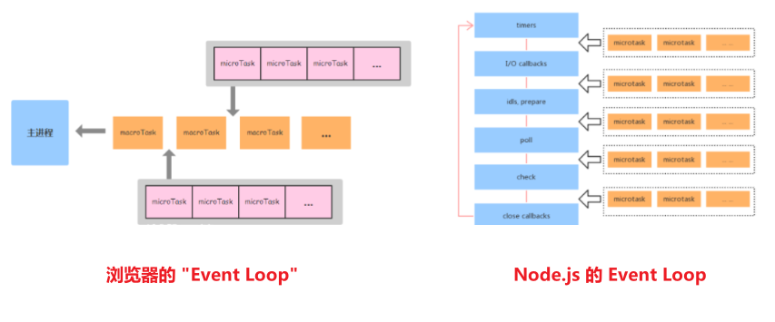
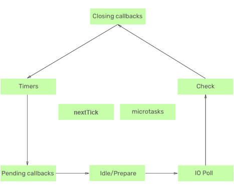

## 异步编程

了解异步编程，首先要知道一些 计算机知识：<font color='#EA0000'><font style="background-color:#ff0">`CPU与存储器`、`IO`、`线程与进程`</font></font>

#### CPU 与存储器

目标: 了解程序运行过程中 CPU 和存储器起到了什么作用或者说扮演了什么角色.

1. **CPU**

   中央处理器，计算机核心部件，负责运算和指令调用。

   开发者编写的 JavaScript 代码在被编译为机器码以后就是通过 CPU 执行的。

2. **存储器**

   内存：用于临时存储数据，断电后数据丢失。由于数据读写速度快，计算机中的应用都是在内存中运行的。

   磁盘：用于持久存储数据，断电后数据不丢失。内部有磁头依靠马达转动在盘片上读写数据, 速度比内存慢。

计算机应用程序在没有运行时是存储在磁盘中的，当我们启动应用程序后，应用程序会被加载到内存中运行，应用程序中的指令会被中央处理器CPU来执行。

#### 什么是 I/O

I 就是 Input 表示输入，O 就是 Output 表示输出，<font style="background-color:#ff0">I/O 操作就是输入输出操作</font>。

什么样的操作属于 I/O 操作呢 ? 

比如数据库的读写操作就是 I/O 操作，因为数据库文件是存储在磁盘中的，而我们编写的程序是运行在内存中的，将内存中的数据写入数据库对于内存来说就是输出，对于数据库来说就是输入, 查询数据库中的数据就是**将磁盘中的数据读取到内存中**，对于**内存**来说就是**输入**, 对于**磁盘**来说就是**输出**。

所以：<font color='#EA7500'>文件读取都称之为 **IO操作**</font>


#### I/O 模型

从数据库中查询数据(将磁盘中的文件内容读取到内存中)，由于磁盘的读写速度比较慢，查询内容越多花费时间越多。无论 I/O 操作需要花费多少时间，在 I/O 操作执行完成后，CPU 都是需要获取到操作结果的，那么问题就来了，CPU 在发出 I/O 操作指令后是否要等待 I/O 操作执行完成呢 ? 这就涉及到 I/O 操作模型了，I/O 操作的模型有两种。

* <font color='#8600FF'>**阻塞 I/O**</font>：

  CPU 等待 I/O 操作执行完成获取到操作结果后再去执行其他指令，这是同步 I/O 操作 (<font color='#8600FF'>**阻塞 I/O**</font>)。

  **同步 I/O** 在代码中的表现就是代码暂停执行等待 I/O 操作，I/O 操作执行完成后再执行后续代码

* <font color='#8600FF'>**非阻塞 I/O**</font>

  CPU 不等待 I/O 操作执行完成，CPU 在发出 I/O 指令后，内存和磁盘开始工作，CPU 继续执行其他指令。当I/O 操作完成后再通知 CPU I/O 操作的结果是什么。这是异步 I/O 操作 (<font color='#8600FF'>**非阻塞 I/O**</font>) 。

  **异步 I/O** 在代码中的表现就是代码不暂停执行，I/O 操作后面的代码可以继续执行，当 I/O 操作执行完成后通过回调函数的方式通知 CPU，说 I/O 操作已经完成了，基于 I/O 操作结果的其他操作可以执行了 (通知 CPU 调用回调函数)。

  （对于 `node`，这就需要开启**新线程**执行 所谓的 非阻塞IO）

同步 I/O 和 异步 I/O 区别就是是否等待 I/O 结果。

Node 提供的一个 操作文件的`API` 就是 <font color='#8600FF'>**异步非阻塞 I/O 模型**</font>。

```javascript
const fs = require("fs")

fs.readFile("./x.txt", "utf-8", function (error, data) { console.log(data) })
console.log("Hello")
```

下面的 **同步IO操作`API`** 就是 <font color='#8600FF'>阻塞 I/O 模型</font>

```javascript
const fs = require("fs")

const data = fs.readFileSync("./y.txt", { encoding: "utf-8" })
console.log(data)
```


#### 进程与线程

##### 进程：

每当我们运行应用程序时，操作系统都会创建该**<font style="background-color:#ff0">应用程序的实例对象</font>**，该实例对象就是应用程序的进程，操作系统会<font color='#8600FF'>按照 **进程** 为单位</font>为应用程序分配资源，比如内存，这样程序才能够在计算机操作系统运行起来。



（图中可以看到：每个进程包含多个线程）

##### 线程：

**线程**是被包裹在<font color='#EA0000'>进程之中</font>的，是<font color='#EA0000'>**进程中的实际运作单位**</font>，一条线程指的就是进程中的一个<font color='#8600FF'>单一顺序的控制流</font>。

每条线程都是一个待办列表，准备被 CPU 执行。而且多个线程可以并行（因为线程并行，可以提高CPU利用率）




### JavaScript 是单线程还是多线程

在 Node.js 运行环境中，它为 JavaScript 代码的执行提供了一个主线程，通常我们所说的单线程指的就是这个主线程。主线程用来执行所有的同步代码。

但是！Node.js 由 C++ 开发的时候，内部依赖了一个叫做 **`libuv`** 的 C++ 库。

在这个库中，它<font color='#EA0000'>维护了一个线程池</font>，默认的情况下在这个线程池中存储了4个线程，JavaScript中的<font color='#EA0000'>异步阻塞型任务</font>就是 **在这些线程中执行** 的。

所以说 JavaScript 代码的运行依靠了不止一个线程，所以<font color='#8600FF'> JavaScript 本质上还是用了多线程的</font>。

再解释一遍：

拿 **Node.js环境 **来说，我们所写的 JavaScript 代码确实是个单线程环境中执行（就好像 浏览器环境的JS引擎线程，只用来执行JS代码），但是 `Node.js` 中 **`libuv`** 会提供一个<font color='#EA0000'>**线程池**</font>，里面的线程可以 用来 <font style="background-color:#ff0">执行不同操作系统的异步调用</font>（异步IO）从而使用了多个线程，这些对我们开发者来说 是感受不到的。

所以，很多人坚持说，`JS` 是单线程的，没有错，但不全面。


JavaScript 在不同环境中，所依赖的**<font style="background-color:#ff0">多线程环境也是不同的</font>**，这个我们查资料时一定要注意！

下面，我们就分别从 `Node环境`  和 `浏览器环境` 看下线程环境的差异


### Node.js 环境 的线程

**Node.js 中最核心的是 V8 引擎（模改的浏览器V8），在 Node.js 启动后，会创建 V8 的实例，这个实例是多线程的！**

其中有以下这些线程：

* 主线程：编译、执行代码。
* 编译/优化线程：在主线程执行的时候，可以优化代码。
* 分析器线程：记录分析代码运行时间，为 Crankshaft 优化代码执行提供依据。
* 垃圾回收的几个线程。

所以说：简单的启动一个 Node.js 服务，可以看到会占用 **7** 个线程

**然后** 我们再执行一个<font color='#EA7500'>**异步IO读取文件**</font>的操作，会看到线程数变成了 **11** 个，因为上面说了： `libuv` 默认开4个线程（也称为一个工作线程池  `Thread Pool` `Worker Pool`）。 



#### Node.js 中 工作线程池

在Node.js中，**我们所写的 `JS` 代码，都是要拿回主线程中执行的**，

其它线程（`libuv`提供的线程）也称之为 是一个<font style="background-color:#ff0"> `Worker Poll` 工作线程池</font>

执行的任务都是 `Node.js` 中的一些 `API`：

* **<font color='#8600FF'>I/O 密集型任务</font>**：
  * DNS：`dns.loopup()`
  * 文件系统：读取文件 `fs.readFile` 等
* **<font color='#8600FF'>CPU 密集型</font>**：
  * `Crypto` 加密相关任务：`crypto.pbkdf2()`、`crypto.scrypt()`、`crypto.randomBytes()`、`crypto.randomFill()`、`crypto.generateKeyPair()`
  * `Zlib`：压缩相关函数，除那些显式同步调用的 `API` 之外，都适用 `libuv` 的线程池。

在许多 Node.js 应用程序中，<font color='#EA0000'>这些 API 是工作线程池任务的唯一来源。</font>

此外应用程序和模块可以使用 [C++ 插件](https://nodejs.org/api/addons.html) 向工作线程池提交其它任务。

##### 工作线程池和主线程的关系

以上这些任务 **在线程池完成后**，会将<font color='#8600FF'>数据</font>返回给 **主线程**中注册的**回调函数**，

 将回调函数<font style="background-color:#ff0"> 排入 `Event Loop` 的事件队列</font>中，等待在 **<font color='#8600FF'>主线程</font>** 中执行

 

#### 实际应用

所以在 node.js或前端 编程时，在**<font color='#EA0000'>同步异步API都有</font>**时，不要为了写代码简单，而使用同步方法，这样会导致执行起来没有**<font color='#8600FF'>利用多线程</font>**；要懂得异步方法会利用多线程，**<font color='#EA7500'>减少执行时间</font>**！

* 同步加密：

  ```js
  const crypto = require('crypto')
  const NUM_REQUESTS = 2;
  for (let i = 0; i < NUM_REQUESTS; i++) {
    	crypto.pbkdf2Sync('srcret', 'salt', 10000, 512, 'sha512')
  }
  ```

   

* 异步加密：

  ```js
  const crypto = require('crypto')
  const NUM_REQUESTS = 2;
  for (let i = 0; i < NUM_REQUESTS; i++) {
    	crypto.pbkdf2('srcret', 'salt', 10000, 512, 'sha512')
  }
  ```

    


### 浏览器中的线程

浏览器中的线程 和 Node 虽然都是V8引擎，但是用到的线程还是有不少区别：

列举一些浏览器环境中的**常驻线程**：

1. **GUI渲染线程**

   - 负责渲染浏览器界面，解析HTML，CSS，构建DOM树和 `RenderObject` 树，布局和绘制等。
   - 当界面需要重绘（Repaint）或由于某种操作引发回流(`reflow`)时，该线程就会执行
   - 注意，**<font color='#EA0000'>GUI渲染线程与JS引擎线程是互斥的</font>**，当 `JS` 引擎执行时GUI线程会被挂起（相当于被冻结了）
   - <font color='#EA7500'>GUI更新会被保存在一个队列中 **等到JS引擎空闲时** 立即被执行。</font>

   

2. **`JS`引擎线程**

   - 也称为 `JS` 内核，负责解析` Javascript` 脚本，运行代码

   - `JS`引擎一直等待着任务队列 `Event Loop` 中任务的到来，然后执行。

     打开一个Tab页（就是一个进程），一个页面无论什么时候都只有一个`JS`线程在运行`JS`程序

   - 同样注意，**GUI渲染线程与`JS`引擎线程是互斥的**，所以如果`JS`执行的时间过长，这样就会造成页面的渲染不连贯，导致页面渲染加载阻塞。

   

3. **异步http请求线程**

   - 在XMLHttpRequest在连接后是通过浏览器新开一个线程请求
   - 将检测到状态变更时，如果设置有回调函数，异步线程就**产生状态变更事件**，将这个回调再放入事件队列中。再由JavaScript引擎执行。

   

4. **定时触发器线程**

   - 传说中的`setInterval`与`setTimeout`所在线程
   - <font color='#EA7500'>浏览器定时计数器并不是由JavaScript引擎计数的,（因为JavaScript引擎是单线程的, 如果处于阻塞线程状态就会影响记计时的准确）</font>
   - 因此通过单独线程来计时并触发定时（计时完毕后，添加到事件队列中，等待JS引擎空闲后执行）

   

5. **事件触发线程**

   - 归属于浏览器而不是`JS`引擎，用来控制事件循环

     其实是和 <font color='#EA0000'>**`libuv`** </font>**<font color='#8600FF'>相似的作用</font>**：

     分别是 **<font color='#8600FF'>维护</font>** 浏览器 和 `node.js`<font color='#8600FF'> **事件循环 `Event Loop`**</font>

     说白了就是：<font style="background-color:#ff0">给`JS`引擎线程安排事情！</font>

   - 当`JS`引擎执行代码块如 `setTimeOut` 时（也可来自浏览器内核的其他线程,如鼠标点击、AJAX异步请求等），会将对应任务添加到事件线程中

   - 当对应的事件符合触发条件被触发时（例如我们触发了一个点击事件）

     该线程会把事件添加到待处理队列的队尾，等待`JS`引擎的处理


### 异步编程

#### 基于回调函数的异步编程

上面介绍这么多线程的信息，就是为了引出异步编程。

多线程帮主线程做了很多事情，但是这些多线程完成任务后，<font style="background-color:#ff0">会通知主线程继续完成一些异步回调</font>，进而将异步回调放入 `Event Loop` 等待主线程执行。

所以就有了：基于<font color='#8600FF'>回调函数</font>的异步编程。

```js
const fs = require("fs")

fs.readFile("./index.html", "utf-8", function (error, data) {
  if (error) console.log("发生了错误")
  console.log(data)
})
```

但是回调函数这种编程方式，容易造成回调地狱。

（等下面介绍完 `Event Loop`）再详细分析更多异步编程的知识。


### 事件循环 `Event Loop` 与 线程环境的关系

事件循环 `Event Loop` 有一个作用： `Javascript` 和 其它线程 之间的一个桥梁

* 浏览器中：

  事件循环是：**JS代码** 和 **浏览器API调用**（`setTimeout`、`AJAX`、`监听事件`）之间的一个桥梁

* Node 中：

  事件循环是：**JS代码** 和 **系统调用**（`file system`、`network`）之间的一个桥梁

<font color='#EA0000'>因为线程环境就不同，所以 Node 和 浏览器的 事件循环 `Event Loop` 也是有些差异的。</font>



####  Event Loop 事件循环机制

为什么要学习事件循环机制?

* 学习事件循环可以让开发者明白 <font color='#8600FF'>**JavaScript 代码的运行机制**</font>到底是怎么样的。

事件循环机制做的是什么事情？

* 事件循环机制用于<font color='#EA7500'>**管理异步 API 的回调函数**</font> 什么时候 <font color='#EA0000'>回到主线程</font>中执行。

* Node.js 采用的是异步 I/O 模型。

  * **`同步API`** 在**主线程**中执行，
  * **`异步API`** 在底层的 C++ 维护的**线程池**中执行，
  * **`异步API的回调函数`** 在**主线程**中执行。

  在 JavaScript 应用运行时，异步 API 的回调函数什么时候能回到主线程中调用呢？

  这就是事件循环机制做的事情，管理 <font color='#EA7500'>异步 API 的回调函数什么时候回到主线程中执行</font>。

为什么这种机制叫做事件循环？

* 因为 Node.js 是事件驱动的。事件驱动就是当什么时候做什么事情，做的事情就定义在回调函数中，可以将异步 API 的回调函数理解为事件处理函数，所以管理异步API回调函数什么时候回到主线程中调用的机制叫做事件循环机制


### 浏览器的 `Event Loop`

浏览器的`Event Loop`，主要分清两个东西就行：<font color='#EA0000'>**微任务**</font>、<font color='#EA0000'>**宏任务**</font>

#### 宏任务与微任务

宏任务：`setInterval`，`setTimeout`，`setImmediate`，` I/O`，`UI 渲染`

微任务：`Promise.then` `Promise.catch` `Promise.finally`, `process.nextTick`

##### 微任务与宏任务的区别

1. 微任务的回调函数被放置在微任务队列中，宏任务的回调函数被放置在宏任务队列中。

2. 微任务优先级高于宏任务。

   <font color='#EA0000'>当 <font color='#8600FF'>**微任务事件队列 **</font>中 <font color='#8600FF'>**存在**</font> 可以执行的回调函数时，事件循环在执行完当前阶段的回调函数后会<font color='#8600FF'> **暂停** </font>进入事件循环的下一个阶段，事件循环会<font color='#8600FF'> **立即进入微任务** </font>的事件队列中开始执行回调函数，当<font color='#8600FF'>**微任务队列**</font>中的回调函数执行<font color='#8600FF'>**完成**</font>后，事件循环<font color='#8600FF'>**再进入**</font>到<font color='#8600FF'>**下一个阶段**</font>开始执行回调函数。</font>

   <font style="background-color:#ff0">`nextTick` 的优先级高于 `microTask`，在执行任务时，只有 `nextTick` 中的所有回调函数执行完成后才会开始执行 `microTask`。</font>

   不同阶段的宏任务的回调函数被放置在了不同的宏任务队列中，宏任务与<font color='#EA0000'>宏任务之间没有优先级</font>的概念，他们的执行顺序是<font color='#EA0000'>按照事件循环</font>的阶段顺序进行的。


### Node.js的 `Event Loop`

是一个循环体，在循环体中有六个阶段

在每个阶段中，都有一个事件队列，不同的<font color='#8600FF'>**事件队列**</font> 存储了 <font color='#8600FF'>**不同类型的异步API 回调函数**</font>

每次这些 **异步API回调函数** 执行<font color='#8600FF'>完成</font>后，会检查是否有微任务，有则<font color='#8600FF'>**先执行微任务**</font>，再**进入下一阶段**。



1. **`Timers`：**用于存储定时器的回调函数(setInterval, setTimeout)。

2. **`Pending callbacks`：**执行与操作系统相关的回调函数，比如启动服务器端应用时监听端口操作的回调函数就在这里调用。

3. **`Idle, prepare`：**系统内部使用。

4. **`IO Poll`：**存储 I/O 操作的回调函数队列，比如文件读写操作的回调函数。

   如果事件队列中有回调函数，执行它们直到清空队列。

   <font style="background-color:#ff0"><font color='#EA7500'>**否则**</font> 事件循环将在此阶段 <font color='#EA0000'>**停留**</font>一段时间以 <font color='#EA0000'>**等待**</font> 新的回调函数进入</font>，这个等待取决于以下两个条件：

   1. `setImmediate` 队列（check 阶段）中存在要执行的回调函数.
   2. `timers` 队列中存在要执行的回调函数。

   在这种情况下, 事件循环将移至 check 阶段, 然后移至 Closing callbacks 阶段，并最终从 timers 阶段进入下一次循环。

5. **`Check`：**存储 `setImmediate API` 的回调函数。

6. **`Closing callbacks`：**执行与关闭事件相关的回调，例如关闭数据库连接的回调函数等。

循环体会不断运行以<font style="background-color:#ff0">检测是否存在没有调用的回调函数</font>，事件循环机制会按照<font color='#EA0000'>先进先出</font>的方式执行他们直到队列为空。

#### process.nextTick 与 setImmediate()

* `process.nextTick()`

  此方法的回调函数优先级最高，会在事件循环之前被调用。

  如果你希望异步任务尽可能早地执行，那就使用 process.nextTick。

  ```javascript
  const fs = require("fs")
  
  function readFile(fileName, callback) {
    if (typeof fileName !== "string") {
      return callback(new TypeError("filename 必须是字符串类型"))
    }
    fs.readFile(filename, function (err, data) {
      if (err) return callback(err)
      return callback(null, data)
    })
  }
  ```

  此段代码的问题在于 readFile 方法根据传入的参数类型，callback 可能会在主线程中直接被调用，callback 也可能在事件循环的 IO 轮询阶段被调用，这可能会导致不可预测的问题发生。如何使 readFile 方法变成完全异步的呢？

  ```javascript
  const fs = require("fs")
  
  function readFile(fileName, callback) {
    if (typeof fileName !== "string") {
      return process.nextTick(callback, new TypeError("filename 必须是字符串类型"))
    }
    fs.readFile(fileName, (err, data) => {
      if (err) return callback(err)
      return callback(null, data)
    })
  }
  ```

  经过以上更改以后，无论 fileName 参数是否是字符串类型，callback 都不会在主线程中直接被调用。

* `setImmediate()`

  setImmediate 表示立即执行，它是宏任务，回调函数会被会放置在事件循环的 check 阶段。

  可以通过 setImmediate 方法将任务放入事件循环中的 check 阶段，因为代码在这个阶段执行不会阻塞主线程，也不会阻塞事件循环。

  ```javascript
  function sleep(delay) {
    var start = new Date().getTime()
    while (new Date().getTime() - start < delay) {
      continue
    }
    console.log("ok")
  }
  ```

  阻塞主线程：

  ```javascript
  console.log("start")
  sleep(2000)
  console.log("end")
  ```

  不阻塞主线程：

  ```javascript
  console.log("start")
  setImmediate(sleep, 2000)
  console.log("end")
  ```

结论：Node <font color='#EA0000'>适合 I/O 密集型任务</font>，不适合 CPU 密集型任务，因为主线程一旦阻塞，程序就卡主了。  


### 异步编程 - Promise、async、await

#### 基于Promise 的异步编程

##### Promise 概述

Promise 是 JavaScript 中异步的编程解决方案，可以解决基于回调函数异步编程中的回调地狱问题。

可以将 Promise 理解为容器，用于包裹异步 API 的容器，当容器中的异步 API 执行完成后，Promise 允许我们在容器的外面获取异步 API 的执行结果，从而避免回调函数嵌套。

Promise 翻译为承若，表示它承若帮我们做一些事情，既然它承若了它就要去做，做就会有一个过程，就会有一个结果，结果要么是成功要么是失败。

所以在 Promise 中有三种状态, 分别为等待(pending)，成功(fulfilled)，失败(rejected)。

默认状态为等待，等待可以变为成功，等待可以变为失败。

状态一旦更改不可改变，成功不能变回等待，失败不能变回等待，成功不能变成失败，失败不能变成成功。

##### Promise 基础语法

```js
const fs = require("fs")

const promise = new Promise(function (resolve, reject) {
  fs.readFile("./x.txt", "utf-8", function (error, data) {
    if (error) {
      // 将状态从等待变为失败
      reject(error)
    } else {
      // 将状态从等待变为成功
      resolve(data)
    }
  })
})

promise
  .then(function (data) {
    console.log(data)
  })
  .catch(function (error) {
    console.log(error)
  })
```

##### Promise 链式调用

```js
const fs = require("fs")

function readFile(path) {
  return new Promise(function (resolve, reject) {
    fs.readFile(path, "utf-8", function (error, data) {
      if (error) return reject(error)
      resolve(data)
    })
  })
}

readFile("./x.txt")
  .then(function (x) {
    console.log(x)
    return readFile("./y.txt")
  })
  .then(function (y) {
    console.log(y)
    return readFile("./z.txt")
  })
  .then(function (z) {
    console.log(z)
  })
  .catch(function (error) {
    console.log(error)
  })
  .finally(function () {
    console.log("finally")
  })
```

##### Promise.all 并发异步操作

```js
const fs = require("fs")

Promise.all([
  readFile("./x.txt"),
  readFile("./y.txt"),
  readFile("./z.txt")
]).then(function (data) {
  console.log(data)
})
```


#### 基于异步函数（async、await）的异步编程

Promise 虽然解决了回调地狱的问题，但是代码看起来仍然不简洁。

使用异步函数 `async` `await`，简化代码提高异步编程体验。

##### 异步函数示例

````js
const fs = require("fs")

function readFile(path) {
  return new Promise(function (resolve, reject) {
    fs.readFile(path, "utf-8", function (error, data) {
      if (error) return reject(error)
      resolve(data)
    })
  })
}

async function getFileContent() {
  let x = await readFile("./x.txt")
  let y = await readFile("./y.txt")
  let z = await readFile("./z.txt")
  return [x, y, z]
}

getFileContent().then(console.log)
````

##### 使用 async、await 时，与 `Event Loop` 的关系

我们通过一段代码来看：

```js
// 声明一个 async函数
//（
//  async函数 其实只是一个 new promise 的语法糖，
//  所以，async函数 中 遇到await 之前，所有的同步代码，相当于 在 new Promise(()=>{}) 回调函数中直接写的代码，会被同步执行
// ）
const asyncFn = async () => {
  let sum = 1;
  for (let i = 0; i < 100000000; i++) {
    sum += i * i * i;
  }
  // await 之前的代码还是会同步执行
  console.log(sum, "async方法 but 同步执行（await之前的代码）");
  await 1; // 遇到await，会等待后面的Promise.resolve后，或者 封装为Promise.resolve
  // 然后：await后面 要执行的代码 才被排入 事件循环的微任务队列中
  console.log("await之后的代码");
  await 1;
  for (let i = 0; i < 100000000; i++) {
    sum += i * i * i;
  }
  console.log(sum, "async");
};

// 声明一个普通函数
const fn = () => {
  let sum = 1;
  for (let i = 0; i < 100000000; i++) {
    sum += i * i * i;
  }
  console.log(sum);
};

// 先调用异步，再调用同步
asyncFn();
process.nextTick(() => {
  console.log(
    "插入一个nextTick微任务, nextTick微任务会在promise.then微任务之前执行"
  );
});
fn();

// 2.4999999500004043e+31 async方法 but 同步执行（await之前的代码）
// 2.4999999500004043e+31
// 插入一个nextTick微任务
// await之后的代码
// 4.999999899997056e+31 async
```

 ##### 总结：

* **`async` `await`** 可以直接理解为<font color='#8600FF'> **`Promise` 的语法糖**</font>，

  所以，这些代码的<font color='#8600FF'>异步处理</font>，以 `Promise` 的标准去思考即可。

  记住以下几点即可：

  * `async` 函数，**不会** 直接放进 `Event Loop` 队列，是遇到 `await` 开始进入

    遇到 `await` 之前的代码，会以<font color='#EA0000'>**同步方式**</font>执行（就像 new Promise(()={})直接执行的回调函数）。

  * `await` 之后的代码，<font style="background-color:#ff0">相当于 `promise.then` 的微任务</font>，排入 `Event Loop`


### 最后，随便来点异步编程代码解析

```js
const fs = require("fs");

function readFile() {
  return new Promise((resovle, reject) => {
    console.log("同步执行1");
    // 开启新线程执行IO操作，完成后，把回调函数添加进 宏任务IO队列
    fs.readFile("./article.txt", {}, (err, data) => {
      if (err) {
        reject("出错");
      } else {
        console.log("IO 宏任务");
        resovle("完成", data); // Promise.resovle 触发，添加一个Promsie.then的微任务
        // nextTick 添加一个nextTick微任务
        process.nextTick(() => {
          console.log("nextTick 微任务1");
        });
      }
    });
  });
}

readFile().then((result) => {
  console.log(result);
});
// 插入一个setTimeout宏任务
//（虽然这个setTimeout写在IO操作后，但是IO操作会费时，所以还是setTimout的宏任务先执行）
setTimeout(() => {
  console.log("setTimeout 宏任务2");
});
process.nextTick(() => {
  console.log("nextTick 微任务2");
});

console.log("同步执行2");

```

