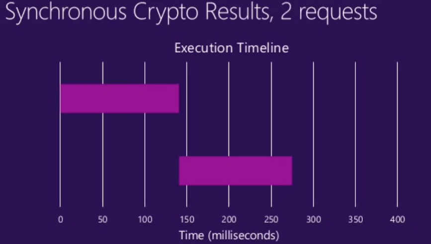

## 进程与线程

#### 进程

每当我们运行应用程序时，操作系统都会创建该**应用程序的实例对象**，该实例对象就是应用程序的进程，操作系统会按照 **进程** 为单位为应用程序分配资源，比如内存，这样程序才能够在计算机操作系统运行起来。

#### 线程

**线程**是被包裹在进程之中的，是**进程中的实际运作单位**，一条线程指的就是进程中的一个单一顺序的控制流。

每条线程都是一个待办列表，准备被 CPU 执行。

## JavaScript 是单线程还是多线程

在 Node.js 运行环境中，它为 JavaScript 代码的执行提供了一个主线程，通常我们所说的单线程指的就是这个主线程。主线程用来执行所有的同步代码。但是！Node.js 由 C++ 开发的时候，内部依赖了一个叫做 **`libuv`** 的 C++ 库。在这个库中，它维护了一个线程池，默认的情况下在这个线程池中存储了4个线程，JavaScript中的异步代码就是 **在这些线程中执行** 的。所以说 JavaScript 代码的运行依靠了不止一个线程，所以 JavaScript 本质上还是用了多线程的。

也就是说，JavaScript 只能说是在开发的感觉上是个单线程环境。**`libuv`** 会通过类似线程池的实现来模拟不同操作系统的异步调用（异步IO），对我们开发者来说 是感受不到的。

再说明一点：

* **Node.js 中最核心的是 V8 引擎（模改的浏览器V8），在 Node.js 启动后，会创建 V8 的实例，这个实例是多线程的！**

  其中有以下这些线程：

  * 主线程：编译、执行代码。
  * 编译/优化线程：在主线程执行的时候，可以优化代码。
  * 分析器线程：记录分析代码运行时间，为 Crankshaft 优化代码执行提供依据。
  * 垃圾回收的几个线程。

  所以说：简单的启动一个 Node.js 服务，可以看到会占用 **7** 个线程

  **然后** 我们再执行一个**异步IO读取文件**的操作，会看到线程数变成了 **11** 个，因为上面说了： `libuv` 默认开4个线程。

#### 实际应用

所以在 node.js或前端 编程时，在同步异步方法都有时，不要为了写代码简单，而使用同步方法，这样会导致执行起来没有利用多线程；要懂得异步方法会利用多线程，减少执行时间！

* 同步：

* 异步：

   