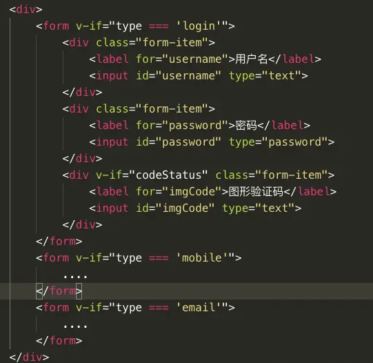
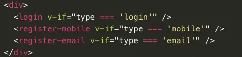
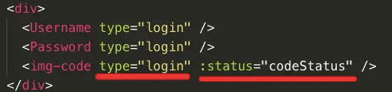
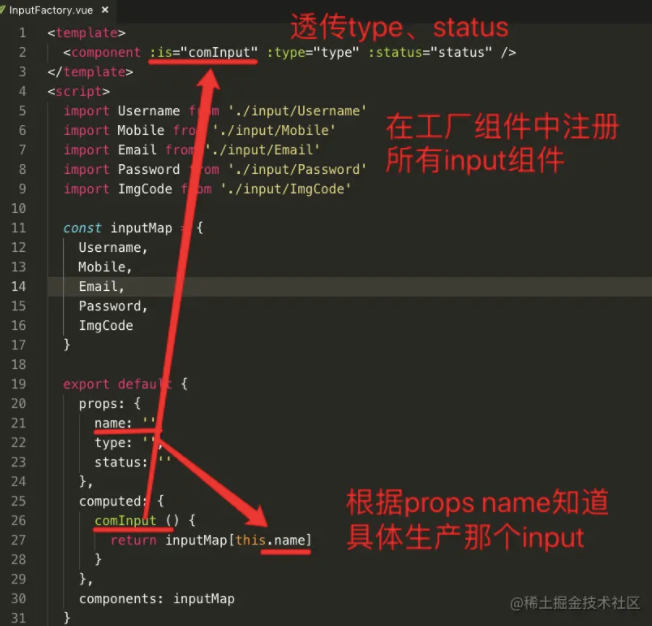

## 设计模式

设计模式，其实就是一种写代码时的设计思想。

#### 分类：

* 创建型
  * <font style="background-color:#ff0">单例模式</font>
  * 原型模式
  * 构造器模式
  * <font style="background-color:#ff0">工厂模式</font>
  * 抽象工厂模式
* 结构型
  * 桥接模式
  * <font style="background-color:#ff0">外观模式</font>
  * 组合模式
  * <font style="background-color:#ff0">装饰器模式</font>
  * <font style="background-color:#ff0">适配器模式</font>
  * <font style="background-color:#ff0">代理模式</font>
  * <font style="background-color:#ff0">享元模式</font>
* 行为型
  * 迭代器模式
  * 解释器模式
  * <font style="background-color:#ff0">观察者模式</font>
  * 中介者模式
  * 访问者模式
  * <font style="background-color:#ff0">状态模式</font>
  * <font style="background-color:#ff0">策略模式</font>
  * 命令模式
  * <font style="background-color:#ff0">模板模式</font>

#### 为什么要学习理解设计模式

我们在写代码，写页面时，为了可维护、可迭代、可读性、低耦合性等等，有时需要考虑 <font color='#EA0000'>**逻辑代码该怎么封装，组件该怎么封装**</font>，设计模式 就是 前人从以往的经验中总结出来的一些 **书写代码的思想**（或者说套路），帮助我们<font style="background-color:#ff0">更快的**做决定、做判断**</font>，为了<font style="background-color:#ff0">**更好的应对**</font>我们的场景，我们眼下这块代码该怎么写。

**设计模式（Design Pattern）是一套被反复使用、多数人知晓的、经过分类的、代码设计经验的总结**（来自百度百科）

#### 注意：

* 我们实现某块功能，某个组件时，可以结合多个设计模式


### 外观模式（Facade）

#### 概念：

* 为子系统中的 **一组接口 **提供一个一致的界面，外观模式定义了 **一个<font style="background-color:#ff0">高层接口</font>**

  这个 **接口** 使得这一子系统更加容易使用。

  引入外观角色之后，用户<font color='#EA7500'>只需要直接与外观角色交互</font>

  用户与子系统之间的复杂关系<font style="color:#000;background-color:#ff0">由外观角色内部来处理</font>，从而<font color='#8600FF'>降低了系统的耦合度</font>

#### 应用示例：

普通登录、邮箱登录、手机登录，三个表单，那么我们就要判断该显示那个表单

 

先经过一层简单封装，变为：

 

逻辑处理还是留在了使用层

所以，使用 外观模式：

 

将逻辑判断和处理留在封装组件的内部，组件变得可读，可随意抽离


### 单例模式

#### 概念：

* 保证一个类<font color='#EA0000'>只有一个实例</font>（<font color='#8600FF'>提供一个访问它的全局访问点</font>，无论”创建“多少次，都只返回第一次所创建的那个唯一的实例）
* 单例模式是创建型设计模式的一种。**<font style="background-color:#ff0">针对全局仅需一个实例</font>**的场景

#### 实现需求：

* **具备判断自己是否已经创建过该实例的的能力**

#### 理解与应用

* jquery 我们全局需要几个，只需要一个，所以这就是符合单例模式的

* 逻辑代码层面：

  * 静态方法实现：

    ```js
    // 静态方法的实现
    class SingleLoading {
      show () {
        console.log('这是一个单例Loading')
      }
      static getInstance(){
        // 判断是否已经创建过实例
        if (!SingleLoading.instance) {
          // 将创建的实例对象保持下来
          SingleLoading.instance = new SingleLoading()
        }
        return SingleLoading.instance
      }
    }
    const loading1 = SingleLoading.getInstance()
    const loading2 = SingleLoading.getInstance()
    console.log(loading1 === loading2) // true
    ```

  * 闭包实现

    ```js
    class SingleLoading {
      show () {
        console.log('这是一个单例Loading')
      }
    }
    SingleLoading.getInstance = (function(){
      // 定义自由变量instance，模拟私有变量
      let instance = null
    
      return function(){
        if(!instance) {
           // 如果为null则new出唯一实例
          instance = new SingleLoading()
        }
        return instance
      }
    })();
    const loading3 = new SingleLoading().getInstance()
    const loading4 = new SingleLoading().getInstance()
    console.log(loading3 === loading4)
    ```

* 封装组件层面：

  我们页面中有时需要显示弹框，而且同时只能显示一个（也就是说只需要一个），那么就可以用<font color='#EA7500'>单例模式的思想</font>来封装一个 **弹框组件**

  实现的**核心思想**：<font style="background-color:#ff0">是否已创建弹框，没有则创建，有则直接使用</font>

  这样做的好处：<font color='#8600FF'>避免了频繁创建和销毁实例，减少内存消耗</font>


### 工厂模式

#### 分类：

- `简单工厂模式`、`工厂方法模式`、`抽象工厂模式`

#### 概念：

* `简单工厂模式`又叫`静态工厂模式`，由一个工厂对象决定创建某一种产品对象类的实例。主要用来创建同一类对象。（白话：只要我能做，要什么样的，做什么样的）

#### 理解与应用：

* 工厂生产零件，我们<font color='#8600FF'>常用的（需要重复用）的</font>细小零件都可以采用工厂模式来生产，工厂会<font color='#8600FF'>根据我们的要求</font>来生产零件。

* 在**组件封装**层面：例如一些按钮，输入框，我们在很多地方要使用，但是每次使用这些小零件的时候，可能存在<font color='#EA0000'>细微的差别</font>，那么，我们就要将我们的建造的那个<font style="background-color:#ff0">**工厂**</font>，尽可能打造成一个<font color='#EA7500'>尽可能灵活的工厂</font>，让其可以做<font color='#8600FF'>各种型号的螺丝</font>

  展示一个很好的 输入框的工厂组件 案例

   

  

* 在**逻辑代码封装**层面：例如 不同的管理人员，有不同的权限，也可以用简单工厂模式来整理

  ```js
  //User类
  class User {
    //构造器
    constructor(opt) {
      this.name = opt.name;
      this.viewPage = opt.viewPage;
    }
  
    //静态方法
    static getInstance(role) {
      switch (role) {
        case 'superAdmin':
          return new User({ name: '超级管理员', viewPage: ['首页', '通讯录', '发现页', '应用数据', '权限管理'] });
          break;
        case 'admin':
          return new User({ name: '管理员', viewPage: ['首页', '通讯录', '发现页', '应用数据'] });
          break;
        case 'user':
          return new User({ name: '普通用户', viewPage: ['首页', '通讯录', '发现页'] });
          break;
        default:
          throw new Error('参数错误, 可选参数:superAdmin、admin、user')
      }
    }
  }
  ```

  


### 状态模式

#### 概念：

* 行为基于它的状态改变而改变。属于行为型模式
* 在状态模式中，我们创建表示<font color='#8600FF'>各种状态</font>的对象和一个<font color='#8600FF'>行为随着状态改变</font>而<font color='#8600FF'>改变的context对象</font>
* 每个阶段的状态都是固定好的

#### 理解与应用：

* 实现<font color='#8600FF'>tab切换</font>时，我们用 `curActive` 来标识当前状态，封装好的组件就是一个“context”，这就是一种状态模式的应用
* 实现<font color='#8600FF'>状态进度条</font>时，也是状态模式的一种应用

##### 完善的状态模式

* 真正完善的状态模式，还需要提供<font color='#EA7500'>状态随意切换的功能</font>，提供各种<font color='#EA7500'>切换状态方式</font>（好比浏览器的前进后退）。


### 策略模式

扩展性极强

#### 概念：

* 一个类的行为或其算法，可以在运行时更改。属于行为型模式
* 在策略模式中，我们创建<font color='#8600FF'>**表示各种策略的对象**</font>和一个<font color='#8600FF'>**行为随着策略对象改变而改变的 context 对象**</font>。策略对象改变 context 对象的执行算法

#### 理解与应用：

* 状态模式和策略模式很相似，但是策略模式的内部处理可以是外部使用时再决定如何处理，状态模式都是已经准备好的。

  * 状态模式：程序运行过程中不同状态之间可以随意转换
  * 策略模式：选择一种策略执行一次

* 策略模式说简单一点，就是要对一些事情做处理，但是 <font color='#8600FF'>**处理方式**</font> <--- 由使用策略时<font color='#8600FF'>选择的策略</font>决定。也就是，实现不同东西，使用不同策略

* 在组件封装层面：

  封装全局提示框时：

  可以先封装3种效果及功能的"策略"，然后给外界提供一个 "context"组件，context负责组织和**按需调用**我们的策略代码。

  也就是，我们的提示框内容，以及提示框按钮的功能都要封装成：<font color='#EA0000'>使用时</font>传递这些**内容和功能**


### 模板模式

#### 概念：

* 定义一个操作中的算法的**<font color='#8600FF'>骨架</font>**，但是将一些步骤<font color='#EA7500'>延迟</font>到子类中，模板方法使得子类可以不改变一个算法的结构即可**<font color='#8600FF'>重定义该算法的某些特定步骤</font>**。

#### 理解与应用：

* <font color='#EA0000'>**封装不变的部分，扩展可变的部分**</font>
* 例如我们渲染列表时，都要经过获取数据、显示正在加载、获取到数据后就渲染列表、是否没有更多数据的状态，这些固定的部分就可以封装成一个骨架，我们每次渲染列表时，都用这个骨架，及不必每次都声明一个 `data、loading、noMore`等等变量来每次实现一遍这种固定套路。
* 其实 `vue`、`react` 宏观上就是模板模式，各种响应式，各种依赖，简化我们从Model层到View层要做的很多事情


### 享元模式

#### 概念：

* 主要用于减少创建对象的数量，以<font color='#8600FF'>减少内存占用</font>和<font color='#8600FF'>提高性能</font>。这种类型的设计模式属于结构型模式，它提供了减少对象数量从而改善应用所需的对象结构的方式。
* 在有大量对象时，有可能会造成内存溢出，我们把其中共同的部分抽象出来，如果有相同的业务请求，直接返回在内存中已有的对象，避免重新创建。

#### 理解应用：

*  JAVA 中的 String，如果有则返回，如果没有则创建一个字符串保存在字符串缓存池里面。 
* 数据库的数据池。
* **优点：**大大减少对象的创建，降低系统的内存，使效率提高。


### 观察者模式

#### 概念：

* 当对象间存在一对多关系时，则使用观察者模式（Observer Pattern）。比如，当一个对象被修改时，则会自动通知依赖它的对象。观察者模式属于行为型模式。
* 一个对象<font color='#8600FF'>状态改变</font>给其他对象<font color='#8600FF'>通知</font>的问题，而且要考虑到<font color='#8600FF'>易用和低耦合</font>，保证<font color='#8600FF'>高度的协作</font>。

#### 理解应用：

* `redux` 其实就是一种观察者模式，有发布、订阅等等
* `vue2` 的源码中其实就应用了观察者模式，收集依赖，同时在这些依赖的角度，就是在订阅这个数据，当数据变化时，观察者 触发视图更新。


### 适配器模式

#### 概念：

* 适配器模式（Adapter Pattern）是作为两个不兼容的接口之间的桥梁。这种类型的设计模式属于结构型模式，它**<font color='#EA0000'>结合了两个独立接口的功能</font>**。

#### 理解应用：

* 将一个已有的类的接口，转化成客户希望的另外一个接口（方法或属性），让原本由于接口不兼容而不能一起工作的那些类可以正常协作，简单理解就是为了兼容而生的“转换器”

* 逻辑代码封装层面：

  当我们为我们的项目封装 请求接口 `request[type](url, data, config)` 方法时，其实就可以应用适配器模式

  因为在使用 get 请求时，我们要传的是 params

  而在使用 post 请求时，我们要传的是 data
  
  但是我们为了使用时方便简洁，我们在封装时，request 的<font color='#8600FF'>第二个参数 `data`</font> 就要采用适配器思想，不管是要传 **`params`** 还是 **`data`** 都 从第二个参数传对象即可。
  
  之后，原本是一个get请求格式，一个post请求格式，就很好的**<font color='#EA0000'>兼容</font>**为一个 request 请求格式
  
* 提高了我们封装出的功能的**<font color='#8600FF'>灵活性</font>**


### 装饰者模式

#### 概念：

* 装饰模式指的是在不必改变原类文件和使用继承的情况下，<font color='#EA0000'>动态地扩展一个对象的功能</font>。它是通过创建一个包装对象，也就是装饰，来包裹真实的对象
* 装饰类和被装饰类可以<font color='#EA0000'>独立发展</font>，<font color='#EA0000'>不会相互耦合</font>，装饰模式是继承的一个替代模式，装饰模式可以动态扩展一个实现类的功能
* 动态地给一个对象添加一些额外的职责。就增加功能来说，装饰器模式相比生成子类更为灵活。

#### 理解与应用：

* TS下就有装饰器

* 在Java中，可以用来降低子类的膨胀

* 封装组件层面：

  我们在使用某些组件时，当前这个组件的功能不能满足我们的需求，例如 input，我们很多input都需要带有校验功能

  这时，我们就可以封装一个装饰器思想的组件，这个组件给传入的Input提供校验功能，antDesign、elementUI等 校验表单就提供了类似的**<font color='#8600FF'>包裹性组件</font>**

  ```vue
  <valid-input field="username" options="[{ rule: required, message: '用户名必须' }]">
    <input v-model="username" type="text" />
  </valid-input>
  ```

  还有，我有次在封装一个弹窗框时，其实也涉及这个思想，就是**弹窗的性质**就像一种装饰器，我们想弹窗显示某个组件，就使用这个弹窗组件<font color='#8600FF'>**包裹装饰**</font>（再结合上**外观模式**，我们把弹窗相关的功能都封装到这个组件中，易于使用）


### 代理模式

#### 概念：

* 在代理模式（Proxy Pattern）中，一个类代表另一个类的功能。这种类型的设计模式属于结构型模式。
* 为其他对象提供一种代理以控制对这个对象的访问
* 和适配器模式的区别：适配器模式主要改变所考虑对象的接口，而代理模式不能改变所代理类的接口。
* 和装饰器模式的区别：装饰器模式为了增强功能，而代理模式是为了加以控制。

#### 理解与应用：

* `Vue3` 用到的 `proxy`
* 想在访问一些内容时做一些控制，就考虑用代理模式
* 可以用来避免已有代码的过度封装，保证代码职责清晰


## 参考文档：

[菜鸟-各种模式的介绍都有](https://www.runoob.com/design-pattern/state-pattern.html)

[掘金文章](https://juejin.cn/post/6844903768333500429)

[掘金文章](https://juejin.cn/post/6844903789019807757)

