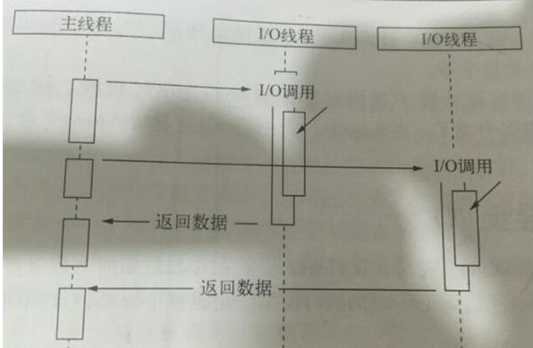

## 进程与线程

#### 进程

每当我们运行应用程序时，操作系统都会创建该**应用程序的实例对象**，该实例对象就是应用程序的进程，操作系统会按照 **进程** 为单位为应用程序分配资源，比如内存，这样程序才能够在计算机操作系统运行起来。

#### 线程

**线程**是被包裹在进程之中的，是**进程中的实际运作单位**，一条线程指的就是进程中的一个单一顺序的控制流。

每条线程都是一个待办列表，准备被 CPU 执行。

## JavaScript 是单线程还是多线程

在 Node.js 运行环境中，它为 JavaScript 代码的执行提供了一个主线程，通常我们所说的单线程指的就是这个主线程。主线程用来执行所有的同步代码。但是！Node.js 由 C++ 开发的时候，内部依赖了一个叫做 **`libuv`** 的 C++ 库。在这个库中，它维护了一个线程池，默认的情况下在这个线程池中存储了4个线程，JavaScript中的异步代码就是 **在这些线程中执行** 的。所以说 JavaScript 代码的运行依靠了不止一个线程，所以 JavaScript 本质上还是用了多线程的。

也就是说，在Node.js环境下，JavaScript 只能说是在开发的感觉上是个单线程环境。**`libuv`** 会通过类似线程池的实现来模拟不同操作系统的异步调用（异步IO），对我们开发者来说 是感受不到的。

## Node.js 的线程

#### Nodes.js 有哪些线程？

**Node.js 中最核心的是 V8 引擎（模改的浏览器V8），在 Node.js 启动后，会创建 V8 的实例，这个实例是多线程的！**

其中有以下这些线程：

* 主线程：编译、执行代码。
* 编译/优化线程：在主线程执行的时候，可以优化代码。
* 分析器线程：记录分析代码运行时间，为 Crankshaft 优化代码执行提供依据。
* 垃圾回收的几个线程。

所以说：简单的启动一个 Node.js 服务，可以看到会占用 **7** 个线程

**然后** 我们再执行一个**异步IO读取文件**的操作，会看到线程数变成了 **11** 个，因为上面说了： `libuv` 默认开4个线程。 

#### Node.js 中 工作线程池

在Node.js中，**我们所写的 `JS` 代码，都是要拿回主线程中执行的**，

其它线程（`libuv`提供的线程）也称之为 是一个 `Worker Poll` 工作线程池

执行的任务都是 `Node.js` 中的一些 `API`：

* **I/O 密集型任务**：
  * DNS：`dns.loopup()`
  * 文件系统：读取文件等
* **CPU 密集型**：
  * `Crypto` 加密相关任务：`crypto.pbkdf2()`、`crypto.scrypt()`、`crypto.randomBytes()`、`crypto.randomFill()`、`crypto.generateKeyPair()`
  * `Zlib`：压缩相关函数，除那些显式同步调用的 `API` 之外，都适用 `libuv` 的线程池。

在许多 Node.js 应用程序中，这些 API 是工作线程池任务的唯一来源。

此外应用程序和模块可以使用 [C++ 插件](https://nodejs.org/api/addons.html) 向工作线程池提交其它任务。

以上这些任务完成后，会将数据返回给 **主线程**中注册的**回调函数**，

 将回调函数 排入 `Event Loop` 的事件队列中，等待在 **主线程** 中执行

 

#### 实际应用

所以在 node.js或前端 编程时，在**同步异步方法都有**时，不要为了写代码简单，而使用同步方法，这样会导致执行起来没有**利用多线程**；要懂得异步方法会利用多线程，**减少执行时间**！

* 同步：

* 异步：

   

## 浏览器中的线程

浏览器中的线程 和 Node 虽然都是V8引擎，但是用到的线程还是有不少区别：

列举一些浏览器环境中的**常驻线程**：

1. **GUI渲染线程**

   - 负责渲染浏览器界面，解析HTML，CSS，构建DOM树和 `RenderObject` 树，布局和绘制等。
   - 当界面需要重绘（Repaint）或由于某种操作引发回流(`reflow`)时，该线程就会执行
   - 注意，**GUI渲染线程与JS引擎线程是互斥的**，当 `JS` 引擎执行时GUI线程会被挂起（相当于被冻结了）
   - GUI更新会被保存在一个队列中 **等到JS引擎空闲时** 立即被执行。

   

2. **`JS`引擎线程**

   - 也称为 `JS` 内核，负责解析 Javascript 脚本，运行代码

   - `JS`引擎一直等待着任务队列 `Event Loop` 中任务的到来，然后执行。

     打开一个Tab页（就是一个进程），一个页面无论什么时候都只有一个JS线程在运行JS程序

   - 同样注意，**GUI渲染线程与JS引擎线程是互斥的**，所以如果JS执行的时间过长，这样就会造成页面的渲染不连贯，导致页面渲染加载阻塞。

   

3. **异步http请求线程**

   - 在XMLHttpRequest在连接后是通过浏览器新开一个线程请求
   - 将检测到状态变更时，如果设置有回调函数，异步线程就**产生状态变更事件**，将这个回调再放入事件队列中。再由JavaScript引擎执行。

   

4. **定时触发器线程**

   - 传说中的`setInterval`与`setTimeout`所在线程
   - 浏览器定时计数器并不是由JavaScript引擎计数的,（因为JavaScript引擎是单线程的, 如果处于阻塞线程状态就会影响记计时的准确）
   - 因此通过单独线程来计时并触发定时（计时完毕后，添加到事件队列中，等待JS引擎空闲后执行）

   

5. **事件触发线程**

   - 归属于浏览器而不是`JS`引擎，用来控制事件循环

     其实是和 **`libuv`** **相似的作用**：

     分别是 **维护** 浏览器 和 `node.js` **事件循环 `Event Loop`**

     说白了就是：给`JS`引擎线程安排事情！

   - 当`JS`引擎执行代码块如 `setTimeOut` 时（也可来自浏览器内核的其他线程,如鼠标点击、AJAX异步请求等），会将对应任务添加到事件线程中

   - 当对应的事件符合触发条件被触发时（例如我们触发了一个点击事件）

     该线程会把事件添加到待处理队列的队尾，等待`JS`引擎的处理

个人感觉，浏览器因为要做交互、渲染等原因，所以线程设计比较复杂。

## 总结：

#### 事件循环 在 浏览器 和 Node 中

* 浏览器中：

  事件循环是：**JS代码** 和 **浏览器API调用**（`setTimeout`、`AJAX`、`监听事件`）之间的一个桥梁

* Node 中：

  事件循环是：**JS代码** 和 **系统调用**（`file system`、`network`）之间的一个桥梁

因为环境不同，所以 Node 和 浏览器的 事件循环 `Event Loop` 也是有些差异的。

###  参考文档

[不要阻塞你的事件循环（或是工作线程池）](https://nodejs.org/zh-cn/docs/guides/dont-block-the-event-loop/)