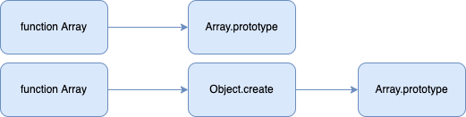
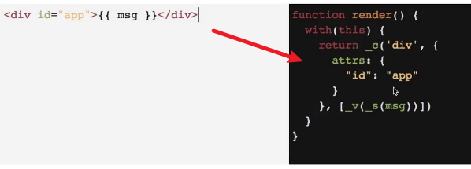
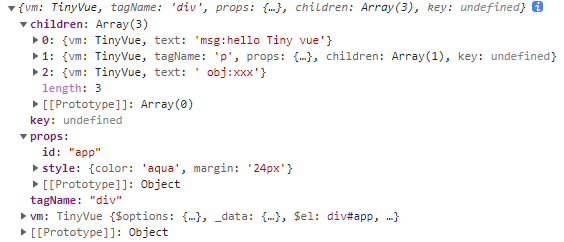
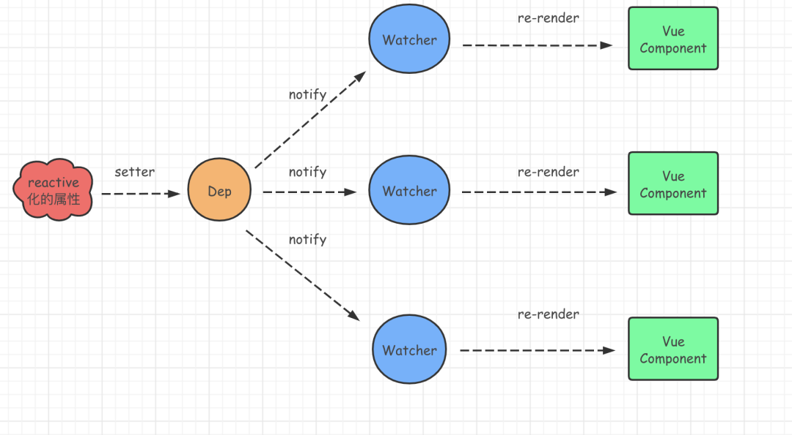
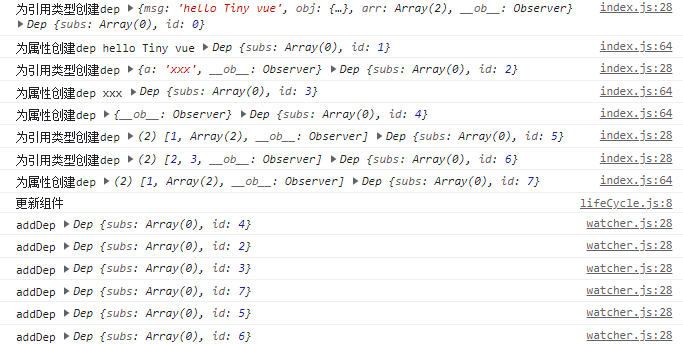

# Vue 原理

## 初始化Vue环境

### Rollup

概述：虽然再最新的 `JavaScript` 语言中已经支持了<font color='#8600FF'>模板语法</font>，但是在过去 `JavaScript` 并没有将此功能作为语言的核心。

导致目前主流的浏览器并不能很好的支持模块语法，所以<font color='#8600FF'>模块打包器</font>应运而生。

`Rollup` 就是一个 **`JavaScript` 模块打包器**，能够实现开发时使用模块、构建时剥离模块或进行模块规范的转换。

`Webpack` 主要为 **工程化项目** 进行打包，`Rollup` 更专注于打包 **库文件**。

### 环境初始化

* 初始化环境 `npm init -y`

* 安装项目依赖

  ```shell
  npm install --save-dev rollup @babel/core @babel/preset-env rollup-plugin-babel rollup-plugin-local-resolve
  ```

  `rollup`： 模块打包工具

  `@babel/core`： babel 核心模块

  `@babel/preset-env`： 转换高级 `JavaScript` 语法

  `rollup-plugin-bable`：rollup 插件，用来在 rollup 中调用 babel

  `rollup-plugin-local-resolve`： rollup 插件，用来进行模块解析，导入模块时可自动解析模块文件夹中的 `index.js`

  例如将 `.files` 解析为 `./file/index.js`

* 创建 `Rollup` 配置文件，在应用根目录下新建 `rollup.config.js` 文件

  ```js
  import babel from "rollup-plugin-babel";
  import localResolver from "rollup-plugin-local-resolve";
  
  export default {
    // 打包入口文件
    input: "src/index.js",
    // 打包出口设置
    output: {
      // 打包文件的存储路径及文件名称
      file: "dist/TinyVue.js",
      // 指定打包之后的代码使用什么类型的模块规范
      // umd 通用模块规范, 该规范既可以在浏览器环境(AMD、无模块)中使用, 也可以在 Node 环境(CommonJS)中使用
      format: "umd",
      // 在浏览器中使用 umd 模块规范时, 打包结果会被放置在一个对象中, 该对象会被挂载到 window 下面
      // name 选项指定的是对象名称
      // window.TinyVue
      name: "TinyVue",
      // 指定源代码和打包代码的之间的映射关系
      // 在浏览器中运行的是打包之后的代码, 如果代码报错, 默认报的也是打包后代码中的报错位置.
      // 但是我们需要知道源代码中代码的报错位置
      sourcemap: true,
    },
    plugins: [
      // 使用 babel 将高级 JavaScript 语法转换成 ECMAScript 5
      babel({
        // 转换高级 JavaScript 语法
        presets: ["@babel/preset-env"],
        // 不转换 node_modules 文件夹中的代码
        exclude: "node_modules/**",
      }),
      // 将路径 ./files 解析成 ./files/index.js
      localResolver(),
    ],
  };
  ```

  

* ss


源码：

`/src/index.js`

```js
function TinyVue(params) {
  console.log("Tiny Vue");
}

window.TinyVue = TinyVue;

export default TinyVue;
```

打包后的代码：

```js
(function (global, factory) {
    // 如果支持CommonJS模块，使用CommonJS模块规范
  typeof exports === 'object' && typeof module !== 'undefined' ? module.exports = factory() :
  // 如果支持amd模块，使用amd模块
  typeof define === 'function' && define.amd ? define(factory) :
  // 否则使用全局对象来挂载我们index导出的内容
  // 在浏览器中this、window、self都可以获取到全局对象，node.js中通过global获取全局对象
  // globalThis无论是在浏览器环境还是在node.js环境都可以获取全局对象
  (global = typeof globalThis !== 'undefined' ? globalThis : global || self, global.TinyVue = factory());
})(this, (function () { 'use strict';

  function TinyVue(params) {
    console.log("Tiny Vue");
  }

  window.TinyVue = TinyVue;

  // 这里就相当于是 export default TinyVue; 
  return TinyVue;

}));
//# sourceMappingURL=TinyVue.js.map

```

### 响应式原理（数据劫持）

#### 什么是数据劫持

监听对数据的操作，当数据被操作时，我们可以立刻知道

#### 为什么需要数据劫持

用来在数据更新后，触发视图更新，所以要监听数据变化

#### 初始化

使用混入方式初始化 `TinyVue`

```js
import { initMixin } from "./init";

// TinyVue 构造函数
function TinyVue(options) {
  this._init(options);
}

// 初始化vue
initMixin(TinyVue);
```

#### 挂载 `Options`

```js
TinyVue.prototype._init = function (options) {
    // 给实例上挂载配置选项，方便实例其它方法使用
    this.$options = options;
  };
```

#### 初始化流程

`src/state.js`

```js
import { observe } from "./observe";
import { isFunction } from "./utils";

export function initState(vm) {
  // 获取开发者选项
  const options = vm.$options;
  // 判断 data 是否存在
  if (options.data) {
    // 初始化 data
    initData(vm);
  }
}

function initData(vm) {
  let data = vm.$options.data;
  // 如果data值为函数，调用获取数据，并且要注意调用时的this指向
  // 因为开发者可能会在给 data 传递函数时，在函数内部使用this，所以要提供vm实例
  data = isFunction(data) ? data.call(vm) : data;
  // 进入数据劫持
  observe(data);
  console.log(data);
  data.obj = { a: 1 };
}
```

#### 对象属性劫持

```js
import { isObject } from "../utils";

// 劫持数据
export function observe(data) {
  // 只有引用数据类型需要劫持，因为只要劫持了所有引用类型，就劫持了全部数据
  if (!isObject(data)) return;
  return new Observer(data);
}

// 因为 类的扩展性比较好，我们又需要劫持对象和数组，所以我们使用类来做数据劫持
class Observer {
  constructor(data) {
    this.walk(data);
  }
  // 循环要劫持的对象
  walk(data) {
    // 遍历对象
    Object.keys(data).forEach((key) => {
      defineReactive(data, key, data[key]);
    });
  }
}

// 劫持某个对象的某个属性
function defineReactive(data, key, value) {
  // 继续劫持 属性值 为 引用类型的数据
  observe(value);

  // 下面不使用 data[key] 而使用 value，是为了形成闭包，缓存value
  // 相当于在函数内部 let value = value;
  // 如果直接使用 data[key]，当我们修改值时，会造成死循环，因为会不断的触发set函数，所以利用闭包，使用缓存好的value
  Object.defineProperty(data, key, {
    get() {
      console.log("获取值");
      return value;
    },
    set(newValue) {
      console.log("设置值");
      // 新值也需要劫持
      observe(newValue);
      value = newValue;
    },
  });
}

```

##### 原理推出 <font color='#8600FF'>性能优化原则</font>

* <font style="background-color:#ff0">不要</font>将所有数据都<font style="background-color:#ff0">放在 data</font> 中，因为 data中的每个数据都会被添加 getter 和 setter
* 数据层次不要嵌套过深，尽量<font style="background-color:#ff0">扁平化</font>
* <font style="background-color:#ff0">不要频繁获取数据</font>，因为将来在 getter 中会有很多逻辑
* 如果数据不需要修改，可以使用 <font color='#8600FF'>**`Object.freeze`**</font> 进行属性冻结。


#### 数据代理

为了通过 `Vue实例.msg` 直接可以获取 `data` 中的数据

我们需要给 `Vue实例` 的 **`data`** 设置数据<font color='#8600FF'>代理</font> 为 `Vue 实例`

`initState.js`

```js
function initData(vm) {
  let data = vm.$options.data;
  // 如果data值为函数，调用获取数据，并且要注意调用时的this指向
  // 因为开发者可能会在给 data 传递函数时，在函数内部使用this，所以要提供vm实例
  data = vm._data = isFunction(data) ? data.call(vm) : data;
  // 遍历data中数据
  for (let key in data) {
    // 代理data中属性
    proxy(vm, key, "_data");
  }
  // 进入数据劫持
  observe(data);
}

/**
 * 代理 source 属性到 target 目标对象
 * @param target 目标对象
 * @param key
 * @param source
 */
function proxy(target, key, source) {
  Object.defineProperty(target, key, {
    get() {
      return target[source][key];
    },
    set(newValue) {
      target[source][key] = newValue;
    },
  });
}

```


#### 数组劫持

数组本质虽然是一个对象，但是数组存放数据一般<font color='#EA0000'>较多</font>，如果我们为每个元素都添加 `getter` 和 `setter` 来劫持的话，<font color='#EA7500'>会导致性能变差</font>

因为开发者经常使用<font color='#8600FF'>**数组变异方法** （会修改原数组的方法）</font>来修改数组，所以 `Vue` 对数组的变异方法进行了<font color='#EA0000'>**重写**</font>。

7个变异方法：`push`、`pop`、`shift`、`unshift`、`reverse`、`sort`、`splice`

那么，我们在重写 变异方法时，使用了<font color='#EA0000'> **篡改原型链** </font>的方式

 


`observe/index.js` 

判断如果是数组

* <font style="background-color:#ff0">修改原型链</font>
* <font style="background-color:#ff0">劫持数组每个元素</font>，确保数组元素中的引用类型也被劫持

```js
    // 如果是数组
    if (isArray(data)) {
      // 修改原型链
      data.__proto__ = newPrototype;
      // 劫持数组每个元素，因为数组元素可能还是引用类型
      this.observeArray(data);
    } else {
      // 如果是对象，遍历劫持
      this.walk(data);
    }


  // 劫持数组元素
  observeArray(data) {
    data.forEach((item) => {
      observe(item);
    });
  }
```

编写新的原型对象

* <font color='#EA0000'>重写</font>数组的变异方法

`observe/array.js`

```js
// Object.create()创建一个对象，原型为数组的原型对象
export const newPrototype = Object.create(Array.prototype);

// 数组变异方法
const methods = [
  "push",
  "pop",
  "shift",
  "unshift",
  "splice",
  "sort",
  "reverse",
];

methods.forEach((method) => {
  // 重写数组变异方法
  newPrototype[method] = function (...args) {      
      // 触发视图更新

    // 实现原有功能（调用原方法）
    Array.prototype[method].call(this, ...args);
  };
});

```

* 确保数组新增元素时，新增元素也被劫持

  将新增元素收集到一个数组中，再次使用 `Observer类` 的劫持数组方法。

  使用`defineProperty` 给 `data` 添加一个<font color='#8600FF'> `__ob__`属性</font> 用来获取 `Observer类`

  `observe/index.js`，**<font color='#EA0000'>注意不可遍历</font>**

  ```js
    constructor(data) {
      // 给 data 提供 类的劫持数组方法
      Object.defineProperty(data, "__ob__", {
        value: this,
        // 使用defineProperty添加 __ob__ 就是为了
        // 设为不可遍历属性，以防下面遍历对象劫持属性时，添加__ob__又，到这里出现死循环
        enumerable: false,
      });
  ```

  `observe/array.js`

  使用 `Observer类` 的劫持数组方法<font color='#EA0000'> **`observeArray` 劫持新增元素**</font>

  ```js
  methods.forEach((method) => {
    newPrototype[method] = function (...args) {
      // 收集新增的数组元素
      let inserted = null;
      switch (method) {
        case "splice":
          inserted = args.slice(2);
          break;
        case "push":
        case "unshift":
          inserted = args;
          break;
      }
  
      // 劫持新增的元素
      if (inserted) {
        this.__ob__.observeArray(inserted);
      }
  
      // 实现原有功能（调用原方法）
      Array.prototype[method].call(this, ...args);
    };
  });
  
  ```

  避免重复劫持

  `observe/index.js`

  ```js
  // 劫持引用类型数据
  export function observe(data) {
    // 只有引用数据类型需要劫持，因为只要劫持了所有引用类型，就劫持了全部数据
    if (!isObject(data)) return;
    // 避免重复劫持
    if (data.__ob__) return;
    return new Observer(data);
  }
  ```

  

## 模板编译原理

`vue` 使用 `html` 模板构建用户界面，但是直接通过 `html` 模板整体替换的方式 渲染 DOM 更新DOM效率比较低。

初始化：

*  `html`模板 -> `ast` 语法树 -> `render` 函数 -> 虚拟DOM -> 渲染成真实DOM

更新：

* 重新调用 `render` 函数 -> 新的虚拟DOM -> 新旧虚拟DOM对比 -> 更新需要更新的部分

### 获取模板

模板优先级：<font color='#8600FF'>**`render` 函数**</font> -> <font color='#8600FF'>**`template` 选项**</font> -> <font color='#8600FF'>**`el` 选项**</font>

根据优先级获取 模板

`init.js`

```js
// 初始化混入
export function initMixin(TinyVue) {
  TinyVue.prototype._init = function (options) {
     // ...
    // 挂载
    if (options.el) {
      console.log("进入挂载");
      this.$mount(options.el);
    }
  };

  TinyVue.prototype.$mount = function (el) {
    // 获取真实 el 的 DOM，挂载到vue实例上
    this.$el = document.querySelector(el);
    // 获取模板
    let options = this.$options;
    let template;
    // 判断是否存在render, 如果存在render就不需要解析模板，可以直接渲染虚拟DOM
    if (!options.render) {
      template = options.template;
      if (!template) {
        // 获取整个vue模板
        template = this.$el.outerHTML;
        console.log(template);
      }
    }
  };
}
```

### 解析模板

从头到尾处理 **html模板字符串** 进行匹配，匹配：

* 开始标记
* 标记属性
* 标记内容
* 结束标记

匹配到以后先从匹配结果中留下有用的信息，再将匹配到的整体内容从html模板字符串中删除，循环往复，直到 html模板字符串为空，模板解析结束。

判断条件：

* 如果模板的开始位置是 `<` ，就是标签，否则就是内容

* 如果开始位置是 `<`，进一步确定是开始标签还是结束标签

  如果是<font style="background-color:#ff0">开始标签</font>匹配出 **<font color='#8600FF'>标签名</font>** 和 **<font color='#8600FF'>标签属性</font>**

  如果是<font style="background-color:#ff0">结束标签</font>，匹配出 **结束标签名**

* 如果模板的开始位置是内容，匹配出内容

  匹配完成后再模板中删除这段匹配结果

```js
// 匹配能够作为标签的字符
const ncname = `[a-zA-Z_][\\-\\.0-9_a-zA-Z]*`;
// 获取标签名称
const qnameCapture = `((?:${ncname}\\:)?${ncname})`;
// 匹配开始标签 <div id="app"></div> => <div
const startTagOpen = new RegExp(`^<${qnameCapture}`);
// 匹配属性
const attribute =
  /^\s*([^\s"'<>\/=]+)(?:\s*(=)\s*(?:"([^"]*)"+|'([^']*)'+|([^\s"'=<>`]+)))?/; // a=b  a="b"  a='b'
// 匹配开始标记是否结束
const startTagClose = /^\s*(\/?)>/;
// 匹配结束标签 </div>
const endTag = new RegExp(`^<\\/${qnameCapture}[^>]*>`);
// 匹配 {{}} 中的内容
const defaultTagRE = /\{\{((?:.|\r?\n)+?)\}\}/g;

export function parserHTML(template) {
  while (template) {
    // 确定模板的开始位置是标签还是内容
    const index = template.indexOf("<");
    if (index === 0) {
      // 继续确定是 开始标签 还是 结束标签
      const startTagMatch = matchStartTag();
      if (startTagMatch) {
        start(startTagMatch.tagName, startTagMatch.attrs);
        continue;
      }
      // 如果时结束标签
      const endTagMatch = template.match(endTag);
      if (endTagMatch) {
        template = template.substring(endTagMatch[0].length);
        end(endTagMatch[1]);
        continue;
      }
    }
    // 开始位置是内容
    if (index > 0) {
      // 获取内容
      const content = template.substring(0, index);
      if (content) {
        text(content);
        // 删除内容
        template = template.substring(content.length);
      }
    }
  }

  function matchStartTag() {
    const startTag = template.match(startTagOpen);
    if (startTag) {
      const result = {
        // 标签名
        tagName: startTag[1],
        // 属性
        attrs: [],
      };
      // 删除以匹配完成的标签部分
      template = template.substring(startTag[0].length);
      // 匹配标记属性
      let matchStartTagClose;
      let matchAttribute;
      // 如果：
      // 1. 开始标记没结束
      // 2. 开始标记有属性
      // 证明有属性需要处理
      while (
        !(matchStartTagClose = template.match(startTagClose)) &&
        (matchAttribute = template.match(attribute))
      ) {
        // 添加属性
        result.attrs.push({
          name: matchAttribute[1],
          value: matchAttribute[3],
        });
        // 删除已匹配完成的属性部分
        template = template.substring(matchAttribute[0].length);
      }
      //删除结束标记
      template = template.substring(matchStartTagClose[0].length);
      return result;
    }
    return false;
  }

  function start(tagName, attrs) {
    console.log(tagName, attrs);
  }

  function text(content) {
    console.log(content);
  }

  function end(tagName) {
    console.log(tagName);
  }
}
```

### 构建 AST 语法树

```js
  // 拿到开始标签
  function start(tagName, attrs) {
    // 首先创建一个 ast元素
    const element = createASTElement(tagName, attrs);
    // 如果根节点为null，设此元素就是根节点
    if (root === null) root = element;
    // 获取父元素
    const parent = stack[stack.length - 1];
    if (parent) {
      // 如果存在父元素，记录
      element.parent = parent;
      // 并给父元素的children添加 本元素
      parent.children.push(element);
    }
    // 栈中添加本元素
    stack.push(element);
  }

  // 拿到内容
  function text(content) {
    // 获取父级
    const parent = stack[stack.length - 1];
    // 给父级 添加 文本类型子节点
    parent.children.push({
      type: 2,
      text: content,
      parent,
    });
  }

  // 拿到结束标签
  function end(tagName) {
    // 弹出最后一个元素
    const elm = stack.pop();
    if (elm.tagName !== tagName) {
      // 如果最后弹出的元素 和 拿到的结束标签 不同，有可能是单标签，还有可能是开发者html代码出错
      throw new Error("标记闭合错误");
    }
  }

  return root;
}

// 创建ast元素
function createASTElement(tagName, attrs) {
  return {
    type: 1,
    tagName,
    attrs,
    parent: null,
    children: [],
  };
}
```

### 构建 render 函数



目标字符串：可执行的 <font color='#8600FF'>render函数调用</font>

```js
_c(
  "div",
  { id: "app" },
  _c("span", null, _v(_s(greet))),
  _c("i", null, _v(_s(msg)))
);
```

`generate.js`

```js
// 匹配 {{}} 中的内容
const defaultTagRE = /\{\{((?:.|\r?\n)+?)\}\}/g;

export function generate(ast) {
  console.log(ast);
  // 获取 属性
  const props = genProps(ast.attrs);
  // 获取 子元素
  const children = genChildren(ast.children);

  return `_c("${ast.tagName}", ${props}${children ? "," + children : ""})`;
}

function genProps(attrs) {
  if (attrs.length) {
    // 有属性
    let str = "{";
    for (let i = 0; i < attrs.length; i++) {
      // 处理特殊属性 style
      if (attrs[i].name === "style") {
        // 整理style属性
        const style = {};
        // 去除空格
        attrs[i].value
          .replace(/\s/g, "")
          // 获取 style 键值对
          .replace(/([^:;]+):([^:;]+)/g, function () {
            style[arguments[1]] = arguments[2];
          });
        // 重新赋值属性值
        attrs[i].value = style;
      }
      // 拼接属性
      str += `${attrs[i].name}:${JSON.stringify(attrs[i].value)},`;
    }
    return str.slice(0, -1) + "}";
  }
  return undefined;
}

// 拼接子元素
function genChildren(children) {
  console.log(children);
  // 如果有子元素
  if (children.length) {
    // [{type: 2, text: 'Hello'}, {type: 2, text: 'TinyVue'}] => [_v('Hello'), _v('TinyVue')]
    // 转为
    // [_v('Hello'), _v('TinyVue')] => _c("div", undefined, _v('hello'), _v('TinyVue'))
    return children.map((child) => gen(child)).join(",");
  }
  return false;
}

function gen(child) {
  if (child.type === 1) {
    // 递归创建元素
    return generate(child);
  } else {
    const { text } = child;
    // 如果当前是普通文本, 直接返回 _v("xxx")
    if (!defaultTagRE.test(text)) return `_v("${text}")`;
    // 由于上面使用正则处理text后，该正则的 lastIndex 已经改变，所以需要重置
    defaultTagRE.lastIndex = 0;
    // 如果包含插值文本，需要遍历 将 插值文本与普通文本 整合拼接
    let match;
    let startIndex = 0;
    // 存放 插值文本和普通文本 数组
    let tokens = [];
    while ((match = defaultTagRE.exec(text))) {
      if (match.index > startIndex) {
        // 如果匹配到的索引位置 不是 现在的开始位置，说明前面还有普通文本
        // 那么就先添加普通文本
        tokens.push(JSON.stringify(text.slice(startIndex, match.index)));
      }
      // 然后添加 插值文本 的_s函数
      tokens.push(`_s(${match[1]})`);
      // 步进开始索引
      startIndex = defaultTagRE.lastIndex;
    }
    // 如果 开始索引 没有到结尾
    if (startIndex < text.length) {
      // 说明后面还有普通文本，继续添加
      tokens.push(text.slice(startIndex));
    }
    // 返回整理好的文本元素
    return `_v(${tokens.join("+")})`;
  }
}

```

`compiler/index.js`

```js
import { generate } from "./generate";
import { parserHTML } from "./parserHTML";

// 将模板解析为 render函数 可使用的渲染函数
export function compileToFunction(template) {
  // 获取 ast 语法树
  const ast = parserHTML(template);
  // 构建render 函数
  // 先拼接 render 函数内部的代码字符串
  const code = generate(ast);
  // 新建 函数，函数体为 render将要调用的 代码字符串
  return new Function(`with(this) {return ${code}}`);
}

```

#### with 语句

`with` 可以用来修改作用域中的作用域指向

```js
const data = { msg: "hello world" };

function render() {
  with (data) {
    // 作用域 
    console.log(msg); // hello world
  }
}

render();
```

将来要用 `with` 传递 `Vue实例` 的 `this` 指向

#### 目前进展

经过以上几步：

我们已经可以将这样的一个**<font color='#8600FF'>模板</font>**：

```html
 <div id="app" style="color: aqua; margin: 24px;">msg:{{msg}}<p>b: {{obj.b.num}}</p> obj:{{obj.a}}</div>
```

转为这样的一个 等待 `render` 去使用的 **<font color='#8600FF'>渲染函数</font>** ：

```js
(function anonymous(
) {
with(this) {return _c("div", {id:"app",style:{"color":"aqua","margin":"24px"}},_v("msg:"+_s(msg)),_c("p", undefined,_v("b: "+_s(obj.b.num))),_v(" obj:"+_s(obj.a)))}
})
```


### 创建虚拟Dom

所谓虚拟DOM，其实就是 JavaScript 对象，使用 JavaScript 对象来描述真实 DOM 对象长成什么样子。

通过虚拟 DOM 技术可以提升真实 DOM 更新效率，更新只需要被更新的，而不是整体更新。

* 添加渲染混入

`render.js`

```js
import { isObject } from "./utils";
import { createElement, createText } from "./vdom";

// 混入渲染相关函数
export function renderMixin(TinyVue) {
  // 创建元素类型的虚拟DOM
  TinyVue.prototype._c = function () {
    return createElement(this, ...arguments);
  };
  // 创建文本类型的虚拟DOM
  TinyVue.prototype._v = function (text) {
    return createText(this, text);
  };
  // 创建插值类型的虚拟DOM
  TinyVue.prototype._s = function (value) {
    // 判断是否是对象，如果是对象转为字符串，如果是文本直接返回
    return isObject(value) ? JSON.stringify(value) : value;
  };

  // 给Vue原型添加 _render 方法
  TinyVue.prototype._render = function () {
    // 调用 拼接好的 render 函数
    const { render } = this.$options;
    console.log(render);
    // 传递this作用域
    return render.call(this);
  };
}
```

`/vdom/index.js`

```js
// 创建虚拟文本元素
export function createText(vm, text) {
  return { vm, text };
}

// 创建虚拟DOM元素
export function createElement(vm, tagName, props = {}, ...children) {
  return {
    vm,
    tagName,
    props,
    children,
    key: props.key,
  };
}
```

`index.js`

```js
// 混入渲染代码
renderMixin(TinyVue);
```

* 初始化时，挂载组件

`init.js`

```js
  // Vue原型添加 $mount 挂载函数
  TinyVue.prototype.$mount = function (el) {
    // ...
    // 挂载组件，传递this实例
    mountComponent(this);
  };
```

`lifeCycle.js`

```js
// 挂载组件
export function mountComponent(vm) {
  // 调用render方法 生成虚拟DOM的根节点
  console.log(vm._render());
}
```

##### 目前进度：

现在我们就可以获取到下面这样的<font color='#8600FF'>虚拟DOM</font>




### 渲染真实DOM

添加生命周期混入，给原型添加<font color='#EA0000'> `_update` 方法</font>

```js
export function lifeCycleMixin(TinyVue) {
  // 给原型添加 update方法
  TinyVue.prototype._update = function (vnode) {
    // 将虚拟节点，渲染成真实DOM
    patch(this.$el, vnode);
  };
}
```

根据<font color='#8600FF'>虚拟节点</font>创建<font color='#8600FF'>真实DOM</font>，并插入页面

`vdom/patch.js`

```js
export function patch(el, vnode) {
  // 根据虚拟节点创建真实Dom对象
  const element = createEle(vnode);
  // 获取父节点
  const parentNode = el.parentNode;
  // 插入真实DOM
  parentNode.insertBefore(element, el.nextSibling);
  // 移除模板Dom
  parentNode.removeChild(el);
}

/**
 * 创建真实DOM
 * @param {*} vnode 虚拟节点
 */
function createEle(vnode) {
  const { tagName, text, props, children } = vnode;
  // 如果有 标签名
  if (typeof tagName === "string") {
    // 就创建DOM元素，并存到 虚拟节点 的el属性中，方便后面 虚拟节点对比更新时，直接找到对应的真实DOM
    vnode.el = document.createElement(tagName);
    // 为元素添加属性
    updateProps(vnode.el, props);
    // 创建元素子节点
    // 遍历children中虚拟子节点，递归创建子节点并添加到真实DOM的子节点中
    children.forEach((child) => vnode.el.appendChild(createEle(child)));
  } else {
    // 否则创建文本节点
    vnode.el = document.createTextNode(text);
  }
  // 返回真实dom对象
  return vnode.el;
}

/**
 * 为真实DOM元素添加属性
 * @param {*} el 元素
 * @param {*} props 属性对象
 */
function updateProps(el, props) {
  // 遍历所有属性
  for (const attr in props) {
    // 如果遇到style属性
    if (attr === "style") {
      // 遍历样式键值对
      for (const style in props[attr]) {
        // 添加样式
        el.style[style] = props[attr][style];
      }
    } else {
      // 否则，直接设置属性
      el.setAttribute(attr, props[attr]);
    }
  }
}
```


## 响应式原理

通过依赖收集可以实现当组件模板中使用到的数据发生变化以后，视图自动更新

### `watcher` 和 `dep`

再 `Vue` 的响应式原理中使用了<font color='#EA0000'>观察者模式</font>，**响应式数据** 就是 <font color='#8600FF'>被观察者</font>，当被观察数据发生变化后，观察者负责更新视图。

`watcher` 就是观察者，每个**<font color='#8600FF'>组件</font>**都会有自己的<font color='#8600FF'> **`watcher`**</font>

每个**<font color='#EA0000'>被观察者数据</font>**都会有 **<font color='#8600FF'>`dep` 属性</font>**，它用来收集 `watcher`，当被观察数据发生变化后，通过 `dep` 查找 `watcher` 通知 `watcher` 更新视图。

 


### 收集依赖更新视图（对象属性依赖收集）

<font style="background-color:#ff0">并不是所有数据发生变化都需要更新视图</font>，只有在模板中<font color='#8600FF'>使用了的数据</font>发生变化才需要，就是说只有在模板中使用了的数据才<font color='#8600FF'>需要收集 `watcher`</font>

在初始化的过程中会调用组件的 **render 方法**，render 方法是通过模板解析生成的。而模板中使用了的数据一定<font style="background-color:#ff0">被包含在 render 方法中</font>，而 render 方法调用后会<font color='#EA7500'>去 vm实例中</font> 获取模板中<font color='#EA7500'>使用的数据</font>的值，此时代码就会走到数据劫持中的get方法，所以在 **<font color='#EA0000'>get方法中</font>** 收集watcher最为合适。

所以，

* 先在组件<font color='#EA7500'>挂载时</font>，为组件创建 `Watcher`，将<font color='#8600FF'>更新组件的方法</font>交给 `Watcher`，<font style="background-color:#ff0"> 由 `Watcher` **<font color='#8600FF'>控制</font>** 更新渲染`lifeCycle.js`</font>

  ```js
  // 挂载组件
  export function mountComponent(vm) {
    // 更新组件
    function updateComponent() {
      // 调用render方法 生成虚拟DOM的根节点，调用_update
      vm._update(vm._render());
    }
  
    // 为组件创建 Watcher，将更新组件的方法交给 Watcher， 由Watcher控制 更新渲染
    new Watcher(updateComponent);
  }
  ```

  

* 实现 `Watcher` 类

  用于<font color='#EA0000'>管理组件更新</font>，并<font color='#EA0000'>收集</font>和组件数据相关的<font color='#EA0000'> `dep`</font>

  `observe/watcher.js`

  ```js
  import { Dep } from "./dep";
  
  // 每个组件对应的Watcher
  export class Watcher {
    constructor(updateComponent) {
      // 获取更新组件函数
      this.updateComponent = updateComponent;
      // 用来收集依赖
      this.deps = [];
      this.depsId = new Set();
      this.initial();
    }
    // 初始化
    initial() {
      // 给Dep添加静态属性 target 指向 this， 方便 在 dep 中获取 watcher
      Dep.target = this;
      this.updateComponent();
      // 在组件渲染完成后，清理Dep的指向，因为只在挂载时收集依赖，之后更新时不需要每次收集
      Dep.target = null;
    }
  
    // 添加 deps 依赖
    addDep(dep) {
      // 如果当前deps没有被收集，再进行收集
      if (!this.depsId.has(dep.id)) {
        this.deps.push(dep);
        this.depsId.add(dep.id);
        // 每当添加 dep 时， 让 dep 反向收集 watcher
        dep.addSub(this);
      }
    }
  
    // 更新视图
    update() {
      this.updateComponent();
    }
  }
  
  ```

* 实现 `Dep` 类

  用于

  * 构建 <font color='#8600FF'>依赖关系 `depend()`</font>，从而<font color='#EA0000'>收集 `watcher`</font>
  * <font color='#EA0000'>通知 `watcher` 更新视图</font> --- <font color='#8600FF'>`notify()`</font>

  ```js
  let id = 0;
  
  export class Dep {
    constructor() {
      // 用来存储 watcher
      this.subs = [];
      // 添加id，帮助 我们避免对同一数据依赖进行重复收集
      this.id = id++;
    }
  
    // 依赖 watcher
    depend() {
      // 让 watcher 收集 dep
      Dep.target.addDep(this);
    }
  
    // 添加 sub ，添加 watcher
    addSub(watcher) {
      this.subs.push(watcher);
    }
  
    // 通知 watcher 更新视图
    notify() {
      this.subs.forEach((watcher) => watcher.update());
    }
  }
  
  ```

* 在获取数据时（即<font style="background-color:#ff0">`_render`渲染 使用数据时</font>），为数据 <font color='#8600FF'>创建 `dep`</font>

  <font style="background-color:#ff0">更新数据时</font>，<font color='#8600FF'>通知 `watcher们`</font> 更新视图

  `observe/index.js`

  ```js
  // 劫持某个对象的某个属性
  function defineReactive(data, key, value) {
  
    // 创建 dep 对象， 为每个数据添加dep
    let dep = new Dep();
    
    Object.defineProperty(data, key, {
      get() {
        // 如果有target说明是 挂载时期，添加依赖
        if (Dep.target) {
          dep.depend();
        }
        return value;
      },
      set(newValue) {
        console.log("设置值");
        // 新值也需要劫持
        observe(newValue);
        value = newValue;
        // 通知 watchers 观察者们 更新视图
        dep.notify();
      },
    });
  }
  ```

#### 目前进度

做到这里，我们的组件已经可以在<font color='#8600FF'> **data 中数据**</font>变化时，**自动**触发组件<font color='#EA7500'>更新</font>


## 异步更新原理

虽然目前实现了数据变化更新视图但是效率很低，当同步多次修改数据时，视图也会更新多次

```js
setTimeout(() => {
  vm.msg = "hahaha" // 触发一次更新
  vm.msg = "hi"     // 触发一次更新
}, 1000)
```

### 异步更新

#### 概念：

当用户同时多次修改同一数据时，只响应一次修改，只触发一次视图更新，从而实现性能提升。

（也就是<font style="background-color:#ff0">本轮同步代码都执行完，利用异步任务来完成一次视图更新</font>）

`src/observe/watcher.js`

```js
  // 更新视图
  update() {
    // 这里不要直接调用重新渲染，使用queueWatcher来管理Watcher
    // 将 Watcher 放到 queueWatcher 队列中，等待执行
    // this.updateComponent();
    queueWatcher(this);
  }

  run() {
    this.updateComponent();
  }
```

`observe/scheduler.js`

```js
import { nextTick } from "../utils";

// 存储 watcher
const queue = [];
// 存储 已有的 watcherId
let has = {};
// 表示 是否 队列中的 Watcher 是否在等待状态
let pending = false;

/**
 * 缓存 Watcher 队列
 * 用来优化减少更新次数
 * @param {*} watcher 组件的观察者
 */
export function queueWatcher(watcher) {
  // 避免添加重复的watcher
  if (!has[watcher.id]) {
    has[watcher.id] = true;
    queue.push(watcher);

    // 如果不在等待状态
    if (!pending) {
      // 开启等待状态
      pending = true;
      // 等主线程任务都执行完成， 将当前的组件统一更新，异步 宏任务 执行队列中的所有 Wacher
      // 添加一个异步微任务，等所有同步代码执行完成，一起更新
      nextTick(() => {
        // 去遍历 watcher 更新DOM
        queue.forEach((watcher) => watcher.run());
        // 更新完成后，
        // 恢复队列状态
        queue.length = 0;
        has = {};
        // 恢复 不在等待状态
        pending = false;
      });
    }
  }
}

```


### nectTick优化

在 Vue 源码中异步更新采用的是 `nextTick` 方法, 而这个方法内部用的其实是 `Promise` 微任务。

`src/utils.js`

<font style="background-color:#ff0">优化多次 `nextTick` 使用同一个 `Promise` 添加微任务</font>

```js
// 缓存 回调函数
let callbacks = [];
let waiting = false;

function flushCallbacks() {
  callbacks.forEach((callback) => callback());
  // 恢复状态
  callbacks.length = 0;
  waiting = false;
}

export function nextTick(callback) {
  // 将回调函数先缓存起来
  callbacks.push(callback);
  // 经过一轮同步代码，到了微任务 才会执行一次
  if (!waiting) {
    waiting = true;
    // 添加微任务，执行本轮同步代码收集到的全部 $nextTick 回调函数
    Promise.resolve().then(flushCallbacks);
  }
}
```


## 响应式原理（数组依赖收集）

#### 现在的进度：

```html
 <div id="app" style="color: aqua; margin: 24px"><p>obj: {{obj}}</p>arr:{{arr}}</div>
```


* 为对象中的每个属性 都 <font color='#EA7500'>创建</font>了<font color='#8600FF'> **`dep` 依赖收集器**</font>

* 而且，我们为模板中 使用过的数据，通过<font color='#8600FF'> `dep.depend()` </font>添加了<font color='#EA0000'>依赖关系</font>

  所以，在此情况下，

  只要是对象中的<font style="background-color:#ff0">属性 被直接修改</font>时，都会通过 <font color='#8600FF'>`dep.notify()`</font>触发 **<font color='#EA0000'>组件更新</font>**

##### 还存在问题：

* 但是我们调用<font color='#EA0000'> 数组的变异方法</font>，修改数组内部时，还<font color='#EA0000'>不能</font>让组件更新

* 前面，我们把 **组件更新 **这件事，交给了 `Watcher`

  `Watcher`又需要`Dep.notify ` 来通知更新

* 所以，想让数组在变异方法时更新组件

  需要<font color='#EA7500'>在变异方法调用</font>时，可以使用 一个 `Dep.notify()` 来通知视图更新。

* 但是，问题在于：

  上面为属性创建的 `dep` 都在 `defineReactive()` 闭包中，是一种<font color='#EA0000'> **私有属性** </font>

  其它地方<font color='#EA0000'>拿不到</font>

* 所以，我们就<font color='#EA7500'>需要</font>给 数组来<font color='#EA0000'>创建</font>一个<font color='#8600FF'> 可以拿到的 `dep`</font>，让数组在变异时使用


我们可以为 每个引用类型的数据 创建一个 `dep`，放到 数据对应的`Observer` 中。

然后，

因为我们之前使用 了 `__ob__` 给数组提供 `劫持数组方法`，我们可以再利用这个 `__ob__`，给数组提供创建好的 `dep`

* 这样相当于，给所有<font style="background-color:#ff0">引用类型数据 的 `__ob__` 都添加了 `dep`</font>

`observe/index.js`

```js
class Observer {
  constructor(data) {
    // 给 data 提供 类的劫持数组方法
    Object.defineProperty(data, "__ob__", {
      value: this,
      // 使用defineProperty添加 __ob__ 就是为了
      // 设为不可遍历属性，以防下面遍历对象劫持属性时，添加__ob__又，到这里出现死循环
      enumerable: false,
    });

    // 给 this 添加 dep
    // 然后 dep 就可以通过 this/__ob__ 来获取 ，进行添加依赖
    this.dep = new Dep();
    console.log("为引用类型创建dep", data, this.dep);
```

也在 数据<font style="background-color:#ff0">被用到时</font>，<font color='#EA0000'>构建依赖关系</font>

`observe/index.js`

```js
 Object.defineProperty(data, key, {
    get() {
      // 如果有target说明是 挂载时期，构建依赖关系
      if (Dep.target) {
        dep.depend();
        // 如果childOb有值，说明是引用类型
        if (childOb) {
          // 使用 dep.depend 收集依赖
          childOb.dep.depend();
        }
      }
      return value;
    },
```

##### 此时：




依赖关系构建后，数组的变异方法中，就可以通过 `数组实例` 获取 `__ob__.dep` 调用 `notify()` 通知更新视图。

`observe/array.js`

```js
methods.forEach((method) => {
  newPrototype[method] = function (...args) {
    // 实现原有功能（调用原方法）
    Array.prototype[method].call(this, ...args);

    // 通知 watcher 更新视图
    this.__ob__.dep.notify();
  };
});
```

### 多维数组（递归为多维数组构建依赖关系）

`observe/array.js`

```js
  Object.defineProperty(data, key, {
    get() {
      // 如果有target说明是 挂载时期，构建依赖关系
      if (Dep.target) {
        dep.depend();
        // 如果childOb有值，说明是引用类型
        if (childOb) {
          // 使用 dep.depend 构建与 引用类型的dep 和 watcher之间的依赖关系
          childOb.dep.depend();

          // 如果值为数组
          if (isArray(value)) {
            // 递归构建依赖
            dependArray(value);
          }
        }
      }
      return value;
    },;
}

/**
 * 如果值为数组，递归遍历数组，给多维数组中的深层数组 建立依赖关系
 * @param {Array} value
 */
function dependArray(value) {
  for (let i = 0; i < value.length; i++) {
    const current = value[i];
    // 如果是引用类型，就收集依赖
    current.__ob__ && current.__ob__.dep.depend();
    // 如果还是个数组
    if (isArray(current)) {
      // 递归 收集数组依赖。
      dependArray(current);
    }
  }
}
```


## 全局混入原理

### 实现全局混入功能

在Vue组件初始化的过程中，将全局选项混入到每一个 Vue 组件实例中，从而实现全局混入功能

```js
TinyVue.mixin({
  great: "hello",
  beforeCreate() {
    console.log("全局混入的beforeCreate-1");
  },
});
TinyVue.mixin({
  great: "你好",
  sayHi: "hi",
  beforeCreate() {
    console.log("全局混入的beforeCreate-2");
  },
});
var vm = new TinyVue({
  el: "#app",
  data: {
    msg: "Hello TinyVue",
  },
  beforeCreate() {
    console.log("vm实例自身的beforeCreate");
  },
});
```

`src/index.js`

```javascript
import { initGlobalAPI } from "./global-api";
// 换入全局API
initGlobalAPI(TinyVue);
```

`src/global-api/index.js`

```javascript
import { mergeOptions } from "../utils";

export function initGlobalAPI(TinyVue) {
  // 用于存储全局属性, 在每个组件初始化的时候, 再将这些属性混入到每个组件配置选项中
  // 全局属性包括任意组件选项比如, 声明周期函数、全局组件、全局指令、自定义配置选项等
  TinyVue.options = {};
  // 用于实现全局混入功能
  TinyVue.mixin = function (options) {
    // 混入选项
    this.options = mergeOptions(this.options, options);
    // 为了链式调用, 返回 TinyVue
    return this;
  };
}
```

`src/utils.js`

```javascript
// 生命周期的合并规则如下:
// {beforeCreate: fn} => {beforeCreate: [fn]}
// {beforeCreate: [fn]} {beforeCreate: fn} => {beforeCreate: [fn, fn]}
// 普通属性合并
// {a: 1, b: 2} {a: 3} => {a: 3, b: 2}

// 使用策略模式合并声明周期函数
let strategy = {};
// 生命周期函数列表
let lifeCycle = ["beforeCreate", "created", "beforeMount", "mounted"];
// 循环生命周期列表
lifeCycle.forEach(function (hook) {
  // 将生命周期名称作为策略对象属性, 值为合并声明周期的方法
  strategy[hook] = function (currentValue, mixinValue) {
    // 如果混入选项存在
    if (mixinValue) {
      // 如果原有选项也存在
      if (currentValue) {
        // 将原有选项和混入选项进行合并
        return currentValue.concat(mixinValue);
      } else {
        // 如果原有选项不存在
        // 将混入选项放置在一个数组中并返回
        if (isArray(mixinValue)) {
          return mixinValue;
        }
        return [mixinValue];
      }
    } else {
       if (Array.isArray(currentValue)) {
         return currentValue;
       }
      return [currentValue];
    }
  };
});

export function mergeOptions(currentOptions, mixinOptions) {
  // 用于存储合并结果
  const options = {};
  // 合并原有选项
  for (let key in currentOptions) {
    mergeKey(key);
  }
  // 合并混入选项
  for (let key in mixinOptions) {
    // 如果当前选项已经在合并过就不再重复合并了
    if (!currentOptions.hasOwnProperty(key)) {
      mergeKey(key);
    }
  }
  // 用于合并选项的方法
  function mergeKey(key) {
    // 查看要合并的选项是否符合策略模式
    const concatFunc = strategy[key];
    // 如果当前合并的选项符合策略模式
    if (concatFunc) {
      // 使用策略模式合并选项
      options[key] = concatFunc(currentOptions[key], mixinOptions[key]);
    } else {
      // 合并选项时, 如果原有选项和混入选项重名, 使用混入选项覆盖原有选项
      options[key] = mixinOptions[key] || currentOptions[key];
    }
  }
  // 返回合并结果
  return options;
}
```

`src/init.js`

```javascript
import { mergeOptions } from "./utils";

export function initMixin(TinyVue) {
  TinyVue.prototype._init = function (options) {
    this.$options = mergeOptions(this.constructor.options, options);
  };
}
```


### 调用生命周期

`src/lifecycle.js`

```javascript
// 用于调用生命周期函数
export function callHook(vm, hook) {
  let handlers = vm.$options[hook];
  handlers && handlers.forEach((fn) => fn.call(vm));
}
```

`src/lifecycle.js`

```javascript
export function mountComponent(vm) {
  // 调用生命周期函数
  callHook(vm, "beforeCreate");
  // 在挂载组件阶段为组件创建观察者, 当被观察数据发生变化时, 执行更新逻辑
  new Watcher(updateComponent);
  // 调用生命周期函数
  callHook(vm, "mounted");
}
```


## Diff 算法

#### 当前问题

在当前代码中，当数据发生变化后，通过 `render` 方法生成了新的虚拟 DOM 对象，然后根据新的虚拟 DOM对象再次生成了新的DOM对象，最终使用新的DOM对象<font color='#EA0000'>替换</font>了旧的 DOM对象，此过程没有经过任何优化，效果极低。


在 Vue 源码中, 当数据发生变化以后，通过 render 方法生成新的虚拟 DOM 对象，使用新的虚拟 DOM 对象和旧的虚拟 DOM 对象进行比对, 从中找出差异部分, 在做真实 DOM 对象操作时只更新差异部分, 效率很高。该比对过程被称之为 Diff 算法。

```js
patch(oldVNode, newVNode);
```

### 比对元素、属性、文本

同级元素和同级元素进行比对, 先比对元素, 再比对属性, 再比对内容。

先比对是否是同一个元素, 如果不是, 放弃比对, 创建新元素替换旧元素, 如果是同一个元素, 继续比对属性是否存在差异。

如果是文本节点, 比较内容是否相同, 如果不同, 使用新内容替换旧内容。

`src/vdom/index.js`

```javascript
// 检测两个虚拟DOM对象是否是同一节点
export function isSameNode(v1, v2) {
  // 标签名称相同、key 属性值相同
  return v1.tag === v2.tag && v1.key === v2.key;
}
```

`src/vdom/patch.js`

```js
import { isSameNode } from "./index";

/**
 * 功能一：根据 虚拟Dom 创建 真实Dom插入
 * 功能二：对比 新旧虚拟Dom 更新Dom
 * @param {*} oldVNode 真实Dom 或者 旧的虚拟Dom
 * @param {*} newVNode 虚拟Dom 或者 新的虚拟Dom
 * @returns
 */
export function patch(oldVNode, newVNode) {
  const isRealNode = oldVNode.nodeType;
  // 如果是真实节点 进行初始化
  if (isRealNode) {
    // 根据虚拟节点创建真实Dom对象
    const element = createEle(newVNode);
    // 获取父节点
    const parentNode = oldVNode.parentNode;
    // 插入真实DOM
    parentNode.insertBefore(element, oldVNode.nextSibling);
    // 移除模板Dom
    parentNode.removeChild(oldVNode);
    return element;
  }
  // 如果是虚拟节点，进行虚拟节点比对
  else {
    // 1. 节点比对
    // 1.1 比对是否是同一个节点 如果不是同一个节点，创建新节点替换老节点
    if (!isSameNode(oldVNode, newVNode)) {
      return oldVNode.el.parentNode.replaceChild(
        createEle(newVNode),
        oldVNode.el
      );
    }
    // 1.2 如果是同一个节点，复用真实Dom
    let el = (newVNode.el = oldVNode.el);
    // 1.3 检测当前节点是否是文本节点，如果是文本节点直接对比文本是否相同，如果不同 使用新的文本替换
    if (!oldVNode.tagName) {
      // 如果新旧文本不同
      if (oldVNode.text !== newVNode.text) {
        // 将 新虚拟Dom的文本内容 设置为 当前dom文本内容
        el.textContent = newVNode.text;
      }
    }
    // 2. 属性比对
    updateProps(newVNode, oldVNode.props);
    // 3. 子元素比对
    let newChildren = newVNode.children || [];
    let oldChildren = oldVNode.children || [];
    // 3.1 如果新节点没有子节点、旧节点有子节点
    if (newChildren.length === 0 && oldChildren.length > 0) {
      // 清空当前子节点
      el.innerHTML = "";
    }
    // 3.2 如果新节点有子节点，旧节点没有子节点
    else if (newChildren.length > 0 && oldChildren.length === 0) {
      // 遍历新虚拟节点，创建 插入
      newChildren.forEach((child) => {
        el.appendChild(createEle(child));
      });
    }
    // 3.3 如果新旧节点都有子节点
    else {
      updateChildren(el, newChildren, oldChildren);
    }
  }
}

/**
 * 创建真实DOM
 * @param {*} vnode 虚拟节点
 */
export function createEle(vnode) {
  const { tagName, text, props, children } = vnode;
  // 如果有 标签名
  if (typeof tagName === "string") {
    // 就创建DOM元素，并存到 虚拟节点 的el属性中，方便后面 虚拟节点对比更新时，直接找到对应的真实DOM
    vnode.el = document.createElement(tagName);
    // 为元素添加属性
    updateProps(vnode, props);
    // 创建元素子节点
    // 遍历children中虚拟子节点，递归创建子节点并添加到真实DOM的子节点中
    children.forEach((child) => vnode.el.appendChild(createEle(child)));
  } else {
    // 否则创建文本节点
    vnode.el = document.createTextNode(text);
  }
  // 返回真实dom对象
  return vnode.el;
}

/**
 * 为真实DOM元素添加属性
 * @param {*} newVNode 新的虚拟节点
 * @param {*} oldProps 旧属性
 */
function updateProps(newVNode, oldProps = {}) {
  // 获取虚拟节点 当前所指的真实Dom
  let el = newVNode.el;
  // 获取新的props
  let newProps = newVNode.props || {};
  // 获取新的style
  let newStyle = newProps.style;
  let oldStyle = oldProps.style;

  // 遍历所有新属性
  for (const key in newProps) {
    // 如果是样式属性，
    if (key === "style") {
      // 遍历样式键值对
      for (const style in newStyle) {
        // 添加样式
        el.style[style] = newStyle[style];
      }
    }
    // 否则直接设置属性
    else {
      el.setAttribute(key, newProps[key]);
    }
  }

  // 遍历旧属性
  for (const key in oldProps) {
    // 如果新属性中没有这个旧属性，删除属性
    if (!newProps[key]) {
      el.removeAttribute(key);
    } else {
      // 遍历旧样式
      if (key === "style") {
        for (const style in oldStyle) {
          // 移除新样式中没有的样式
          if (!newStyle[style]) {
            el.style[style] = "";
          }
        }
      }
    }
  }
}
```

### 比对子元素

```js
/**
 * 更新子节点
 * @param {*} el dom元素
 * @param {*} newChildren 新的虚拟子节点列表
 * @param {*} oldChildren 旧的虚拟子节点列表
 */
function updateChildren(el, newChildren, oldChildren) {
  // 获取 旧的子节点相关信息
  let oldStartIndex = 0;
  let oldStartVNode = oldChildren[oldStartIndex];
  let oldEndIndex = oldChildren.length - 1;
  let oldEndVNode = oldChildren[oldEndIndex];
  // 获取 新的子节点相关信息
  let newStartIndex = 0;
  let newStartVNode = newChildren[newStartIndex];
  let newEndIndex = newChildren.length - 1;
  let newEndVNode = newChildren[newEndIndex];

  // 创建映射表
  function makeKeyByIndex(oldChildren) {
    const map = {};
    // 遍历旧节点列表
    oldChildren.forEach((item, index) => {
      // 记录 key值：索引
      map[item.key] = index;
    });
    return map;
  }

  const mapping = makeKeyByIndex(oldChildren);

  // 如果 旧的开始指针 或 新的开始指针 超出 最大长度 停止循环
  while (oldStartIndex <= oldEndIndex && newStartIndex <= newEndIndex) {
    // 如果遍历到节点值为undefined，继续步进，跳过本次循环
    if (!oldStartVNode) {
      oldStartVNode = oldChildren[++oldStartIndex];
    } else if (!oldEndVNode) {
      oldEndVNode = oldChildren[--oldEndIndex];
    }
    // 如果 开始的新旧子节点 相同，说明可以从头开始比较
    else if (isSameNode(oldStartVNode, newStartVNode)) {
      // 深度遍历（比较两个节点 去更新）
      patch(oldStartVNode, newStartVNode);
      // 步进 索引及节点
      oldStartVNode = oldChildren[++oldStartIndex];
      newStartVNode = newChildren[++newStartIndex];
    }
    // 如果 结束的新旧节点 相同，说明可以从尾部开始倒序比较
    else if (isSameNode(oldEndVNode, newEndVNode)) {
      // 深度遍历（比较两个节点 去更新）
      patch(oldEndVNode, newEndVNode);
      // 步进 索引及节点回退
      oldEndVNode = oldChildren[--oldEndIndex];
      newEndVNode = newChildren[--newEndIndex];
    }
    // 新尾 旧头 比较
    else if (isSameNode(oldStartVNode, newEndVNode)) {
      patch(oldStartVNode, newEndVNode);
      // 将旧的头节点 插入到 旧的尾节点的下一个兄弟节点之前（用来复用旧节点）
      el.insertBefore(oldStartVNode.el, oldEndVNode.el.nextSibling);
      // 步进 旧开始索引++ 新结束索引--
      oldStartVNode = oldChildren[++oldStartIndex];
      newEndVNode = newChildren[--newEndIndex];
    }
    // 旧尾 新头 比较
    else if (isSameNode(oldEndVNode, newStartVNode)) {
      patch(oldEndVNode, newStartVNode);
      // 将旧的头节点 插入到 旧的尾节点之前（用来复用旧节点）
      el.insertBefore(oldEndVNode.el, oldStartVNode.el);
      // 步进 旧结束索引-- 新开始索引++
      oldEndVNode = oldChildren[--oldEndIndex];
      newStartVNode = newChildren[++newStartIndex];
    }
    // 乱序比对
    else {
      // 用新节点的key值，寻找 映射表中 是否有相同节点
      const index = mapping[newStartVNode.key];
      if (index === undefined) {
        // 如果没有找到，说明 旧节点中没有相同节点
        // 创建新元素
        el.insertBefore(createEle(newStartVNode), oldStartVNode.el);
      } else {
        // 如果找到，说明 旧节点中 有相同节点可以复用
        // 复用节点
        const moveVNode = oldChildren[index];
        // 比对差异
        patch(moveVNode, newStartVNode);
        el.insertBefore(moveVNode.el, oldStartVNode.el);
        // 加undefined占位
        oldChildren[index] = undefined;
      }
      // 步进 新节点开始索引++
      newStartVNode = newChildren[++newStartIndex];
    }
  }

  // 如果 新的开始索引 小于 新的结束索引
  // 说明：新节点还有没有遍历到的
  if (newStartIndex <= newEndIndex) {
    // 如果 旧结束索引后面的一个位置，如果存在值，说明是倒序对比
    const anchor = oldChildren[1 + oldEndIndex];
    // 遍历没有遍历到的 新节点
    for (let i = newStartIndex; i <= newEndIndex; i++) {
      if (anchor) {
        el.insertBefore(createEle(newChildren[i]), anchor.el);
      } else {
        // 插入 没有的新节点
        el.appendChild(createEle(newChildren[i]));
      }
    }
  }

  // 如果 旧的开始索引 小于 旧的结束索引
  // 说明：旧节点有不需要的
  if (oldStartIndex <= oldEndIndex) {
    // 遍历 不需要存在的旧节点
    for (let i = oldStartIndex; i <= oldEndIndex; i++) {
      // 避免最后要删除的节点是undefined
      let child = oldChildren[i];
      // 移除
      child && el.removeChild(child.el);
    }
  }
}
```

