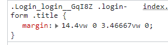

### 移动端适配 `postcss-px-to-viewport`

该工具可将 样式代码中的 `px` 单位 转换为<font color='#EA0000'> `vm` 单位</font>

 

#### 在 React项目的 `craco.config.js` 中配置

依赖版本：

```js
"@craco/craco": "^6.4.3",
"postcss-px-to-viewport": "^1.1.1",
"postcss": "^8.x" # 当前create-react-app中自带的postcss就是8.x
```

##### 注意：

* 由于 `postcss` 从 `7.x`版本到 `8.x`版本 使用配置方式有更新，所以使用时很有可能由于版本问题 使用该插件失效或报错。

##### 正确配置方式：

`craco.config.js`

```js
const pxToViewport = require("postcss-px-to-viewport");
const vm = pxToViewport({
  // 视口宽度
  viewportWidth: 375,
});

module.exports = {
  style: {
    postcss: {
      mode: "extends",
      loaderOptions: {
        postcssOptions: {
          ident: "postcss",
          plugins: [vm],
        },
      },
    },
  },
};
```


##### 之前的配置方式会报错

错误中会提示 `ident` `postcssOptions` 等信息。

```js
module.exports = {
  style: {
    postcss: {
      plugins: [vw],
    },
  },
};
```


#### 优点：

* 适配效果最好

#### 缺点：

* 不能转换行内样式，同理，使用该适配方式`js` 不好干预样式