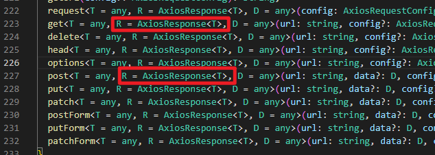
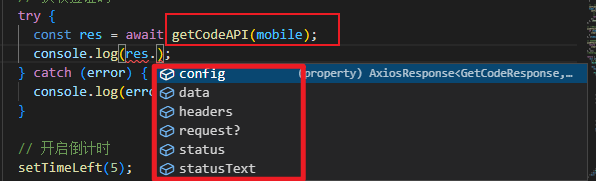
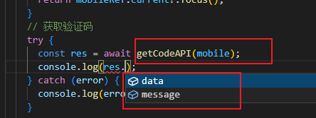

## Typescript中使用 `axios` 发请求

#### 简易封装请求

```ts
import { store } from "./../store/index";
import axios from "axios";

const request = axios.create({
  baseURL: "http://toutiao.itheima.net/v1_0",
  timeout: 5000,
});

// 请求拦截器
request.interceptors.request.use((config) => {
  // 获取store中token
  const { token } = store.getState();
  // 添加token（需要非空断言）
  config.headers!.Authorization = `Bear ${token}`;
  return config;
});

// 响应拦截器
request.interceptors.response.use(undefined, (error) => {
  if (error.response.status === 401) {
 	// ....
  }
});

export default request;
```

#### 声明接口

声明接口是，需声明 <font color='#8600FF'>接口所需参数的类型</font>，<font color='#8600FF'>接口响应值类型</font>

如下封装一个 **登录接口**

```ts
import request from "@/utils/request";
import { Token } from "./../types/data.d";

// 声明接口所需参数类型
export type LoginParams = {
  mobile: string;
  code: string;
};

// 声明接口响应类型
type LoginResponse = {
  message: string;
  data: Token;
};

// 登录接口
export const loginAPI = (values: LoginParams) => {
  // 发送请求
  return request.post<LoginResponse>("/authorizations", values);
};
```

#### 封装为 `asyncThunk`

封装为 `asyncThunk` 以便 获取数据后，直接存入`redux`中

```ts
import { LoginParams } from "../../api/index";
import { createAsyncThunk } from "@reduxjs/toolkit";
import { loginAPI } from "@/api";
import { setToken } from "@/utils/token";

// 登录
export const login = createAsyncThunk(
  "login/token",
  async (params: LoginParams) => {
    // 发起请求
    const response = await loginAPI(params);
    // 拿到返回数据
    const tokens = response.data.data;
    // 设置本地token
    setToken(tokens);
    // redux中保存toekn
    return tokens;
  }
);
```

#### 响应拦截器需修改 `Promise`返回值 时，如何处理

```ts
// 响应拦截器
request.interceptors.response.use(
  (response: AxiosResponse) => {
    return response.data;
  }
);
```

需给请求传入 第二个类型参数



请求方法的**类型参数**中，可以传<font color='red'>**三个**</font>类型参数，上面的案例只传了一个类型参数

* 第一个类型参数：该请求<font color='#8600FF'>**获取数据类型**</font>
* 第二个类型参数：该方法<font color='#8600FF'>Promise结果最终返回的数据类型</font>（<font color='#EA0000'>默认</font>为**第一个类型参数`<T>`的`AxiosResponse<T>`类型**，若<font style="background-color:#ff0">响应拦截器</font>中不进行修改，<font color='#8600FF'>默认类型</font>其实是正确的）

如下代码中：

* 第一个`GetCodeResponse`为返回类型，如果只传这个，会通过`AxiosResponse<T>`自动推断第二个类型参数
* 因为我们拦截器将 `AxiosResponse` 进行了修改，所以我们需要直接传第二类型，之前自动推断的已经不正确了

```js
// 声明接口响应类型
type GetCodeResponse = {
  message: string;
  data: null;
};

// 短信验证码
export const getCodeAPI = (mobile: number) => {
  // 发送请求,
  // 第一个GetCodeResponse为返回类型，如果只传这个，会通过AxiosResponse<T>自动推断第二个类型参数
  // 因为我们拦截器将 AxiosResponse 进行了修改，所以我们需要直接传第二类型，之前自动推断的已经不正确了
  return request.get<GetCodeResponse, GetCodeResponse>("sms/codes/" + mobile);
};
```

##### 效果对比

原本调用`getCodeAPI`的提示和响应拦截器改过的结果不一致：

 

现在，传入第一个类型参数后：这样就和拦截器返回结果一致了！

 