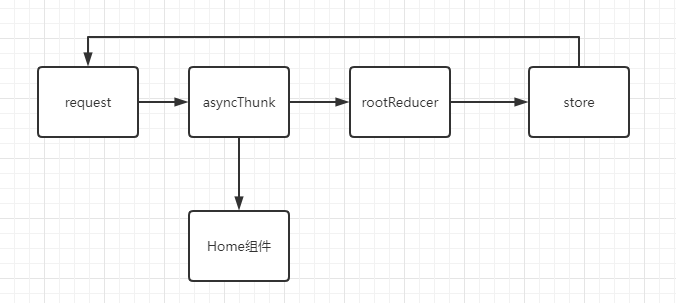
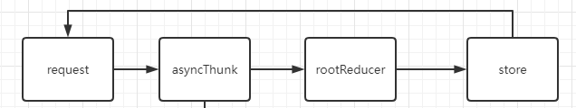

### 如何解决循环依赖 how-to-fix-circular-dependency

在写 `redux` 项目时，本人遇到了 循环依赖导致的 <font color='#EA0000'>引入xxx变量时为`undefined` </font>的问题。

[`redux-toolkit` 官网也提到了该问题](https://redux-toolkit.js.org/usage/usage-guide#exporting-and-using-slices)

原文：**JS modules can have "circular reference" problems if two modules try to import each other**. 


#### 首先要明白：

<font style="background-color:#ff0">**循环依赖**本身 对于`ES6模块化` 不是问题</font>（只是可能造成问题）

问题在于：循环依赖之后，我们使用某些<font color='#8600FF'>变量或方法</font>时，这些<font color='#8600FF'>变量或方法</font> <font color='#EA0000'>是否已准备就绪！？</font>

#### 问题情景还原

这是 `App.tsx`

```tsx
import { Provider } from "react-redux";
import { BrowserRouter, Route, Routes } from "react-router-dom";
// 先引入了Home组件
import Home from "./pages/Home";
// 最后引入 store
import store from "./store";

function App() {
  return (
    <Provider store={store}>
      <BrowserRouter>
        <div className="app">
          <Routes>
              <Route  element={<Home />}></Route>
          </Routes>
        </div>
      </BrowserRouter>
    </Provider>
  );
}

export default App;
```

在 `Home 组件` 中，需引入某 `AsyncThunk`，该`AsyncThunk` 又需要引入 `request.ts`，`request.ts` 中又需要引入 `store`， `store` 中需要引入 `rootReducer`，`rootReducer` 需要引入`Home组件`中引入的`AsyncThunk`。

 

如图，一个依赖循环出现。但是`es6`模块化其实解决了循环依赖，所以这没有问题。

**问题在于：**在这种条件下，Home组件要使用 `XXXAyncThunk`时，模块加载机制会认为：<font style="background-color:#ff0">后面加载 `store` 时，才会初始化 `XXXAyncThunk`</font>，现在 `store` 在 `Home` 加载后才会加载，现在想在`Home`使用 `XXXAyncThunk`，所以报错：

```
Uncaught ReferenceError: Cannot access 'getUserChannel' before initialization
```

#### 最终 解决方式：

上移 `import store from "./store";` 引入 `store` 位置

```tsx
// 先引入 store
import store from "./store";
import { Provider } from "react-redux";
import { BrowserRouter, Route, Routes } from "react-router-dom";
// 后引入 Home组件
import Home from "./pages/Home";

function App() {
  return (
    <Provider store={store}>
      <BrowserRouter>
        <div className="app">
          <Routes>
              <Route  element={<Home />}></Route>
          </Routes>
        </div>
      </BrowserRouter>
    </Provider>
  );
}

export default App;
```

没有报错了，使用正常。

**原因：**

这样<font color='#8600FF'>**调整 Import 顺序**</font>后，相当于：不论如何，先把这个<font color='#8600FF'> **循环依赖链条**</font> 上相关的东西 <font color='#EA0000'>都加载好</font>了

 

这个循环依赖问题已经。

之后，组件内使用该 **<font color='#8600FF'>循环依赖链条</font>** 上的任何东西，都是已经加载好的，就不会报错了。

#### 总结：

在 `ES6` 模块下（据说 `CommnJS` 还有不一样的问题），解决 **循环依赖** 产生问题的思路就是：

* <font color='#EA0000'>先将 循环依赖链 加载好</font>
* 再加载 <font color='#8600FF'>需使用该依赖链中内容的 其它**模块** </font>

<font style="background-color:#ff0">不要让 **`其它模块`**，从某一环切入依赖循环，进而才加载该依赖循环</font>


#### 其它解决方案：

提供两个文档，提供了很好的循环依赖 `circular-dependency` 的解决思路

https://medium.com/visual-development/how-to-fix-nasty-circular-dependency-issues-once-and-for-all-in-javascript-typescript-a04c987cf0de

其实本质道理，和上述我的方式差不多，先把所有东西集中到一个位置，一起全部导出。

也就是我们可能见过的这样的 `index.js` 文件

```ts
export * from "./x"
export * from "./xx"
export * from "./xxx"
```

