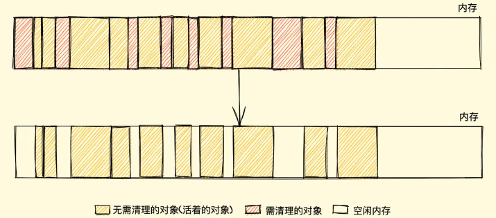
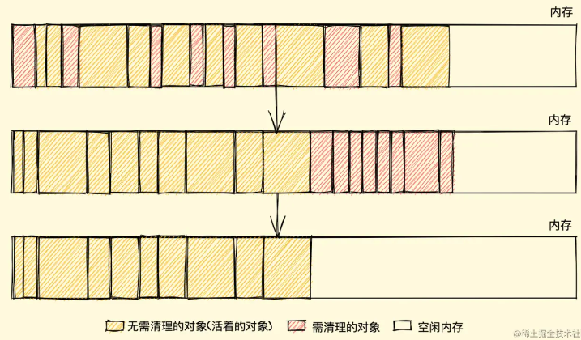
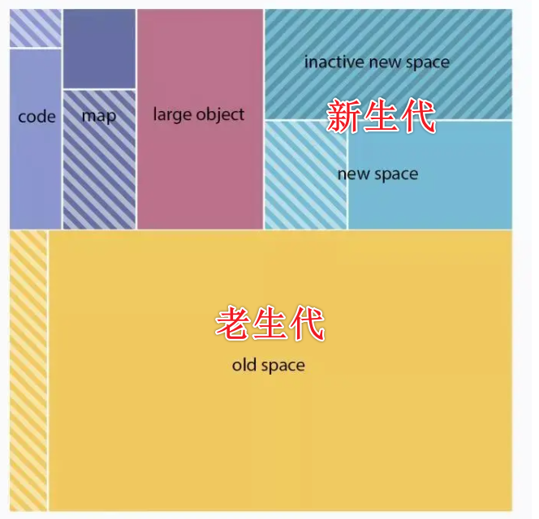
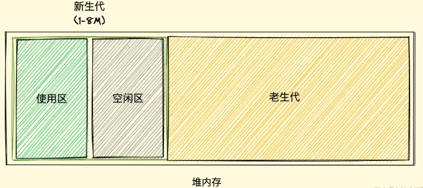
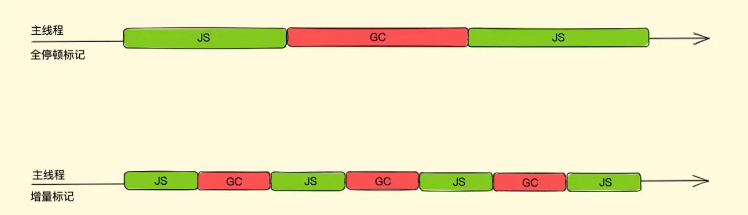
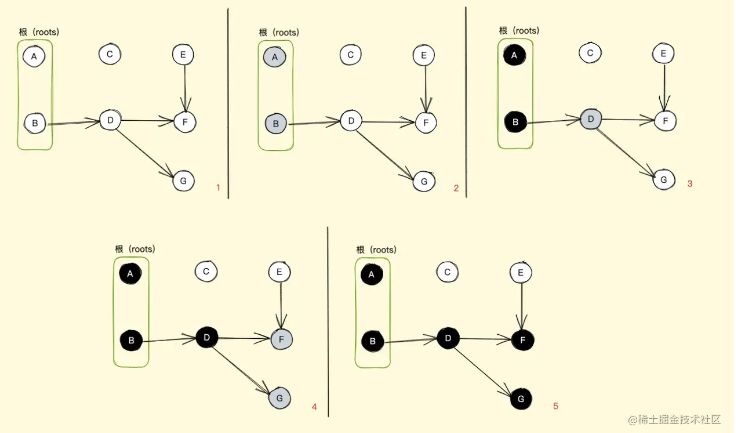
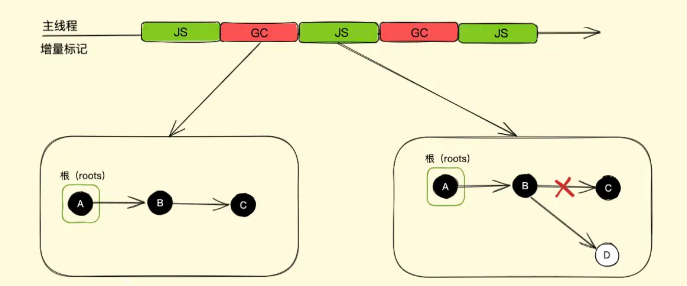
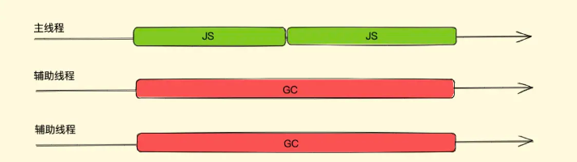

## 垃圾回收机制

`GC ` 即 `Garbage Collection`, 一般的高级语言里面会自带 `GC`，比如 `Java、Python、JavaScript` 等，也有无 `GC` 的语言，比如 `C、C++` 等，这种就需要手动管理内存了。浏览器会（定时）执行垃圾回收，释放内存，避免内存过高导致程序崩溃。

### 变量生命周期

与其叫变量声明周期，其实是**占用内存的对象、值的生命周期**。

1. 全部变量：定义在所有函数之外的变量

   一般不会被回收

2. 局部变量：定义在某个函数中的变量

   不用了一般就会被回收

局部变量旨在函数执行过程中存在，而在这个过程中会为局部变量在栈或者堆上分配相应的内存空间，以存储它们的值，然后在函数中使用这些变量，直到函数结束，就会释放这些局部变量所占用的内存空间。

所以，垃圾回收必须知道哪个变量有用，哪个变量没用

### 标记清除算法

在 `Javascript` 内存管理中有个概念叫：**可达性**，就是**以某种方式可访问的值**，它们需要被保证存于内存中，反之，没被保证的则需回收。

浏览器需要定时检查垃圾进行清理，至于如何找到这些需要回收的垃圾，就需要一些算法策略了！其中最常见的一种就是：**标记清除算法**。

该算法会在运行阶段（标记阶段）给存储在内存中的所有活动对象加上标记，此后在清除阶段把没有标记的（非活动对象）销毁。

例如：*某个函数执行完之后，其中的局部变量就会被清除标记，等待下次被清理*。

清除算法的大致过程：

* 在运行时，给所有变量加上标记为0，假设所有对象都是垃圾
* 然后从各个根对象（Window顶级对象等）开始遍历，把不是垃圾的节点改为 1（也就是可以遍历到的节点，说明都有被引用）
* 清理所有标记为0的垃圾，回收内存
* 最后，把所有内存标记修改为0，等待下一轮垃圾回收。

清除算法优点就是简单，缺点就是：会造成内存碎片，导致剩余的空闲内存不是一整块： 

 

对于该缺点，需要另一个算法来解决：**标记整理（Mark-compact）算法**

该算法会在标记结束后不立即清理，而是先将活着的对象向内存的一端移动，最后清理边界的内存。

## V8对GC的优化

V8就是基于上述的 **标记清除垃圾回收机制 **进行了优化

### 内存结构

在 V8引擎的 **堆结构** 中，主要有 **新生代 **和 **老生代**

因为上述的垃圾清理算法每次垃圾回收，都要检查内存中所有对象，这样，对于存活时间过长、或存活时间过短的对象，保持一种检查频率，其实并**不高效**。

因此，就有了 **分代式垃圾回收机制**，也就产生了上述的 **新生代 **和 **老生代**，两个区域采用不同的垃圾回收策略。

新生代存放 存活时间比较短的对象 / 新产生的对象，通常只支持`1~8M`的容量，而老生代的对象为 存活时间较长 / 常驻内存的对象（经历过新生代垃圾回收还存活的对象），容量较大。

V8的内存结构图如下：

 

#### 新生代

新生代的对象采用 `Scavenge 算法`（采用复制式的 `Cheney 算法`） 进行垃圾回收。

`Cheney算法`中将堆内存一分为二，一个是处于使用状态的空间（**使用区**），一个是处于闲置状态的空间（**空闲区**）

 

新加入的对象都会放到使用区，当使用区快被**写满**时，就需要执行一次垃圾清理操作。

当开始进行垃圾回收时

* 新生代垃圾回收器会对使用区中的活动对象做**标记**
* 标记完成之后将使用区的活动对象复制进空闲区并进行排序
* 随后，进入垃圾清理阶段，将非活动对象占用的空间清理掉。
* 最后进行角色互换，把原来的使用区视为空闲区，把原来的空闲区视为使用区

##### 晋升机制

上述过程中，若遇到某些 活动对象 

* 经历过 `Scavenge`回收，
* 或 空闲区空间占用超过了 25%，

那么这些对象就会**被直接晋升到老生代**空间中。

**25%**是因为空闲区将会翻转为使用区，若使用区占比过大，用来进行对象内存分配，将会影响后续内存分配。

#### 老生代

对于老生代的垃圾回收策略，因为老生代的对象通常比较大，用新生代的回收策略复制来复制去会非常耗时，效率不高，

所以，老生代采用上述的 **清除标记算法 + 清除整理算法** 进行垃圾回收

### 分代策略的优点：

将新、小、存活时间短的对象作为新生代，采用一小块内存**高频率**清理垃圾；

将大、老、存活时间旧的对象作为老生代，采用一大块内存**低频率**清理垃圾。

很大程度提高了垃圾回收机制的效率。

### 其它优化点：

#### 并行回收

因为在回收时，这个过程内存是静态的（主线程JS代码暂停运行）

所以不用考虑内存中对象的引用关系改变，只需要考虑协同

因此，可以使用**多个线程**并行进行垃圾回收，新生代就采用了并行策略。

这些线程同时将对象空间中的数据移动到空闲区。

#### 增量标记与惰性清理

上面所说的并行策略，虽然可以增加垃圾回收的效率，对于新生代垃圾回收器能够有很好的优化，但是其实它还是一种**全停顿式**的垃圾回收方式。

对于**老生代**来说，存放的都是比较大的对象，即时用并行策略，依然可能消耗大量时间，造成停顿感。

因此，`V8` 通过 **三色标记法** 与 **写屏障** 两个方案，实现了增量标记与惰性清理（将一次 `GC` 过程，分成很多小步，每执行完一小步，就让 `JS`代码执行一会儿）

 

##### 三色标记法

该方法将标记清除算法中的 0、1状态，分为更细化的 三种标记状态：白、灰、黑。

- 白色指的是未被标记的对象
- 灰色指自身被标记，成员变量（该对象的引用对象）未被标记
- 黑色指自身和成员变量皆完成标记工作

 

过程：

* 最初都是白色对象，意味着回收器没有标记它们
* 从根对象开始，将根对象标记为灰色，开始推入标记工作表中
* 当回收器从标记工作表中弹出对象时，完成该对象内的标记工作时，由灰色转为黑色
* 就这样一直往下走，直到没有灰色节点
* 这样，每次暂停执行，恢复时直接从灰色节点开始继续执行就可以

通过三色标记，可以很好的配合增量回收进行暂停恢复，从而减少 `全停顿` 的时间

##### 写屏障

由于垃圾回收和JS代码交替执行，有时会出现这样的情况：

假如我们有 `A、B、C` 三个对象依次引用，在第一次增量分段中全部标记为黑色（活动对象），而后暂停开始执行应用程序也就是 JavaScript 脚本，在脚本中我们将对象 `B` 的指向由对象 `C` 改为了对象 `D` ，接着恢复执行下一次增量分段。

 

但是，白色对象 `D` 可以在次轮 `GC` 的清理阶段被回收，然而后面的程序可能还会用 `D`。这样一定会出问题。

所以，`写屏障 (Write-barrier) `机制，就是为了防止这种情况引发问题

即：一旦有黑色对象引用白色对象，该机制会强制将引用的白色对象改为灰色，从而保证正确标记。

这个机制也称为：强三色不变性

#### 增量标记与惰性清理的优缺点

虽然使得主线程**每次的停顿时间大大减少**，但是总的暂停时间其实是略微增加了，其次，由于写屏障机制的成本，增量标记可能还会降低应用程序的吞吐量。

#### 并发回收（Concurrent）

该回收机制☞在主线程执行 `JS` 代码时，辅助线程在后台完成执行垃圾回收的操作，这样主线程就可以不被挂起暂停。

 

由于这种并发模式，堆中的对象引用关系随时都有可能发生变化，辅助线程之前做的一些标记或者正在进行的标记就要做对应的改变，所以它需要**额外实现一些读写锁机制**来控制。

#### V8老生代的回收优化

V8中的老生代垃圾回收器，将上述的三种策略进行融合使用，主要是使用了并发标记（也就是标记操作全都由辅助线程完成）

标记完成之后，再执行并行清理操作（主线程在执行清理操作时，多个辅助线程也同时执行清理操作）

同时，清理的任务会采用增量的方式分批在各个 `JavaScript` 任务之间执行

### 参考文档：

[掘金文章](https://juejin.cn/post/6981588276356317214)